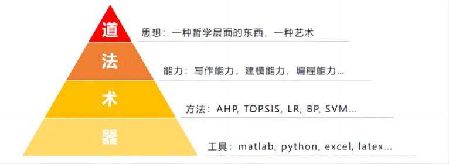
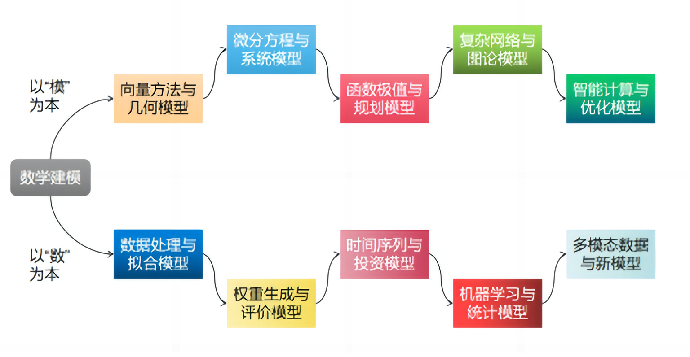

<h1>绪论 走进数学建模的大门</h1>

> 项目负责人&主编：马世拓（若冰，马马老师，B站id：平成最强假面骑士）
>
> 编辑&校对：
>
> - 陈思州（小红花）：第1章，第2章，第10章
> - 刘旭（卡拉比丘流形）：第3章，第5章
> - 萌弟：第6章，第8章
> - 聂雄伟（牧小熊）：第7章，第8章
> - 邢硕（Susan）：第4章，第9章
>
> 排版&美工：何瑞杰（拟身怪乖宝宝），陈思州（小红花），聂雄伟（牧小熊）
>
> 特别鸣谢：CSDN博主youcans_（<https://blog.csdn.net/youcans>）和 洋洋菜鸟（<https://blog.csdn.net/qq_25990967>）的博客教程内容对本教程的支持与帮助！

何谓“数学建模”？我想这个问题其实并没有一个明确的定义。老宗师姜启源先生说，“数学建模就是建立数学模型解决实际问题”，我却总感觉这个定义还是抽象了些。“建立数学模型”，什么是“数学”的“模型”？怎样建这个“模型”？用什么去建这个“模型”？在我刚开始读本科的时候，我也对这个问题感到很疑惑，于是去拜读了很多人的作品，诸如姜启源、谢金星二位先生的《数学模型》、司守奎先生的《数学建模算法与应用》等很多经典教材，隐约是能够觉得，这个“数学”的“模型”本质上还是一些数学知识，而建这个“模型”则不能手算，须用计算机去设计程序。至少姜先生告诉了我数模的本质，司先生告诉了我数模的方法。

图0.1 人类认识世界的三种模型 

可道理和工具都有了，应该如何建立这个“模型”呢？

这个问题我从20年就在思考，一直思考至今。朋友，请不要被“数学建模”这四个字劝退，它的本质还是解应用题，只是曾经的“小明买糖”变成了如今的“嫦娥探月”。可数学建模若是仅仅作为解题的手段而存在，那我便不会愿意花上四年时间去学它。数学建模作为一种思想，它是真真切切在工程问题中有所应用的。

我想，一些照本宣科的老师若是来上数学建模这门课，给你们讲的第一个例子大概率是船划水或包饺子。我不愿意照本宣科，也并不打算去介绍一些你们听着简单无聊可在实际工程中却没多大用处的例子。我便以身边最近的一个例子介绍吧：

2020年初，新冠病毒的到来打乱了我们的正常生活。在新冠肺炎的防治过程中就充满了数学建模的影子：如果读者翻到第三章，我会介绍SEIR模型，也就是传染病模型，我们把人群分为易感人群、密切接触者、感染者和康复者四类人群，这四类人群的新增、减少都遵循着动力系统的一些规律，我们可以列出一个微分方程组对其进行模拟：

$$
\begin{array}{c}
N\frac{{ds}}{{dt}} =  - N\lambda si\\
N\frac{{de}}{{dt}} = N\lambda si - N\delta e\\
N\frac{{di}}{{dt}} = N\delta e - N\mu i\\
N\frac{{dr}}{{dt}} = N\mu i\\
s(t) + e(t) + i(t) + r(t) = 1
\end{array}
$$

读者现在可能并不知道这个方程组是什么意思，没有关系，在后续的学习中我们会一点点解释。而除了解微分方程组以外，我想很多读者还见过“一个教室里面的同学如果封锁了教室传染病会如何传染”这样的动画，而这样的动画可以通过元胞自动机去进行模拟。医生在研发新药、在患者身上进行试验的时候，会收集相应的实验数据，而对这些实验数据的分析、假设检验则又充满了统计学知识的应用……

所以，你看到了，这个过程充满了数学建模。

一个好的模型，它能够准确地反映问题，但又不失简洁性。我历来信奉一条最根本的道义，那就是“大道至简”。什么样的模型可以算得上一个好模型呢？我认为它需要遵循以下要点：

- 形式简洁：模型不至于太冗长，大道至简。
- 精度到位：求解精度符合工程实际的要求。
- 理论创新：在理论层面上进行一些创新。
- 排除干扰：能够排除一些无关紧要的干扰项。
- 可解释性：模型的结果有良好的可解释性。
- 求解方便：模型能够利用MATLAB等求解工具进行求解。

> 注意：好的模型需要不断进行调整，前人的一些好模型我们仍然可以进行改进。

数学建模是一门十分注重理论联系实际的课程,它有助于培养学生的数学思维与想象力；有助于培养学生的工程应用能力;有助于学生了解量化研究的一般方法。但在高等院校数学教学中，数学建模这门学科的学习是一门比较艰难的事情，是一个需要长期积累与总结的工作。对于这门学科，学生不好学、教师不好教的问题由来已久，其原因归根结底，仍然是由于缺乏对这门学科课程框架的统一共识与系统化的课程架构。数学建模课上教什么？怎么教？学生在下面准备数学建模竞赛备什么？怎么备？要达到一个怎样的标准才算是备好了？可能很多的学生和教师们都还有这样一个疑问。

数学模型不同于数学建模，二者是有区别的。而数学建模这门学科要是说想用一套统一的方法去学是很难。这也就是说，数学建模领域的研究方法很难形成一套绝对统一的研究范式。不同应用领域、不同数学知识相互交融，所使用的建模方法论也不可能做到一言以蔽之。诚然，数学建模没有一个完整的通用的体系可循，但就本科阶段的教学与竞赛需求而言，建模不同于模型案例的拼盘，它是有法可循的。

春秋时期著名的哲学家老子在《道德经》一书中说到：“人法地，地法天，天法道，道法自然”，这一思想是体现了“天人合一”的思想。在长期实践中，总结出以中国道家古典哲学为思想内核的“道与理”课程框架。以学生对数学建模课程认知过程为基础，将数学建模知识的教学划分为“道——法——术——器”四个阶段，对现有数学建模课程知识内容进行了整合与重构。

图0.2 数学建模的四个境界 

纵观多年全国大学生数学建模竞赛赛题，问题类型大致可以分为“以模型为核心”的优化类、过程类问题，与“以数据为核心”的统计类、分析类问题。这为数学建模课程教学提供了一个很好的思路：以模型与数据为教学中的两条核心主线，将数学建模课程的知识进行串联、归纳与整合。为此，构建了“以数为本”和“以模为本”的数学建模知识体系架构，如图所示：

图0.3 数学建模导论教程的章节逻辑 

在双主线的数学建模知识框架下，将学生需要掌握与学习的模型大体分为了十个章节。十章内容环环相扣，能够很系统地串联起数学建模教学中的主要知识体系。例如，从向量与几何谈起，讨论到几何图形中位置关系与数量关系的抽取与方程构建和求解；再从一般方程的求解到微分方程的求解，介绍函数与多元函数的微分和微分方程，从数学理论到代码实现，再到应用案例，并创新性地将元胞自动机融合于本章教学；随后从微分方程一章的数值方法出发引出函数的极值问题，从而引出规划模型的原理、求解与建模案例，以及博弈论、排队论等同样具有优化性质的模型；再介绍图论的基本概念与典型问题后，将重点聚焦于最短路径、TSP问题等的离散优化模型在图论中的应用，从而又引出新需求；智能计算与优化从TSP问题的解法谈起，引出遗传算法等智能优化方法。“以模为本”能够较好地串联起运筹学、微分方程、动力系统等知识内容。

而“以数为本”的主线则强调培养学生的“数据驱动”思维。随着人工智能与大数据技术的发展，数学建模的竞赛教学与研究得到了极大的推动，有越来越多的数学建模竞赛题开始融入“大数据分析”类的问题，而为了应对这一变化，也有越来越多的高校在数学建模课程中融入了数据分析的内容。将前面的模型应用于数据中于是有了最小二乘拟合的优化等数据处理与拟合方法；在数据处理的基础上可以对数据进行评价；将时间序列这一特殊形式的数据抽象为回归问题介绍预测处理方法，并介绍投资组合问题的优化形式；在数据处理和优化背景的基础上对数据进行挖掘建模，重点介绍传统数学课程中难以展开的机器学习方法；对于一些非常规数据，也创新性地借鉴了计算机视觉、自然语言处理领域的方式方法，对其进行有针对性选择融入到课程教学中。

这门课程起源于我在2022年最早的一版数学建模导论教程<https://www.bilibili.com/video/BV12W4y1C7Tr>，在网络上的反馈还是很不错的。如今我把它放到datawhale的平台，希望能让更多的学习者参与学习。新的导论在以往内容的基础上新增了许多补充性内容，也参考了很多大师的作品。其中非常感谢CSDN博主洋洋菜鸟和youcans_二位的数学建模博客，有部分章节的案例参考过二位的作品，二位也对本教程表示非常支持。也非常感谢datawhale数学建模导论项目组团队成员以及开源项目保姆团队，让本教程顺利孵化。

现在，同学们，让我们一同走进数学建模的大门吧！
