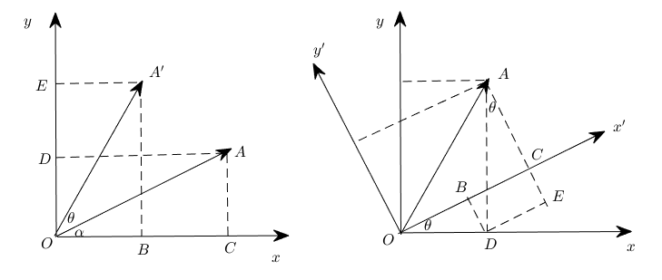
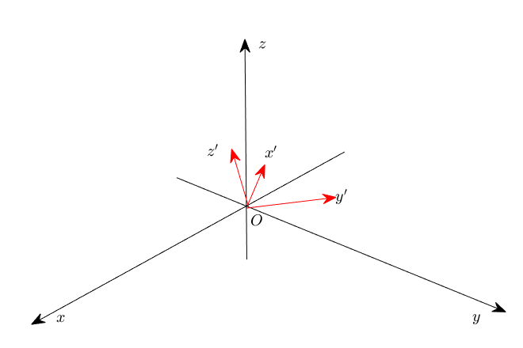

<center><h1>第1章  解析方法与几何模型</h1></center>

> 内容：@若冰（马世拓）
>
> 审稿：@陈思州
>
> 排版&校对：@何瑞杰

读者朋友们，在这一章当中我们将会主要学习几何模型的相关知识。你们应该都还记得一些基本的几何原理知识，用具体的几何形状来抽丝剥茧为大家介绍数学建模这再合适不过了。而在这一章中，我们不仅会学习到如何分析问题、构造数学模型，更重要的是学会如何使用代码求解一些简单的模型。本章我们希望各位能够：

* **了解一些常见的几何模型构造的思想方法**
* **对常见立体几何模型与平面几何模型能够有自己的思考**
* **可以使用Python求解一些简单方程或方程组的解**

> 注意：本章内容不会太难，大家注意在简单案例中蕴含的数学思想即可。

## 1.1  向量表示法与几何建模基本案例

### 1.1.1  几何建模的思想

人类对于数学世界的探索起源于两样东西：一是计数，二是丈量。计数用以表示多少，要计算多了多少少了多少，于是有了数字的概念和四则运算，也就有了后来的代数学；丈量是测量土地的长宽面积、测量角度、分析几何关系等，也就有了后来的几何学。高中毕业以后，我们对于数学模型的理解其实还很浅薄，但几何模型对我们来讲是最直观的东西。有一张图，我们就可以直观地感受：哪两个平面平行，哪两条线垂直……通过一系列的几何定理还可以推算线段的长度等等。所以，我们就以几何模型作为了解数学建模的切入点。

但是大家可万万不要小看几何模型，虽然一些基本的数学公式我们在初中高中就学过了，这类问题还是大有讲究的。几何模型中充斥了不同的数学关系，根据关系的分类可以把它们分为位置关系和数量关系两种。位置关系就包括平行、垂直、异面、相交等，数量关系则是需要具体求解边长、角度、面积等。那么既然涉及到求解，就必然会涉及到等量关系也就是方程与函数。以往的这些方程与函数是可以手动计算的，但在一个复杂的几何框架中，量与量之间的关系，还会有那么容易计算吗？

分析几何问题，在现在这个阶段我们所掌握的方法大体上可以分为三种：

* **传统几何的演绎-证明体系**：这种体系下的方法都是基于已经被证明了的公理与定理体系（例如勾股定理、正弦定理、圆幂定理等），在解决问题的过程中更强调分析而非计算，往往是通过构造辅助线、辅助平面等利用严密的逻辑推理步步为营推导出最后的结果。这种方法往往分析起来会更加困难，但减少了计算量。
* **基于向量的计算化几何**：向量被引入几何当中最初的目的是为了表示有向线段，但后来大家发现基于向量的一些运算特性可以把一些数量问题统一化。几何图形中的边长、角度、面积可以转化为向量的模长、内积等求解，平行、垂直等可以转化为向量共线、内积为0等求解，就可以把所有几何问题都变成可计算的问题。这样的方法更加重视计算，并且除了传统的几何向量外，还可以构造直角坐标系从而获得坐标向量，运算更加方便。
* **基于极坐标与方程的解析几何**：这种方法其实可以回溯到当初学圆锥曲线的时期，把几何图形的相交、相切、相离抽象成方程解的问题。后来又学习过极坐标和参数方程，就会发现利用极坐标和参数方程去表示曲线实在是太方便了。这样的方法就可以把几何问题转化成一个代数问题来求解，大大提高了求解的效率。

同学们在中学阶段还记得都用过哪些几何方法去进行建模吗？我想，那真的太多了，但我们总能够总结出一些常见的公理与定理，例如： 

* **三角形中的角度关系**：这是几何学中的基本概念之一，涉及到三角形内角和定理（三角形的三个内角之和等于$180\circ$）、直角三角形的角度关系（一个角为$90^{\circ}$，另外两个角之和为$90^{\circ}$）等。
* **勾股定理**：这是直角三角形中最著名的定理之一，表明直角三角形的两条直角边的平方和等于斜边的平方。即如果直角三角形的直角边长分别为$a$和$b$，斜边长为$c$，则有 $a^{2} + b^{2} = c^{2}$。
* **正弦定理**：这是解决三角形问题时非常有用的定理，它表明在任意三角形中，各边的长度与其对应角的正弦值之比相等。即如果三角形的边长分别为$a$、$b$、$c$，对应的角分别为$A$、$B$、$C$，则有 $\displaystyle \frac{a}{\sin A} = \frac{b}{\sin B} = \frac{c}{\sin C} = 2R$，其中$R$是三角形外接圆的半径。
* **余弦定理**：在任意三角形中，任意一边的平方等于其他两边的平方和减去两倍的其他两边长度乘以它们夹角的余弦值。即如果三角形的边长分别为$a$、$b$、$c$，对应的角分别为$A$、$B$、$C$，则有 $c^{2} = a^{2} + b^{2} - 2ab\cos C$。余弦定理在解决非直角三角形的问题中非常有用，尤其是在涉及边长和角度关系的问题中。
* **圆幂定理**：对于任意一点到圆的两条切线，它们的长度是相等的。对于任意一条经过该点的割线，割线的两段长度的乘积是一个常数，这个常数等于该点到圆心的距离的平方减去圆的半径的平方。圆幂定理在解决与圆有关的几何问题中非常有用。
* **切割线定理**（也称为割线-切线定理）：如果一条直线从外部点P切割圆，形成一条切线段$PT$和一条割线段$PAB$（A和B是割线与圆的交点），那么$PT^{2} = PA \cdot PB$。这个定理在解决圆和直线关系的几何问题中很有帮助。
* **四点共圆**：四点共圆是一个判断四个点是否能在同一个圆上的几何概念。如果四个点$A$、$B$、$C$、$D$满足某种特定的关系，那么它们可以位于同一个圆上。这个概念在解决几何问题时非常重要，尤其是在证明四个点共圆的时候。常用的判断四点共圆的方法包括使用圆的方程、利用角的性质（如对顶角、圆周角等）等。
* **圆锥曲线的几何性质**：圆锥曲线（包括椭圆、双曲线和抛物线）拥有许多独特的几何性质。例如，椭圆的每一点到两个焦点的距离之和是一个常数；双曲线的每一点到两个焦点的距离之差的绝对值是一个常数；抛物线上的每一点到焦点的距离等于该点到准线的距离。
* **圆锥曲线的光学性质**：圆锥曲线的光学性质是指光线在圆锥曲线上的反射和折射特性。例如，椭圆上的任意一点反射到两个焦点的光线路径长度相等；抛物线上的任意一点反射到焦点的光线都平行于对称轴；双曲线上的任意一点反射到一个焦点的光线将经过另一个焦点。
* 圆锥曲线的离心率：圆锥曲线的离心率（eccentricity）是一个非负实数，它描述了圆锥曲线的形状。对于椭圆，离心率$e$满足$0\leqslant e<1$；对于双曲线，$e>1$；对于抛物线，$e=1$。离心率越小，椭圆越接近圆形；离心率越大，双曲线的两支越开。

当然，常见的其实远不止这么一点，这里罗列的是笔者觉得比较重要的几何定理，特地做一个总结。实际运用的时候有很多东西都是可以用的。

### 1.1.2  向量表示与坐标变换

我相信各位同学在高中肯定是知道向量这个概念的，但是你们最多认识到三维，并且还依赖于画图，中学阶段我们也仅仅是接触到了三维向量。现在如果我告诉你，一个向量可以有不止三个轴，可以有$5$维，有$10$维，有$10000$维，你现在还能依靠图理解向量吗？事实上向量的维数可以是很多维，从代数的意义上你可以认为向量是一个集合，从几何的意义上你又可以认为向量是一个n维欧几里得空间中的一个点：
$$
x = [x_{1}, x_{2}, \dots, x_{n}]^{\top}. \tag{1.1.1}
$$
和二维、三维空间中的向量一样，高维空间中的向量同样可以进行加减运算、数量乘运算和数乘运算。但毕竟这是一门应用数学课程，我们不打算把太多精力放在任何一本线代课本里面都能找到的公式上，使用 Python 的NumPy 库举例子恐怕会更加直观。从程序设计的角度来看，如果读者接触过C语言应该会了解数组的概念，而在 C++ 语言中 STL 里面已经包含了 `vector` 类型。在 Python 中我们可以使用 NumPy 库来创建和操作向量，例如：

```python
import numpy as np
x = np.array([1, 2, 3, 5, 8])
# array([1, 2, 3, 5, 8])
```

这样我们便创建了一个向量。随后便可以进行各种操作。

> 注意：分隔符也可以用分号或空格，但得到向量的形状是不同的。

引入向量的目的并不仅仅是为了在几何图形中更好地表示方向和距离，而是为了利用代数的方法来解决几何问题。向量提供了一种将几何概念转化为代数表达式的方式，从而使得几何问题的解决变得更加简单和直接。

例如，在解决物理问题时，力、速度和加速度等物理量都可以用向量表示。通过向量的加减和数乘运算，我们可以直接计算出合力、相对速度等结果，而不需要借助复杂的几何图形。在计算机图形学中，向量被广泛用于表示和处理图形和动画。通过向量运算，我们可以实现图形的旋转、缩放、平移等变换，以及计算光线的反射和折射等效果。

解析几何法的本质就是利用函数与方程来表示不同的几何曲线。在中学阶段我们都学习过圆锥曲线的方程形式，但在实际问题中我们面临的曲线会更加复杂。尤其是在三维空间中的曲线与曲面，可能会用到多元函数去进行表示，也可能用极坐标或参数方程更加方便，但不管怎么说，解析几何方法的本质就是把各种几何问题都转化为代数问题求解。解方程比起复杂的分析，更依靠计算，而这恰恰是程序所擅长的。

在数学中，坐标变换通常涉及到一系列的矩阵运算，这些矩阵描述了一个坐标系相对于另一个坐标系的位置和方向。旋转变换就是其中的一个典型例子。当我们说一个坐标系相对于另一个坐标系进行了旋转，我们通常是指它绕着一个轴或者点旋转了一定的角度。二维空间的旋转可以简化为点绕原点旋转，而三维空间则涉及到更复杂的轴向旋转。



<center>图1 二维坐标系中的旋转</center>

在二维空间中，如果我们要将坐标系绕原点旋转一个角度，就可以通过旋转矩阵来实现。旋转矩阵是一个非常简单而又强大的工具，它可以将原始坐标系中的点通过线性变换映射到新坐标系中。对于逆时针旋转，二维旋转矩阵的形式是

$$
\left[ \begin{matrix}
\cos \theta & -\sin \theta\\ \sin \theta & \cos \theta
\end{matrix} \right] . \tag{1.1.2}
$$

这里，$\theta$是旋转角度，当应用这个旋转矩阵于一个点$(x, y)$，它会给出新的坐标$(x', y')$，这表示了原始点在新坐标系中的位置。

使用NumPy进行这样的变换非常简单。首先，我们创建一个表示点坐标的NumPy数组，然后创建表示旋转矩阵的二维数组。通过对这两个数组进行点积运算（也就是矩阵乘法），我们就可以得到新的坐标，在Python中可以这样实现：

```python
import numpy as np

# 设定旋转角度，这里我们以30度为例
theta = np.radians(30)  # 将30度转换为弧度

# 创建旋转矩阵
rotation_matrix = np.array([
    [np.cos(theta), -np.sin(theta)],
    [np.sin(theta), np.cos(theta)]
])

# 假设我们有一个点 (a, b)
point = np.array([a, b])

# 通过旋转矩阵变换这个点的坐标
rotated_point = rotation_matrix.dot(point)

print("原坐标为:", point)
print("旋转后的坐标为:", rotated_point)
# 原坐标为: [5 3]
# 旋转后的坐标为: [2.83012702 5.09807621]
```

此示例代码中，旋转角度是预设的，你可以根据实际情况调整。通过这种方式，我们能够将几何问题通过坐标变换转化为代数问题，使用编程方法来进行高效的计算。这不仅仅适用于理论数学问题，同样也适用于工程、物理学、计算机图形学以及机器人技术等多个领域中。


<center>图2 三维坐标系中绕三个坐标轴的旋转</center>

在三维空间中，物体的旋转可以围绕三个主轴进行：$\mathrm{x}$轴， $\mathrm{y}$轴和$\mathrm{z}$轴。这些轴旋转代表了不同方向的运动，并且可以通过旋转矩阵来数学描述。例如，一个点$P(x, y, z)$绕$\mathrm{z}$轴旋转角度$\alpha$可以表示为

$$
R_{\mathrm{z}}(\alpha) = \left[ \begin{matrix}
\cos\alpha & -\sin\alpha & 0\\sin\alpha & \cos\alpha & 0\\0 & 0 &1
\end{matrix} \right], \tag{1.1.3}
$$

这个旋转保持$\mathrm{z}$坐标不变，同时在$XY$平面上变换$\mathrm{x}$和$\mathrm{y}$坐标。相似地，点$P$绕$\mathrm{y}$轴旋转角度$\beta$的旋转矩阵为

$$
R_{\mathrm{y}}(\beta) = \left[ \begin{matrix}
\cos\beta & 0 & \sin\beta\\
0 & 1 & 0\\
-\sin\beta & 0 & \cos\beta
\end{matrix} \right], \tag{1.1.4}
$$

这个旋转保持$\mathrm{y}$坐标不变，同时在$XZ$平面上变换$\mathrm{x}$和$\mathrm{z}$坐标。而点$P$绕$\mathrm{x}$轴旋转角度$\gamma$的旋转矩阵为

$$
R_{\mathrm{x}}(\gamma) = \left[ \begin{matrix}
1 & 0 & 0\\
0 & \cos\gamma & -\sin\gamma\\
0 & \sin\gamma & \cos\gamma
\end{matrix} \right], \tag{1.1.5}
$$

这个旋转保持$\mathrm{x}$坐标不变，同时在$YZ$平面上变换$\mathrm{y}$和$\mathrm{z}$坐标。若点$P$需同时围绕三个轴旋转，则最终旋转矩阵$R$为这三个矩阵的乘积，即$R = R_{\mathrm{z}}(\alpha)R_{\mathrm{y}}(\beta)R_{\mathrm{x}}(\gamma)$。需要注意的是，由于矩阵乘法的非交换性，旋转的顺序会影响最终结果。

在实际应用中，如机器人学、航空航天和计算机图形学，旋转顺序对于模拟和预测物体如何移动至关重要。例如，飞机的姿态控制就极依赖于绕不同轴的旋转顺序，以精确地模拟和控制飞机的行动。在三维建模和动画制作中，这些旋转变换同样是创建动态、逼真场景的基础。

在Python中，利用NumPy库，我们可以使用如下代码片段来实现三维旋转变换：

```python
import numpy as np

# 定义旋转角度（以弧度为单位）
alpha = np.radians(30)  # 绕 Z 轴旋转
beta = np.radians(45)   # 绕 Y 轴旋转
gamma = np.radians(60)  # 绕 X 轴旋转

# 定义旋转矩阵
R_z = np.array([[np.cos(alpha), -np.sin(alpha), 0],
                [np.sin(alpha), np.cos(alpha), 0],
                [0, 0, 1]])

R_y = np.array([[np.cos(beta), 0, np.sin(beta)],
                [0, 1, 0],
                [-np.sin(beta), 0, np.cos(beta)]])

R_x = np.array([[1, 0, 0],
                [0, np.cos(gamma), -np.sin(gamma)],
                [0, np.sin(gamma), np.cos(gamma)]])

# 总旋转矩阵
R = R_z @ R_y @ R_x

# 定义点P的坐标
P = np.array([1, 2, 3])

# 计算旋转后的坐标
P_rotated = R @ P

print("旋转后P点的坐标为:", P_rotated)
# 旋转后P点的坐标为: [3.39062937 0.11228132 1.57829826]
```

在该代码中，点$P$经过由$\alpha$，$\beta$，和$\gamma$定义的旋转后，其新坐标由$P_{\text{rotated}}$给出。该代码首先创建了绕$\mathrm{z}$，$\mathrm{y}$，和$\mathrm{x}$轴的三个旋转矩阵，然后将它们相乘得到一个总的旋转矩阵$R$，并应用这个矩阵来转换点$P$的坐标。

正是通过这些准确的数学变换和编程实现，我们能够在计算机模拟和实际应用中处理复杂的三维空间问题。无论是设计复杂的机械系统、创建逼真的三维动画，还是开发高级的虚拟现实环境，三维旋转都是不可或缺的基础。



<center>图3 欧拉角图示</center>

欧拉角是三维空间中用于表示一个物体相对于一个固定坐标系（通常是参考坐标系或世界坐标系）的方向的一组角。这种表示方法定义了三次旋转，将物体从其初始方向旋转到期望方向。欧拉角通常表示为三个角度：$\alpha$，$\beta$，和$\gamma$分别对应于绕$\mathrm{z}$轴，$\mathrm{x}$轴（或$\mathrm{y}$轴），以及再次$\mathrm{y}$轴（或$\mathrm{x}$轴）的旋转。

欧拉角旋转顺序的不同，定义了不同的旋转方式，最常见的是：

* **Z-Y-X（Roll-Pitch-Yaw）**：首先绕$\mathrm{z}$轴旋转$\alpha$（Yaw），然后绕*新位置的*$\mathrm{y}$轴旋转$\beta$（Pitch），最后绕*新位置的*$\mathrm{x}$轴旋转$\gamma$（Roll）。
* **Z-X-Y（Yaw-Pitch-Roll）**：首先绕$\mathrm{z}$轴旋转$\alpha$（Yaw），然后绕*新位置的*$\mathrm{x}$轴旋转$\beta$（Pitch），最后再次绕$\mathrm{y}$轴旋转$\gamma$（Roll）。

每次旋转都是围绕变换后的轴，而不是初始的固定轴。这些旋转通常通过旋转矩阵进行计算，并且可以合成为一个单一的矩阵，它描述了总的旋转。在实际应用中，如飞行动力学和计算机图形学，欧拉角非常重要。

这里是Python中计算欧拉角旋转的代码示例，假设采用$Z$-$Y$-$X$顺序：

```python
import numpy as np

# 定义欧拉角（以弧度为单位）
alpha = np.radians(30)  # 绕 z 轴的 Yaw 角度
beta = np.radians(45)   # 绕 y 轴的 Pitch 角度
gamma = np.radians(60)  # 绕 x 轴的 Roll 角度

# 构建对应的旋转矩阵
R_z = np.array([[np.cos(alpha), -np.sin(alpha), 0],
                [np.sin(alpha), np.cos(alpha), 0],
                [0, 0, 1]])
R_y = np.array([[np.cos(beta), 0, np.sin(beta)],
                [0, 1, 0],
                [-np.sin(beta), 0, np.cos(beta)]])
R_x = np.array([[1, 0, 0],
                [0, np.cos(gamma), -np.sin(gamma)],
                [0, np.sin(gamma), np.cos(gamma)]])

# 总旋转矩阵，注意乘法的顺序
R = np.dot(R_x, np.dot(R_y, R_z))

print("组合旋转矩阵为:")
print(R)
# 组合旋转矩阵为:
# [[ 0.61237244 -0.35355339  0.70710678]
#  [ 0.78033009  0.12682648 -0.61237244]
#  [ 0.12682648  0.9267767   0.35355339]]
```

当你运行这段代码，它会打印出综合所有三次旋转的旋转矩阵R。

## 1.2 Numpy 与线性代数

在本节中，我们将探讨Python中最强大的科学计算库之一：NumPy。在深入学习之前，我们需要弄清楚线性代数在实际应用中的重要性。线性代数不仅是理解数据结构、解决数学问题的基础，也是计算机图形学、机器学习等高级领域不可或缺的工具。NumPy库在这里扮演了至关重要的角色，因为它为我们提供了一个高效、便捷的平台来处理数值计算和线性代数运算。接下来的内容，将通过实际的例子展示如何使用NumPy来执行一些基础但强大的线性代数操作。

### 1.2.1  Numpy向量与矩阵的操作

在科学计算的世界里，NumPy的数组对象是我们解决问题的得力助手。它能让我们轻松地执行向量化运算，这意味着可以一次性处理数据集而不需要使用循环。这种处理方式不仅代码更加简洁，而且运行速度也远快于传统的Python循环。在Numpy中，向量和矩阵都可以用二维数组表示，让我们来看看基本操作。

**创建向量和矩阵**

```python
import numpy as np
# 创建向量
vector = np.array([1, 2, 3])
# 创建矩阵
matrix = np.array([[1, 2, 3],
                   [4, 5, 6],
                   [7, 8, 9]])
```

**向量和矩阵的基本属性**

```python
# 向量的维度
print(vector.shape) # (3, )
# 矩阵的维度
print(matrix.shape) # (3, 3)
# 矩阵的行数和列数
print(matrix.shape[0])  # 行数, 3
print(matrix.shape[1])  # 列数, 3
```

**索引和切片**

```python
# 索引
print(vector[0])  # 输出第一个元素, 1
print(matrix[1, 1])  # 输出第二行第二列的元素, 5

# 切片
print(vector[0:2])  # 输出前两个元素, [1, 2]
print(matrix[0:2, 0:2])  # 输出左上角的2x2子矩阵, [[1, 2], [4, 5]]
```

**向量和矩阵的运算**

```python
# 向量加法
vector1 = np.array([1, 2, 3])
vector2 = np.array([4, 5, 6])
print(np.add(vector1, vector2))
# [5, 7, 9]

# 矩阵乘法
matrix1 = np.array([[1, 2], [3, 4]])
matrix2 = np.array([[5, 6], [7, 8]])
print(np.dot(matrix1, matrix2))  # 或使用 matrix1 @ matrix2
# [[19, 22],
#  [43, 50]]
```

### 1.2.2  利用Numpy进行线性代数基本运算

在NumPy中，我们可以利用数组的**广播机制**来进行各种线性代数运算。例如，你可以轻松地将一个标量与一个向量或矩阵相乘，而不需要编写任何循环。NumPy也提供了计算矩阵的转置、行列式、逆矩阵等常见操作的函数。

```python
import numpy as np

# 数量乘法示例
scalar = 5
scaled_vector = scalar * vector
print("Scaled vector:", scaled_vector)
# Scaled vector: [ 5 10 15]

# 矩阵的转置示例
transposed_matrix = matrix.T
print("Transposed matrix:\n", transposed_matrix)
# Transposed matrix:
# [[1, 4, 7]
#  [2, 5, 8]
#  [3, 6, 9]]

# 计算行列式示例
matrix_determinant = np.linalg.det(matrix)
print("Matrix determinant:", matrix_determinant)
# Matrix determinant: 0.0

# 求解线性方程组示例
A = np.array([[3, 1], [1, 2]])
b = np.array([9, 8])
solution = np.linalg.solve(A, b)
print("Solution of the linear system:", solution)
# Solution of the linear system: [2. 3.]

```

### 1.2.3  `numpy.linalg` 的使用

最后，我们不能不提NumPy中的 `linalg` 子模块，它包含了一系列关于线性代数的函数。无论是求解方程组，还是计算特征值、特征向量，乃至执行奇异值分解，`linalg` 模块都能够提供帮助。通过这些工具，我们可以探索矩阵的深层属性，并应用于各种数学和工程问题。下面是一些 `numpy.linalg` 模块的使用示例：

**计算逆矩阵**

```python
import numpy as np
# If the matrix is singular, use the pseudo-inverse
pseudo_inverse_matrix = np.linalg.pinv(matrix)
print("Pseudo-inverse of the matrix:")
print(pseudo_inverse_matrix)
# Pseudo-inverse of the matrix:
# [[-6.38888889e-01 -1.66666667e-01  3.05555556e-01]
#  [-5.55555556e-02  4.20756436e-17  5.55555556e-02]
#  [ 5.27777778e-01  1.66666667e-01 -1.94444444e-01]]

```

**特征值和特征向量**

```python
eigenvalues, eigenvectors = np.linalg.eig(matrix)
print(eigenvalues)
# [ 1.61168440e+01 -1.11684397e+00 -1.30367773e-15]

print(eigenvectors)
# [[-0.23197069 -0.78583024  0.40824829]
#  [-0.52532209 -0.08675134 -0.81649658]
#  [-0.8186735   0.61232756  0.40824829]]

```

**奇异值分解**

```python
U, S, V = np.linalg.svd(matrix)
print(U)
# [[-0.21483724  0.88723069  0.40824829]
#  [-0.52058739  0.24964395 -0.81649658]
#  [-0.82633754 -0.38794278  0.40824829]]

print(S)
# [1.68481034e+01 1.06836951e+00 4.41842475e-16]

print(V)
# [[-0.47967118 -0.57236779 -0.66506441]
#  [-0.77669099 -0.07568647  0.62531805]
#  [-0.40824829  0.81649658 -0.40824829]]

```

> 在np的计算中存在浮点数误差，特征向量形成矩阵转置乘以特征向量形成矩阵并不完全等于单位矩阵，故按步骤计算和直接调用函数存在一定误差。感谢学习者提问，这里回答一下。

**范数计算**

```python
norm = np.linalg.norm(vector)
print(norm)
# 3.7416573867739413

```

## 1.3  平面几何模型的构建

### 1.3.1 问题背景介绍

我们以2023 年高教社杯全国大学生数学建模竞赛B题为例：

单波束测深是利用声波在水中的传播特性来测量水体深度的技术。声波在均匀介质中作匀速直线传播，在不同界面上产生反射，利用这一原理，从测量船换能器垂直向海底发射声波信号，并记录从声波发射到信号接收的传播时间，通过声波在海水中的传播速度和传播时间计算出海水的深度，其工作原理如图 4 所示。由于单波束测深过程中采取单点连续的测量方法，因此，其测深数据分布的特点是，沿航迹的数据十分密集，而在测线间没有数据。 


<center>图4 单波束（左）和多波束（右）探测的工作原理</center>

多波束测深系统是在单波束测深的基础上发展起来的，该系统在与航迹垂直的平面内一次能发射出数十个乃至上百个波束，再由接收换能器接收由海底返回的声波，其工作原理如图 4所示。多波束测深系统克服了单波束测深的缺点，在海底平坦的海域内，能够测量出以测量船测线为轴线且具有一定宽度的全覆盖水深条带（图 5）。 


<center>图5 条带的重叠区域及其与覆盖宽度、测线间距的关系</center>

多波束测深条带的覆盖宽度$W$随换能器开角$\theta$和水深$D$的变化而变化。若测线相互平行且海底地形平坦, 则相邻条带之间的重叠率定义为$\displaystyle\eta = 1 - \frac{d}{W}$, 其中$d$为相邻两条测线的间距，$W$为条带的覆盖宽度 (图 5)。若$\eta < 0$，则表示漏测。为保证测量的便利性和数据的完整性, 相邻条带之间应有$10\% \sim 20\%$的重叠率。

但真实海底地形起伏变化大, 若采用海区平均水深设计测线间隔, 虽然条带之间的平均重叠率可以满足要求, 但在水深较浅处会出现漏测的情况 (图 6), 影响测量质量; 若采用海区最浅处水深设计测线间隔, 虽然最浅处的重叠率可以满足要求, 但在水深较深处会出现重叠过多的情况 (图 6), 数据冗余量大, 影响测量效率。

与测线方向垂直的平面和海底坡面的交线构成一条与水平面夹角为$\alpha$的斜线（图 6），称$\alpha$为坡度。请建立多波束测深的覆盖宽度及相邻条带之间重叠率的数学模型。


<center>图6 问题一示意图</center>

若多波束换能器的开角为 $120^{\circ}$，坡度为 $1.5^{\circ}$，海域中心点处的海水深度为 $70 ~\mathrm{m}$，利用上述模型计算表 1 中所列位置的指标值，将结果以表 1 的格式放在正文中，同时保存到 `result1.xlsx`文件中。

<center>表1 问题一的计算结果</center>


### 1.3.2 问题一的分析

对于问题一，这是一个几何模型问题。已知开角$120^{\circ}$，坡度为 $1.5^{\circ}$，$D=70$，求覆盖宽度，这个问题本质上就是一个已知三角形角度和角平分线长度求对边的几何问题。可以反复利用三角形中的**正弦定理**求解左右两条波束落点的距离也就是带宽，随后通过几何关系求解重复部分。

### 1.3.3 问题一的模型建立

将问题一中的几何模型进行抽象构造如图2所示。图2中船的行进方向垂直纸面向外，船的位置为$D$点。$DF$为重力方向竖直向下，而$AB$是水平面。$D$点发射出两条波束$DA$和$DE$交海底平面于$A$、$E$两点。由于$DF$竖直向下，结合问题背景可知$DF$为$\angle ADE$的角平分线。过$A$作$AC$，这是海底平面，$\angle CAB=1.5^{\circ}$。整体如图7所示：


<center>图7 单一探测船的示意图</center>

在图7中显然，由于$DF$竖直向下而$AB$为水平面，故$\angle DAB+\angle ADF=90^{\circ}$，$\angle CAB=1.5^{\circ}$，$\angle ADF$为开角的一半也就是$60^{\circ}$，故有：

$$
\angle DAF = 90^{\circ} - \angle CAB - \angle ADF. \tag{1.3.1}
$$
这可以推算出$\angle DAF$为$28.5^\circ$，由三角形的内角和可知$\angle DEA$为$31.5^{\circ}$。已知$DF$长度为$70\text{ m}$，且知道对角角度，可以在$\Delta DAF$和$\Delta DFE$中分别使用正弦定理：
$$
\frac{DF}{\sin 28.5^{\circ}} = \frac{AF}{\sin 60^{\circ}}, \quad \frac{DF}{\sin 31.5^{\circ}} = \frac{EF}{\sin 60^{\circ}}. \tag{1.3.2}
$$
所以待求带宽的长度也就是$AF+EF$。经过代换，可以解得在已知海底深度$D$的条件下，覆盖宽度的计算方法为：
$$
W = D \left( \frac{\sin 60^{\circ}}{\sin 28.5^{\circ}} + \frac{\sin 60^{\circ}}{\sin 31.5^{\circ}} \right). \tag{1.3.3}
$$
为了求解相邻测线的覆盖率，考虑两条相邻测线的情况，如图8所示：


<center>图8 多艘探测船的示意图</center>

从图8中可以看到，$G$点在$D$点左侧$d$米处。且由于船在水面上行走，$GD // AB$。那么同样地，由于$GJ$同样竖直向下，所以$GH//DF$, $GI//DF$，$\Delta GHI$和$\Delta DFE$是相似的。对于$G$点和$D$点而言，波束重叠部分的重叠覆盖宽度$\lambda=EH$。若过$J$作$AB$平行线，并延长$DK$相交于$P$，则二者形成的$\Delta JKP$中$\angle KJP=1.5^{\circ}$且$JP=d$。那么$EH$的长度显然有下面的关系：
$$
EH = JH + EK - JK. \tag{1.3.4}
$$
根据前面通过正弦定理得到的推论，有：
$$
\begin{align}
JH &= \frac{GJ}{\sin 31.5^{\circ}} \cdot \sin 60^{\circ},\tag{1.3.5}\\
EK &= \frac{DK}{\sin 28.5^{\circ}} \cdot \sin 60^{\circ}, \tag{1.3.6}\\
JK &= \frac{d}{\cos 1.5^{\circ}}, \tag{1.3.7}\\
GJ &= DK + d\tan 1.5^{\circ}. \tag{1.3.8}
\end{align}
$$

通过对上述表达式的求解，可以得到重叠部分的宽度为：

$$
\begin{aligned}
\lambda &= (DK + d\tan 1.5^{\circ})\cdot \frac{\sin 60^{\circ}}{\sin 31.5^{\circ}} + DK \cdot \frac{\sin 60^{\circ}}{\sin 28.5^{\circ}} - \frac{d}{\cos 1.5^{\circ}}\\
&= DK \cdot \left( \frac{\sin 60^{\circ}}{\sin 31.5^{\circ}} + \frac{\sin 60^{\circ}}{\sin 28.5^{\circ}} \right) + d \cdot \left( \frac{\sin 60^{\circ} \tan 1.5^{\circ}}{\sin 31.5^{\circ}} - \frac{1}{\cos 1.5^{\circ}} \right) 
\end{aligned}\tag{1.3.9}
$$

利用公式可以解得若测线距离中心位置左侧$d\text{ m}$或右侧$d\text{ m}$对应的覆盖宽度。而对应测线的海底深度为$GJ$，同样给出了对应海底深度的测算方法。而若知道对应海底深度，由于$\Delta GHI$与$\Delta DFE$相似，可以利用相似求对应位置的覆盖宽度：

$$
\frac{W'}{D + d \tan\alpha} = \frac{W}{D}. \tag{1.3.10}
$$

经过一系列变换，可以达成对问题一的求解。

### 1.3.3 问题一的模型求解与讨论

通过建模与编程求解，可以得到计算结果如表2所示：

<center>表2 问题一的解答</center>

| $d/\text{m}$   | $-800$   | $-600$   | $-400$    | $-200$   | $0$    | $200$   | $400$     | $600$     | $800$     |
| -------------- | -------- | -------- | --------- | -------- | ------ | ------- | --------- | --------- | --------- |
| $D/\mathrm{m}$ | $90.94$  | $85.711$ | $80.474$  | $75.237$ | $70$   | $64.76$ | $59.526$  | $54.289$  | $49.051$  |
| $W/\mathrm{m}$ | $315.81$ | $297.62$ | $279.441$ | $261.25$ | $243$  | $224.8$ | $206.698$ | $188.513$ | $170.328$ |
| $\eta/\%$<br>  | $—$      | $0.3569$ | $0.3151$  | $0.267$  | $0.21$ | $0.148$ | $0.0740$  | $0.0153$  | $0.12365$ |

在表2中，距离是自变量，表示观测点到某个参考点的距离，它在整个数据集中从-800m到800m变化。随着距离的增加，海水深度逐渐减小。这可能与沿着某一方向移动远离海岸线导致海水深度减小有关。随着距离的增加，覆盖宽度逐渐减小。这可能是由于覆盖物在距离远离某一基准点时逐渐减小，也与相似形有关。覆盖率与距离和海水深度相关，并且在大约向右偏移600m左右时出现最小值。经探究，二者呈现典型的凸函数关系，当D=563m附近时覆盖率取得最小。

**问题一的Python实现**

该脚本计算从海底反射的超声波束的覆盖宽度，考虑各种线路测量的海底坡度和深度。

```python
import numpy as np
from scipy.optimize import fsolve

# 常量定义
theta = 2 * np.pi / 3  # 全开角
alpha = 1.5 / 180 * np.pi  # 海底坡度
htheta = theta / 2  # 半开角
h = 70  # 中心点的海水深度
d = 200  # 测线距离
k = np.tan(np.pi / 2 - htheta)  # 超声波直线的斜率
k0 = np.tan(alpha)  # 海底斜率

# 初始化
Aleft = []  # 左端点坐标
Aright = []  # 右端点坐标
Acenter = []  # 中心点坐标
W = []  # 覆盖宽度

# 求解交点
for n in range(-4, 5):
    leftsolve = lambda t: k * (t - n * d) - k0 * t + h
    rightsolve = lambda t: -k * (t - n * d) - k0 * t + h
    tleft = fsolve(leftsolve, 0)
    tright = fsolve(rightsolve, 0)
    Aleft.append([tleft[0], k0 * tleft[0] - h])
    Aright.append([tright[0], k0 * tright[0] - h])
    Acenter.append([200 * n, k0 * 200 * n - h])
Aleft = np.array(Aleft)
Aright = np.array(Aright)
Acenter = np.array(Acenter)
D = Acenter[:, 1]  # 海水深度
W = np.sqrt((Aleft[:, 0] - Aright[:, 0]) ** 2 + (Aleft[:, 1] - Aright[:, 1]) ** 2)  # 覆盖宽度

# 计算重合部分
cover = np.zeros(8)
for i in range(8):
    cover[i] = np.sqrt((Aright[i, 0] - Aleft[i + 1, 0]) ** 2 + (Aright[i, 1] - Aleft[i + 1, 1]) ** 2)
    # 判断是否有重叠，如果没有，则重叠率为负值
    if Aright[i, 0] - Aleft[i + 1, 0] < 0: 
        cover[i] = -cover[i]
eta = cover / W[1:]

# 打印结果
print("海水深度 D:", D)
# 海水深度 D: [-90.94873726 -85.71155294 -80.47436863 -75.23718431 -70.
# -64.76281569 -59.52563137 -54.28844706 -49.05126274]

print("覆盖宽度 W:", W)
# 覆盖宽度 W: [315.81332829 297.62756059 279.44179288 261.25602517 243.07025746
# 224.88448975 206.69872205 188.51295434 170.32718663]

print("重合部分比例 eta:", eta)
# 重合部分比例 eta: [0.35695443 0.31510572 0.26743092 0.21262236 0.14894938 0.07407224
# 0.01525164 0.12364966]

```

## 1.4  立体几何模型的构建

背景同上，问题如下：问题 2 考虑一个矩形待测海域（图 9），测线方向与海底坡面的法向在水平面上投影的夹角为 𝛽，请建立多波束测深覆盖宽度的数学模型。


<center>图9 问题二的示意图</center>

若多波束换能器的开角为$120^{\circ}$，坡度为$1.5^{\circ}$，海域中心点处的海水深度为 $120 \text{ m}$，利用上述模型计算表 2 中所列位置多波束测深的覆盖宽度，将结果以表 2 的格式放在正文中，同时保存到 `result2.xlsx` 文件中。

<center>表2 问题二的计算结果</center>


### 1.4.1问题二的分析

问题二是问题一的延续。第二个问题将场景从二维向三维扩展，在三维空间内利用正弦定理求解投影长度。可以通过做辅助平面的方式构造四棱锥，利用三面角定理求解。通过坡度和倾斜角可以解得测线与平面夹角关系，再通过波束的最大开角$120^{\circ}$可以得到直线与平面夹角，从而变换模型得到四棱锥的几何构型。通过解方程的方法求最优解。

### 1.4.2问题二模型的建立

对于第二问，问题变成了一个立体几何问题，如图10所示。


<center>图10 问题二的三维示意图</center>

图10中$KJ$为测线。倾斜角$\beta$为测线与坡面法向投影的夹角，平面$ABC$是垂直于直线$KJ$的（线面垂直），$CD$为垂面与海底形成的交线，也就是所需要求解的长度。平面$BEC$是平行于水平面，也平行于直线$JK$的。同时$CE$垂直于平面$ABE$，且$CE//FH$。那么很显然，直线$KJ$与直线$BC$构成异面垂直，角度为$\beta$。并且，$AE$垂直于$CE$，$AB$垂直于$BE$，$AB$垂直于$BC$，构成一个典型的四面体几何模型。

在图所示的情况中，$\beta$是一个钝角。如果过$B$作$KJ$在平面$BEC$中的投影$BK’$，$\angle EBK’$的角度为$\beta$，补角为$180-\beta$。那么很显然，由于$BK’$垂直于$BC$，$BE$垂直于$CE$，那么$\angle BCE$与$\angle CBE$互余，$\angle CBE$和$180-\beta$互余，也就是说$\angle BCE$的角度也就是$180-\beta$。
注意到$\displaystyle \cos\angle ACB = \frac{CB}{AC}$, $\displaystyle \cos\angle BCE=\frac{CE}{BC}$, $\displaystyle cos\angle ACE=\frac{CE}{AC}$，这实际上就构成了三面角公式：

$$
\cos \angle  ACB \cdot \cos\angle BCE = \cos \angle  ACE. \tag{1.4.1}
$$

因为$\angle ACB=30^{\circ}$，$\angle BCE=45^{\circ}$，所以$\angle ACE$是可以求解的，$\angle EAC$也是可以求解的（二者互余）。

然后另外再使用一次三面角公式，$\displaystyle \cos\angle EAC=\frac{EA}{AC}$, $\displaystyle \cos\angle EAB=\frac{AB}{EA}$, $\displaystyle \cos\angle BAC=\frac{AB}{AC}$，所以可以得到：

$$
\cos \angle  EAC \cdot \cos\angle EAB = \cos \angle  BAC. \tag{1.4.2}
$$

故$\angle EAB$也是可以求出来的。而$\angle DEB$为坡面角$1.5^{\circ}$，同样也就能求出$\angle ABD$。若在$\Delta ABD$中使用正弦定理，因为已知$AD$和对角，则$AE$的长满足方程：

$$
\frac{AE}{\sin\angle ADE} = \frac{d}{\sin\angle AED}. \tag{1.4.3}
$$

同时，由于前面求解过$\angle EAC$，即可求$AC$的长。因为$EC$垂直于平面$ABE$，所以$\Delta EAC$构成一个直角三角形。$AC$长度满足：

$$
EA = EC \cos \angle CAE. \tag{1.4.4}
$$

另外，在$\Delta CAD$中知道了$AC$、$AD$的长和夹角（$60^{\circ}$），就可以使用余弦定理求解$CD$的值：

$$
CD^{2} = AC^{2} + AD^{2} - 2 \cdot AC \cdot AD \cdot \cos60 ^{\circ}.\tag{1.4.5}
$$

同理，对于另一条波束射线，分析方法同上。只需要将$\angle BCE$的角度从$180-\beta$变为$\beta$即可求解。所以带宽$DC+DC’$可以求解。

### 1.4.2问题二模型的求解与讨论

通过建模与编程求解，可以得到计算结果如表3所示：

<center>表3 问题二的解答</center>


从表3中可以看出如下规律：

1. **测量船距海域中心点处的距离与覆盖宽度之间的关系**： 从数据可以看出，随着测量船距海域中心点处的距离增加，覆盖宽度似乎也在增加。这可能表示在不同距离下，测量覆盖区域的宽度不同，这是一个直观的趋势。
2. **测量船距海域中心点处的距离与测线方向夹角之间的关系**： 表格中的数据似乎显示了不同距离下的测线方向夹角的变化。这可能表示在不同距离下，测量船需要采取不同的测线方向。这也是一个趋势。
3. **部分数据存在对称性**： 通过观察，可以看到表格的一部分数据在特定角度（如90度）下具有对称性，即某些角度下的数据在正负方向上相等。这可能反映了某种对称性或规律。

**问题二的Python实现**

```python
import numpy as np
from scipy.optimize import fsolve

# 常量定义
theta = 2 * np.pi / 3  # 全开角
alpha = -1.5 / 180 * np.pi  # 坡度
htheta = theta / 2  # 半开角
h = 120  # 正中心的海水深度
unit = 1852  # 一海里等于1852米
k0 = np.tan(alpha)  # 海底坡面直线的斜率

# 初始化覆盖宽度矩阵
W = np.zeros((8, 8))

# 计算不同角度和位置的声呐波束的覆盖宽度
for i in range(1, 9):
    for j in range(1, 9):
        beta = (i - 1) * np.pi / 4
        d = (j - 1) * 0.3 * unit  # 换算为米
        v = np.array([np.cos(beta), np.sin(beta), 0])  # 直线的法向量
        origin = v * d  # 发射位置
        
        # 波束的方向向量
        v1 = np.array([-np.sin(beta) * np.sin(htheta), np.cos(beta) * np.sin(htheta), -np.cos(htheta)])
        v2 = np.array([np.sin(beta) * np.sin(htheta), -np.cos(beta) * np.sin(htheta), -np.cos(htheta)])
        
        # 用于找到波束与海底交点的函数
        leftsolve = lambda t: (v1[0] * t + origin[0]) * k0 - h - (v1[2] * t + origin[2])
        rightsolve = lambda t: (v2[0] * t + origin[0]) * k0 - h - (v2[2] * t + origin[2])
        
        # 解方程找到交点
        tleft = fsolve(leftsolve, 0)
        tright = fsolve(rightsolve, 0)
        
        # 计算左右交点的坐标
        pleft = v1 * tleft + origin
        pright = v2 * tright + origin
        
        # 计算并存储覆盖宽度
        W[i-1, j-1] = np.linalg.norm(pleft - pright)
        
# 打印覆盖宽度矩阵
print("覆盖宽度矩阵 W:\n", W)
# 覆盖宽度矩阵 W: 
# [[415.69219382 466.09105496 516.4899161  566.88877725 617.28763839
#  667.68649953 718.08536067 768.48422182]
# [416.19152335 451.87170745 487.55189155 523.23207565 558.91225975
#  594.59244385 630.27262795 665.95281205]
# [416.69186994 416.69186994 416.69186994 416.69186994 416.69186994
#  416.69186994 416.69186994 416.69186994]
# [416.19152335 380.51133925 344.83115515 309.15097105 273.47078694
#  237.79060284 202.11041874 166.43023464]
# [415.69219382 365.29333267 314.89447153 264.49561039 214.09674925
#  163.6978881  113.29902696  62.90016582]
# [416.19152335 380.51133925 344.83115515 309.15097105 273.47078694
#  237.79060284 202.11041874 166.43023464]
# [416.69186994 416.69186994 416.69186994 416.69186994 416.69186994
#  416.69186994 416.69186994 416.69186994]
# [416.19152335 451.87170745 487.55189155 523.23207565 558.91225975
#  594.59244385 630.27262795 665.95281205]]

```


### 1.4.3 问题二的第二种解法

在问题中，以海面中央为原点，南北方向为$\mathrm{x}$轴，东西方向为$\mathrm{y}$轴，竖直向上为$\mathrm{z}$轴正方向构建三维直角坐标系如图11所示：


<center>图11 问题二解法2的三维示意图</center>

对于测线，若已知倾斜角，则测线的方向向量为：

$$
\boldsymbol{v} = [\cos\beta, \sin\beta, 0]^{\top}. \tag{1.4.6}
$$

而沿着测线行进的船只发射出的两道波束，因最大开角已知为$120^{\circ}$，可以求得左右两道波束的方向向量分别为：

$$
\begin{aligned}
\boldsymbol{v}_{1} &= \left[ -\cos \frac{\theta}{2} \sin\beta, \cos \frac{\theta}{2}\cos\beta, -\sin \frac{\alpha}{2} \right]^{\top}, \\
\boldsymbol{v}_{2} &= \left[ \cos \frac{\theta}{2} \sin\beta, -\cos \frac{\theta}{2}\cos\beta, -\sin \frac{\alpha}{2} \right]^{\top}.
\end{aligned}\tag{1.4.7}
$$

海底坡面在三维坐标系中的解析方程可以写作：

$$
z = -x\tan \alpha - h, \quad x \in [-1852, 1852],~y \in [-3704, 3704]. \tag{1.4.8}
$$

三维空间中的直线方程，是以方向向量为核心构造的。若以参数方程的形式写出测线的解析式，在测线通过点$P(x_{0},y_{0},0)$的情况下，有下面一组等式成立：
$$
\left\{  
\begin{align}
x &= t\cos\beta + x_{0},\\
y &= t\sin\beta + y_{0},\\
z &= z_{0}.
\end{align}
\right.\tag{1.4.9}
$$


同样的，在通过$P$点的条件下，从$P$点发射出两条测线的参数方程分别为
左测线：
$$
\left\{  
\begin{align}
x &= -t\cos \frac{\theta}{2}\sin\beta + x_{0},\\
y &= t\cos \frac{\theta}{2}\cos\beta + y_{0},\\
z &= -t\sin \frac{\theta}{2} + z_{0};
\end{align}
\right.\tag{1.4.10}
$$

右测线：
$$
\left\{  
\begin{align}
x &= t\cos \frac{\theta}{2}\sin\beta + x_{0},\\
y &= -t\cos \frac{\theta}{2}\cos\beta + y_{0},\\
z &= -t\sin \frac{\theta}{2} + z_{0};
\end{align}
\right.\tag{1.4.10}
$$

将左测线和右测线与平面方程联立，即可求得船只在测线上$P$点处发射波束的落点坐标。而对于每一条测线，它与通过原点的测线都平行，且相邻两条测线的距离为$d$。根据距离条件，可以计算出相邻测线必定通过的一个点。例如，对于通过原点的测线而言，其右侧测线上必定存在一个点$P$，使得$OP=d$的同时$OP$垂直于测线。可以解得这个$P$点坐标为：

$$
P = [-d\sin\beta, d\cos\beta, 0]^{\top}. \tag{1.4.12}
$$

联立上述条件，可以求解出对于每一条刻线$l_{i}$，当船只P在测线上移动时形成的落点坐标集合$\{w_{i,1}\}$和$\{w_{i,2}\}$，进而可以求解所有落点形成的长度$L$。

## 1.5  使用Python解方程与方程组

在科学计算和工程应用中，经常会遇到需要求解方程或方程组的问题。Python提供了强大的数学库，如Numpy和Sympy，可以帮助我们轻松地解决这些问题。

### 1.5.1  利用Numpy求线性方程（组）的数值解

Numpy是Python中一个用于数值计算的库，它提供了很多用于矩阵运算的功能。我们可以使用Numpy中的linalg.solve函数来解线性方程组。例如，我们有以下方程组：

$$
\begin{align}
10x - y - 2z &= 72,\\
-x + 10y - 2z &= 83,\\
-x - y + 5z &= 42.
\end{align}\tag{1.5.1}
$$

我们可以使用以下代码来求解这个方程组：

```python
import numpy as np
a = np.array([[10, -1, -2], [-1, 10, -2], [-1, -1, 5]])
b = np.array([[72], [83], [42]])
c = np.linalg.solve(a, b)
print(c)
#[[11.]
# [12.]
# [13.]]

此外，我们还可以使用矩阵的逆来求解方程组，即：
x = np.linalg.inv(a).dot(b)
print(x)
# [[11.]
# [12.]
# [13.]]

```

### 1.5.2  利用Sympy求方程（组）的解析解

Sympy是Python中一个用于符号计算的库，它可以提供方程的解析解，而不仅仅是数值解。什么是解析解和数值解呢？简单来说，解析解是指用数学符号（如$x$、$y$、$\pi$等）表示的解，而数值解是指用具体的数字表示的解。

在Sympy中，我们首先需要创建符号变量，然后使用 `solve` 函数来求解方程或方程组。例如：

```python
from sympy import symbols, solve, nonlinsolve

x, y = symbols('x y')
print(solve(x * 2 - 2, x))  # 解方程2x - 2 = 0
# [1]

print(solve([x + y - 35, x * 2 + y * 4 - 94], x, y))  # 解方程组x + y = 35, 2x + 4y = 94
# {x:23, y:12}

print(solve(x**2 + x - 20, x))  # 解方程x^2 + x - 20 = 0
# [-5, 4]

a, b, c, d = symbols('a b c d', real=True)
print(nonlinsolve([a**2 + a + b, a - b], [a, b]))  # 解非线性方程组a^2 + a + b = 0, a - b = 0
# {(-2, -2), (0, 0)}

```

以下是一个具体案例：


<center>图12 平面型Stewart平台示意图</center>

图12给出的是平面型Stewart平台示意图，它模拟一个操作装置，其中包括一个三角形($ABC$)平台，平台位于一个由3个支柱($P_{1}$, $P_{2}$和$P_{3}$)控制的固定平面中。图中的三角形($ABC$)表示平面型Stewart平台，它的尺寸由3个长度$L_{1}$，$L_{2}$，$L_{3}$确定。平台的位置由$3$个支柱的可变长度的$3$个参数$P_{1}$，$P_{2}$，$P_{3}$所控制。需要解决的问题是，在给定一组参数$P_{1}$，$P_{2}$，$P_{3}$的值后，计算出$A$点的坐标$(x, y)$和角度$\theta$的值($\theta$是$L_{3}$与$x$轴的夹角)。请你完成：

1. 数学建模：参数$L_{1}, L_{2}, L_{3}, x_{1}, x_{2}, y_{2}$是固定常数，在给定一组参数$P_{1}, P_{2}, P_{3}$的值后，判断能否得到Stewart平台的一个位置，即能否得到$A$点坐标$(x, y)$和角度$\theta$的值。如果能，则称它为Stewart平台的一个**位姿**。但位姿并不一定是唯一的，如何让你的模型能够计算出一组固定参数下的全部位姿。
2. 模型检验：假设有如下参数: $x_{1}=5$, $(x_{2}, y_{2})=(0,6)$，$L_{1}=L_{3}=3$, $L_{2}=3$, $p_{1}=p_{2}=5$, $p_{3}=3$，请根据你的模型，计算出Stewart平台的全部位姿，即计算出每个Stewart平台中的$A$点坐标$(x, y)$和角度$\theta$的值。

**定义问题的几何关系**

$A$点的坐标：由于$A$点位于支柱$P_{1}$的顶端，我们可以使用距离公式确定$A$点的坐标。这是一个圆的方程，表示所有与原点距离为$P_{1}$的点集合。方程如下：

$$
x^{2} + y^{2} = P_{1}^{2}. \tag{1.5.2}
$$
角度$\beta$的计算：角度是$\Delta ABC$的内角，根据余弦定理，我们有：

$$
\cos \beta = \frac{L_{2}^{2} + L_{3}^{2} - L_{1}^{2}}{2L_{2}L_{3}}. \tag{1.5.3}
$$

$B$点的坐标：$B$点相对于$A$点的位置可以用角度$\theta$表示，根据$A$点的坐标和角度$\theta$，我们可以写出$B$点的坐标

$$
B(x_{B}, y_{B}) = \Big(x + L^{3}\cos \theta, y + L^{3} \sin \theta\Big). \tag{1.5.4}
$$

$C$点的坐标：同样地，$C$点相对于$A$点的位置可以用角度$\beta + \theta$来确定，于是$C$点的坐标为：

$$
C(x_{C}, y_{C}) = \Big(x + L^{2}\cos(\beta + \theta), y + L^{2}\sin(\beta + \theta)\Big)
$$

**建立方程组**

$B$点与$P_{2}$的距离关系：由于$B$点还位于支柱的顶端，所以我们有第二个方程：

$$
(x_{B} - x_{1})^{2} + y_{B}^{2} = P_{2}^{2}.\tag{1.5.6}
$$

$C$点与$P_{3}$的距离关系：同理，$C$点位于支柱的顶端，所以我们有第三个方程：

$$
(x_{C} - x_{2})^{2} + (y_{C} - y_{2})^{2} = P_{3}^{2}. \tag{1.5.7}$$

**解方程组以确定$A$点坐标和角度$\theta$**

* 方程求解：我们现在有三个方程和两个未知数 $x$ 和 $y$。为了求解 $x$ 和 $y$，我们可以用任何一个方程消去  后解一个二元一次方程组。
* 多解的情况：这组方程可能有多个解，对应于不同的物理位置和Stewart平台的不同位姿。
* 数值求解：在实践中，通常需要通过数值方法来解这类方程组，例如使用牛顿法或者数值优化算法。
* 模型检验：给定的参数  $x_{1}=5$, $(x_{2}, y_{2})=(0,6)$，$L_{1}=L_{3}=3$, $L_{2}=3$, $p_{1}=p_{2}=5$, $p_{3}=3$ 可以代入上述方程组中进行求解。这将验证模型的正确性，并给出所有可能的Stewart平台位姿。

通过上述步骤，我们不仅可以找到$A$点的坐标和角度$\theta$ ，而且还可以确定Stewart平台的多个可能位姿，这些位姿对应于不同的解集。这是一个典型的运动学问题，其解决方案涉及几何、三角函数以及数值计算。

### 1.5.3  利用Scipy求方程（组）的数值解

在进行数值求解时，`fsolve` 是 Scipy 库中用于解决非线性方程组的一个非常有用的函数。它通常用于查找方程组的根，其中方程组可以是非线性的，并且不保证有解析解。接下来我们将会对1.5.2小节例题进行求解。

首先，尝试使用 Sympy 库解方程组时，我们发现问题无法解决。这是因为所面临的方程组可能没有简洁的解析解，或者是解析解超出了Sympy库的计算范围。以下是尝试解方程的代码和得到的结果：

```python
from sympy import symbols, cos, sin, pi, nonlinsolve
import numpy as np
x, y, theta = symbols('x y theta', real=True)
L1, L2, L3 = 3, 3, 3
p1, p2, p3 = 5, 5, 3
x1, x2, y2 = 5, 0, 6
# 计算内角β
b = np.arccos((L2**2 + L3**2 - L1**2) / (2 * L2 * L3))
print(b)
# 尝试解方程组
solution = nonlinsolve([
    (x + L3 * cos(theta) - x1)**2 + (y + L3 * sin(theta))**2 - p1**2,
    x**2 + y**2 - p2**2,
    (x + L2 * cos(pi/3 + theta))**2 + (y + L2 * sin(pi/3 + theta) - y2)**2 - p3**2
], [x, y, theta])
print(solution)
# 1.0471975511965979

```

得到的输出表明，我们没有找到方程组的解析解。在这种情况下，我们转向数值解法，特别是Scipy库中的`fsolve`函数，来找到方程组的数值解。以下是使用`fsolve`的案例：

```python
from scipy.optimize import fsolve
from math import sin, cos, pi
# 定义方程组
def equations(vars):
    x, y, theta = vars
    L1, L2, L3 = 3, 3, 3
    p1, p2, p3 = 5, 5, 3
    x1, x2, y2 = 5, 0, 6
    # 根据问题描述定义的方程
    eq1 = (x + L3*cos(theta) - x1)**2 + (y + L3*sin(theta))**2 - p2**2
    eq2 = x**2 + y**2 - p1**2
    eq3 = (x + L2*cos(pi/3 + theta))**2 + (y + L2*sin(pi/3 + theta) - y2)**2 - p3**2
    return [eq1, eq2, eq3]
# 初始猜测值
initial_guess = [-1.37, 4.80, 0.12]
# 使用fsolve求解方程组
result = fsolve(equations, initial_guess)
print(result)
# [1.15769945 4.86412705 0.02143414]

```

执行以上代码，我们得到了方程组的一组数值解。

上面的代码中，`equations` 函数定义了一个方程组，它接受一个变量列表（在这里是 `x`, `y`, 和 `theta`），然后返回一个方程组列表。然后，我们使用 `fsolve` 来求解这个方程组，并且提供了一个初始猜测值列表 `initial_guess`。`fsolve` 会尝试找到这些方程的根，这意味着它会寻找满足方程组为零的 `x`, `y`, 和 `theta` 的值。

在 Scipy 库中，除了 `fsolve`，还有其他几个函数可以用于解决类似的问题，比如：

* `brentq` 或 `bisection`：这些函数是用于求解单变量方程的根的，适用于在指定区间内具有一个根的情况。
* `root`：这个函数提供了一个更加通用的接口来求解多变量方程组的根，它允许选择不同的算法，比如 `hybr`, `lm`, `broyden1`, 等等。
* `newton`：用于求解单变量方程的根，当你有方程的导数信息时特别有用。

对于复杂的方程组，尤其是当没有解析解时，使用数值方法通常是解决问题的可行方式。**在使用数值方法时，很重要的一点是要有一个合理的初始猜测，因为这些方法很大程度上依赖于起始点，并且可能收敛到局部解，或者在某些情况下可能根本不收敛。**

## 本章小结

本章是数学建模的一个导引章节。在这一章节中，我们一起探索了几何模型在数学建模中的基础应用和实际操作。从向量表示法的初步了解到复杂立体几何模型的构建，再到运用Python编程语言中的 Numpy、Sympy、Scipy 等库求解方程和方程组，我们一步步深入了解了几何模型的精髓。

我们首先回顾了几何建模的基本思想，并探讨了向量表示和坐标变换的重要性。这不仅巩固了我们的几何基础知识，也为后续的学习打下了坚实的基础。接着，通过Numpy的强大功能，我们学习了线性代数中向量与矩阵的操作，以及如何运用Numpy.linalg库来进行基本的线性代数运算。

随后，我们针对平面几何模型和立体几何模型分别进行了深入的分析和建模。在每个问题中，我们不仅建立了数学模型，还通过模型的求解与讨论，实践了数学建模的全过程，这无疑增强了我们解决实际问题的能力。

在使用Python解方程与方程组的部分，我们学习了如何利用不同的Python库来解决具体的数学问题。这些内容不仅仅是理论上的，更多的是实践操作，让我们在解决实际问题时更加得心应手。

作为本章的结束，希望大家不仅理解了几何模型的构建方法，而且能够领会背后的数学原理，并将这些知识应用到现实生活中去。在接下来的章节中，我们将进一步学习更多高级的数学建模技巧和方法。请大家继续保持好奇心和探索精神，相信在数学建模的道路上会有更多的发现和成就。

祝愿各位读者在学习的旅途中收获知识，享受创造的乐趣，不断提升自己的问题解决能力。在这个以数据和模型驱动的时代，让我们共同成长为理解世界的数学建模者。
