<center><h1>第10章  多模数据与智能模型</h1></center>

> 内容：@若冰（马世拓）
> 
> 审稿：@陈思州
> 
> 排版&校对：@陈思州

随着我们进入本书的第十章，我们将探讨多模数据与智能模型的前沿技术。在这一章中，我们将深入了解数字图像处理、计算语言学、数字信号处理等领域，以及它们在人工智能中的应用。这些技术不仅是现代科技进步的基石，也是处理复杂数据分析问题的关键。本章主要涉及到的知识点有：

- 数字图像处理与计算机视觉

- 计算语言学与自然语言处理

- 数字信号处理与智能感知

注意：除了常用的Python之外，还有其他多种软件和工具，如Matlab等，都可用于这些任务的高效处理。

## 10.1  数字图像处理与计算机视觉

视觉信息是我们第一种非常规的数据模式，在Python当中可以使用opencv处理数字图像，并提取出视觉特征用于数学建模。

### **10.1.1  数字图像的表示与处理**

计算机可以存储数字图像，可以展示数字图像，也可以对图像进行分析与处理。但一张图是怎样放到计算机中的呢？其实本质上还是依靠线性代数这个工具。计算机把数字图像看作一个很大的矩阵，把图像中每个像素看作矩阵的一个元素，用矩阵元素的值表示图像对应位置的像素点明暗程度以及颜色情况。

我们可以通过opencv来实现图像处理的Python编程。OpenCV是一个开源的计算机视觉库。它包含了大量图像和视频处理的通用算法，比如图像滤波、特征检测、目标跟踪、人脸识别等。对于想要做图像处理或计算机视觉研究、开发的人来说，OpenCV就像一个强大的工具箱，能帮助他们更轻松、高效地实现各种复杂的视觉任务。无论你是做科学研究、商业应用还是个人项目，OpenCV都能为你提供很大的帮助。例如，读取项目中的一张图并展示，可以用如下代码表示：

```python
# These imports let you use opencv

import cv2 #opencv itself

import common #some useful opencv functions

import numpy as np # matrix manipulations

# the following are to do with this interactive notebook code

%matplotlib inline 

from matplotlib import pyplot as plt # this lets you draw inline pictures in the notebooks

import pylab # this allows you to control figure size 

pylab.rcParams['figure.figsize'] = (10.0, 8.0) # this controls figure size in the notebook

input_image=cv2.imread('noidea.jpg')

input_image=cv2.imread('noidea.jpg')
```


就可以看到这张图片的状态：

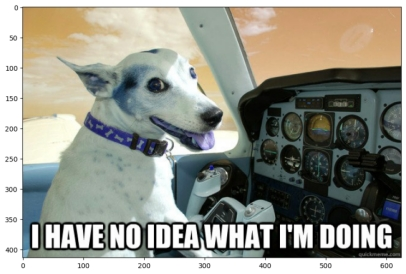 

图10.1 彩色图片状态展示

 

对于一张黑白的图像，它可以表示为一个M*N的矩阵。而对于一张彩色图像，就不是一个矩阵这么简单了。对于彩色图像而言，主要有RGB和HSV两种表示方法。RGB中彩色图像被分为三个通道，因为在物理学中所有的色彩都可以用红、绿、蓝三种颜色按不同比例组合而成。因此，对于彩色图像中，每个像素点的值也是一个三维数组，每一项表示对应通道的亮度值。例如，对于上述图像而言，我们可以看看它的尺寸：

```python
print(input_image.shape)

结果为(414,625,3)，表明图像的大小为414*625，有三个通道。在这张图里面，有b,g,r三个通道。可以将它作分解并重新组合，我们来看看一个通道究竟长什么样子：

# split channels

b,g,r=cv2.split(input_image)

plt.imshow(r, cmap='gray')

merged=cv2.merge([r,g,b])

# merge takes an array of single channel matrices

plt.imshow(merged)
```


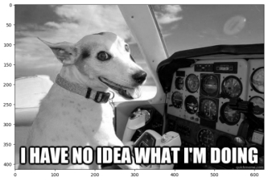 

图10.2 黑白彩色图片对比图

 

 

可以看到，每个通道的图都可以当做一张单独的黑白图像，但经过rgb重排以后的图终于可以显示为正常的彩色。这一操作也可以用下面的代码实现：

```python
opencv_merged=cv2.cvtColor(input_image, cv2.COLOR_BGR2RGB)

plt.imshow(opencv_merged)
```


HSV表示法是一种描述颜色的方式，其中H代表色调（Hue），S代表饱和度（Saturation），V代表明度（Value）。这种颜色空间与人类对颜色的感知方式更为接近，因此，在图像处理中，HSV空间经常用于颜色分割、颜色识别等任务。

色调是颜色的一种属性，它表示的是纯色的类型，比如红色、蓝色或黄色等。在HSV颜色空间中，色调以角度来表示，从0到360度。比如0（或360）度表示红色，120度表示绿色，240度表示蓝色。饱和度表示颜色的纯度或强度。一个颜色的饱和度越高，它就越鲜艳；饱和度越低，颜色就越接近灰色。在HSV中，饱和度是一个百分比值，从0%（灰色）到100%（完全饱和）。明度表示颜色的亮度或明暗程度。它与颜色的强度或发光量有关。在HSV中，明度也是一个百分比值，从0%（黑色）到100%（白色）。

RGB是一种加色模型，它是通过红、绿、蓝三种颜色的组合来表示颜色的。每种颜色的强度都通过一个0-255的数值来表示。RGB模型在显示设备上使用得很广泛，但它不太直观地表示人类对颜色的感知，尤其是色调。而HSV则是一种更接近人类感知的颜色空间，更适合用于颜色分割等任务。

在OpenCV中，你可以使用cvtColor函数将图像从RGB空间转换到HSV空间。以下是一个简单的示例：

```python 
# 读取图像  

image = cv2.imread('path_to_your_image.jpg')  

# 将图像从RGB转换到HSV  

hsv_image = cv2.cvtColor(image, cv2.COLOR_BGR2HSV)   

# 在HSV空间中设置一个颜色范围（比如蓝色）  

lower_blue = np.array([110, 50, 50])  

upper_blue = np.array([130, 255, 255])  

# 创建一个掩码，只保留在指定颜色范围内的像素  

mask = cv2.inRange(hsv_image, lower_blue, upper_blue)   

# 使用掩码对原图像进行颜色分割  

result = cv2.bitwise_and(image, image, mask=mask)   

# 显示结果  

cv2.imshow('Original Image', image)  

cv2.imshow('Mask', mask)  

cv2.imshow('Result', result)  

cv2.waitKey(0)  

cv2.destroyAllWindows()
```


这段代码首先读取一个图像，然后将其从RGB空间转换到HSV空间。接着，它定义了一个蓝色的HSV范围，并创建了一个掩码，只保留在这个范围内的像素。最后，它使用这个掩码对原图像进行颜色分割，并显示结果。

使用Opencv实现图像的裁剪可以通过数组索引的方式实现，例如，可以通过下面的代码切分图像中的某个部分：

```python
dogface = input_image[60:250, 70:350]

plt.imshow(dogface)
```

我们还可以把切分出来的部分粘贴到原图上去：

```python
fresh_image=cv2.imread('noidea.jpg') 

fresh_image[200:200+dogface.shape[0], 200:200+dogface.shape[1]]=dogface

print(dogface.shape[0])

print(dogface.shape[1])

plt.imshow(fresh_image)

如果想要实现翻转，可以使用flip函数。通过axis参数控制是水平翻转还是竖直翻转：

flipped_code_0=cv2.flip(input_image,0) # vertical flip

plt.imshow(flipped_code_0)

和numpy.array类似，opencv也提供了数组转置的transpose函数，这被用于翻转行列并生成镜像效果：

transposed=cv2.transpose(input_image)

plt.imshow(transposed)
```


高斯平滑（Gaussian Blurring）是图像处理中常用的一种技术，用于减少图像噪声和细节层次。它通过对图像中的每一个像素点，取其本身和邻域内的其他像素点的加权平均值来实现平滑效果。权重由高斯函数计算得出，距离中心越远的像素点，权重越小。可以通过GaussianBlur实现高斯平滑的效果：

```python
d=5

img_blur5 = cv2.GaussianBlur(input_image, (2*d+1, 2*d+1), -1)[d:-d,d:-d]

plt.imshow(cv2.cvtColor(img_blur5, cv2.COLOR_BGR2RGB))
```

腐蚀操作是一种形态学操作，它用来消除图像中的小物体、断开连接在一起的物体等。腐蚀操作的基本思想是将结构元素在图像上滑动，如果结构元素下的所有像素都是前景像素（通常为白色），则该位置的中心像素被认为是前景像素，否则为背景像素。

```python
import cv2 

import numpy as np 

 

# 读取图像，转换为灰度图像  

image = cv2.imread('path_to_your_image.jpg', 0)  

 

# 定义结构元素（核），这里使用5x5的矩形核  

kernel = np.ones((5, 5), np.uint8)  

 

# 进行腐蚀操作  

eroded_image = cv2.erode(image, kernel, iterations=1)  

 

# 显示原图像和腐蚀后的图像  

cv2.imshow('Original Image', image)  

cv2.imshow('Eroded Image', eroded_image)  

cv2.waitKey(0)  

cv2.destroyAllWindows()
```

锐化操作是一种用于增强图像边缘和细节的技术。在OpenCV中，通常通过使用滤波器来实现锐化，比如拉普拉斯滤波器或者自定义的卷积核。

```python
import cv2 

import numpy as np  

# 读取图像  

image = cv2.imread('path_to_your_image.jpg')  

# 定义锐化卷积核  

kernel = np.array([[-1,-1,-1],  

          [-1,9,-1],  

          [-1,-1,-1]])  

# 应用卷积核进行锐化  

sharpened_image = cv2.filter2D(image, -1, kernel)  

# 显示原图像和锐化后的图像  

cv2.imshow('Original Image', image)  

cv2.imshow('Sharpened Image', sharpened_image)  

cv2.waitKey(0)  

cv2.destroyAllWindows()
```


### **10.1.2  数字图像的特征点**

特征点是数字图像处理中用于图像分析和处理的关键信息点，它们可以代表图像中的显著特征，如角点、边缘和其他结构。有效的特征点检测是很多计算机视觉任务的基础，包括图像匹配、物体识别和追踪等。

Sobel特征点主要基于Sobel算子，这是一种常用于边缘检测的算子。其核心思想是将图像分成水平和垂直两个方向，然后在每个方向上计算梯度并求和，最后将两个方向上的梯度幅值差作为边缘强度。Sobel特征点的计算方法主要是通过应用两个3x3的卷积核对图像进行卷积操作，分别计算图像在水平和垂直方向上的梯度变化，从而识别出图像中的边缘。其主要作用是用于边缘检测，能够突出图像中的边缘特征，有效减少数据量，保留图像的重要结构属性，为后续图像处理和分析提供基础。例如：

```python
sobelimage=cv2.cvtColor(input_image,cv2.COLOR_BGR2GRAY)

 

sobelx = cv2.Sobel(sobelimage,cv2.CV_64F,1,0,ksize=9)

sobely = cv2.Sobel(sobelimage,cv2.CV_64F,0,1,ksize=9)

plt.imshow(sobelx,cmap = 'gray') 
```


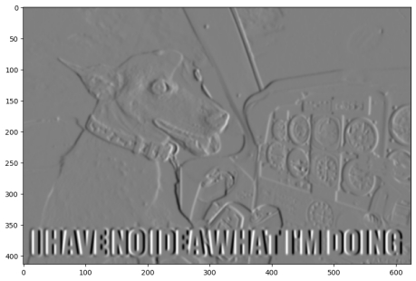 

图10.3 Sobel特征点图

Canny算子是由John F. Canny于1986年开发出来的一个多级边缘检测算法，被认为是最好的边缘检测算法之一。它采用了一系列步骤来提取图像中的边缘信息，包括噪声抑制、梯度计算、非极大值抑制、双阈值检测以及边缘连接。

 

首先，Canny算子利用高斯滤波器对输入图像进行平滑处理，以减少图像中的噪声。然后，通过对平滑后的图像应用Sobel或Prewitt等算子，计算每个像素点的梯度幅值和方向。接下来，非极大值抑制过程会在梯度图像上比较每个像素点在其梯度方向上的值，并保留局部最大值点，抑制非边缘像素。之后，Canny算子使用双阈值检测，根据设定的高阈值和低阈值，将梯度图像中的像素点分为强边缘、弱边缘和非边缘三个部分。最后，通过连接强边缘像素和与之相连的弱边缘像素，形成完整的边缘。

Canny算子相比其他边缘检测算法具有更高的准确性和更低的错误率，能够产生单一像素宽度的边缘响应，并尽量减少将噪声和细节等误判为边缘的情况。同时，Canny算子提出的基于边缘梯度方向的非极大值抑制和双阈值的滞后阈值处理，改进了传统算子如Sobel和Prewitt等的不足。

```python
th1=30

th2=60 # Canny recommends threshold 2 is 3 times threshold 1 - you could try experimenting with this...

d=3 # gaussian blur

 

edgeresult=input_image.copy()

edgeresult = cv2.GaussianBlur(edgeresult, (2*d+1, 2*d+1), -1)[d:-d,d:-d]

gray = cv2.cvtColor(edgeresult, cv2.COLOR_BGR2GRAY)

edge = cv2.Canny(gray, th1, th2)

edgeresult[edge != 0] = (0, 255, 0) # this takes pixels in edgeresult where edge non-zero colours them bright green

plt.imshow(cv2.cvtColor(edgeresult, cv2.COLOR_BGR2RGB))
```


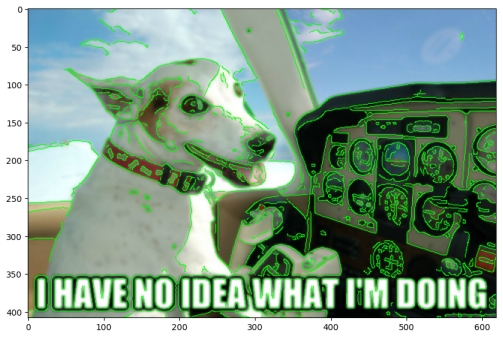 

图10.4 Harris角点图

 

Harris角点检测是一种计算机视觉中常用的角点检测算法，用于在图像中检测出角点特征。角点通常被定义为两条边的交点，或者说，角点的局部邻域应该具有两个不同区域的不同方向的边界。

Harris角点检测的原理主要基于图像的灰度变化和局部窗口的协方差矩阵。具体步骤包括：首先，将彩色图像转换为灰度图像；然后，根据灰度值计算每个像素的梯度，通常使用Sobel算子；接着，计算每个像素周围窗口内梯度的自相关矩阵；最后，根据自相关矩阵计算Harris响应函数，用于评估每个像素周围区域是否为角点。当Harris响应函数的值较大时，表示该像素点处存在角点。

 

Harris角点检测具有对图像旋转、尺度变化和亮度变化的不变性，且计算简单快速。它在计算机视觉领域中有广泛的应用，如目标跟踪、运动检测、视频剪辑、三维建模以及目标识别等。通过结合图像的多个角度，Harris角点检测可以恢复图像的完整形状，从而准确地识别和追踪目标。

```python
harris_test=input_image.copy()

#greyscale it

gray = cv2.cvtColor(harris_test,cv2.COLOR_BGR2GRAY)

 

gray = np.float32(gray)

blocksize=4 # 

kernel_size=3 # sobel kernel: must be odd and fairly small

# run the harris corner detector

dst = cv2.cornerHarris(gray,blocksize,kernel_size,0.05) # parameters are blocksize, Sobel parameter and Harris threshold

#result is dilated for marking the corners, this is visualisation related and just makes them bigger

dst = cv2.dilate(dst,None)

#we then plot these on the input image for visualisation purposes, using bright red

harris_test[dst>0.01*dst.max()]=[0,0,255]

plt.imshow(cv2.cvtColor(harris_test, cv2.COLOR_BGR2RGB))
```


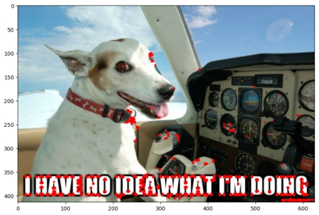 

图10.5 ORB特征点图

 

ORB（Oriented FAST and Rotated BRIEF）特征点是一种快速且高效的局部特征点提取和描述方法，它结合了FAST特征点检测算法和BRIEF描述子算法，并通过一系列改进和融合实现了更高的效率和鲁棒性。

ORB特征点检测的过程首先利用FAST算法来快速检测图像中的角点。这些角点通常是图像中像素值发生急剧变化的区域，如边缘、角等。为了提高特征点的旋转不变性，ORB算法会对检测到的角点进行方向计算，为每个角点分配一个主方向。接着，ORB算法使用BRIEF描述子算法为每个角点生成一个紧凑的二进制特征向量。这个特征向量仅包含0和1，其顺序根据特定角点和其周围像素区域的灰度强度变化而定。这种二进制特征向量可以节省内存空间和计算时间，同时保持较高的特征匹配准确性。

ORB算法在实时视觉应用，如SLAM（同时定位与地图构建）和无人机视觉等领域中得到了广泛应用。它提供了一种有效的方式来从图像中提取和描述关键特征点，以便进行后续的匹配、跟踪和三维重建等任务。

```python
orbimg=input_image.copy()

orb = cv2.ORB_create()

# find the keypoints with ORB

kp = orb.detect(orbimg,None)

# compute the descriptors with ORB

kp, des = orb.compute(orbimg, kp)

# draw keypoints

cv2.drawKeypoints(orbimg,kp,orbimg)

plt.imshow(cv2.cvtColor(orbimg, cv2.COLOR_BGR2RGB))
```


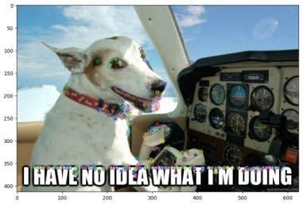 

图10.6 ORB特征点匹配图

 

与此同时，ORB特征点还具有平移不变性，简单的几何变换不影响ORB特征点的计算与匹配。下例展示了ORB特征点的匹配操作：

```python
kp2 = orb.detect(img2match,None)

# compute the descriptors with ORB

kp2, des2 = orb.compute(img2match, kp2)

# create BFMatcher object: this is a Brute Force matching object

bf = cv2.BFMatcher(cv2.NORM_HAMMING, crossCheck=True)

# Match descriptors.

matches = bf.match(des,des2)

# Sort them by distance between matches in feature space - so the best matches are first.

matches = sorted(matches, key = lambda x:x.distance)


# Draw first 50 matches.

oimg = cv2.drawMatches(orbimg,kp,img2match,kp2,matches[:50], orbimg)


plt.imshow(cv2.cvtColor(oimg, cv2.COLOR_BGR2RGB))
```


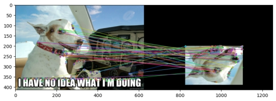 

图10.7 ORB特征点匹配操作图

 

### **10.1.3  计算机视觉**

生物的视觉能够让它们看到现实世界并感知，那么计算机如果想要感受这个世界首先就需要看到这个世界。计算机视觉就是让计算机看到世界的一门学科，它主要聚焦的就是图像信息如何在计算机中存储、表示、处理、分析、理解并应用。在传统的计算机视觉研究中，大家主要是利用一些数学方法实现对计算机图像的计算与处理，还远远达不到真正的理解信息。但随着神经网络的发展，计算机视觉终于迎来了一场革命。

以卷积神经网络和注意力机制为代表的深度学习方法在图像分类、目标检测、语义分割、图像超分辨率、图像生成等领域有着重要作用。如果不知道什么是卷积，可以理解为一个小矩阵在图片上扫描，每一次扫描小矩阵（也叫卷积核）会对扫描到的区域执行按位乘并求和，然后生成一个新的图像，过程如图10.8所示：

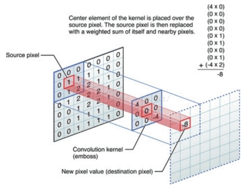 

图10.8 图像上执行卷积操作

在图像上执行卷积操作如图所示，卷积核扫描后按照按位乘求和的方式组织了新的图像。这一方法能够降低计算量，但保留图像的有效特征，也是特征提取的一种方法。卷积神经网络把这个卷积核中每一项的值看作一个待学习的权重从而构建神经网络。

注意：卷积神经网络是图像处理的经典方法。它的常见模型包括LeNet-5、ResNet、VGG、GoogleNet、GhostNet等多种结构，也是后继很多网络的Backbone例如Faster RCNN、YOLO、FCN等也都有卷积的影子在里面。

图像分类任务是计算机视觉领域中的一项基本任务，其目标是将输入的图像自动分配到预先定义的类别中。例如，一个图像分类系统可能将输入的图片识别为动物、植物、建筑或其他类别。这种分类依赖于从图像中提取的特征，这些特征可能包括颜色、纹理、形状等信息。研究者们一直在试图寻找不需要手工设计特征的分类模型。

ImageNet数据集的提出，标志着计算机视觉领域进入了一个新的时代。ImageNet是一个大型图像数据库，包含了数以百万计的手动标注的图像，涵盖了上千个不同的类别。这个数据集的提出极大地推动了深度学习在图像分类任务中的应用，因为它提供了足够的数据来训练复杂的神经网络模型。随着深度学习的到来，研究者们开始构建能够自动学习图像特征的神经网络，而不是依赖手工设计的特征。

在深度学习的浪潮中，面向图像分类的深度学习模型经历了多次迭代。最初的模型，如AlexNet，采用了卷积神经网络（CNN）的结构，通过堆叠多个卷积层来提取图像的特征。随后，VGGNet和GoogLeNet等模型进一步提升了性能，通过增加网络深度和宽度，以及引入新的卷积结构，如Inception模块。而ResNet模型则通过引入残差连接，解决了深度神经网络中的梯度消失问题，从而实现了更高的分类准确率。这些模型的迭代不仅推动了图像分类任务的性能提升，也为其他计算机视觉任务提供了强大的基础。

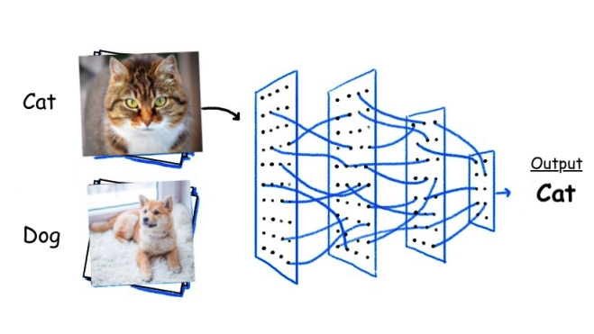 

图10.9 图像分类任务

目标检测任务是计算机视觉领域的一个重要分支，旨在识别图像或视频中的特定目标，并给出它们的位置信息。这个任务通常涉及定位目标物体的边界框，并识别其类别。然而，目标检测面临着一些挑战，其中最突出的是目标尺寸变化、形状多样、遮挡情况以及背景的复杂性。这些因素使得准确检测目标变得困难，尤其是在复杂场景中。

为了评估目标检测算法的性能，我们采用一系列评价指标。这些指标主要包括准确率（Precision）、召回率（Recall）、F1分数以及mAP（mean Average Precision）。在目标检测领域，存在许多经典的数据集用于训练和评估算法。其中，PASCAL VOC、COCO（Common Objects in Context）和ImageNet Detection Challenge等数据集广受欢迎。这些数据集包含了大量标注好的图像，涵盖了各种目标类别和场景，为研究者提供了丰富的实验资源。

随着技术的不断发展，目标检测方法也在不断演进。经典的目标检测方法如YOLO、SSD、Faster R-CNN、DETR等，通过引入深度学习技术，实现了对目标的高效检测。YOLO系列算法通过改进网络结构和损失函数，逐渐提高了检测速度和精度。而Faster R-CNN则通过引入区域提议网络（RPN），实现了对目标区域的快速提取和分类，进一步提高了目标检测的性能。这些经典方法的技术演化和迭代不仅推动了目标检测领域的进步，也为后续研究提供了宝贵的经验和启示。随着技术的不断创新和发展，相信未来目标检测任务将会取得更加卓越的成果。

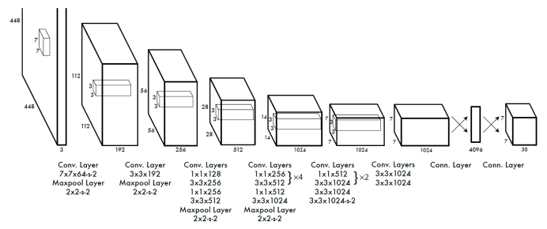

图10.10 YOLO模型基本结构

 

图像分割任务是指将图像划分为若干个互不相交的区域，每个区域都代表图像中的一个物体或场景的一部分。这一任务在计算机视觉中至关重要，因为它有助于从复杂的图像中提取出有意义的信息。然而，图像分割面临着诸多难点。首先，图像中的物体可能具有复杂的形状、纹理和颜色，使得准确区分不同物体变得困难。其次，光照条件、噪声、遮挡等因素也可能对分割结果产生负面影响。此外，处理不同尺度和分辨率的图像也是一大挑战。

在图像分割模型的技术演化与迭代方面，经典的模型如FCN（全卷积网络）为后续的研究奠定了基础。FCN通过引入全卷积层来替代传统卷积神经网络中的全连接层，从而实现了端到端的像素级预测。随后，U-Net模型进一步推动了图像分割技术的发展。U-Net采用编码器-解码器结构，通过跳跃连接将低层特征与高层特征相结合，提高了分割的准确性和细节保留能力。随着深度学习技术的不断发展，越来越多的模型如DeepLab、Mask R-CNN等不断涌现，它们在特征提取、上下文信息融合、多尺度处理等方面进行了改进和创新，进一步提升了图像分割的性能和鲁棒性。

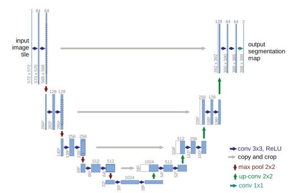 

图10.11 U-Net模型基本结构

 

图像生成任务是计算机视觉领域的一个重要分支，它涉及到生成具有特定属性的图像。这个任务的目标是根据给定的输入信息，生成一张新的图像。生成对抗网络（GAN）则是这一领域出色的模型。GAN网络，即生成对抗网络，是一种在图像生成任务中表现尤为出色的深度学习模型。GAN网络由两个主要部分构成：生成器和判别器。生成器的任务是生成新的数据样本，如图像，而判别器则负责判断这些生成的样本与真实数据之间的差异。这两个部分通过对抗学习的方式相互竞争，使生成器不断提高其生成逼真样本的能力，同时判别器也持续提高其辨别真伪样本的能力。它的核心思想正是我们在第3章中讲到的博弈论。由于GAN网络具有出色的表现，它已被广泛应用于计算机视觉、自然语言处理和创意艺术等多个领域。

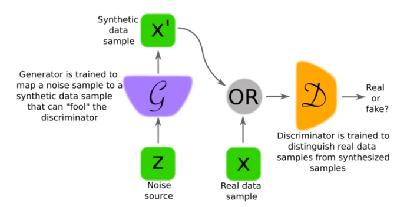 

图10.12 GAN模型基本结构

 

现在，随着人工智能的发展，我们也有了很多面向计算机视觉的大模型。比如midjourney和stable diffusion，SORA……如今，随着人工智能技术的飞速进步，计算机视觉领域也迎来了前所未有的发展机遇。在这一浪潮中，我们见证了众多面向计算机视觉的大模型的涌现，它们如同璀璨的明星，点亮了科技创新的天空。展望未来，随着人工智能技术的不断发展，我们相信会有更多面向计算机视觉的大模型涌现出来，为我们带来更多的惊喜和突破。这些模型将在图像识别、目标检测、图像生成等多个方面发挥越来越重要的作用，推动计算机视觉领域不断向前发展。

## 10.2  计算语言学与自然语言处理

语言同样是可以被计算的。这第二种非常规数据就是对文本的处理与分析。

### **10.2.1  Python处理字符串**

Python处理字符串的功能非常全面和强大，无论是基本的字符串操作还是复杂的文本处理任务，Python都提供了丰富的工具和方法。

 

首先，Python支持多种方式来创建和操作字符串。我们可以使用单引号、双引号或三引号来定义字符串。例如：

 ```python
 str1 = 'Hello, World!'
 
 str2 = "Welcome to Python"
 
 str3 = '''This is a
 
 multi-line string.'''
 ```

 

其次，Python提供了丰富的字符串方法，这些方法允许我们执行各种字符串操作。例如，使用`upper()`和`lower()`方法可以将字符串转换为大写或小写形式：

```python
str_lower = str1.lower()  # 转换为小写

str_upper = str1.upper()  # 转换为大写

print(str_lower)  # 输出: hello, world!

print(str_upper)  # 输出: HELLO, WORLD!
```


此外，Python还支持字符串的切片操作，允许我们提取字符串的子串。切片操作使用冒号分隔起始索引和结束索引，并可以指定步长：

 ```python
 substring = str2[7:13]  # 提取索引7到12之间的字符（不包括13）
 
 print(substring)  # 输出: to Python
 ```


Python还提供了查找和替换字符串中特定子串的功能。例如，使用`find()`方法可以查找子串的索引，而`replace()`方法则可以替换字符串中的特定部分：

 ```python
 index = str1.find('World')  # 查找'World'的索引
 
 print(index)  # 输出: 7
 
  
 
 new_str = str1.replace('World', 'Python')  # 将'World'替换为'Python'
 
 print(new_str)  # 输出: Hello, Python!
 ```

 

对于更复杂的文本处理任务，Python支持正则表达式，通过`re`模块提供了一套强大的工具。正则表达式允许我们定义复杂的字符串模式，并进行匹配、查找和替换操作：

 ```python
 import re
 
 # 使用正则表达式查找所有数字
 
 numbers = re.findall(r'\d+', str3)
 
 print(numbers)  # 输出: ['1', '2']（假设str3中包含数字）
 
 # 使用正则表达式替换字符串中的模式
 
 new_str4 = re.sub(r'\s+', '_', str2)  # 将所有空格替换为下划线
 
 print(new_str4)  # 输出: Welcome_to_Python
 ```

 

通过这些示例，我们可以看到Python处理字符串的灵活性和强大性。无论是简单的字符串拼接和切片，还是复杂的文本搜索和替换，Python都提供了直观且易于使用的工具和方法。这使得Python成为处理文本数据和字符串操作的理想选择。

### **10.2.2  文本的嵌入表示**

图像因为在计算机中以数值张量的形式存储，它的计算我们还可以理解。文本又是为什么可以作为数据而计算呢？这就要提到自然语言处理技术啦。

在自然处理领域，对文本的编码也就是向量化将其转化为序列模型是进行所有任务的基本预处理操作。文本的向量化方法有很多，从最早的基于统计自然语言处理的向量化方法，到后来的基于机器学习的向量化方法，再到目前应用广泛的基于深度学习的向量化方法（尤其是基于大规模预训练模型的向量化），向量化方法的技术路径按照一条有规律的主线向前推进。

最原始的文本向量化方法即为独热编码(One-Hot Encoding)。独热编码将所有文本中的单词进行统计，将每个单词转化为1个0-1向量。显然，独热编码方法仅适合处理单个词、短语等极短文本，不适合对长文本进行建模。基于统计方法的TF-IDF算法则很好地改进了这一问题。TF的意思是词频，IDF的意思是逆文本频率指数，它基于这样一个事实：某个单词在某一篇文章中出现频次越高，同时在其他文章中出现频次越低，则这个单词就越可能是该文章的一个关键词。TF-IDF的基本表达式形如：

|  | (10.1) |
| ----------------------- | ------ |

其中，TF(t,d)词语t 在 文档d 中出现的频率，IDF(t)是逆文本频率指数，它可以衡量 单词t 用于区分这篇文档和其他文档的重要性。IDF的公式如式3.2所示，其中Ntext表示文章总数，Ntext(t)表示含单词t的文章数，分母加1是为了避免分母为0：

|  | (10.2) |
| ----------------------- | ------ |

Word2vec是基于神经网络的模型，引入了机器学习因素，它有两类典型的模型，即：用一个词语作为输入，来预测它周围的上下文的skip-gram模型，和拿一个词语的上下文作为输入，来预测这个词语本身的CBOW模型。CBOW对小型语料比较合适，而Skip-Gram在大型语料中表现更好。图10.13为两种典型的word2vec架构：

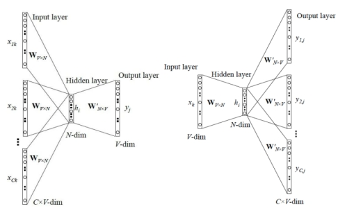 

图10.13 两种典型的word2vec架构

 

2018年底微软提出的BERT（Bidirectional Encoder Representation from Transformers）相较于Elmo和GPT-2取得了更好的表现，目前也是应用最广泛的文本向量化方法之一,因为在 BERT 中，特征提取器也是使用的Transformer,且 BERT 模型是真正在双向上深度融合特征的语言模型[[[] Devlin J, Chang M W, Lee K, et al. BERT: Pre-training of Deep Bidirectional Transformers for Language Understanding[J]. 2018.]]。

BERT架构如图10.14所示，与GPT、ELMo模型的区别如图所示。BERT与GPT的区别就在于BERT采用的是Transformer Encoder，也就是说每个时刻的Attention计算都能够得到全部时刻的输入，而OpenAI GPT采用了Transformer Decoder，每个时刻的Attention计算只能依赖于该时刻前的所有时刻的输入，因为OpenAI GPT是采用了单向语言模型。

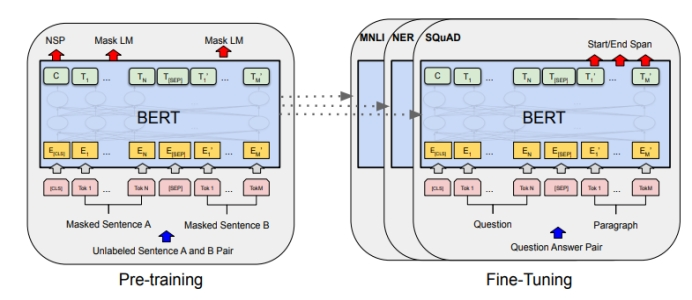 

图10.14 BERT的架构

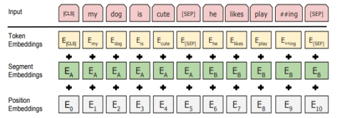 

图10.15 BERT的嵌入表示形式

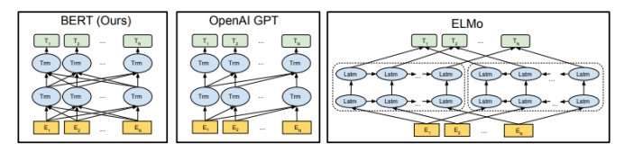 

图10.16 BERT、GPT和ELMo的对比

图10.16 BERT预处理进行下游任务的输入是三个嵌入表示叠加，如图10.15，Token embedding 表示当前词的embedding，Segment Embedding 表示当前词所在句子的index embedding，Position Embedding 表示当前词所在位置的index embedding。

在 BERT 出现之前的词嵌入技术，如 Word2Vec 中，一个句子的嵌入表示，往往简单的使用 Word2Vec 得到的各个单词的词嵌入表示进行平均或加和得到，这就导致无法得到包含深层语义和语序信息的词嵌入表示，实际任务中效果也较差。而通过BERT 得到的词嵌入表示融入了更多的语法、词法以及语义信息，而且动态的改变词嵌入也能够让单词在不同语境下具有不同的词嵌入表示。

### **10.2.3  文本的分类与话题模型**

对于文本分类任务，我们可以将其向量化后转化为一般的机器学习分类任务后用机器学习算法解决，也可以用深度学习算法解决。TextCNN网络是2014年提出的用来做文本分类的卷积神经网络，由于其结构简单、效果好，在文本分类、推荐等NLP领域应用广泛。图10.8就是一个TextCNN的模型图：

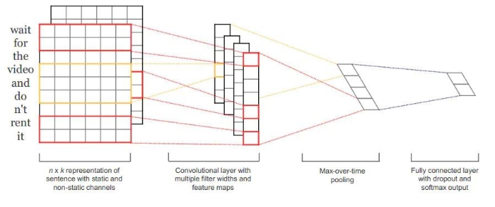 

图10.17 TextCNN的模型结构

图10.17代表了TextCNN中的模型结构。与图像当中CNN的网络相比，TextCNN 最大的不同便是在输入数据的不同。图像是二维数据, 图像的卷积核是从左到右, 从上到下进行滑动,然后通过卷积核映射来进行特征抽取，而以自然语言为代表的序列模型是一维数据, 虽然经过word-embedding 生成了二维向量，但是对词向量而言无法进行从左到右的滑动卷积。TextCNN的成功更多的是发掘序列模型的卷积模式，通过引入已经训练好的词向量来在多个数据集上达到了非常良好的表现，进一步证明了构造更好的embedding是提升自然语言处理领域各项任务的关键能力。

  循环神经网络被用于文本等序列模型的建模中。文本分类问题就是对输入的文本字符串进行分析判断，之后再输出结果，但字符串无法直接输入到RNN网络，因此在输入之前需要先对文本拆分成单个词组，将词组编码成一个向量，每轮输入一个词组，得到输出结果也是一个向量。嵌入表示将一个词对应为一个向量，向量的每一个维度对应一个浮点值，动态调整这些浮点值使得编码和词的意思相关。这样网络的输入输出都是向量，再最后进行全连接操作对应到不同的分类即可。

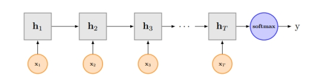 

图10.18 使用RNN进行文本分类

如图10.18，RNN进行文本分类时将问题抽象为序列，最后使用softmax进行分类预判。RNN网络不可避免地带来问题就是最后的输出结果受最近的输入较大，而之前较远的输入可能无法影响结果，这就是信息瓶颈问题。可以使用双向LSTM，不仅增加了反向信息传播，而且每一轮的都会有一个输出，将这些输出进行组合之后再传给全连接层。

注意：卷积神经网络应用在文本问题上的一个最大的特点就是快。

自然语言处理模型在处理中文的时候一个很大的问题就是分词，因为中文不像英文单词用空格分隔，并且中文分词的时候要注意歧义的问题。另外，如果想自动识别语句中的专有名词，例如人名、地名、时间等，这一任务叫命名实体识别。对于分词和命名实体识别，都可以将其抽象为序列标注问题解决。

传统的命名实体识别方法依赖于手工规则的系统，结合命名实体库，对每条规则进行权重辅助，然后通过实体与规则的相符情况来进行类型判断。大多数时候，规则往往依赖具体语言领域和文本风格，难以覆盖所有的语言现象。基于机器学习的命名实体识别方法广泛应用了判别式的条件随机场和生成式的隐马尔可夫模型。目前，文本中的序列标注任务通常会采用循环神经网络与条件随机场的融合模型，必要时还可以加入BERT等大规模预训练模型等内容。

LDA（隐狄利克雷分布）在文本话题模型中的应用原理，其实可以理解为一种帮助我们自动找出文本中隐藏话题的“魔法”。想象一下，你有一堆文章，但是你不知道它们主要讲了哪些话题。LDA就能帮你把这些话题找出来。LDA是怎么做到的呢？首先，它认为每篇文章都是由几个不同的话题混合而成的。比如说，一篇文章可能同时讨论了“旅游”和“美食”这两个话题，但可能“旅游”的话题更多一些，“美食”的话题稍微少一些。然后，LDA又认为每个话题都是由一堆特定的词语组成的。比如“旅游”这个话题，就可能会有“风景”、“旅行”、“酒店”等词语；而“美食”这个话题，则可能会有“菜肴”、“口感”、“餐厅”等词语。LDA的工作就是找出每篇文章中各个话题的比例，以及每个话题中各个词语的比例。它会反复地学习、尝试，直到找到一个最合理的解释，即这些文章是如何由这些话题和词语组成的。这样，当我们再次看到一篇新的文章时，LDA就能告诉我们这篇文章主要讨论了哪些话题，以及每个话题在文章中的重要程度。注意, LDA在分析文本的话题模型的时候词汇的语序对话题模型并没有什么显著影响。

例如，我们爬取了B站上有关觉醒年代的所有视频有关数据信息，首先可以绘制一幅它的词云图：

```python
import pandas as pd

df=pd.read_excel("觉醒年代所有视频.xlsx")

import jieba

import wordcloud

# 读取文本

s=''.join(str(i) for i in df['description'])

s=s.replace('nan','')

print(s)

ls = jieba.lcut(s) # 生成分词列表

text = ' '.join(ls) # 连接成字符串

stopwords = ["的","是","了","得","将","不","导致","引起","【","】","http","https","quot",'q','u','o','t','他','你','我'] # 去掉不需要显示的词

wc = wordcloud.WordCloud(font_path="msyh.ttc",

             width = 2000,

             height = 1400,

             background_color='white',

             max_words=500,stopwords=s)

# msyh.ttc电脑本地字体，写可以写成绝对路径

wc.generate(text) # 加载词云文本

wc.to_file("词云1.png") # 保存词云文件

 
```


 

 

图10.19 词云图

 

接着，使用gensim包中的LDA模块构造话题模型：

```python
import gensim

from gensim import corpora

import matplotlib.pyplot as plt

import matplotlib

import numpy as np

import warnings

warnings.filterwarnings('ignore')  # To ignore all warnings that arise here to enhance clarity

 

from gensim.models.coherencemodel import CoherenceModel

from gensim.models.ldamodel import LdaModel

dictionary = corpora.Dictionary([ls])  # 构建词典

corpus = [dictionary.doc2bow([text]) for text in ls]  #表示为第几个单词出现了几次

ldamodel = LdaModel(corpus, num_topics=15, id2word = dictionary, passes=30,random_state = 1)  #分为15个主题

print(ldamodel.print_topics(num_topics=15, num_words=20))  #每个主题输出20个单词
```

通过话题模型可以看到，文本可以分为以下话题：

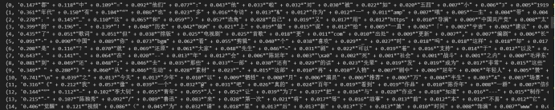 

最后，我们利用snownlp分析文本的情感倾向与极性：

```python
import snownlp

data=pd.DataFrame(strings,columns=['弹幕'])

data['情感极性']=data['弹幕'].apply(lambda x: snownlp.SnowNLP(x).sentiments)

data
```


得到结果如图所示：

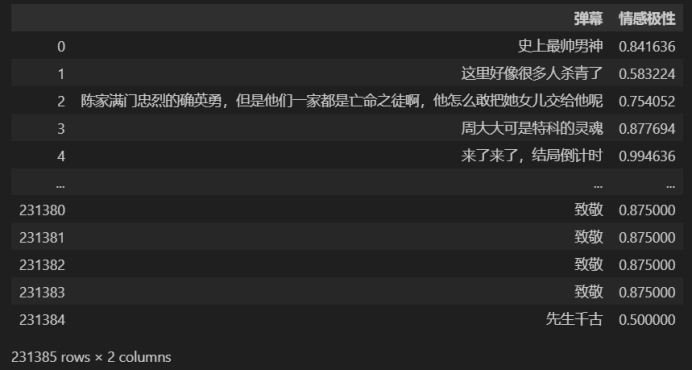 

SnowNLP的情感分析功能通常会返回一个情感分数，这个分数可以用来表示文本的情感倾向。通常，分数越高表示情感越积极，分数越低表示情感越消极。你需要了解这个分数的具体含义和取值范围。SnowNLP可能还提供了对文本中特定词汇的情感分析。你可以查看这些词汇及其对应的情感分数，了解哪些词汇对整体情感倾向的影响最大。这有助于你深入理解文本的情感内容。

## 10.3  数字信号处理与智能感知

第三种非常规数据类型是对数字信号的变换与处理。在数字信号处理的世界中，我们经常需要转换和处理各种信号，以便更好地理解和利用这些数据。本教程不准备抢走信号与系统老师的饭碗，所以对数字信号的处理只是简单补充，想要深入了解，请参阅相关的数字信号处理课程。

### **10.3.1  数字信号的傅里叶变换**

傅里叶变换是一种非常有力的数学工具，它让我们能够从一种视角（时域）切换到另一种视角（频域）。通过这种变换，我们可以揭示信号的频率内容，这对于许多应用来说是至关重要的。

 

想象一下，当你听音乐时，你所听到的声音随时间变化，展现出不同的音高和节奏。这种随时间变化的声音就是一个典型的时域信号，即我们可以看到音乐在时间上的波形。然而，仅仅通过波形图观察，我们很难分辨出音乐中包含的各种不同音符或频率成分。

 

这时，傅里叶变换就显得非常有用。它允许我们将这些时域信号转换成频域信号，从而清晰地揭示出音乐中各个不同频率成分的具体信息。在信号处理领域，我们常常将信号视为随时间变化的函数。时域分析关注的是信号随时间的变化，而频域分析则关注的是信号中各个频率成分的表现，这有助于我们深入理解信号的复杂频率特性。

 

傅里叶级数告诉我们，任何周期函数都可以被分解为一系列正弦和余弦函数的和。这些正弦和余弦函数具有不同的频率和相位，通过它们的组合，我们能逼近或完整表达原始的周期函数。对于那些非周期信号，我们可以将其视为周期无限大的信号，通过傅里叶变换进行分析。

 

傅里叶变换的数学公式如下所示：

 

| 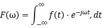 | (0.3) |
| ----------------------- | ----- |

 

其中：

  表示信号在频率为 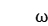 时的频谱分量；

 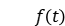 表示信号在时刻 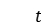 的值；

 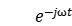 是复指数函数，其中 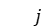 是虚数单位。

这个公式表示的是将时域信号  转换为频域信号 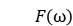 的过程。通过积分运算，我们可以得到信号在各个频率上的分量。简单来说，傅里叶变换就是将时间上的信号转换成显示其频率成分的信号。通过这种转换，我们能够计算并分析不同频率上的信号强度。

 

傅里叶变换的结果通常表示为复数，这是因为复数可以同时包含幅度和相位信息。这里的幅度表示频率成分的强度，而相位则显示了这些频率成分在时间轴上的位置。通过分析这些复数结果，我们可以得到信号的幅度谱和相位谱，进而全面理解信号的频率特征。

 

傅里叶变换在许多技术领域都有广泛应用。在信号处理领域，它可以帮助我们过滤或减少噪音。在图像处理中，傅里叶变换用于分析图像的频率属性，帮助进行图像增强和边缘检测。此外，它也是通信技术中不可或缺的一部分，用于编码和传输信号。总之，傅里叶变换是一种强大的数学工具，它能够将信号从时域转换到频域，帮助我们深入理解信号的频率特性并进行相应的处理。

 

如果你想在实际编程中实现傅里叶变换，Python提供了非常便捷的工具。例如，使用NumPy库中的fft模块，你可以轻松进行一维离散傅里叶变换。这里有一个简单的示例，演示了如何用NumPy进行这样的变换：

```python
import numpy as np

import matplotlib.pyplot as plt

# 创建一个包含一些频率成分的信号

fs = 150.0;  # 采样频率

ts = 1.0/fs; # 采样间隔

t = np.arange(0,1,ts) # 时间向量

ff = 5;  # 频率

y = np.sin(2*np.pi*ff*t)

# 对信号进行傅里叶变换

n = len(y) # 长度

k = np.arange(n)

T = n/fs

frq = k/T # 两侧的频率范围

Y = np.fft.fft(y)/n # fft计算并归一化

# 由于对称性，我们只取一半

Y = Y[range(n//2)]

frq = frq[range(n//2)]

# 绘图

plt.subplot(2,1,1)

plt.plot(t,y)

plt.xlabel('Time')

plt.ylabel('Amplitude')

 

plt.subplot(2,1,2)

plt.plot(frq,abs(Y),'r') # 绘制频谱图

plt.xlabel('Freq (Hz)')

plt.ylabel('|Y(freq)|')

plt.tight_layout()

plt.show()
```


 

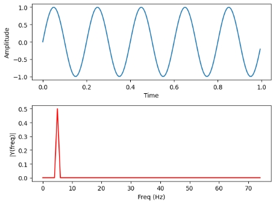 

图10.20 原始信号与频谱图展示

 

在这个例子中，我们首先创建了一个包含单一频率成分的信号。然后，我们使用`np.fft.fft`函数对该信号进行傅里叶变换，并绘制了原始信号和频谱图。值得注意的是，由于傅里叶变换的结果在频率轴上是对称的，我们通常只展示一半的频谱图。

 

这只是一个入门级的示例。在更复杂的实际应用中，你可能需要处理包含多个频率成分的信号，或者进行更高级的操作，如窗函数处理和滤波等。

 

此外，如果你要处理的数据是二维的（如图像），你可以使用二维傅里叶变换，这可以通过np.fft.fft2函数来实现。二维傅里叶变换在图像处理中特别有用，比如在图像增强或边缘检测等应用中。

 

### **10.3.2  数字信号的统计指标**

在处理信号数据时，尽管其处理方式相比图像和文本数据可能显得更为直接，通常涉及各种类型的滤波技术，我们还需要深入理解信号的内在特性。这些特性通常在时域、频域以及时频域内分析，以提供全面的信号表征。但在介绍信号的滤波之前，我需要先列举一些信号的统计特性，包括时域、频域、时频域：

 

时域分析是信号分析中最直观的方法，它涉及信号随时间变化的特性。在时域中，我们可以提取以下几种关键的统计特性：

 

我们提取的时域特征包括：

- 最大值：信号在观测期间的最高点，表示信号能够达到的最大幅度。

- 最小值：与最大值相对，表示信号在观测期间的最低点。

- 峰值：信号最大值和最小值的差值，常用于描述信号的振幅。

- 偏度：度量信号分布的对称性。正偏度意味着信号的尾部向右延伸较长，负偏度则表示尾部向左延伸较长。

|  | (10.4) |
| ----------------------- | ------ |

其中表示偏度，用于表示统计数据分布偏斜方向和程度。

- 整流平均值

|  | (10.5) |
| ----------------------- | ------ |

其中Xarv表示整流平均值。

- 均值：即为信号中心值，随机信号在均值附近波动，其定义为：

|  | (10.6) |
| ----------------------- | ------ |

其中N为样本大小。

- 标准差：反映出信号的波动程度，其大小与波动程度正相关：

|  | (10.7) |
| ----------------------- | ------ |

 

- 均方根值：即有效值，能作为振动信号振动幅度大小的一个量度，也可以度量故障的严重程度：

|  | (10.8) |
| ----------------------- | ------ |

 

- 峰值指标：用于表示信号中是否存在冲击：

|  | (10.9) |
| ----------------------- | ------ |

C即为峰值指标，Xp为信号的峰值。

- 峭度指标：用于反映信号中冲击的特征：

|  | (10.10) |
| ----------------------- | ------- |

 

- 波形指标：用于检测信号中是否有冲击:

|  | (10.11) |
| ----------------------- | ------- |

 

- 裕度指标：用于检测设备的磨损情况：

|  | (10.12) |
| ----------------------- | ------- |

 

- 脉冲指标：用于检测信号中是否存在冲击：

|  | (10.13) |
| ----------------------- | ------- |

这些特性帮助我们把握信号在时间上的基本行为和波动特点。

当我们分析信号时，确实需要考虑其复杂的自然属性，尤其是当信号的幅值、频率、和相位随机变化时。这些变化给直接的傅里叶变换带来了挑战，因为傅里叶变换需要信号具有稳定的周期性，这在许多实际应用中是不现实的。因此，我们转向功率谱密度分析，它不要求信号具有长期的稳定性，而是关注于信号功率如何在各个频率上分布，从而适用于分析广泛的信号类型，包括随机和非平稳信号。

在频域分析中，除了传统的频率和幅度分析，我们还可以提取一些更为细致的特征，来描述和理解信号的行为和状态：

- 重心频率：当设备发生故障时，可推知某一处频率的振动幅值会发生变化，进而导致功率谱的重心位置发生变化，而重心频率可以反映功率谱的重心位置，故可用重心频率来判断故障状态。

|  | (10.14) |
| ----------------------- | ------- |

其中为重心频率，和分别为时刻对应的频率值与幅值。

- 均方频率：这是一个评估功率谱重心稳定性的指标，可用于追踪功率谱中心的动态变化。其计算方法通常涉及到功率谱的二阶矩。

|  | (10.15) |
| ----------------------- | ------- |

- 频率方差：此参数反映了频率谱能量的分散程度，是评价信号频率分布稳定性的一个关键指标。频率方差越大，表明信号的能量分布越分散。 

|  | (10.16) |
| ----------------------- | ------- |

时频域分析提供了一种同时观察信号在时间和频率两个维度变化的方法，适合分析那些在短时间内频率特性快速变化的信号：

- 频带能量：通过计算特定频带内的总能量，可以帮助我们理解信号在特定频段的能量分布情况。

- 相对功率谱熵：这是度量功率谱分布均匀性的指标。高的功率谱熵意味着信号的能量较为均匀地分布在不同的频率上，而低的功率谱熵则表明信号的能量集中在少数几个频率上。这一指标对于分析信号的复杂性和预测其行为模式非常有用。

|  | (10.17) |
| ----------------------- | ------- |

通过深入分析这些特性，我们不仅能更好地理解信号的基本行为和波动特点，还能在实际应用中，如设备维护和故障预测等领域，提供更准确的数据支持。

### **10.3.3  数字信号的滤波与分解**

数字信号处理（DSP）是一门研究信号的表示、变换和信息提取的学科。在众多DSP应用中，滤波是一项基本而重要的技术，用于去除信号中不需要的成分或提取有用的信息。Python 提供了多个强大的库来支持数字信号处理，其中 scipy 和 numpy 是最常用的工具。

在Python中，你可以使用多种库来对信号进行滤波，其中最常见的库包括`scipy`和`numpy`。

 

准备工作：安装必要的库。在Python中开始信号处理之前，我们需要确保已经安装了必要的库。通过以下命令，您可以快速安装numpy和scipy：

```python
pip install numpy scipy
```

 

然后，我们从创建一个包含两个不同频率成分的合成信号开始。这种信号可以帮助我们演示滤波效果的直观性，并应用不同类型的滤波器：

 ```python
 import numpy as np
 
 import matplotlib.pyplot as plt
 
  
 
 # 设置采样频率
 
 fs = 1000 # Hz，表示每秒采样1000次
 
  
 
 # 生成时间向量，持续1秒
 
 t = np.linspace(0, 1, fs, endpoint=False)
 
  
 
 # 定义信号中的两个频率
 
 f1, f2 = 5, 120 # Hz
 
  
 
 # 使用正弦波叠加生成信号
 
 x = np.sin(2 * np.pi * f1 * t) + 0.5 * np.sin(2 * np.pi * f2 * t)
 
  
 
 # 绘制这个复合信号
 
 plt.figure(figsize=(10, 4))
 
 plt.plot(t[:100], x[:100], label='Original Signal')
 
 plt.title('原始信号')
 
 plt.xlabel('时间 [秒]')
 
 plt.ylabel('振幅')
 
 plt.legend()
 
 plt.show()
 ```


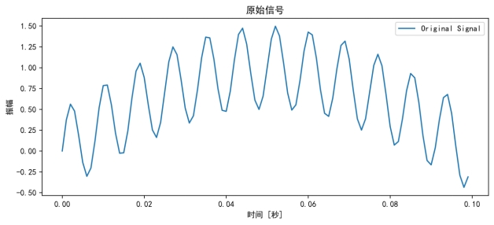 

图10.21 原始信号图

 

​	我们的目标是去除信号中的高频部分。为此，我们将设计一个低通滤波器，只允许频率低于60Hz的部分通过。

```python
from scipy import signal

# 设计一个低通滤波器，截止频率为60Hz

b, a = signal.iirfilter(N=8, Wn=60 / (fs / 2), btype='low', ftype='butter')

# 现在，我们使用刚刚设计的滤波器处理信号，并观察滤波效果。

# 通过滤波器处理信号

y = signal.lfilter(b, a, x)

# 绘制滤波后的信号与原始信号对比

plt.figure(figsize=(10, 8))

plt.subplot(2, 1, 1)

plt.plot(t[:100], x[:100])

plt.title('原始信号')

plt.xlabel('时间 [秒]')

plt.ylabel('振幅')

 

plt.subplot(2, 1, 2)

plt.plot(t[:100], y[:100])

plt.title('经过低通滤波的信号')

plt.xlabel('时间 [秒]')

plt.ylabel('振幅')

plt.tight_layout()

plt.show()
```


 

图10.22 原始信号与经过滤波信号对比图

 

在这个例子中，我们创建了一个包含两个频率成分（5Hz和120Hz）的信号。然后，我们设计了一个8阶的IIR低通滤波器，其截止频率为60Hz，并使用`signal.lfilter`函数将滤波器应用于信号。最后，我们绘制了原始信号和滤波后的信号，如图10.22所示。

 

除了低通滤波器外，scipy.signal模块还为我们提供了一系列强大的工具，可以用来设计不同类型的滤波器，从基本的低通和高通滤波器到更复杂的带通和带阻滤波器。你可以通过调整滤波器的类型和参数来满足你的需求。在这里举出一些所支持的高级滤波。

 

巴特沃斯滤波器：通过scipy.signal.butter函数设计。这种滤波器以其平坦的通带特性而闻名，能够在通带内保持较一致的幅度响应，非常适合需要避免频率失真的应用场合。

 

切比雪夫滤波器：通过scipy.signal.cheby1（类型I）和scipy.signal.cheby2（类型II）函数设计。这些滤波器在通带或阻带中具有等波纹性能，使得它们在特定的频率范围内可以实现更快的衰减速率，适用于对滤波器性能要求较高的情况。

 

椭圆滤波器：通过scipy.signal.ellip设计，这类滤波器在通带和阻带都具有等波纹特性，并且能够在较低的滤波器阶数下实现非常陡峭的截止特性，非常适合对过渡带有严格要求的应用。

 

贝塞尔滤波器：通过scipy.signal.bessel设计，这种滤波器在所有滤波器中最注重相位特性的线性，使之成为处理音频和其他需要精确相位信息的信号的理想选择。

 

FIR滤波器设计：scipy.signal还提供了firwin和firwin2函数，用于设计具有指定频率响应的有限脉冲响应（FIR）滤波器。这类滤波器通常更易于设计并且能够完全实现线性相位特性。

 

除了基本的滤波器设计，scipy.signal还支持更高级的功能，如使用窗函数法设计滤波器、优化滤波器系数等。这些高级技术允许用户在保证滤波性能的同时，优化滤波器的结构和效率。使用这些滤波方法时，你可以通过调整滤波器的阶数、截止频率、类型等参数来优化滤波器的性能。此外，`scipy.signal`还提供了其他功能强大的信号处理函数，如卷积、相关、频谱分析等，以支持更复杂的信号处理任务。

 

如果你需要更高级的滤波功能，例如窗函数设计、滤波器系数优化等，你可能需要深入了解数字信号处理的理论，并查阅`scipy.signal`模块的文档以获取更多信息。请注意，设计滤波器时需要根据具体的应用需求选择合适的滤波器类型和参数。在设计滤波器之前，了解数字信号处理的基本原理和滤波器的特性是非常重要的。

 

在数字信号处理的实践中，我们不仅需要考虑如何设计和优化滤波器，还经常需要处理信号的非线性和非平稳特性。这就引出了一种非常有用的分析方法：经验模态分解（Empirical Mode Decomposition，简称EMD）是一种用于分析非线性、非平稳信号的方法。它可以将一个复杂的信号分解成一系列本征模态函数（Intrinsic Mode Functions，简称IMF），这些IMF代表了信号在不同时间尺度上的特征。

 

简单来说，EMD就像是一种“筛”信号的方法。想象你手里有一堆不同大小的沙子，你想要把它们分开。EMD就像是一个筛子，它可以帮助你逐步把大颗粒、中颗粒和小颗粒的沙子分开。对于信号来说，这个“筛子”就是EMD算法，而“沙子”就是信号中的不同成分。这使得EMD成为分析复杂信号的有效工具，尤其是在处理音频和生物医学信号等领域中非常有用。

 

接下来我们会进行EMD的编程实战，你需要安装 PyEMD 库。打开你的命令行工具，并输入以下命令来安装：

```python
pip install EMD-signal
```

这行命令会从 Python 包索引（PyPI）下载并安装 PyEMD 库，让你可以在你的代码中使用它。接下来，我们将编写一个 Python 脚本来执行经验模态分解。这里是详细的步骤和代码解释：

首先，我们需要导入几个 Python 库，包括用于数据操作的 numpy，用于数据可视化的 matplotlib.pyplot，以及 PyEMD 库中的 EMD 类。我们还使用 scipy.signal 来添加噪声，增强示例的实用性。

```python
import numpy as np

import matplotlib.pyplot as plt

from PyEMD import EMD

import scipy.signal as signal

 

我们将生成一个简单的测试信号，包括两个不同频率的正弦波，并加上随机噪声。这个信号将作为 EMD 分解的输入。

t = np.linspace(0, 1, 200)  # 时间向量

s = np.sin(11*2*np.pi*t) + np.sin(22*2*np.pi*t) + 0.2*np.random.normal(size=t.size)  # 信号生成

 

使用 EMD 类初始化一个分解器，并对信号 s 进行分解，提取出多个内在模态函数（IMF）。

emd = EMD()

IMFs = emd(s)

 

最后，我们使用 matplotlib 库来绘制原始信号和每个分解出的 IMF。这有助于可视化分解的效果，更好地理解每个 IMF 的物理意义。

plt.figure(figsize=(12, 9))

plt.subplot(len(IMFs)+1, 1, 1)

plt.plot(t, s, 'r')

plt.title("Input signal: 's(t)'")

plt.xlabel("Time [s]")

for n, imf in enumerate(IMFs):

  plt.subplot(len(IMFs)+1, 1, n+2)

  plt.plot(t, imf, 'g')

  plt.title("IMF "+str(n+1))

  plt.xlabel("Time [s]")

plt.tight_layout()

plt.show()
```

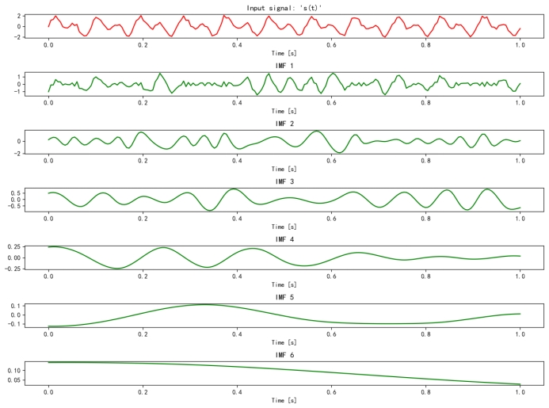 

 图10.23 原始信号与IMF图

 

如图10.23所示，这段代码首先生成了一个包含两个不同频率正弦波和噪声的信号。然后，它使用`EMD`类来初始化一个经验模态分解器，并将信号传递给分解器。分解器会返回一系列IMFs，这些IMFs代表了信号中的不同成分。最后，代码使用matplotlib库来绘制原始信号和每个IMF的图形。

通过这个教程，你应该能够理解如何使用 Python 和 PyEMD 库来处理和分析信号。这种技能在许多领域都非常有用，比如声音分析、经济数据处理和其他需要信号分解的场合。

## 10.4  多模态数据与人工智能

### **10.4.1  多模态概念与意义**

模态是一个指生物通过感知器官（如眼睛、耳朵）和经验来接收和处理信息的方式的概念。人类有视觉、听觉、触觉、味觉和嗅觉五种基本的感知方式，这些都可以被视为不同的模态。

多模态是指结合多种感知方式或信息来源的概念。在技术领域，这意味着通过结合声音、图片、视频、文字等多种形式的信息来让机器更好地理解和与人类交流。例如，一个多模态的人工智能系统可以同时理解语音指令和用户的表情，从而做出更合适的反应。

多模态学习的核心在于它能够让机器通过多种方式理解世界，这对于构建高效且自然的人机交互系统尤为重要。例如，多模态系统可以在自动驾驶车辆中同时处理视觉数据和传感器数据，或者在智能助手中同时理解语音和文本输入。

传统的深度学习模型通常专注于单一模态的数据处理，如仅处理图像或文本。多模态学习则通过融合不同的数据类型（如图像和文本），在许多领域都有广泛的应用，应用方向不限于自然语言处理、计算机视觉、音频处理等。具体任务又可以分为文本和图像的语义理解、图像描述、视觉定位、对话问答、视觉问答、视频的分类和识别、音频的情感分析和语音识别等。

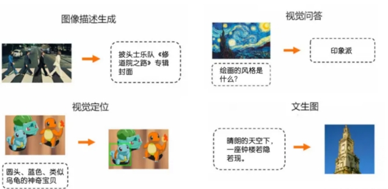 

图10.24 多模态任务介绍

 

未来，多模态学习的发展将重点在于增强模型的跨模态处理能力，使其能够更好地整合和理解来自不同模态的信息。这不仅能提升机器的理解能力，还能推动AI技术在自动化和智能化应用中的广泛应用。接下来我们将介绍多模态模型目前的发展情况。

### **10.4.2  多模态模型发展关系及时间线**

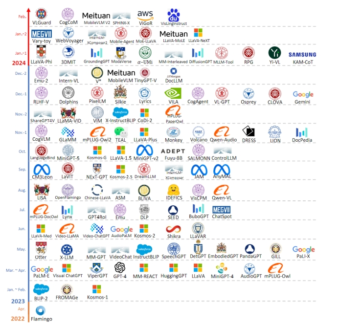 

图10.25 多模态模型发展时间

引用来源：论文《MMLLMs: Recent Advances in MultiModal Large Language Models》

上述的大多多模态模型结构可以总结为五个主要关键组件，具体如下图所示：

 

图10.26多模态模型基本结构

引用来源：论文《MMLLMs: Recent Advances in MultiModal Large Language Models》

在多模态模型的发展中，主要可以分为以下五个核心组件：

 

***1. 模态编码器（Modality Encoder, ME）***：

  图像编码器（Image Encoder）：用于将图像数据转化为机器可处理的特征表示。

  视频编码器（Video Encoder）：专门处理视频数据，提取时间和空间特征。

  音频编码器（Audio Encoder）：转换音频输入为特征，便于后续的处理和分析。

 

***2. 输入投影器（Input Projector, IP）***：

  线性投影器（Linear Projector）：通过简单的线性变换将输入数据映射到一个新的空间。

  多层感知器（MultiLayer Perceptron, MLP）：使用深层网络结构进行更复杂的数据转换。

  交叉注意力（CrossAttention）：允许模型关注输入数据中的关键部分，以提高信息的相关性和准确性。

  Q-Former：一种基于Transformer的结构，用于处理和优化多模态数据的交互。

 

***3. 大模型基座（LLM Backbone）***：

  ChatGLM、LLaMA、Qwen、Vicuna等：这些大模型为多模态学习提供了强大的基础架构，支持高效的信息处理和复杂任务的执行。

 

***4. 输出投影器（Output Projector, OP）***：

  Tiny Transformer：一个轻量级的Transformer模型，专注于高效的输出生成。

  Multi-Layer Perceptron (MLP)：用于将内部表示转换为最终输出，如文本、图像或音频。

 

***5. 模态生成器（Modality Generator, MG）***：

  Stable Diffusion、Zeroscope、AudioLDM等：这些生成器用于创造新的多模态输出，如图像、音频或其它类型的合成数据。

 

按上述五部分结构对经典多模态模型进行总结，结果如下：

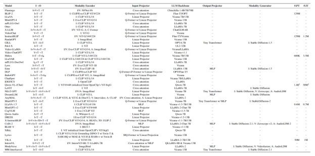 

图10.27多模态现有模型类型总结

引用来源：论文《MMLLMs: Recent Advances in MultiModal Large Language Models》

以上各部分的具体应用示例包括基于VIT（Vision Transformer）的视觉预训练模型，这类模型通过Transformers架构有效地对视觉信息进行表征，逐渐成为视觉信息编码的主流方式。这部分主要梳理了以VIT为基础的预训练及其在多模态对齐中的应用，具体分类如下：

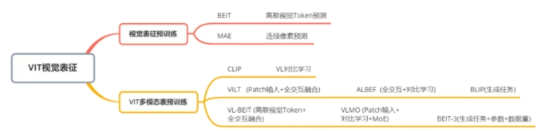 

图10.28 VIT视觉预训练模型 

通过这些技术组件的综合应用，多模态预训练模型能够在多种数据类型之间建立深入的联系和理解，从而在各种复杂环境下提供更为准确和自然的交互体验。上述多模态预训练模型发展关系如下：

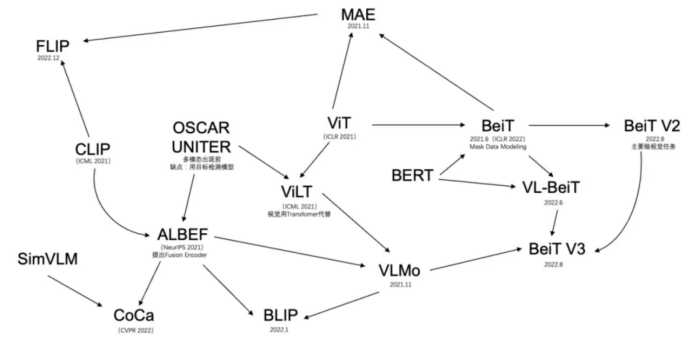 

图10.28 多模态预训练模型发展关系

### **10.4.3  多模态基础知识--Transformer**

目前，主流的多模态大模型大多以Transformer为基础。Transformer是一种由谷歌在2017年提出的深度学习模型，主要用于自然语言处理（NLP）任务，特别是序列到序列（Sequence-to-Sequence）的学习问题，如文本生成。Transformer彻底改变了之前基于循环神经网络（RNNs）和长短期记忆网络（LSTMs）的序列建模范式，并且在性能提升上取得了显著成效。Transformer结构如下图所示：

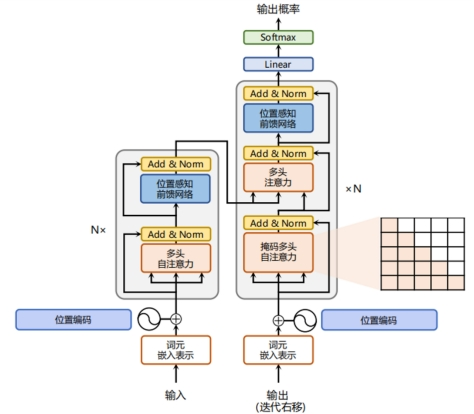 

图10.29 Transformer架构图

 

***Transformer的核心构成包括：***

***自注意力机制（Self-Attention Mechanism）：*** Transformer模型摒弃了传统RNN结构的时间依赖性，通过自注意力机制实现对输入序列中任意两个位置之间的直接关联建模。每个词的位置可以同时关注整个句子中的其他所有词，计算它们之间的相关性得分，然后根据这些得分加权求和得到该位置的上下文向量表示。这种全局信息的捕获能力极大地提高了模型的表达力。

***多头注意力（Multi-Head Attention）：*** Transformer进一步将自注意力机制分解为多个并行的“头部”，每个头部负责从不同角度对输入序列进行关注，从而增强了模型捕捉多种复杂依赖关系的能力。最后，各个头部的结果会拼接并经过线性变换后得到最终的注意力输出。

***位置编码（Positional Encoding）：*** 由于Transformer不再使用RNN的顺序处理方式，为了引入序列中词的位置信息，它采用了一种特殊的位置编码方法。这种方法对序列中的每个位置赋予一个特定的向量，该向量的值与位置有关，确保模型在处理过程中能够区分不同的词语顺序。

***编码器-解码器架构（Encoder-Decoder Architecture）：*** Transformer采用了标准的编码器-解码器结构，其中，编码器负责理解输入序列，将其转换成高级语义表示；解码器则依据编码器的输出，结合自身产生的隐状态逐步生成目标序列。在解码过程中，解码器还应用了自注意力机制以及一种称为“掩码”（Masking）的技术来防止提前看到未来要预测的部分。

***残差连接（Residual Connections）：*** Transformer沿用了ResNet中的残差连接设计，以解决随着网络层数加深带来的梯度消失或爆炸问题，有助于训练更深更复杂的模型。

***层归一化（Layer Normalization）：*** Transformer使用了层归一化而非批量归一化，这使得模型在小批量训练时也能获得良好的表现，并且有利于模型收敛。

### **10.4.4  多模态任务对齐**

本节主要介绍文本和图像的多模态数据如何进行对齐。首先，我们将从文本数据的处理开始。

### **文本转Embedding**

Tokenization（分词）：Tokenization 是将文本切分为模型可处理的token或子词的过程。此步骤通常采用 BPE 或 WordPiece 分词算法，不仅帮助控制词典大小，同时保留了表达文本序列的能力。相关的关键点总结如下：

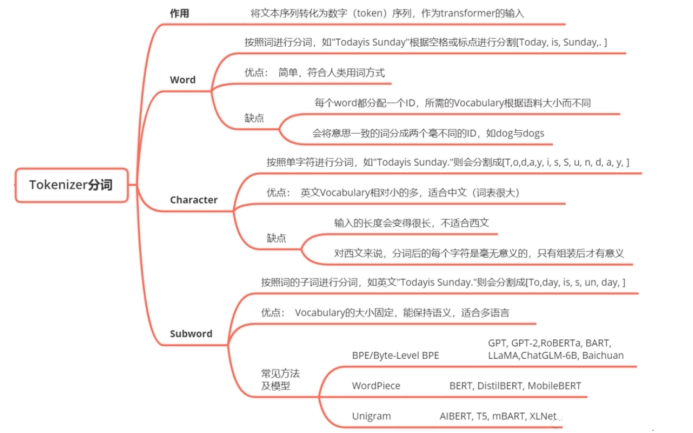 

图10.30 Tokenizer分词总结

Embedding（嵌入）：Embedding 过程将 token 或子词映射到多维空间中的向量，以捕捉其语义含义。这些连续的向量使模型能处理离散的 token，并学习单词间的复杂关系。使用 Tramsformer (BERT) 模型的步骤包括：

· 输入文本："thank you very much"

· Tokenization后: ["thank", "you", "very","much"]

· Embedding：假设每个token被映射到一个2048维的向量，“thank you very much”被转换成4*2048的embeddings

### **图像转换Embedding**

图像数据也采用与文本类似的处理方法，通过 Vit Transformer 模型进行处理。首先，把图像分成固定大小的patch，类比于LLM中的Tokenization操作；然后通过线性变换得到patch embedding，类比LLM中的Embedding操作。由于Transformer的输入就是token embeddings序列，所以将图像的patch embedding送入Transformer后就能够直接进行特征提取，得到图像全局特征的embeddings。具体步骤如下：

· 输入图像大小：224x224像素，3个颜色通道（RGB）+ 预处理：归一化，但不改变图像大小图像切分：

· 假设每个patch大小为14x14像素，图像被切分成(224/14) × (224/14) =256个patches 线性嵌入：

· 将每个14x14x3的patch展平成一个一维向量，向量大小为 14×14×3=588

· 通过一个线性层将每个patch的向量映射到其他维的空间（假设是D维），例如D=768 , 每个patch被表示为一个D维的向量。最后，由于Transformer内部不改变这些向量的大小，就可以用256*768的embeddings表示一张图像。

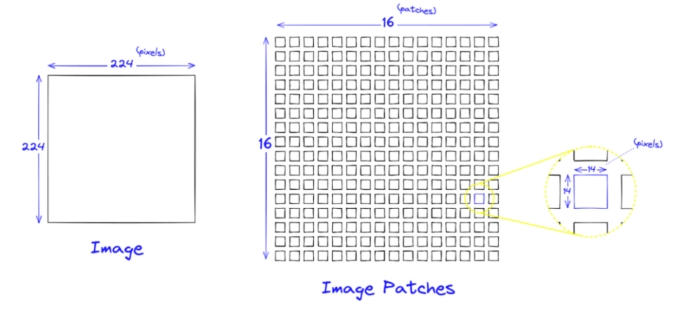 

图10.31 图像Embedding处理

 

### **模态对齐**

模态对齐是指将来自不同模态的数据转化为能够相互对应的统一形式，从而使得不同模态之间可以协同工作，共同完成任务。在处理图像和文本的任务中，模态对齐特别关键，因为它允许模型理解并关联视觉信息和语言信息。

例如，在图像标注任务中，模型需要不仅识别出图像中的物体，如"小狗"，还需要将其与相应的文本描述对齐。如果图像中的"小狗"和文本中的"小狗"在各自的模态空间中被不同地表示，模型就需要通过某种方式来桥接这种差异，使得两者能够匹配。常用的模态对齐方法包括但不限于使用联合嵌入空间、对齐损失函数和跨模态转换网络。

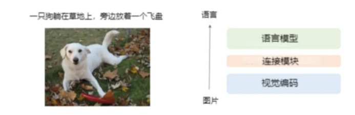 

图10.32 图片对齐语言示意图

 

这种对齐通常涉及到以下几个步骤：

1. 特征提取： 这就像是从故事和图片中各自提炼出关键信息。对于计算机，这意味着使用算法从图片中识别出像是轮廓、颜色和形状这样的视觉元素，同时从文本中识别出关键词和语义结构。这样做的结果是，无论是图片还是文字，都转换成了计算机能理解的数字列表——也就是向量。
2. 特征变换： 接下来，就像是将故事的翻译成插画的“语言”，或者反过来。这个过程需要确保提取的特征可以在一个共同的“向量空间”中进行比较。有时候，这就像是在不同的文化中找到共同的表达方式，让一种表达形式能够反映另一种的含义。
3. 对齐策略： 现在，我们需要一种方法来确认故事和插图确实是对应的。在计算机的世界里，这可以通过增加两者之间相似度的方法来实现。想象一下，你通过比较故事和插图之间的相似点，来确认它们是匹配的。
4. 端到端训练： 最后，就像在不断的游戏中学习，计算机通过不停地尝试和调整来更好地匹配故事和图片。它会逐渐学会如何提取特征、变换它们，并找到最佳的对齐方式。

 

通过这种方式，计算机最终能够处理并理解多种形式的信息，无论是看到的图片还是读到的文本。这项技术不仅应用于图像和文本，还可以扩展到视频、音频和更多其他类型的数据。模态对齐让计算机能够在更复杂、更接近人类理解世界的方式上工作，这对于创造聪明、灵活的人工智能系统来说至关重要。

### **10.4.5  多模态模型训练流程**

在这个领域，我们的教程继续深入了解多模态大型语言模型的训练，这个过程分成两个紧密联系的阶段：多模态预训练（Multimodal Pre-Training, MM PT）和多模态指令调优（Multimodal Instruction Tuning, MM IT）。让我们一起走近这两个阶段的具体细节：

 

（1）多模态预训练（MM PT）：

目标：在这个阶段，我们专注于训练输入投影器（Input Projector, IP）和输出投影器（Output Projector, OP），目的是让模型学会如何把视觉、听觉和语言等不同的信息模态转换成统一的表示形式。简单来说，就是教会大型语言模型（Large Language Model, LLM）的主干网络如何理解和处理这些不同来源的信息。

数据集：通常，这里涉及的是像X-Text这样的多模态数据集，其中包含了图像-文本对（Image-Text），视频-文本对（Video-Text）以及音频-文本对（Audio-Text）。这样的数据集让模型有机会学习如何把不同形式的信息对应起来，就好比学习多种语言的翻译。

优化：在预训练的过程中，核心的任务是优化IP和OP的参数，以最小化条件文本生成损失（conditional text generation loss）。这涉及到一个过程，让模型学会如何将模态编码器（Modality Encoder）输出的特征和文本特征相对齐，从而生成可以直接喂给LLM主干网络的特征。

 

（2）多模态指令调优（MM IT）：

目标：当模型基本理解了不同模态信息后，我们进入指令调优阶段。这里的目标是细化模型的能力，使其能够更好地根据特定的、格式化的指令来执行任务。就像在预训练后教会模型如何根据具体的操作手册来行动。

方法：这个阶段的方法分为两种。首先是监督式微调（Supervised Fine-Tuning, SFT），它将前一阶段学习到的数据转换成特定的指令格式，然后对模型进行进一步训练。另外一种方法是基于人类反馈的强化学习（Reinforcement Learning from Human Feedback, RLHF），这种方法依赖于对模型产生的输出给予反馈，进一步改进模型的性能。

数据集：在这个阶段使用的数据集一般包括了视觉问答（Visual Question Answering, VQA）任务、基于指令的执行任务等，这些可以是简单的单轮问答形式，也可以是更复杂的多轮对话形式。

 

通过以上两个阶段，我们不仅让模型学会了如何处理和理解不同的信息模态，还教会了它如何根据特定指令行动。这使得模型在面对多样化的实际任务时，能够有着更为出色的表现和更高的灵活性。