<center><h1>第6章 数据处理与拟合模型</h1></center>

> 内容：@若冰（马世拓）
> 
> 审稿：@萌弟
> 
> 排版&校对：@若冰

从这一章开始我们就在数据的海洋中遨游了。在这一章中我们将介绍数学建模中的数据处理以及常见的数据模型。从数据中挖掘有用的价值，这个学科叫做数据挖掘，也是数学建模中必考的问题，也是各大数学建模竞赛中考察的重难点。它主要针对的就是从杂乱无章的数据到验证结论的全过程。本章主要涉及到的知识点有：
- 数据与大数据
- Python数据预处理
- 常见的统计分析模型
- 随机过程与随机模拟
- 数据可视化
> 注意：本章内容涉及到基础的概率论与数理统计理论，如果对这部分内容不熟悉，可以参考相关概率论与数理统计的相关书籍，如果您想对此基础做入门学习，可以参考：https://github.com/Git-Model/__init_Modeling__。
## 6.1  数据与大数据
数据的概念我想很多读者可能会或多或少的有一些认知误区。因为我想当我提到“数据”二字的时候，多数读者脑子里面的第一印象就是一张excel表格。可能学过数据库系统原理的朋友脑子里也可能浮现出SQL文件，然后开始想它的主码这些东西。但事实上，“数据”的概念远远大于一张excel表格。
### 6.1.1  什么是数？什么是数据？
古希腊的先哲毕达哥拉斯说“万物皆数”，我私以为这句话说的是没错的。因为纵观整个自然科学，物理学中充满了数据，化学中充满了数据，计算机科学本身也有数据，并且即使是社会学、经济学乃至新闻领域，都充满了量化研究的影子。但他们的数据就是简单的做表格吗？恕我直言，仅仅是做Excel表格这种高中生能干的活，大学为什么要开设大数据的专业和相关研究？
因为万物皆数，很多你想象不到的东西都可以转化为数据。

你或许无法想象，有一天唐诗宋词也会被称作“数据”吧？你或许无法想象，许嵩的一首歌也会被称作“数据”吧？你或许也无法想象，有关你女朋友的自拍也被称作为“数据”吧？但事实上，这些都是广义的“数据”。因为数据的目的，是为了描述与传递信息；而信息的载体是多种多样的，人类能够感知与认知的信息，计算机同样有办法处理。

而我们把这些信息的不同形式称之为“模态”，包括：

- 数值类数据，例如结构化的excel表格和SQL文件。
- 文本类数据，例如新闻报道、微博评论、餐饮点评等文字。
- 图像类数据，以一定尺寸的黑白或彩色图像在计算机内存储。
- 音频类数据，例如音乐、电话录音等。
- 信号类数据，例如地震波的波形、电磁波信号、脑电信号等。

这些形式下的数据都可以用来数学建模。文本变为数据，只需要做词频统计、TF-IDF、词嵌入等操作就可以“数化”；图像变为数据，因为它在计算机内本身就是以RGB三个通道的大矩阵在存储每个像素点的颜色信息；音频和信号类数据则更为简单，它本身可以视作一个波，用信号与系统的概念和方法也可以对其“数化”。

而不同模态的数据往往能够联合对同一个事物去做描述，例如对于狗狗而言，既有它的图片，又有它的叫声。能够同时利用描述同一事物的不同模态数据去进行联合建模的模型，我们称之为多模态模型。
> 注意：视频数据为什么没有单列呢？因为视频本身也是由一帧帧图像在时间轴上堆叠才形成的数据。如果加上声音就更完美了。所以本质上视频数据是图像和音频的融合。
### 6.1.2  数据与大数据
可能很多人认为：8000条数据啊！我人都要算麻了！这还不叫大数据吗？但说实话，这个量真不能算。真正的大数据可能要以TB甚至PB、ZB来衡量。当然对于我们平时来说，能够过G的数据体量基本都不小了，但在G以内的数据说实话都不能算太大。

我为什么在这里这么强调“大数据”的“大”究竟是什么水平？难道是为了显得我看起来老练而见多识广吗？绝非如此。心里对“大数据”的“大”有一个基本的概念，不仅能够让我们对“大数据科学”保持谦卑，更重要的是知道面对不同体量的数据如何快速下手找准最合适的建模方法。

靠山吃山，靠水吃水。小数据有小数据的方法，大数据有大数据的方法。拿着线性回归的那一套去拟合大数据，往往效果不会很好；拿着神经网络去学小数据，学到的东西往往没有意义（我们会笑称：你是想去研究few-shot learning吗）。面对不同的数据，能够使用最合适的方法最为重要。而判断此方法是否合适，一个根本的衡量就是数据的体量。
### 6.1.3  数据科学的研究对象
Drew Conway在2010年阐释“数据科学”的时候称：“数据科学是统计学、计算机科学和领域知识的交叉学科”（如图4.1.1(a)）。其实数学建模亦是如此，它需要数学基础，也需要计算机基础，但在解决实际工程问题的时候需要特定的工程背景。此三者缺一不可。但我看到很多学校讲“数据科学”，只是纯粹的让学生学习机器学习尤其是有监督学习，甚至自然语言处理和计算机视觉这些课程都是选修课。每当我看到这样的课程大纲和安排的时候我就在想：什么时候数据科学变成了一门这么狭隘的科学了？

在我的印象当中，数据科学应该包含如图所示的研究方面：

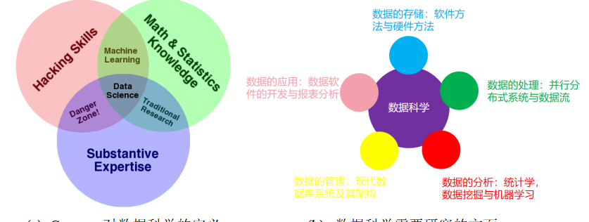

笔者看来，大数据科学研究的不仅仅是数据分析，它还包括了：
- 数据的获取和存储：包括爬虫、软件定义存储、硬件存储有关背景知识等。
- 数据的处理：包括分布式计算、并行计算、数据流等知识，以及Hadoop、Spark等大数据框架。
- 数据的分析：包括统计学、数据挖掘与机器学习、计算机视觉、自然语言处理等内容，重在挖掘数据中的模式与知识。
- 数据的管理：现代数据库系统及其架构等内容。
- 数据的应用：数据可视化、数据相关软件的开发、报表分析以及如何将数据挖掘得到的结果还原为实际问题的解决方案。
> 注意：这一节我们主要是为了阐明一些概念，但在后面数据处理的方法中我们主要还是以excel表格为例展开介绍数据的处理方法。图像、文本等非常规数据我们在第10章会简单介绍。另外补充一个小点，csv、tsv等格式的数据可以用记事本、excel、WPS等打开，以前在碰到一些学校的学生的时候他们甚至不知道怎么打开csv，这里特地提示一下。

## 6.2  数据的预处理
上一节基本都是一些概念性的东西，这一节我们开始讨论讨论实操。关于数据的预处理，是有一些基本操作方法的，这一节的主要目的就是总结归纳其中的操作方法。
### 6.2.1  为什么需要数据预处理
在现实生活问题中，我们得到的原始数据往往非常混乱、不全面，模型往往无法从中有效识别并提取信息。数据和特征决定了效果的上限，而模型和算法只是逼近这个上限而已，在采集完数据后，建模的首要步骤以及主要步骤便是数据预处理。

在介绍数据预处理之前，我们需要引入一些概念来加强我们对数据的理解。以2021年华数杯C题的部分数据为例，在WPS中打开它如图:

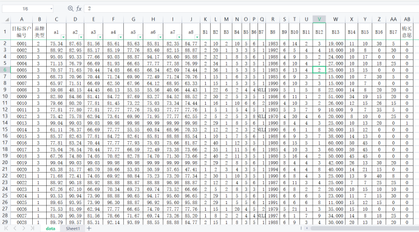

图中展示了前29行数据。最上面一行我们称之为表头，表头的每一格我们称之为字段。每个字段描述了这一列数据表示的意义。而这个表格的体量则是它有多少行多少列，如果列数超过了行数的1/2就可以说是有些稀疏了，如果列数是行数的3倍那它就是严重稀疏的数据。这个数据的每一列称其为一个属性，有多少个属性又可以称之有多少维。

> 注意：稀疏还有一种定义，就是表格里面很多都是空白的或者全是0。

属性有离散属性和连续属性之分。例如在图中，“品牌类型”这个属性只有{1,2,3}三个有限的取值，我们称之为离散。当然，这个取值也可以不是数字，比如{汽车，火车，飞机}等。但例如属性“a1”，它的取值是一个连续的浮点数，这种属性我们称之为连续属性。连续属性和离散属性的处理方法是截然不同的。“目标客户编号”提供了每一行数据的标识信息，可以根据这个编号对数据进行检索、排序等操作，我们称之为“主码”，也可以理解为id。

### 6.2.2  使用pandas处理数据的基础
一份数据可能并没有理想中那么规则，经常会出现空缺、重复和一些异常记录，那么如何识别并处理这些问题就非常关键了。对于重复数据直接将其删除即可。但缺失数据的处理有一些技巧。我们主要是观察缺失率，如果存在缺失的数据项（数表一行称作一个数据项）占比较少（大概5%以内）这个时候如果问题允许可以把行删掉。如果缺失率稍微高一点（5%-20%）左右就可以使用填充、插值的方法去处理，有关插值的方法我们会在下一节探讨，而填充方法包括常数填充、均值填充等方法；如果缺失率还高一些（20%-40%）那么就需要用预测方法例如机器学习去填充缺失数据了；但如果一行数据有50%以上都是缺失的，如果条件允许，我们可以把这一列都删掉（当然凡事都有例外，见机行事）。下面我们来做一些小实验，学习如何使用python处理数据：
（1）Python创建一个数据框DataFrame：
import pandas as pd
import numpy as np
data = {'animal': ['cat', 'cat', 'snake', 'dog', 'dog', 'cat', 'snake', 'cat', 'dog', 'dog'],
        'age': [2.5, 3, 0.5, np.nan, 5, 2, 4.5, np.nan, 7, 3],
        'visits': [1, 3, 2, 3, 2, 3, 1, 1, 2, 1],
        'priority': ['yes', 'yes', 'no', 'yes', 'no', 'no', 'no', 'yes', 'no', 'no']}

labels = ['a', 'b', 'c', 'd', 'e', 'f', 'g', 'h', 'i', 'j']
df = pd.DataFrame(data)
（2）显示该 DataFrame 及其数据相关的基本信息：
df.describe()
（3）返回DataFrame df 的前5列数据：
df.head(5)
（4）从 DataFrame `df` 选择标签列为 `animal` 和 `age` 的列
df[['animal', 'age']]
（5）在 `[3, 4, 8]` 行中，列为 `['animal', 'age']` 的数据
df.loc[[3, 4, 8], ['animal', 'age']]
（6）选择列为`visits`中等于3的行
df.loc[df['visits']==3, :]
（7）选择 `age` 为缺失值的行
df.loc[df['age'].isna(), :]
（8）选择 `animal` 是cat且`age` 小于 3 的行
df.loc[(df['animal'] == 'cat') & (df['age'] < 3), :]
（9）选择 `age` 在 2 到 4 之间的数据（包含边界值）
df.loc[(df['age']>=2)&(df['age']<=4), :]
（10）将 'f' 行的 `age` 改为 1.5
df.index = labels
df.loc[['f'], ['age']] = 1.5
（11）对 `visits` 列的数据求和
df['visits'].sum()
（12）计算每种 `animal` `age` 的平均值
df.groupby(['animal'])['age'].mean()

6.2.3  使用pandas处理数据的进阶
6.2.2节的内容主要介绍了一些pandas dataframe的基础语法与一些简单的案例，但仅仅使用简单处理数据api无法快速处理一些特定的任务，如：数据去重、填补缺失值等等。下面，我们还是以一个简单的demo，说明pandas如何处理这些在数学建模中常见的任务。
```python
（1）创建pandas dataframe
df = pd.DataFrame({'From_To': ['LoNDon_paris', 'MAdrid_miLAN', 'londON_StockhOlm',
                               'Budapest_PaRis', 'Brussels_londOn'],
              'FlightNumber': [10045, np.nan, 10065, np.nan, 10085],
              'RecentDelays': [[23, 47], [], [24, 43, 87], [13], [67, 32]],
                   'Airline': ['KLM(!)', '<Air France> (12)', '(British Airways. )',
                               '12. Air France', '"Swiss Air"']})
df

（2）FlightNumber列中有某些缺失值，缺失值常用nan表示，请在该列中添加10055与10075填充该缺失值。
df['FlightNumber'] = df['FlightNumber'].interpolate().astype(int)

（3）由于列From_To 代表从地点A到地点B，因此可以将这列拆分成两列，并赋予为列From与To。
temp = df['From_To'].str.split("_", expand=True)
temp.columns = ['From', 'To']

（4）将列From和To转化成只有首字母大写的形式。
temp['From'] = temp['From'].str.capitalize()
temp['To'] = temp['To'].str.capitalize()

（5）将列From_To从df中去除，并把列From和To添加到df中
df.drop('From_To', axis=1, inplace=True)
df[['From', 'To']] = temp

（6）清除列中的特殊字符，只留下航空公司的名字。
df['Airline'] = df['Airline'].str.extract(r'([a-zA-Z\s]+)', expand=False).str.strip()

（7）在 RecentDelays 列中，值已作为列表输入到 DataFrame 中。我们希望每个第一个值在它自己的列中，每个第二个值在它自己的列中，依此类推。如果没有第 N 个值，则该值应为 NaN。将 Series 列表展开为名为 的 DataFrame delays，重命名列delay_1，delay_2等等，并将不需要的 RecentDelays 列替换df为delays。
delays = df['RecentDelays'].apply(pd.Series)
delays.columns = ['delay_%s' % i for i in range(1, len(delays.columns)+1)]
df = df.drop('RecentDelays', axis=1).join(delays, how='left')

（8）将delay_i列的控制nan都填为自身的平均值。
for i in range(1, 4):
    df[f'delay_{i}'] = df[f'delay_{i}'].fillna(np.mean(df[f'delay_{i}']))

（9）在df中增加一行，值与FlightNumber=10085的行保持一致。
df = df._append(df.loc[df['FlightNumber'] == 10085, :], ignore_index=True)

（10）对df进行去重，由于df添加了一行的值与FlightNumber=10085的行一样的行，因此去重时需要去掉。
df = df.drop_duplicates()
```
### 6.2.3  数据的规约
数据为何需要规约？因为实际应用中数据的分布可能是有偏的，量纲影响和数值差异可能会比较大。规约是为了形成对数据的更高效表示，学习到更好的模型。它会保留数据的原始特征，但对极端值、异常值等会比较敏感。这里我们就介绍两个比较典型的规约方式：min-max规约和Z-score规约。

min-max规约的表达式形如：
$$
{x_{new}} = \frac{{x - \min (x)}}{{\max (x) - \min (x)}}    \tag{6.2.1}
$$
这一操作的目的是为了消除量纲影响，所有的属性都被规约到[0,1]的范围内，数据的偏差不会那么大。但是如果出现异常值，比如非常大的数值，那么这个数据的分布是有偏的。为了对数据的分布进行规约，还会使用到另一个常用的方法就是Z-score规约：
$$
{x_{new}} = \frac{{x - \bar x}}{{std(x)}}   \tag{6.2.2}
$$
本质上，一列数据减去其均值再除以标准差，如果这一列数据近似服从正态分布，这个过程就是化为标准正态分布的过程。Z-score规约和min-max规约往往不是二者取其一，有时候两个可以组合起来用。除此以外，还有很多的规约方法，但是这两种最为常用。若使用Python实现起来也非常简单，只需要：


## 6.3  常见的统计分析模型
说到大数据的分析思路，学过概率论与数理统计这门课的同学都会脱口而出——统计分析。统计分析的很多内容与机器学习的相关内容大差不差，但是侧重点不一样。统计分析通常在做“为什么”的任务，机器学习通常在做“预测未来”的任务。这里将介绍几种常用的统计分析的方法，由于统计分析的原理涉及大量数学知识，对这部分知识的原理感兴趣的话，欢迎查看：https://github.com/Git-Model/Modeling-Universe/tree/main/Data-Story

另外，在第九章中，我们会对这些统计方法进行更精细的讲解。

### 6.3.1  回归分析与分类分析
回归分析与分类分析都是一种基于统计模型的统计分析方法。它们都研究因变量（被解释变量）与自变量（解释变量）之间存在的潜在关系，并通过统计模型的形式将这些潜在关系进行显式的表达。不同的是，回归分析中因变量是连续变量，如工资、销售额；而分类分析中因变量是属性变量，如判断邮件“是or否”为垃圾邮件。下面，使用几个简单的例子，说明回归分析与分类分析在数学建模中的应用。

（1）回归分析：在学生刚入大学时，大学通常会举办一个大学入学考试，该成绩虽然没什么用，但是能让刚入学的学生保持持续学习的警示。现在，我们想分析大学成绩GPA是否与入学成绩以及高考成绩有关？
```python
import numpy as np
import pandas as pd
import matplotlib.pyplot as plt
from scipy import stats
import seaborn as sns
from IPython.display import display
import statsmodels.api as sm

# 加载数据
gpa1=pd.read_stata('./data/gpa1.dta')

# 在数据集中提取自变量（ACT为入学考试成绩、hsGPA为高考成绩）
X1=gpa1.ACT
X2=gpa1[['ACT','hsGPA']]
# 提取因变量
y=gpa1.colGPA

# 为自变量增添截距项
X1=sm.add_constant(X1)
X2=sm.add_constant(X2)
display(X2)


# 拟合两个模型
gpa_lm1=sm.OLS(y,X1).fit()
gpa_lm2=sm.OLS(y,X2).fit()

# 输出两个模型的系数与对应p值
p1=pd.DataFrame(gpa_lm1.pvalues,columns=['pvalue'])
c1=pd.DataFrame(gpa_lm1.params,columns=['params'])
p2=pd.DataFrame(gpa_lm2.pvalues,columns=['pvalue'])
c2=pd.DataFrame(gpa_lm2.params,columns=['params'])
display(c1.join(p1,how='right'))
display(c2.join(p2,how='right'))
```


从模型I可以看到，ACT变量的pvalue为0.01<0.05，说明大学入学考试成绩ACT能显著影响大学GPA；但从模型II可以看到，高考成绩haGPA的pvalue为0.000005远小于0.05，说明高考成绩haGPA显著影响大学成绩GPA，但大学入学考试成绩ACT的pvalue为0.38大于0.05，不能说明大学入学考试成绩ACT显著影响大学成绩GPA。为什么会出现这样矛盾的结论呢？原因有可能是：在没有加入高考成绩haGPA时，大学入学考试成绩ACT确实能显著影响大学成绩GPA，但是加入高考成绩haGPA后，有可能高考成绩haGPA高的同学大学入学考试也高分，这两者的相关性较高，显得“大学入学考试成绩ACT并不是那么重要”了。

从模型II的系数params数值可以看到，当高考成绩haGPA显著影响大学成绩GPA，params为0.45代表每1单位的高考成绩的增加将导致大学GPA平均增加0.45个单位。

（2）分类分析：ST是我国股市特有的一项保护投资者利于的决策，当上市公司因财务状况不佳导致投资者难以预测其前景时，交易所会标记该公司股票为ST，并进行一系列限制措施。我们想研究被ST的公司其背后的因素，并尝试通过利用公司的财务指标提前预测某上市公司在未来是否会被ST，是一件很有意义的举措。而在这项任务中，因变量就是公司是否会被ST。该例中自变量是一些财务指标，如ARA、ASSET等，它们具体的意义在此不做赘述。
```python
# 加载基础包
import pandas as pd
import numpy as np
import statsmodels.api as sm
from scipy import stats

# 读取数据
ST=pd.read_csv('./data/ST.csv')
ST.head()

st_logit=sm.formula.logit('ST~ARA+ASSET+ATO+ROA+GROWTH+LEV+SHARE',data=ST).fit()
print(st_logit.summary())
```
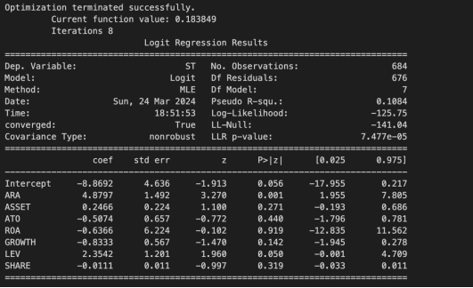

其中pvalue为第四列标记为P(>| z |)的数值。与回归分析累死，一般认为，p值小于0.05的自变量是显著的，也就是说，有统计学证据表明该变量会影响因变量为1的概率（即顾客购买杂志）。

### 6.3.2  假设检验
假设检验是统计分析中重要的一环，它贯穿着统计分析的所有环节。在数学建模中，我们既能通过假设检验对数据进行探索性的信息挖掘，以给予我们选择模型充分且客观的依据；又能在建模完成后，通过特定的假设检验验证模型的有效性。因此，储备基本的假设检验知识，学会根据数据特点、任务需求选择相对应的假设检验十分重要。

为了便于大家理解，我们用一个例子开始对这个话题的讨论：必胜中学初三年级在三天前开展了一次数学考试，校长给级长下达了命令：全级均分必须不低于110，否则就要扣级长工资。今天考试成绩出来了，但是由于年级人数太多，完成全级考试情况的统计还需要两天的时间。急性子的级长很想早点知道这次考试的情况，万幸的是一班已经完成了成绩统计，级长便想以一班的成绩，推测出全级的考试情况。已知：一班的成绩均值为，样本标准差s=4，人数n=25，且根据以往的经验，年级的考试成绩呈现正态分布。那么，级长可以认为年级均分不低于110吗？

现在简单分析一下问题。我们将整个年级的数学成绩作为一个总体，在这个前提下，可以将一班的数学成绩视作在这个总体中抽取出的一个样本。级长想知道的是一班这个样本的均值是否达到110吗？显然不是，因为样本均值108.2是已知的；级长想知道的是，能否通过一班这个样本推测出年级这一总体的均值是否达到110。

换言之，我们需要对“年级总体均分不低于110”这样的命题做出“是”或“否”的回答，这类问题就被称之为假设检验问题。对假设检验问题进行数理上的检验并给予回答，这个过程就是假设检验。

总结一下：这种根据样本信息与已知信息，对一个描述总体性质的命题进行“是或否”的检验与回答，就是假设检验的本质。即：假设检验验证的不是样本本身的性质，而是样本所在总体的性质。

假设检验大体上可分为两种：参数假设检验与非参数假设检验。若假设是关于总体的一个参数或者参数的集合，则该假设检验就是参数假设检验，刚刚的例子的假设是关于总体均值的，均值是参数，因此这是一个参数假设检验；若假设不能用一个参数集合来表示，则该假设检验就是非参数假设检验，一个典型就是正态性检验。

（1）正态性检验：于参数检验比非参数检验更灵敏，因此一旦数据是正态分布的，我们应该使用参数检验，此时对数据进行正态性检验就非常有必要了。在这里，我们提供了三种方法对帮助大家判断数据的正态性：可视化判断-正态分布概率图；Shapiro-Wilk检验；D'Agostino's K-squared检验。
```python
# 生成1000个服从正态分布的数据
data_norm = stats.norm.rvs(loc=10, scale=10, size=1000) # rvs(loc,scale,size):生成服从指定分布的随机数，loc：期望；scale：标准差；size：数据个数
# 生成1000个服从卡方分布的数据
data_chi=stats.chi2.rvs(2,3,size=1000)

# 画出两个概率图
fig=plt.figure(figsize=(12,6))
ax1=fig.add_subplot(1,2,1)
plot1=stats.probplot(data_norm,plot=ax1) # 正态数据
ax2=fig.add_subplot(1,2,2)
plot2=stats.probplot(data_chi,plot=ax2) # 卡方分布数据
```
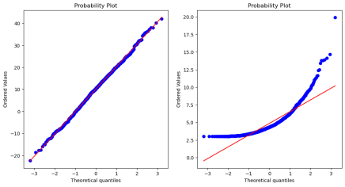

可以看到，正态性数据在正态分布概率图中十分接近直线y=x，而卡方分布数据则几乎完全偏离了该直线。可见，概率图可视化确实可以起到初步判断数据正态性的作用。实际应用中，由于数据的复杂性，仅使用一种方法判断正态性有可能产生一定的误差，因此我们通常同时使用多种方法进行判断。如果不同方法得出的结论不同，此时就需要仔细观察数据的特征，寻找结果不一致的原因。如：若Shapiro-Wilk test显著（非正态），D'Agostino's K-squared test不显著（正态），则有可能是因为样本量较大，或者样本中存在重复值现象，如果事实确实如此，那么我们就应该采纳D'Agostino's K-squared test的结论而非Shapiro-Wilk test的结论。（在这里，我们假设数据服从正态分布，p<0.05则拒绝假设，换个说法：p<0.05数据不服从正态分布，如果p>=0.05说明没有证据说明数据不服从正态分布）
```python
# 接下来，我们在python中定义一个函数，将概率图、Shapiro-Wilk test、D'Agostino's K-squared test结合在一起。
data_small = stats.norm.rvs(0, 1, size=30) # 小样本正态性数据集
data_large = stats.norm.rvs(0, 1, size=6000) # 大样本正态性数据集
# 定义一个正态性检验函数，它可以输出：
## 正态概率图
## 小样本Shapiro-Wilk检验的p值
## 大样本D'Agostino's K-squared检验的p值

from statsmodels.stats.diagnostic import lilliefors
from typing import List

def check_normality(data: np.ndarray, show_flag: bool=True) -> List[float]:
    """
    输入参数
    ----------
    data : numpy数组或者pandas.Series
    show_flag : 是否显示概率图
    Returns
    -------
    两种检验的p值；概率图
    """

    if show_flag:
        _ = stats.probplot(data, plot=plt)
        plt.show()

    pVals = pd.Series(dtype='float64')
    # D'Agostino's K-squared test
    _, pVals['Omnibus'] = stats.normaltest(data) 

    # Shapiro-Wilk test
    _, pVals['Shapiro-Wilk'] = stats.shapiro(data)

    print(f'数据量为{len(data)}的数据集正态性假设检验的结果 : ----------------')
    print(pVals)
check_normality(data_small,show_flag=True)
```
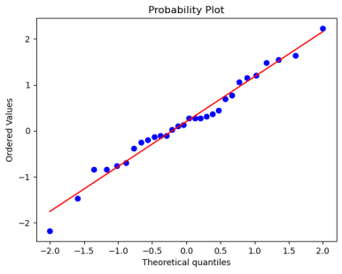
```python
数据量为30的数据集正态性假设检验的结果 : ----------------
Omnibus         0.703004
Shapiro-Wilk    0.898077
dtype: float64

check_normality(data_large,show_flag=False) # 当样本量大于5000，会出现警告
数据量为6000的数据集正态性假设检验的结果 : ----------------
Omnibus         0.980014
Shapiro-Wilk    0.992427
dtype: float64

e:\anaconda\envs\ml\lib\site-packages\scipy\stats\morestats.py:1760: UserWarning: p-value may not be accurate for N > 5000.
  warnings.warn("p-value may not be accurate for N > 5000.")
```
（2）单组样本均值假定的检验：必胜中学里，陈老师班结束了一次英语考试。由于班级人数较多，短时间内很难完成批改与统计，陈老师又很想知道此次班级平均分与级长定的班级均分137的目标是否有显著区别，于是他随机抽取了已经改好的10名同学的英语成绩：

136,136,134,136,131,133,142,145,137,140

问：陈老师可以认为此次班级平均分与级长定的班级均分137的目标没有显著区别吗？

很明显，这就是一个典型的单组样本均值假定的检验，比较的是这个样本（10个同学的英语成绩）所代表的总体均值（班级英语成绩均值）是否与参考值137相等。那么对于这类问题，我们有两种检验可以使用：单样本t检验与wilcoxon检验。
data=np.array([136,136,134,136,131,133,142,145,137,140])
data
# 定义一个单组样本均值检验函数，使它可以同时输出t检验与wilcoxon符号秩和检验的p值
def check_mean(data,checkvalue,significance=0.05,alternative='two-sided'):        
    '''
    输入参数
    ----------
    data : numpy数组或者pandas.Series
    checkvalue : 想要比较的均值
    significance : 显著性水平
    alternative : 检验类型，这取决于我们备择假设的符号:two-sided为双侧检验、greater为右侧检验、less为左侧检验

    输出
    -------
    在两种检验下的p值
    在显著性水平下是否拒绝原假设
    '''
    pVal=pd.Series(dtype='float64')
    # 正态性数据检验-t检验
    _, pVal['t-test'] = stats.ttest_1samp(data, checkvalue,alternative=alternative)
    print('t-test------------------------')
    if pVal['t-test'] < significance:
      print(('目标值{0:4.2f}在显著性水平{1:}下不等于样本均值(p={2:5.3f}).'.format(checkvalue,significance,pVal['t-test'])))
    else:
      print(('目标值{0:4.2f}在显著性水平{1:}下无法拒绝等于样本均值的假设.(p={2:5.3f})'.format(checkvalue,significance,pVal['t-test'])))

    # 非正态性数据检验-wilcoxon检验
    _, pVal['wilcoxon'] = stats.wilcoxon(data-checkvalue,alternative=alternative)
    print('wilcoxon------------------------')    
    if pVal['wilcoxon'] < significance:
      print(('目标值{0:4.2f}在显著性水平{1:}下不等于样本均值(p={2:5.3f}).'.format(checkvalue,significance,pVal['wilcoxon'])))
    else:
      print(('目标值{0:4.2f}在显著性水平{1:}下无法拒绝等于样本均值的假设.(p={2:5.3f})'.format(checkvalue,significance,pVal['wilcoxon'])))
    
    return pVal
check_mean(data,137,0.05)
t-test------------------------
目标值137.00在显著性水平0.05下无法拒绝等于样本均值的假设.(p=1.000)
wilcoxon------------------------
目标值137.00在显著性水平0.05下无法拒绝等于样本均值的假设.(p=0.812)
/Users/leo/opt/anaconda3/envs/DataAnalysis_env/lib/python3.10/site-packages/scipy/stats/_morestats.py:3337: UserWarning: Exact p-value calculation does not work if there are zeros. Switching to normal approximation.
  warnings.warn("Exact p-value calculation does not work if there are "
/Users/leo/opt/anaconda3/envs/DataAnalysis_env/lib/python3.10/site-packages/scipy/stats/_morestats.py:3351: UserWarning: Sample size too small for normal approximation.
  warnings.warn("Sample size too small for normal approximation.")
t-test      1.000000
wilcoxon    0.811892
dtype: float64

（2）两组样本的均值相等性检验：

在进行两组之间的均值比较之前，我们需要进行一个重要的判断：这两组样本之间是否独立呢？这个问题的答案将决定着我们使用何种类型的检验。

为了让大家对这里的“独立”有较好的了解，我们看看下面的例子。陈老师在年级有一个竞争对手：王老师。王老师在他们班级在同一时间也举行了一次英语考试，且两个班用的是同一份卷子，因此两个班的英语成绩就具有比较的意义了。和陈老师一样，王老师也来不及批改和统计他们班级的英语成绩，不过他手头上也有12份已经改好的试卷，成绩分别为：

134,136,135,145,147,140,142,137,139,140,141,135

问：我们可以认为两个班级的均分是相等的吗？

这是一个非常典型的双独立样本的均值检验。值得注意的是，这里的独立指的是抽样意义上的独立，而不是统计意义的独立，什么意思呢？即我们只需要保证这两个样本在选取的时候是“现实上”的互不影响就可以了。至于两者在数值上是否独立（通过独立性检验判断的独立性）我们并不关心。对于抽样意义上的独立的解释，各种教材众说纷纭，在这里我们选取一种容易理解的说法：两个样本中，一个样本中的受试不能影响另一个样本中的受试。

在本例中，两个班级的授课老师不同，因此两个班学生的英语学习不会受到同一个老师的影响；两个班级考试同时进行，意味着不存在时间差让先考完的同学给后考完的同学通风报信（进而影响受试）。因此，我们可以认为这是两个独立的样本。

事实上，两个样本是否在抽样意义上独立，是没有固定答案的，因为在很多情况下，我们既不能保证两个样本间完全独立，也很难判断出两者是否存在相关性。我们只能在抽样的时候使用更加科学的抽样方法，尽可能地避免样本间的相互影响。

若两个样本的总体都服从正态分布，那么我们可以使用双样本t检验。如果不服从正态分布，则可以使用Mannwhitneyu秩和检验，Mannwhitneyu秩和检验是一种非参数检验。
```python
# 定义一个单组样本均值检验函数，使它可以同时输出t检验与mannwhitneyu检验的p值
def unpaired_data(group1:np.ndarray,group2:np.ndarray,significance=0.05,alternative='two-sided'):
    """ 
    输入参数
    ----------
    group1/2 : 用于比较的两组数据
    significance : 显著性水平
    alternative : 检验类型，这取决于我们备择假设的符号:two-sided为双侧检验、greater为右侧检验、less为左侧检验
    输出
    -------
    在两种检验下的p值
    在显著性水平下是否拒绝原假设
    """
    pVal=pd.Series(dtype='float64')

    # 先进行两组数据的方差齐性检验
    _,pVal['levene']=stats.levene(group1,group2)


    # t检验-若数据服从正态分布
    if pVal['levene']<significance:
        print('在显著性水平{0:}下，两组样本的方差不相等(p={1:.4f})，因此需要使用方差不等的t检验'.format(significance,pVal['levene']))
        print('------------------------------------')
        _, pVal['t-test'] = stats.ttest_ind(group1, group2,equal_var=False,alternative=alternative) # 因为方差不相等，因此是False
        print('t检验p值：{}'.format(pVal['t']))
    else:
        print('在显著性水平{0:}下，不能拒绝两组样本方差相等的假设(p={1:.4f})，因此需要使用方差相等的t检验'.format(significance,pVal['levene']))
        print('------------------------------------')
        _, pVal['t-test'] = stats.ttest_ind(group1, group2,equal_var=True,alternative=alternative) # 因为方差相等，因此是True     
        print('t检验p值：{:.3f}'.format(pVal['t-test']))   
    

    # mannwhitneyu检验-数据不服从正态检验
    _, pVal['mannwhitneyu'] = stats.mannwhitneyu(group1, group2,alternative=alternative)
    print('Mann-Whitney检验p值：{:.3f}'.format(pVal['mannwhitneyu']))
    # --- >>> STOP stats <<< ---
    
    # 两组样本均值的散点图可视化
    print('------------------------------------')
    print('两组样本均值的散点图可视化')
    plt.plot(group1, 'bx', label='group1')
    plt.plot(group2, 'ro', label='group2')
    plt.legend(loc=0)
    plt.show()
    
    return pVal
# 陈老师班
group1=data
# 王老师班
group2=np.array([134,136,135,145,147,140,142,137,139,140,141,135])

unpaired_data(group1,group2)
```
在显著性水平0.05下，不能拒绝两组样本方差相等的假设(p=0.8277)，因此需要使用方差相等的t检验
```python
------------------------------------
t检验p值：0.221
Mann-Whitney检验p值：0.260
------------------------------------
```
两组样本均值的散点图可视化
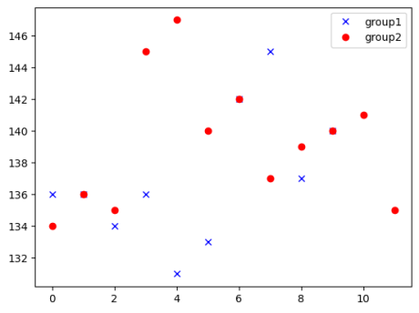

```python
levene          0.827727
t-test          0.221138
mannwhitneyu    0.259739
dtype: float64
```

两个检验都表明，两个班级的平均分没有显著差异。

在进行两组间均值比较的时候，有一种特殊情况——两个样本“故意”不独立。这种情况多出现两个样本分别为同一个受试个体不同时间的受试结果，这两个样本是“成对”的，是彼此紧密相连的。对这样两个样本进行均值比较检验，就是成对检验。

为了让大家更好地理解“成对”的概念，我们再把王老师的故事讲长一点。得知了王老师班的考试均值与自己班的没有显著差异，陈老师非常生气：“我堂堂优秀教师，居然不能和隔壁老王拉开差距，岂有此理！”，于是陈老师开始了为期一周的魔鬼训练，并在一个星期后又进行了一次全班的测验。陈老师**依旧抽取了上次十位同学的成绩**，依次为：

139,141,137,136,135,132,141,148,145,139

问：这次班级均分与上次是否存在显著差异呢？

显然，两个样本分别为相同的同学前后两次的考试成绩，是非常典型的成对数据，因此我们可以使用成对检验。成对检验也分为两种：若总体服从正态分布，则使用成对t检验；若总体不服从正态分布，则使用成对wilcoxon秩和检验。
```python
def paired_data(group1:np.ndarray,group2:np.ndarray,significance,alternative='two-sided'):
    """
    输入参数
    ----------
    group1/2 : 用于比较的两组数据，注意，两组数据的样本顺序必须相同
    significance : 显著性水平
    alternative : 检验类型，这取决于我们备择假设的符号:two-sided为双侧检验、greater为右侧检验、less为左侧检验

    输出
    -------
    在两种检验下的p值
    在显著性水平下是否拒绝原假设
    """
    pVal=pd.Series(dtype='float64')

    # 配对t检验-样本服从正态分布
    _, pVal['t-test'] = stats.ttest_1samp(post - pre, 0,alternative=alternative)
    print('t-test------------------------')
    if pVal['t-test'] < significance:
      print(('在显著性水平{0:}下，两组配对样本的均值不相等(p={1:5.3f}).'.format(significance,pVal['t-test'])))
    else:
      print(('在显著性水平{0:}下无法拒绝等于样本均值的假设.(p={1:5.3f})'.format(significance,pVal['t-test'])))    

    # wilcoxon秩和检验
    _, pVal['wilcoxon'] = stats.wilcoxon(group1,group2, mode='approx',alternative=alternative)
    print('wilcoxon------------------------')
    if pVal['wilcoxon'] < significance:
      print(('在显著性水平{0:}下，两组配对样本的均值不相等(p={1:5.3f}).'.format(significance,pVal['wilcoxon'])))
    else:
      print(('在显著性水平{0:}下无法拒绝等于样本均值的假设.(p={1:5.3f})'.format(significance,pVal['wilcoxon'])))    
    
    return pVal
# 第一次测验
pre=data
# 第二次测验
post=np.array([139,141,137,136,135,132,141,148,145,139])

paired_data(pre,post,0.05)
```
```python
t-test------------------------
在显著性水平0.05下，两组配对样本的均值不相等(p=0.039).
wilcoxon------------------------
在显著性水平0.05下，两组配对样本的均值不相等(p=0.049).

/Users/leo/opt/anaconda3/envs/DataAnalysis_env/lib/python3.10/site-packages/scipy/stats/_morestats.py:3351: UserWarning: Sample size too small for normal approximation.
  warnings.warn("Sample size too small for normal approximation.")
t-test      0.039370
wilcoxon    0.048997
dtype: float64
```
两种检验都显示两次测验的均分在显著性水平0.05下有显著差异，根据双边检验的p值是某侧单边检验两倍的结论，我们可以推测出第二次测验的均分均值显著地高于第一次测验均分，恭喜陈老师，赢！

（3）方差分析-多组样本间的均值相等性检验

既然我们检验的是不同总体的均值是否相等，那么观察各样本的样本均值的“差异程度”一定是非常自然且合理的想法，如果各样本的均值差异很大，那么它们的总体均值也有很大可能存在差异。

样本间均值的“差异程度”是一个很好的评判指标，但这并不足够，还有一个不起眼的指标也十分重要：各样本的样本内差异程度。在相同的样本间差异程度下，样本内差异程度越大，各总体间均值存在差异的可能性就越小，为什么呢？简单来说，就是样本内差异程度越大，“偶然性”越大，我们越难以判断两个不相等的均值是否真的不相等。

举个例子：小红的考试均分是91，小刚的考试均分是89。我们假设一个非常极端的情况：他们的标准差都是0，即小红每次考试都是91，小刚每次考试都是89，那么我们似乎可以很容易地判断出，两个人的均分确实存在明显的差异；但是，如果他们的标准差都很大，高达6（方差就是36），即他们的成绩都很不稳定，这次小红考79、小刚考93，下次小红考94、小刚考70。在高达36的方差下，2分的均值差似乎没有什么说服力了。


因此，我们需要综合这两个评判指标。最简单的方法就是两者相除，即样本间均值的“差异程度”除以样本内差异程度。这就是方差分析最根本的思想。

尽管在大样本下，非正态性数据的方差分析也是稳健的，但是在小样本下，对非正态性数据做方差分析还是可能存在误差。此时，我们可以使用kruskalwallis检验。该检验也是一种非参数检验，关于该检验的原理，我们就不再学习了。大家只需要知道它的应用场景既可。
案例：对altman_910.txt数据集进行方差分析。该数据记录了3组心脏搭桥病人给予不同水平的一氧化氮通气下，他们的红细胞内叶酸水平。注：三组样本都是正态性样本。
```python
data = np.genfromtxt('./data/altman_910.txt', delimiter=',') 
group1 = data[data[:,1]==1,0]
group2 = data[data[:,1]==2,0]
group3 = data[data[:,1]==3,0]
group1

from typing import Tuple

def anova_oneway() -> Tuple[float, float]:

    pVal=pd.Series(dtype='float64')

    # 先做方差齐性检验
    _,pVal['levene'] = stats.levene(group1, group2, group3)
    if pVal['levene']<0.05: #这里假设显著性水平为0.05
        print('警告: 方差齐性检验的p值小于0.05: p={}，方差分析结果在小样本下可能不准确'.format(pVal['levene']))
        print('-------------------------------')

    # 单因素方差分析-假设样本服从正态分布
    _, pVal['anova_oneway_normal'] = stats.f_oneway(group1, group2, group3) # 在这里输入待分析的数据
    
    print('若样本服从正态分布，单因素方差分析的p值为{}'.format(pVal['anova_oneway_normal']))
    if pVal['anova_oneway_normal'] < 0.05:
        print('检验在0.05的显著性水平下显著，多组样本中至少存在一组样本均值与其它样本的均值不相等。')

    print('---------------------------------')

    # 单因素方差分析-假设样本不服从正态分布
    _, pVal['anova_oneway_notnormal'] = stats.mstats.kruskalwallis(group1, group2, group3) # 在这里输入待分析的数据
    
    print('若样本不服从正态分布，单因素方差分析的p值为{}'.format(pVal['anova_oneway_notnormal']))
    if pVal['anova_oneway_notnormal'] < 0.05:
        print('检验在0.05的显著性水平下显著，多组样本中至少存在一组样本均值与其它样本的均值不相等。')    

    return pVal

anova_oneway()
```
```python
警告: 方差齐性检验的p值小于0.05: p=0.045846812634186246，方差分析结果在小样本下可能不准确
-------------------------------
若样本服从正态分布，单因素方差分析的p值为0.043589334959178244
检验在0.05的显著性水平下显著，多组样本中至少存在一组样本均值与其它样本的均值不相等。
---------------------------------
若样本不服从正态分布，单因素方差分析的p值为0.12336326887166982
levene                    0.045847
anova_oneway_normal       0.043589
anova_oneway_notnormal    0.123363
dtype: float64
```
### 6.3.2  随机过程与随机模拟
随机过程的世界是构建在概率论的世界上的，它拥有比概率论更为广阔的视野。那么，随机过程相比于概率论做了哪些深化的研究呢？首先，概率论仅仅研究的是在某一个时点，某个随机变量（随机向量）的分布情况，如：2022年07月03日这天的某个股票价格在开盘前是一个随机变量，因为在开盘前这个价格可以是的任意值，但是每个价格的概率是有差别的。而随机过程描述的是一段时间内随机变量的分布的变化，如：2022年07月03日这天的某个股票价格在开盘前是一个随机变量，而2022年07月04日这天的某个股票价格在开盘前也是一个随机变量，这两个随机变量按道理不会差别太大（也有可能差别很大），如果差别太大了估计就是暴跌或者暴涨了，我们说这种随机变量的分布按照时间变化的性质可以使用随机过程来描述。因此，总结一下：随机过程就是在随机变量的基础上加入了时间维度（值得注意的是，时间维度不是随机变量，只是普通变量），随机过程与概率论有很强的关联性，又有不同。（由于随机过程的相关原理需要大量数学理论，如果想系统了解相关理论，欢迎访问https://github.com/Git-Model/Modeling-Universe/tree/main/Data-Story）
我们用一个案例，带大家使用随机过程来对现实世界进行模拟分析与预测。在本次案例中，我们主要掌握如何使用简单的simpy进行仿真的流程，simpy的具体语法将在后续课程给大家详细解答，这里只需要直观感受下仿真的流程即可。

**案例1**：为了改善道路的路面情况（道路经常维修，坑坑洼洼），因此想统计一天中有多少车辆经过，因为每天的车辆数都是随机的，一般来说有两种技术解决这个问题：

（1） 在道路附近安装一个计数器或安排一个技术人员，在一段长时间的天数（如365天）每天24h统计通过道路的车辆数。

（2） 使用仿真技术大致模拟下道路口的场景，得出一个近似可用的仿真统计指标。

由于方案（1）需要花费大量的人力物力以及需要花费大量的调研时间，虽然能得出准确的结果，但是有时候在工程应用中并不允许。因此，我们选择方案（2），我们通过一周的简单调查，得到每天的每个小时平均车辆数：[30, 20, 10, 6, 8, 20, 40, 100, 250, 200, 100, 65, 100, 120, 100, 120, 200, 220, 240, 180, 150, 100, 50, 40]，通过利用平均车辆数进行仿真。
```python
# 模拟仿真研究该道路口一天平均有多少车经过
import simpy

class Road_Crossing:
    def __init__(self, env):
        self.road_crossing_container = simpy.Container(env, capacity = 1e8, init = 0)
    
def come_across(env, road_crossing, lmd):
    while True:
        body_time = np.random.exponential(1.0/(lmd/60))  # 经过指数分布的时间后，泊松过程记录数+1
        yield env.timeout(body_time)  # 经过body_time个时间
        yield road_crossing.road_crossing_container.put(1)

hours = 24  # 一天24h
minutes = 60  # 一个小时60min
days = 3   # 模拟3天
lmd_ls = [30, 20, 10, 6, 8, 20, 40, 100, 250, 200, 100, 65, 100, 120, 100, 120, 200, 220, 240, 180, 150, 100, 50, 40]   # 每隔小时平均通过车辆数
car_sum = []  # 存储每一天的通过路口的车辆数之和
print('仿真开始：')
for day in range(days):
    day_car_sum = 0   # 记录每天的通过车辆数之和
    for hour, lmd in enumerate(lmd_ls):
        env = simpy.Environment()
        road_crossing = Road_Crossing(env)
        come_across_process = env.process(come_across(env, road_crossing, lmd))
        env.run(until = 60)  # 每次仿真60min
        if hour % 4 == 0:
            print("第"+str(day+1)+"天，第"+str(hour+1)+"时的车辆数：", road_crossing.road_crossing_container.level)
        day_car_sum += road_crossing.road_crossing_container.level
    car_sum.append(day_car_sum)
print("每天通过交通路口的的车辆数之和为：", car_sum)
```
```
仿真开始：
第1天，第1时的营业额： 80
第1天，第5时的营业额： 44
第1天，第9时的营业额： 996
第1天，第13时的营业额： 989
第1天，第17时的营业额： 582
第1天，第21时的营业额： 582
第2天，第1时的营业额： 81
第2天，第5时的营业额： 65
第2天，第9时的营业额： 833
第2天，第13时的营业额： 917
第2天，第17时的营业额： 496
第2天，第21时的营业额： 585
第3天，第1时的营业额： 85
第3天，第5时的营业额： 89
第3天，第9时的营业额： 888
第3天，第13时的营业额： 1048
第3天，第17时的营业额： 554
第3天，第21时的营业额： 734
每天商店的的营业额之和为： [11491, 11014, 11572]
```

**案例2**：现在，我们来仿真“每天的商店营业额”这个复合泊松过程吧。首先，我们假设每个小时进入商店的平均人数为：[10, 5, 3, 6, 8, 10, 20, 40, 100, 80, 40, 50, 100, 120, 30, 30, 60, 80, 100, 150, 70, 20, 20, 10]，每位顾客的平均花费为：10元（大约一份早餐吧），请问每天商店的营业额是多少？
```python
# 模拟仿真研究该商店一天的营业额
import simpy

class Store_Money:
    def __init__(self, env):
        self.store_money_container = simpy.Container(env, capacity = 1e8, init = 0)
    
def buy(env, store_money, lmd, avg_money):
    while True:
        body_time = np.random.exponential(1.0/(lmd/60))  # 经过指数分布的时间后，泊松过程记录数+1
        yield env.timeout(body_time) 
        money = np.random.poisson(lam=avg_money)
        yield store_money.store_money_container.put(money)

hours = 24  # 一天24h
minutes = 60  # 一个小时60min
days = 3   # 模拟3天
avg_money = 10
lmd_ls = [10, 5, 3, 6, 8, 10, 20, 40, 100, 80, 40, 50, 100, 120, 30, 30, 60, 80, 100, 150, 70, 20, 20, 10]   # 每个小时平均进入商店的人数
money_sum = []  # 存储每一天的商店营业额总和
print('仿真开始：')
for day in range(days):
    day_money_sum = 0   # 记录每天的营业额之和
    for hour, lmd in enumerate(lmd_ls):
        env = simpy.Environment()
        store_money = Store_Money(env)
        store_money_process = env.process(buy(env, store_money, lmd, avg_money))
        env.run(until = 60)  # 每次仿真60min
        if hour % 4 == 0:
            print("第"+str(day+1)+"天，第"+str(hour+1)+"时的营业额：", store_money.store_money_container.level)
        day_money_sum += store_money.store_money_container.level
    money_sum.append(day_money_sum)
print("每天商店的的营业额之和为：", money_sum)
```
```
仿真开始：
第1天，第1时的营业额： 121
第1天，第5时的营业额： 92
第1天，第9时的营业额： 926
第1天，第13时的营业额： 1036
第1天，第17时的营业额： 714
第1天，第21时的营业额： 754
第2天，第1时的营业额： 127
第2天，第5时的营业额： 123
第2天，第9时的营业额： 925
第2天，第13时的营业额： 1036
第2天，第17时的营业额： 567
第2天，第21时的营业额： 782
第3天，第1时的营业额： 148
第3天，第5时的营业额： 53
第3天，第9时的营业额： 1057
第3天，第13时的营业额： 1212
第3天，第17时的营业额： 605
第3天，第21时的营业额： 572
每天商店的的营业额之和为： [11394, 12285, 12223]
```

**案例3**：艾滋病发展过程分为四个阶段（状态），急性感染期（状态 1）、无症状期（状态 2）， 艾滋病前期（状态 3）, 典型艾滋病期（状态 4）。艾滋病发展过程基本上是一个不可逆的过程,即：状态1 -> 状态2 -> 状态3 -> 状态4。现在收集某地600例艾滋病防控数据，得到以下表格：
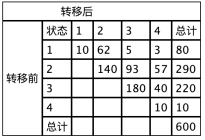

现在，我们希望计算若一个人此时是无症状期（状态2）在10次转移之后，这个人的各状态的概率是多少？
```python
# 研究无症状期病人在10期转移后的状态分布
def get_years_dist(p0, P, N):
    P1 = P
    for i in range(N):
        P1 = np.matmul(P1, P)
    return np.matmul(p0, P1)

p0 = np.array([0, 1, 0, 0])
P = np.array([
    [10.0/80, 62.0/80, 5.0/80, 3.0/80],
    [0, 140.0/290, 93.0/290, 57.0/290],
    [0, 0, 180.0/220, 40.0/220],
    [0, 0, 0, 1]
])
N = 10
print(str(N)+"期转移后，状态分布为：", np.round(get_years_dist(p0, P, N), 4))
```
```
10期转移后，状态分布为： [0.000e+00 3.000e-04 1.048e-01 8.948e-01]
```

## 6.4  数据可视化
使用文字表达结论往往显得过于单调与枯燥，所谓“一图抵千言”，适当使用图表会增加分析结论的有趣性与可读性，这里有一个关键词叫：数据可视化。

首先，我们先来探讨下“可视化”与“数据可视化”的联系与区别。可视化和数据可视化其实都旨在使用图表去表达观点，而数据可视化更加强调使用可视化的图表去表达数据中的信息，如数据分析中的结论。可视化与数据可视化的差别其实类似于：时尚杂志封面与学术杂志封面的区别，一个注重视觉的观感，另一个在注重观感的同时表达数据结论；

其次，数据可视化在一般情况下可以分为：在分析过程中的数据可视化与分析结果表达中的数据可视化。分析过程中的数据可视化强调辅助分析，即图表不是很在意观感如何，只要自己能看懂，自己从图表中得到有用的结论并辅助分析的流程其实就可以了。而分析结果表达中的数据可视化强调在阅读数据分析结论的人能更好地知道分析结论是什么，因此相对于分析过程中的数据可视化来说更加美观、表达的信息更全面；（在这里，我们主要探讨分析结果表达中的数据可视化）

最后，什么才能称得上是一个好的数据可视化图表呢？
   - 图表展示的信息全面且无歧义
   - 图表表达的信息越多、越全面越好
   - 通俗易懂，不能太专业

下面，我们用一个例子来看看什么才算是一个好的数据可视化图表：
```python
import numpy as np 
import pandas as pd 
import matplotlib.pyplot as plt 
%matplotlib inline 
plt.rcParams['font.sans-serif']=['SimHei','Songti SC','STFangsong']
plt.rcParams['axes.unicode_minus'] = False  # 用来正常显示负号
import seaborn as sns

df = pd.DataFrame({
    'variable': ['gender', 'gender', 'age', 'age', 'age', 'income', 'income', 'income', 'income'],
    'category': ['Female', 'Male', '1-24', '25-54', '55+', 'Lo', 'Lo-Med', 'Med', 'High'],
    'value': [60, 40, 50, 30, 20, 10, 25, 25, 40],
})
df['variable'] = pd.Categorical(df['variable'], categories=['gender', 'age', 'income'])
df['category'] = pd.Categorical(df['category'], categories=df['category'])
# 堆叠柱状图
from plotnine import *
(
    ggplot(df, aes(x='variable', y='value', fill='category'))+
    geom_col()
)
```
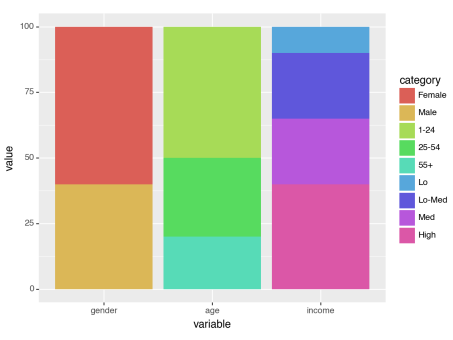
```python
# 柱状图
from plotnine import *
(
    ggplot(df, aes(x='variable', y='value', fill='category'))+
    geom_col(stat='identity', position='dodge')
)
```


大家现在可以先忽略可视化的代码部分，着重观察两个图表在表达信息上的差异。以上两个图其实都是表示：在gender、age和income上，不同类别的占比，但是第一个图明显比第二个图表达的信息更多，因为第一个图能表达每个类别的大致占比情况，而第二个图只能比较不同类别下的数量情况。
### 6.4.1  Python三大数据可视化工具库的简介
#### （1）Matplotlib：

Matplotlib正如其名，脱胎于著名的建模软件Matlab，因此它的设计与Matlab非常相似，提供了一整套和Matlab相似的命令API，适合交互式制图，还可以将它作为绘图控件，嵌入其它应用程序中。同时，Matplotlib是Python数据可视化工具库的开山鼻祖。

Matplotlib是一个面向对象的绘图工具库，pyplot是Matplotlib最常用的一个绘图接口，调用方法如下：
```python
import matplotlib.pyplot as plt
```
在Matplotlib中，我们可以想像自己手里拿着一支画笔🖌️，每一句代码都是往纸上添加一个绘图特征，下面我们以最简单的方式绘制散点图为例：

- 创建一个图形对象，并设置图形对象的大小（可以想象成在白纸中添加一个图，并设置图的大小）：plt.figure(figsize=(6,4))
- 在纸上的坐标系中绘制散点：plt.scatter(x=x, y=y)
- 设置x轴的标签label：plt.xlabel('x')
- 设置y轴标签的label：plt.ylabel('y')
- 设置图表的标题：plt.title('y = sin(x)')
- 展示图标：plt.show()
举个例子：
```python
# 创建数据
x = np.linspace(-2*np.pi, 2*np.pi, 100)
y = np.sin(x)
import matplotlib.pyplot as plt 
plt.figure(figsize=(8,6))
plt.scatter(x=x, y=y)
plt.xlabel('x')
plt.ylabel('y')
plt.title('y = sin(x)')
plt.show()
```
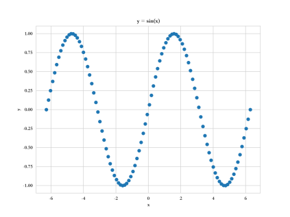

在上面的例子中，我们听过Matplotlib绘制了最简单的散点图，但是以上的方法没有体现Matplotlib的“面向对象”的特性。下面，我们使用一个例子体会Matplotlib的面向对象绘图的特性：

【例子】绘制y = sin(x) 和 y=cos(x)的散点图：

创建第一个绘图对象

     在纸上的坐标系中绘制散点：plt.scatter(x=x, y=sin(x))
     设置x轴的标签label：plt.xlabel('x')
     设置y轴标签的label：plt.ylabel('y')
     设置图表的标题：plt.title('y = sin(x)')

创建第二个绘图对象：

     在纸上的坐标系中绘制散点：plt.scatter(x=x, y=cos(x))
     设置x轴的标签label：plt.xlabel('x')
     设置y轴标签的label：plt.ylabel('y')
     设置图表的标题：plt.title('y = cos(x)')
```python
# 准备数据
x = np.linspace(-2*np.pi, 2*np.pi, 100)
y1 = np.sin(x)
y2 = np.cos(x)
# 绘制第一个图：
fig1 = plt.figure(figsize=(6,4), num='first')
fig1.suptitle('y = sin(x)')
plt.scatter(x=x, y=y1)
plt.xlabel('x')
plt.ylabel('y')

# 绘制第二个图：
fig2 = plt.figure(figsize=(6,4), num='second')
fig2.suptitle('y = cos(x)')
plt.scatter(x=x, y=y2)
plt.xlabel('x')
plt.ylabel('y')

plt.show()
```
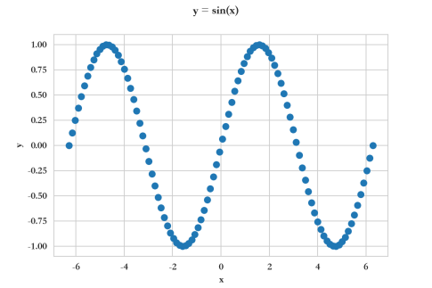
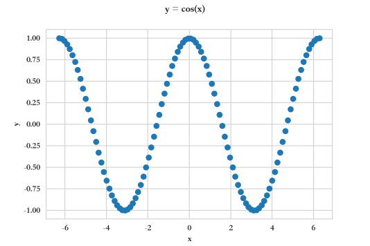

现在，大家应该能体会到“Matplotlib的每一句代码都是往纸上添加一个绘图特征”这句话的含义了吧。现在，我们来看看这样的Matplotlib有什么优点与缺点。优点是非常简单易懂，而且能绘制复杂图表；缺点也是十分明显的，如果绘制复杂图表的时候一步一步地绘制，代码量还是十分巨大的。Seaborn是在Matplotlib的基础上的再次封装，是对Matplotlib绘制统计图表的简化。下面，我们一起看看Seaborn的基本绘图逻辑。
#### （2）Seaborn：
Seaborn主要用于统计分析绘图的，它是基于Matplotlib进行了更高级的API封装。Seaborn比matplotlib更加易用，尤其在统计图表的绘制上，因为它避免了matplotlib中多种参数的设置。Seaborn与matplotlib关系，可以把Seaborn视为matplotlib的补充。
下面，我们使用一个简单的例子，来看看使用Seaborn绘图与使用Matplotlib绘图之间的代码有什么不一样：
```python
# 准备数据
x = np.linspace(-10, 10, 100)
y = 2 * x + 1 + np.random.randn(100)
df = pd.DataFrame({'x':x, 'y':y})
# 准备数据
x = np.linspace(-10, 10, 100)
y = 2 * x + 1 + np.random.randn(100)
df = pd.DataFrame({'x':x, 'y':y})

# 使用Seaborn绘制带有拟合直线效果的散点图
sns.lmplot("x","y",data=df)
```
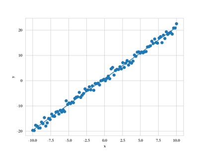
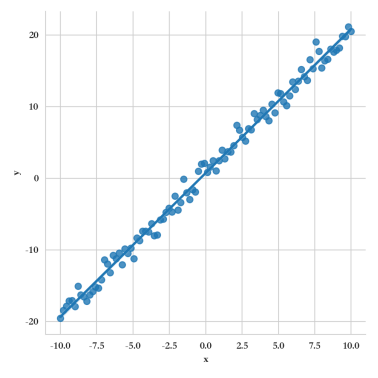
可以看到，Seaborn把数据拟合等统计属性高度集成在绘图函数中，绘图的功能还是构筑在Matplotlib之上。因此，Seaborn相当于是完善了统计图表的Matplotlib工具库，二者应该是相辅相成的。因此，在实际的可视化中，我们往往一起使用Matplotlib和Seaborn，两者的结合应该属于Python的数据可视化的一大流派吧。
#### （3）Plotnine：
gplot2奠定了R语言数据可视化在R语言数据科学的统治地位，R语言的数据可视化是大一统的，提到R语言数据可视化首先想到的就是ggplot2。数据可视化一直是Python的短板，即使有Matplotlib、Seaborn等数据可视化包，也无法与R语言的ggplot2相媲美，原因在于当绘制复杂图表时，Matplotlib和Seaborn由于“每一句代码都是往纸上添加一个绘图特征”的特性而需要大量代码语句。Plotnine可以说是ggplot2在Python上的移植版，使用的基本语法与R语言ggplot2语法“一模一样”，使得Python的数据可视化能力大幅度提升，为什么ggplot2和Plotnine会更适合数据可视化呢？原因可以类似于PhotoShop绘图和PPT绘图的区别，与PPT一笔一画的绘图方式不同的是，PhotoShop绘图采用了“图层”的概念，每一句代码都是相当于往图像中添加一个图层，一个图层就是一类绘图动作，这无疑给数据可视化工作大大减负，同时更符合绘图者的认知。

下面，我们通过一个案例来看看Plotnine的图层概念以及Plotnine的基本绘图逻辑：
```python
from plotnine import *     # 讲Plotnine所有模块引入
from plotnine.data import *   # 引入PLotnine自带数据集
mpg.head()
```
mpg数据集记录了美国1999年和2008年部分汽车的制造厂商，型号，类别，驱动程序和耗油量。

    manufacturer 生产厂家
    model 型号类型
    year 生产年份
    cty 和 hwy分别记录城市和高速公路驾驶耗油量
    cyl 气缸数
    displ 表示发动机排量
    drv 表示驱动系统：前轮驱动、(f),后轮驱动®和四轮驱动(4)
    class 表示车辆类型，如双座汽车，suv，小型汽车
    fl (fuel type)，燃料类型

```python
# 绘制汽车在不同驱动系统下，发动机排量与耗油量的关系
p1 = (
    ggplot(mpg, aes(x='displ', y='hwy', color='drv'))     # 设置数据映射图层，数据集使用mpg，x数据使用mpg['displ']，y数据使用mpg['hwy']，颜色映射使用mog['drv']
    + geom_point()       # 绘制散点图图层
    + geom_smooth(method='lm')        # 绘制平滑线图层
    + labs(x='displacement', y='horsepower')     # 绘制x、y标签图层
)
print(p1)   # 展示p1图像
```
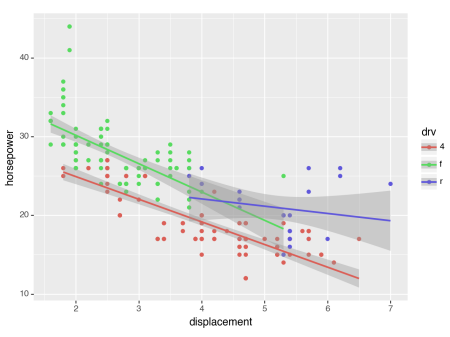

从上面的案例，我们可以看到Plotnine的绘图逻辑是：一句话一个图层。因此，在Plotnine中少量的代码就能画图非常漂亮的图表，而且可以画出很多很复杂的图表，就类似于PhotoShp能轻松画出十分复杂的图但是PPT需要大量时间也不一定能达到同样的效果。
那什么时候选择Matplotlib、Seaborn还是Plotnine？Plotnine具有ggplot2的图层特性，但是由于开发时间较晚，目前这个工具包还有一些缺陷，其中最大的缺陷就是：没有实现除了直角坐标以外的坐标体系，如：极坐标。因此，Plotnine无法绘制类似于饼图、环图等图表。为了解决这个问题，在绘制直角坐标系的图表时，我们可以使用Plotnine进行绘制，当涉及极坐标图表时，我们使用Matplotlib和Seaborn进行绘制。有趣的是，Matplotlib具有ggplot风格，可以通过设置ggplot风格绘制具有ggplot风格的图表。
```python
plt.style.use("ggplot")   #风格使用ggplot
```

但是值得注意的是，这里所说的绘制ggplot风格，是看起来像ggplot表格，但是实际上Matplotlib还是不具备图层风格。
### 6.4.2  基本图标Quick Start
（1）类别型图表：类别型图表一般表现为：X类别下Y数值之间的比较，因此类别型图表往往包括：X为类别型数据、Y为数值型数据。类别型图表常常有：柱状图、横向柱状图（条形图）、堆叠柱状图、极坐标的柱状图、词云、雷达图、桑基图等等。
```python
## Matplotlib绘制单系列柱状图：不同城市的房价对比
data = pd.DataFrame({'city':['深圳', '上海', '北京', '广州', '成都'], 'house_price(w)':[3.5, 4.0, 4.2, 2.1, 1.5]})

fig = plt.figure(figsize=(10,6))
ax1 = fig.add_axes([0.15,0.15,0.7,0.7])  # [left, bottom, width, height], 它表示添加到画布中的矩形区域的左下角坐标(x, y)，以及宽度和高度
plt.bar(data['city'], data['house_price(w)'], width=0.6, align='center', orientation='vertical', label='城市')
"""
x 表示x坐标，数据类型为int或float类型，也可以为str
height 表示柱状图的高度，也就是y坐标值，数据类型为int或float类型
width 表示柱状图的宽度，取值在0~1之间，默认为0.8
bottom 柱状图的起始位置，也就是y轴的起始坐标
align 柱状图的中心位置，"center","lege"边缘
color 柱状图颜色
edgecolor 边框颜色
linewidth 边框宽度
tick_label 下标标签
log 柱状图y周使用科学计算方法，bool类型
orientation 柱状图是竖直还是水平，竖直："vertical"，水平条："horizontal"
"""
plt.title("不同城市的房价对比图")   # 在axes1设置标题
plt.xlabel("城市")    # 在axes1中设置x标签
plt.ylabel("房价/w")    # 在axes1中设置y标签
plt.grid(b=True, which='both')  # 在axes1中设置设置网格线
for i in range(len(data)):
    plt.text(i-0.05, data.iloc[i,]['house_price(w)']+0.01, data.iloc[i,]['house_price(w)'],fontsize=13)   # 添加数据注释
plt.legend()
plt.show()
```
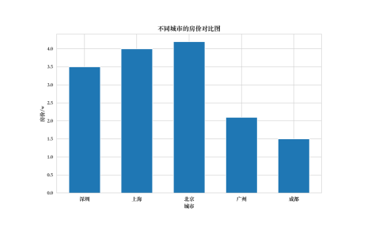
```python
## Plotnine绘制单系列柱状图：不同城市的房价对比
data = pd.DataFrame({'city':['深圳', '上海', '北京', '广州', '成都'], 'house_price(w)':[3.5, 4.0, 4.2, 2.1, 1.5]})

p_single_bar = (
    ggplot(data, aes(x='city', y='house_price(w)', fill='city', label='house_price(w)'))+
    geom_bar(stat='identity')+
    labs(x="城市", y="房价(w)", title="不同城市的房价对比图")+
    geom_text(nudge_y=0.08)+
    theme(text = element_text(family = "Songti SC"))
)
print(p_single_bar)
```
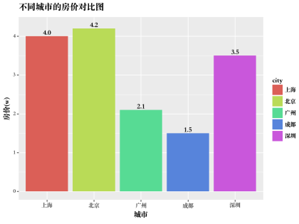
```python
## Matplotlib绘制多系列柱状图：不同城市在不同年份的房价对比
data = pd.DataFrame({
    '城市':['深圳', '上海', '北京', '广州', '成都', '深圳', '上海', '北京', '广州', '成都'],
    '年份':[2021,2021,2021,2021,2021,2022,2022,2022,2022,2022],
    '房价(w)':[3.5, 4.0, 4.2, 2.1, 1.5, 4.0, 4.2, 4.3, 1.6, 1.9]
})

fig = plt.figure(figsize=(10,6))
ax1 = fig.add_axes([0.15,0.15,0.7,0.7])  # [left, bottom, width, height], 它表示添加到画布中的矩形区域的左下角坐标(x, y)，以及宽度和高度
plt.bar(
    np.arange(len(np.unique(data['城市'])))-0.15, 
    data.loc[data['年份']==2021,'房价(w)'], 
    width=0.3, 
    align='center', 
    orientation='vertical', 
    label='年份：2021'
    )
plt.bar(
    np.arange(len(np.unique(data['城市'])))+0.15, 
    data.loc[data['年份']==2022,'房价(w)'], 
    width=0.3, 
    align='center', 
    orientation='vertical', 
    label='年份：2022'
    )
plt.title("不同城市的房价对比图")   # 在axes1设置标题
plt.xlabel("城市")    # 在axes1中设置x标签
plt.ylabel("房价/w")    # 在axes1中设置y标签
plt.xticks(np.arange(len(np.unique(data['城市']))), np.array(['深圳', '上海', '北京', '广州', '成都']))
plt.grid(b=True, which='both')  # 在axes1中设置设置网格线

data_2021 = data.loc[data['年份']==2021,:]
for i in range(len(data_2021)):
    plt.text(i-0.15-0.05, data_2021.iloc[i,2]+0.05, data_2021.iloc[i,2],fontsize=13)   # 添加数据注释

data_2022 = data.loc[data['年份']==2022,:]
for i in range(len(data_2022)):
    plt.text(i+0.15-0.05, data_2022.iloc[i,2]+0.05, data_2022.iloc[i,2],fontsize=13)   # 添加数据注释
plt.legend()
plt.show()
```
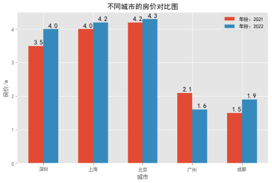
```python
## Plotnine绘制多系列柱状图：不同城市在不同年份的房价对比
data = pd.DataFrame({
    '城市':['深圳', '上海', '北京', '广州', '成都', '深圳', '上海', '北京', '广州', '成都'],
    '年份':[2021,2021,2021,2021,2021,2022,2022,2022,2022,2022],
    '房价(w)':[3.5, 4.0, 4.2, 2.1, 1.5, 4.0, 4.2, 4.3, 1.6, 1.9]
})

data['年份'] = pd.Categorical(data['年份'], ordered=True, categories=data['年份'].unique())
p_mult_bar = (
    ggplot(data, aes(x='城市', y='房价(w)', fill='年份'))+
    geom_bar(stat='identity',width=0.6, position='dodge')+
    scale_fill_manual(values = ["#f6e8c3", "#5ab4ac"])+
    labs(x="城市", y="房价(w)", title="不同城市的房价对比图")+
    geom_text(aes(label='房价(w)'), position = position_dodge2(width = 0.6, preserve = 'single'))+
    theme(text = element_text(family = "Songti SC"))
)
print(p_mult_bar)
```
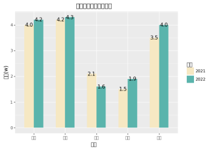
```python
## Matplotlib绘制堆叠柱状图：不同城市在不同年份的房价对比
data = pd.DataFrame({
    '城市':['深圳', '上海', '北京', '广州', '成都', '深圳', '上海', '北京', '广州', '成都'],
    '年份':[2021,2021,2021,2021,2021,2022,2022,2022,2022,2022],
    '房价(w)':[3.5, 4.0, 4.2, 2.1, 1.5, 4.0, 4.2, 4.3, 1.6, 1.9]
})
tmp=data.set_index(['城市','年份'])['房价(w)'].unstack()
data=tmp.rename_axis(columns=None).reset_index()
data.columns = ['城市','2021房价','2022房价']
print(data)

plt.figure(figsize=(10,6))
plt.bar(
    data['城市'], 
    data['2021房价'], 
    width=0.6, 
    align='center', 
    orientation='vertical', 
    label='年份：2021'
    )
plt.bar(
    data['城市'], 
    data['2022房价'], 
    width=0.6, 
    align='center', 
    orientation='vertical', 
    bottom=data['2021房价'],
    label='年份：2022'
    )
plt.title("不同城市2121-2022年房价对比图")   # 在axes1设置标题
plt.xlabel("城市")    # 在axes1中设置x标签
plt.ylabel("房价/w")    # 在axes1中设置y标签
plt.legend()
plt.show()
```
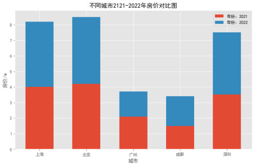
```python
## Matplotlib绘制百分比柱状图：不同城市在不同年份的房价对比
## Matplotlib绘制堆叠柱状图：不同城市在不同年份的房价对比
data = pd.DataFrame({
    '城市':['深圳', '上海', '北京', '广州', '成都', '深圳', '上海', '北京', '广州', '成都'],
    '年份':[2021,2021,2021,2021,2021,2022,2022,2022,2022,2022],
    '房价(w)':[3.5, 4.0, 4.2, 2.1, 1.5, 4.0, 4.2, 4.3, 1.6, 1.9]
})
tmp=data.set_index(['城市','年份'])['房价(w)'].unstack()
data=tmp.rename_axis(columns=None).reset_index()
data.columns = ['城市','2021房价','2022房价']
print(data)

plt.figure(figsize=(10,6))
plt.bar(
    data['城市'], 
    data['2021房价']/(data['2021房价']+data['2022房价']), 
    width=0.4, 
    align='center', 
    orientation='vertical', 
    label='年份：2021'
    )
plt.bar(
    data['城市'], 
    data['2022房价']/(data['2021房价']+data['2022房价']), 
    width=0.4, 
    align='center', 
    orientation='vertical', 
    bottom=data['2021房价']/(data['2021房价']+data['2022房价']),
    label='年份：2022'
    )
plt.title("不同城市2121-2022年房价对比图")   # 设置标题
plt.xlabel("城市")    # 在axes1中设置x标签
plt.ylabel("房价/w")    # 在axes1中设置y标签
plt.legend()
plt.show()
```
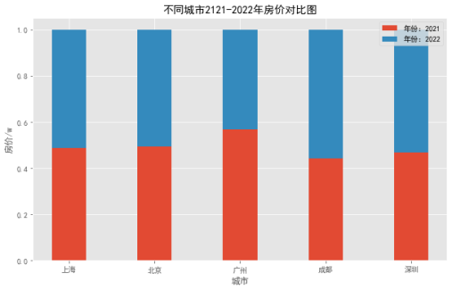
```python
# 使用Matplotlib绘制雷达图：英雄联盟几位英雄的能力对比
data = pd.DataFrame({
    '属性': ['血量', '攻击力', '攻速', '物抗', '魔抗'],
    '艾希':[3, 7, 8, 2, 2],
    '诺手':[8, 6, 3, 6, 6]
})

plt.figure(figsize=(8,8))
theta = np.linspace(0, 2*np.pi, len(data), endpoint=False)   # 每个坐标点的位置
theta = np.append(theta, theta[0])  # 让数据封闭
aixi = np.append(data['艾希'].values,data['艾希'][0])  #让数据封闭
nuoshou = np.append(data['诺手'].values,data['诺手'][0])  # 让数据封闭
shuxing = np.append(data['属性'].values,data['属性'][0])  # 让数据封闭

plt.polar(theta, aixi, 'ro-', lw=2, label='艾希') # 画出雷达图的点和线
plt.fill(theta, aixi, facecolor='r', alpha=0.5) # 填充
plt.polar(theta, nuoshou, 'bo-', lw=2, label='诺手')  # 画出雷达图的点和线
plt.fill(theta, nuoshou, facecolor='b', alpha=0.5) # 填充
plt.thetagrids(theta/(2*np.pi)*360, shuxing)  # 为每个轴添加标签
plt.ylim(0,10)
plt.legend()
plt.show()
```
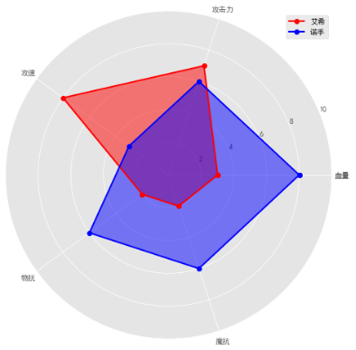

（2）关系型图表：关系型图表一般表现为：X数值与Y数值之间的关系，如：是否是线性关系、是否有正向相关关系等等。一般来说，关系可以分为：数值型关系、层次型关系和网络型关系。
```python
# 使用Matplotlib和四个图说明相关关系：
x = np.random.randn(100)*10
y1 = np.random.randn(100)*10
y2 = 2 * x + 1 + np.random.randn(100)
y3 = -2 * x + 1 + np.random.randn(100)
y4 = x**2 + 1 + np.random.randn(100)

plt.figure(figsize=(12, 12))

plt.subplot(2,2,1)  #创建两行两列的子图，并绘制第一个子图
plt.scatter(x, y1, c='dodgerblue', marker=".", s=50)
plt.xlabel("x")
plt.ylabel("y1")
plt.title("y1与x不存在关联关系")

plt.subplot(2,2,2)  #创建两行两列的子图，并绘制第二个子图
plt.scatter(x, y2, c='tomato', marker="o", s=10)
plt.xlabel("x")
plt.ylabel("y2")
plt.title("y2与x存在关联关系")

plt.subplot(2,2,3)  #创建两行两列的子图，并绘制第三个子图
plt.scatter(x, y3, c='magenta', marker="o", s=10)
plt.xlabel("x")
plt.ylabel("y3")
plt.title("y3与x存在关联关系")

plt.subplot(2,2,4)  #创建两行两列的子图，并绘制第四个子图
plt.scatter(x, y4, c='deeppink', marker="s", s=10)
plt.xlabel("x")
plt.ylabel("y3")
plt.title("y4与x存在关联关系")

plt.show()
```
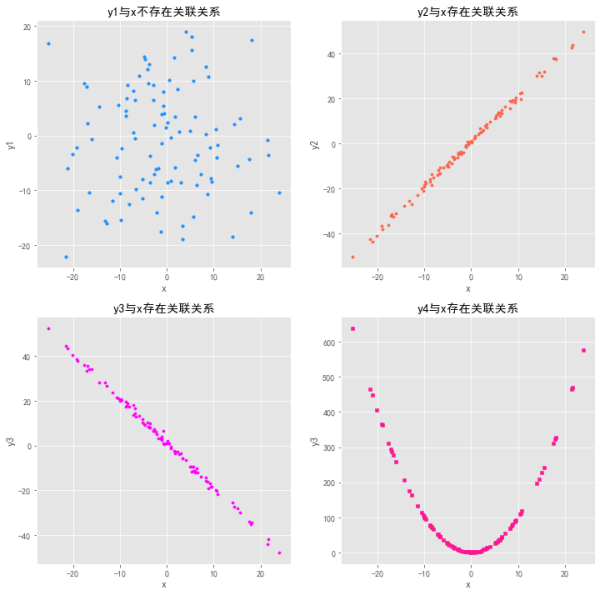
```python
# 使用Plotnine和四个图说明相关关系：
x = np.random.randn(100)*10
y1 = np.random.randn(100)*10
y2 = 10 * x + 1 + np.random.randn(100)
y3 = -10 * x + 1 + np.random.randn(100)
y4 = x**2 + 1 + np.random.randn(100)

df = pd.DataFrame({
    'x': np.concatenate([x,x,x,x]),
    'y': np.concatenate([y1, y2, y3, y4]),
    'class': ['y1']*100 + ['y2']*100 + ['y3']*100 + ['y4']*100
})

p1 = (
    ggplot(df)+
    geom_point(aes(x='x', y='y', fill='class', shape='class'), color='black', size=2)+
    scale_fill_manual(values=('#00AFBB', '#FC4E07', '#00589F', '#F68F00'))+
    theme(text = element_text(family = "Songti SC"))
)
print(p1)
```
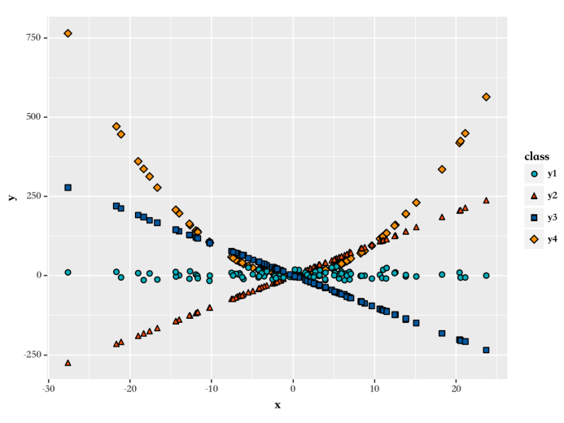
```python
# 使用Matplotlib绘制具备趋势线的散点图
from sklearn.linear_model import LinearRegression  #线性回归等参数回归
import statsmodels.api as sm

from sklearn.preprocessing import PolynomialFeatures  # 构造多项式
x = np.linspace(-10, 10, 100)
y = np.square(x) + np.random.randn(100)*100
x_poly2 = PolynomialFeatures(degree=2).fit_transform(x.reshape(-1, 1))
y_linear_pred = LinearRegression().fit(x.reshape(-1, 1), y).predict(x.reshape(-1, 1))
y_poly_pred = LinearRegression().fit(x_poly2, y).predict(x_poly2)
y_exp_pred = LinearRegression().fit(np.exp(x).reshape(-1, 1), y).predict(np.exp(x).reshape(-1, 1))
y_loess_pred = sm.nonparametric.lowess(x, y, frac=2/3)[:, 1]

plt.figure(figsize=(8, 8))
plt.subplot(2,2,1)
plt.scatter(x, y, c='tomato', marker="o", s=10)
plt.plot(x, y_linear_pred, c='dodgerblue')
plt.xlabel("x")
plt.ylabel("y")
plt.title("带线性趋势线的散点图")

plt.subplot(2,2,2)
plt.scatter(x, y, c='tomato', marker="o", s=10)
plt.plot(x, y_poly_pred, c='dodgerblue')
plt.xlabel("x")
plt.ylabel("y")
plt.title("带二次趋势线的散点图")

plt.subplot(2,2,3)
plt.scatter(x, y, c='tomato', marker="o", s=10)
plt.plot(x, y_exp_pred, c='dodgerblue')
plt.xlabel("x")
plt.ylabel("y")
plt.title("带指数趋势线的散点图")

plt.subplot(2,2,4)
plt.scatter(x, y, c='tomato', marker="o", s=10)
plt.plot(x, y_loess_pred, c='dodgerblue')
plt.xlabel("x")
plt.ylabel("y")
plt.title("带 loess平滑线的散点图")

plt.show()
```
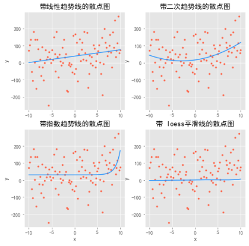
```python
# 使用Matplotlib绘制聚类散点图
from sklearn.datasets import load_iris  #家在鸢尾花数据集
iris = load_iris()
X = iris.data
label = iris.target
feature = iris.feature_names
df = pd.DataFrame(X, columns=feature)
df['label'] = label

label_unique = np.unique(df['label']).tolist()
plt.figure(figsize=(10, 6))
for i in label_unique:
    df_label = df.loc[df['label'] == i, :]
    plt.scatter(x=df_label['sepal length (cm)'], y=df_label['sepal width (cm)'], s=20, label=i)
plt.xlabel('sepal length (cm)')
plt.ylabel('sepal width (cm)')
plt.title('sepal width (cm)~sepal length (cm)')
plt.legend()
plt.show()
```
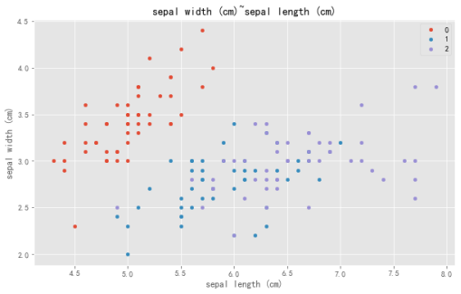
```python
# 使用plotnine绘制相关系数矩阵图：
from plotnine.data import mtcars
corr_mat = np.round(mtcars.corr(), 1).reset_index() #计算相关系数矩阵
df = pd.melt(corr_mat, id_vars='index', var_name='variable', value_name='corr_xy') #将矩阵宽数据变成长数据
df['abs_corr'] = np.abs(df['corr_xy'])
p1 = (
    ggplot(df, aes(x='index', y='variable', fill='corr_xy', size='abs_corr'))+
    geom_point(shape='o', color='black')+
    scale_size_area(max_size=11, guide=False)+
    scale_fill_cmap(name='RdYIBu_r')+
    coord_equal()+
    labs(x="Variable", y="Variable")+
    theme(dpi=100, figure_size=(4.5,4.55))
)
p2 = (
    ggplot(df, aes(x='index', y='variable', fill='corr_xy', size='abs_corr'))+
    geom_point(shape='s', color='black')+
    scale_size_area(max_size=10, guide=False)+
    scale_fill_cmap(name='RdYIBu_r')+
    coord_equal()+
    labs(x="Variable", y="Variable")+
    theme(dpi=100, figure_size=(4.5,4.55))
)
p3 = (
    ggplot(df, aes(x='index', y='variable', fill='corr_xy', label='corr_xy'))+
    geom_tile(color='black')+
    geom_text(size=8, color='white')+
    scale_fill_cmap(name='RdYIBu_r')+
    coord_equal()+
    labs(x="Variable", y="Variable")+
    theme(dpi=100, figure_size=(4.5,4.55))
)
print([p1, p2, p3])
```
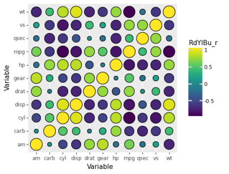

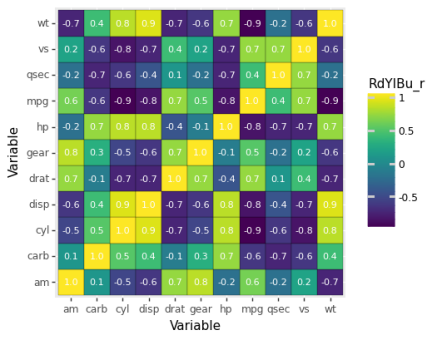
```python
# 使用Matplotlib/Seaborn绘制相关系数矩阵图
uniform_data = np.random.rand(10, 12)
sns.heatmap(uniform_data)
```


（3）分布型图表：所谓数据的分布，其实就是数据在哪里比较密集，那里比较稀疏，描述数据的密集或者稀疏情况实际上可以用频率或者概率。
```python
# 使用matplotlib绘制直方图：
plt.figure(figsize=(8, 6))
plt.hist(mtcars['mpg'], bins=20, alpha=0.85)
plt.xlabel("mpg")
plt.ylabel("count")
plt.show()
```
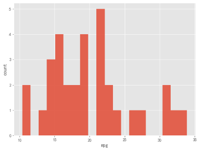
```python
# 使用matplotlib绘制箱线图
import seaborn as sns 
from plotnine.data import mtcars

data = mtcars
data['carb'] = data['carb'].astype('category')
plt.figure(figsize=(8, 6))
sns.boxenplot(x='carb', y='mpg', data=mtcars, linewidth=0.2, palette=sns.husl_palette(6, s=0.9, l=0.65, h=0.0417))
plt.show()
```
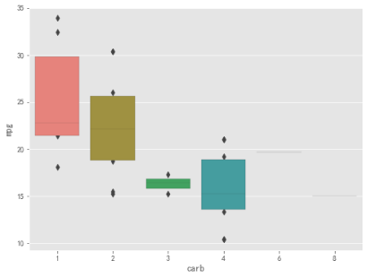
```python
# 使用Matplotlib绘制饼状图：
from matplotlib import cm, colors
df = pd.DataFrame({
    '己方': ['寒冰', '布隆', '发条', '盲僧', '青钢影'],
    '敌方': ['女警', '拉克丝', '辛德拉', '赵信', '剑姬'],
    '己方输出': [26000, 5000, 23000, 4396, 21000],
    '敌方输出': [25000, 12000, 21000, 10000, 18000]
})

df_our = df[['己方', '己方输出']].sort_values(by='己方输出', ascending=False).reset_index()
df_other = df[['敌方', '敌方输出']].sort_values(by='敌方输出', ascending=False).reset_index()
color_list = [cm.Set3(i) for i in range(len(df))]
plt.figure(figsize=(16, 10))
plt.subplot(1,2,1)
plt.pie(df_our['己方输出'].values, startangle=90, shadow=True, colors=color_list, labels=df_our['己方'].tolist(), explode=(0,0,0,0,0.3), autopct='%.2f%%')


plt.subplot(1,2,2)
plt.pie(df_other['敌方输出'].values, startangle=90, shadow=True, colors=color_list, labels=df_other['敌方'].tolist(), explode=(0,0,0,0,0.3), autopct='%.2f%%')

plt.show()
```

```python
# 使用Matplotlib绘制环状图：
from matplotlib import cm, colors
df = pd.DataFrame({
    '己方': ['寒冰', '布隆', '发条', '盲僧', '青钢影'],
    '敌方': ['女警', '拉克丝', '辛德拉', '赵信', '剑姬'],
    '己方输出': [26000, 5000, 23000, 4396, 21000],
    '敌方输出': [25000, 12000, 21000, 10000, 18000]
})

df_our = df[['己方', '己方输出']].sort_values(by='己方输出', ascending=False).reset_index()
df_other = df[['敌方', '敌方输出']].sort_values(by='敌方输出', ascending=False).reset_index()
color_list = [cm.Set3(i) for i in range(len(df))]
wedgeprops = {'width':0.3, 'edgecolor':'black', 'linewidth':3}
plt.figure(figsize=(16, 10))
plt.subplot(1,2,1)
plt.pie(df_our['己方输出'].values, startangle=90, shadow=True, colors=color_list, wedgeprops=wedgeprops, labels=df_our['己方'].tolist(), explode=(0,0,0,0,0.3), autopct='%.2f%%')
plt.text(0, 0, '己方' , ha='center', va='center', fontsize=30)

plt.subplot(1,2,2)
plt.pie(df_other['敌方输出'].values, startangle=90, shadow=True, colors=color_list, wedgeprops=wedgeprops, labels=df_other['敌方'].tolist(), explode=(0,0,0,0,0.3), autopct='%.2f%%')
plt.text(0, 0, '敌方' , ha='center', va='center', fontsize=30)
plt.show()
```


（4）时间序列型图表：
```python
# 使用Plotnine绘制时间序列线图：
df = pd.read_csv(
    './data/AirPassengers.csv'
    )  # 航空数据1949-1960
df['date'] = pd.to_datetime(df['date'])
p1 = (
    ggplot(df, aes(x='date', y='value'))+
    geom_line(size=1, color='red')+
    scale_x_date(date_labels="%Y", date_breaks="1 year")+
    xlab('date')+
    ylab('value')
)
print(p1)
```

```python
# 使用Matplotlib绘制时间序列折线图
plt.figure(figsize=(8,6))
plt.plot(df['date'], df['value'], color='red')
plt.xlabel("date")
plt.ylabel("value")
plt.show()
```
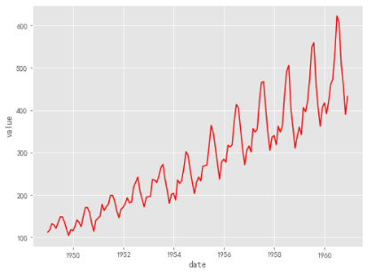
```python
# Plotnine绘制多系列折线图
date_list = pd.date_range('2022-01-01', '2022-03-31').astype('str').tolist() * 2
value_list = np.random.randn(len(date_list))
Class = [1] * (len(date_list) // 2) + [2] * (len(date_list) // 2)
data = pd.DataFrame({
    'date_list': date_list,
    'value_list': value_list,
    'Class': Class
})

data['date_list'] = pd.to_datetime(data['date_list'])
p1 = (
    ggplot(data, aes(x='date_list', y='value_list', group='factor(Class)', color='factor(Class)'))+
    geom_line(size=1)+
    scale_x_date(date_labels="%D")+
    xlab('date')+
    ylab('value')
)
print(p1)
```
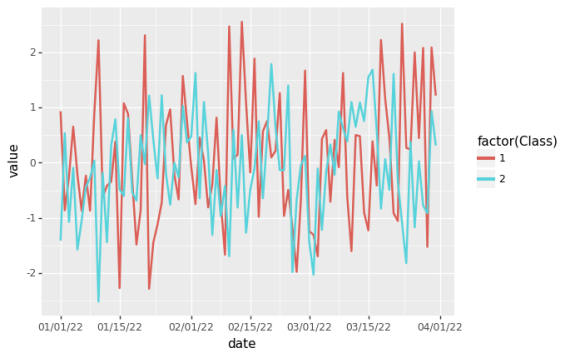
```python
# Matplotlib 绘制多系列折线图
date_list = pd.date_range('2022-01-01', '2022-03-31').astype('str').tolist()
value_list1 = np.random.randn(len(date_list))
value_list2 = np.random.randn(len(date_list))
data = pd.DataFrame({
    'date_list': date_list,
    'value_list1': value_list1,
    'value_list2': value_list2
})
data['date_list'] = pd.to_datetime(data['date_list'])

plt.figure(figsize=(8, 6))
plt.plot(data['date_list'], data['value_list1'], color='red', alpha=0.86, label='value1')
plt.plot(data['date_list'], data['value_list2'], color='blue', alpha=0.86, label='value2')
plt.legend()
plt.xlabel('date')
plt.ylabel('value')
plt.show()
```
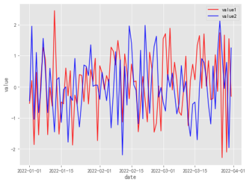
## 6.5  插值模型
插值方法实际上除了是用于处理缺失值一个很好的方法，也是做数据填充的很好的方法。比如，我获取了按日的数据，需要按小时对数据进行填充，这个时候就可以用插值去做填充任务。这里介绍几种比较常见的插值方法。
### 6.5.1  线性插值法
线性插值对两个点中的解析式是按照线性方程来建模。比如我们得到的原始数据列{y}和数据的下标{x}，这里数据下标x可能并不是固定频率的连续取值而是和y一样存在缺失的。给定了数据点(xk,yk)和(xk+1,yk+1)，需要对两个点之间构造直线进行填充。很显然，根据直线的点斜式方程，这个直线解析式为：
$$
{L_1}(x) = {y_k} + \frac{{{y_{k + 1}} - {y_k}}}{{{x_{k + 1}} - {x_k}}}(x - {x_k})   \tag{6.5.1}
$$
按照这个方程形式对空缺的(x,y)处进行填充就可以完成插值过程。
```python
import numpy as np
#数据准备
X = np.arange(-2*np.pi, 2*np.pi, 1) # 定义样本点X，从-pi到pi每次间隔1
Y = np.sin(X) # 定义样本点Y，形成sin函数
new_x = np.arange(-2*np.pi, 2*np.pi, 0.1) # 定义插值点
# 进行样条插值
import scipy.interpolate as spi
# 进行一阶样条插值
ipo1 = spi.splrep(X, Y, k=1)  # 样本点导入，生成参数
iy1 = spi.splev(new_x, ipo1)  # 根据观测点和样条参数，生成插值
```
### 6.4.2  三次样条插值
三次样条插值是一种非常自然的插值方法。它将两个数据点之间的填充模式设置为三次多项式。它假设在数据点(xk,yk)和(xk+1,yk+1)之间的三次式叫做Ik，那么这一组三次式需要满足条件：
$$
{a_i}x_i^3 + {b_i}x_i^2 + {c_i}{x_i} + {d_i} = {a_{i + 1}}x_{i + 1}^3 + {b_{i + 1}}x_{i + 1}^2 + {c_{i + 1}}{x_{i + 1}} + {d_{i + 1}}   \tag{6.5.2}
$$
$$
3{a_i}x_i^2 + 2{b_i}{x_i} + {c_i} = 3{a_{i + 1}}x_{i + 1}^2 + 2{b_{i + 1}}{x_{i + 1}} + {c_{i + 1}} \tag{6.5.3}
$$
$$
6{a_i}{x_i} + 2{b_i} = 6{a_{i + 1}}{x_{i + 1}} + 2{b_{i + 1}}   \tag{6.5.4}
$$
通过解方程的形式可以解出每一只三次式。而简而言之，也就是说某个数据点前后两条三次函数不仅在当前的函数值相等，一次导数值和二次导数值也要保持相等。
```python
# 进行三次样条拟合
ipo3 = spi.splrep(X, Y, k=3)  # 样本点导入，生成参数
iy3 = spi.splev(new_x, ipo3)  # 根据观测点和样条参数，生成插值
```
### 6.4.3  拉格朗日插值
对于一组数据{y}和下标{x}，定义n个拉格朗日插值基函数：
$$
{l_k}(x) = \prod\limits_{i = 0,i \ne k}^n {\frac{{x - {x_i}}}{{{x_k} - {x_i}}}}     \tag{6.5.5}
$$
这本质上是一个分式，当x=xk时lk(x)=1，这一操作实现了离散数据的连续化。按照对应下标的函数值加权求和可以得到整体的拉格朗日插值函数：
$$
L(x) = \sum\limits_{k = 0}^n {{y_k}{l_k}(x)}    \tag{6.5.6}
$$
但很不幸，Python没有为我们提供拉格朗日插值函数的方法。不过好在实现并不算太困难，我们可以自己写一个：
```python
def lagrange(x0,y0,x):
    y=[]
    for k in range(len(x)):
        s=0
        for i in range(len(y0)):
           t=y0[i]
           for j in range(len(y0)):
              if i!=j:
                t*=(x[k]-x0[j])/(x0[i]-x0[j])
           s+=t
        y.append(s)
    return y
```
通过一个简单的样例进行测试：
```python
from scipy.interpolate import interp1d
x0=[1,2,3,4,5]
y0=[1.6,1.8,3.2,5.9,6.8]
x=np.arange(1,5,1/30)
f1=interp1d(x0,y0,'linear')
y1=f1(x)
f2=interp1d(x0,y0,'cubic')
y2=f2(x)
y3=lagrange(x0,y0,x)
plt.plot(x0,y0,'r*')
plt.plot(x,y1,'b-',x,y2,'y-',x,y3,'r-')
plt.show()
```
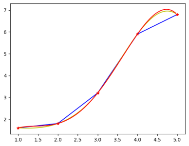

