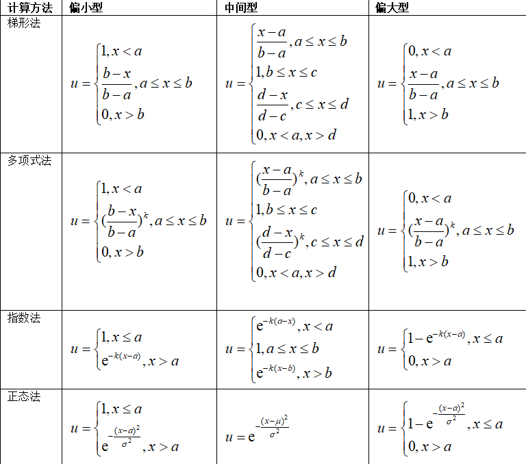

<center><h1>第7章 权重生成与评价模型</h1></center>
> 内容：@若冰（马世拓）
> 
> 审稿：@牧小熊（聂雄伟）
> 
> 排版&校对：@牧小熊（聂雄伟）

这一章我们主要介绍评价模型。评价类模型是初次接触数学建模竞赛的同学非常喜爱的一类题型，因为代码量小，原理通俗易懂。这类问题主要是用以解决对于一个目标不同方案之间比较或不同影响因素之间比较的问题。本章主要涉及到的知识点有：

- 层次分析法
- 熵权法
- TOPSIS分析法
- 模糊评价法
- CRITIC方法
- 主成分分析法
- 因子分析法
- 数据包络法

> 注意：本章内容相对来说较为简单，比起代码实现，对结果的解读更为重要。

## 7.1 层次分析法

> 层次分析法是美国运筹学家匹茨堡大学教授萨蒂于20世纪70年代初提出的一种评价策略。这种策略虽然带有一定主观性，但非常奏效，也是在社会科学研究中经常使用的一类方法。

### 7.1.1 层次分析法的原理

首先，层次分析法的流程分五步走：

1.选择指标，构建层次模型。

2.对目标层到准则层之间和准则层到方案层之间构建比较矩阵。

3.对每个比较矩阵计算CR值检验是否通过CR检验，如果没有通过检验需要调整比较矩阵。

4.求出每个矩阵最大的特征值对应的归一化权重向量。

5.根据不同矩阵的归一化权向量计算出不同方案的得分进行比较。

下面我们就对其中的每个步骤进行详细的分析。

首先是选择指标。在一些问题当中，如果它明确了需要做一个评价类问题，有可能会给出一些评价的指标准则，但很多情况下它并不会给你明确的指标。这需要你查阅资料或者自己去构建。事实上当我们需要用层次分析法解决问题的时候所评价的准则量绝非空穴来风凭空杜撰，而是在经过大量文献考证或社会调查后选取的。如果不去查阅文献的话可能就得发放调查问卷或者使用德尔菲法去征求专家意见。所幸，这些指标都是可以通过查找以往文献得到的。指标按照一定的层级结构组织起来就构成了一个指标体系。

层次分析法的层次从何而来？注意，在层次分析法中一个非常重要的操作就是构造层次模型图。从结构上看，层次分析法将模型大致分为目标层、准则层和方案层。目标层是你的评价目标，准则层是你的评价指标体系，方案层是多个对比方案。注意，方案层是一定要有多个对象进行比较的，因为层次分析法是基于比较的方法。


图7.1 使用层次分析法选择空调

两个相邻的层次之间是需要构建成对比较矩阵的。比方说在上图，我们在目标层和准则层之间就需要构建第一层比较矩阵，这个矩阵的大小是行列均为4。矩阵的每一项表示因素i和因素j的相对重要程度。由于对角线上元素都是自己和自己做比较，所以对角线上元素为1。另外，还有一条重要性质：
$$
{a\mathop{{}}\nolimits_{{ij}}a\mathop{{}}\nolimits_{{ji}}=1}
$$
关于这个矩阵的每一项取值多少，若因素*i*比因素*j*重要，为了描述重要程度，我们用1~9中间的整数描述，如表5.2所示。

**表5.2 重要性程度取值**

| **取值**         | 1        | 2            | 3            | 4            | 5            | 6            | 7            | 8            | 9            |
| ---------------- | -------- | ------------ | ------------ | ------------ | ------------ | ------------ | ------------ | ------------ | ------------ |
| **相对重要程度** | 同等重要 | 介于1、3之间 | 相对重要一些 | 介于3、5之间 | 相对比较重要 | 介于5、7之间 | 相比明显重要 | 介于7、9之间 | 相比非常重要 |

表5.2中描述的重要性是因素*i*比因素*j*重要的情况下描述的。如果是因素*j*比因素*i*重要，由式（5.2）得到的“相对不重要程度”那就用1~9的倒数描述即可。这个比较矩阵每一项的确定具有较强的主观性，因为究竟二者重要程度是比较重要还是非常重要也是不同的人可能有不同的理解，但总体来讲是奏效的。

注意：通常来说，对重要性的取值都是取奇数，也就是1、3、5、7、9，偶数是当你不太确定，也就是认为介于两个奇数程度之间时再取偶数。

除了准则层外，方案层也需要构建成对比较矩阵。但不同的是，假如有m个准则n个样本，需要构建的矩阵数量为m，矩阵大小为(n,n)。每个成对比较矩阵是需要我们自己手动确定的。在人工商定了这些成对比较矩阵后，接下来的操作是对每个成对比较矩阵进行一致性检验。在前面我们已经知道如何对矩阵进行特征值分解，那么对于成对比较矩阵可以很容易地计算出它最大的特征值及其对应的特征向量。那么，定义CI值：
$$
{CI=\frac{{ \lambda \mathop{{}}\nolimits_{{max}}-n}}{{n-1}}}
$$
这里*n*取4的话很容易计算出CI值为0.0145。而除了CI，还有一个RI值（随机一致性指标），在不同的*n*的取值下RI值也不同。这个值是通过大量随机实验得到的统计规律，数值可以查表获得，将RI表列在表5.4中。

**表5.4 RI*取值**

| n      | 1    | 2    | 3    | 4    | 5    | 6    | 7    |
| ------ | ---- | ---- | ---- | ---- | ---- | ---- | ---- |
| **RI** | 0    | 0    | 0.52 | 0.89 | 1.12 | 1.26 | 1.32 |
| **n**  | 8    | 9    | 10   | 11   | 12   | 13   | 14   |
| **RI** | 1.41 | 1.46 | 1.49 | 1.52 | 1.54 | 1.56 | 1.58 |

得到RI和CI后，计算CI和RI的比值也就是CR。查表计算可以得到这个矩阵的CR值为0.0161。通常来说，当CR值超过0.1时，就可以认为这个矩阵是不合理的，需要被修改、被调整。这里由于没有超过这个阈值，所以可以认为这个比较矩阵通过了一致性检验。于是，剩下的过程便可以如法炮制，计算出准则层到方案层的4个矩阵了。

得到一致性检验结果后，还需要对最大特征值对应的特征向量进行归一化得到权重向量。归一化的方法为将特征向量除以该向量所有元素之和：
$$
{x\mathop{{}}\nolimits_{{i}}=\frac{{x\mathop{{}}\nolimits_{{i}}}}{{{\mathop{ \sum }\limits_{{i-1}}^{{n}}{x\mathop{{}}\nolimits_{{i}}}}}}}
$$
最终可以得到每个指标的权重，以及每个样本在不同指标上的归一化得分。通过加权折算就可以得到评价的最终分数。

### 7.1.2 层次分析法的案例

上面的纯文字表述可能还是会有些抽象，没关系，我们这里有两个不错的案例。

**例7.1** 某日从三条河流的基站处抽检水样，得到了水质的四项检测指标如表5.1所示。请根据提供数据对三条河流的水质进行评价。其中，DO代表水中溶解氧含量，越大越好；CODMn表示水中高锰酸盐指数，NH3-N表示氨氮含量，这两项指标越小越好；pH值没有量纲，在6~9区间内较为合适。

**例7.1的数据**

| **地点名称**   | **pH\*** | **DO** | **CODMn** | **NH3-N** |
| -------------- | -------- | ------ | --------- | --------- |
| 四川攀枝花龙洞 | 7.94     | 9.47   | 1.63      | 0.077     |
| 重庆朱沱       | 8.15     | 9.00   | 1.4       | 0.417     |
| 湖北宜昌南津关 | 8.06     | 8.45   | 2.83      | 0.203     |

首先，我们需要对上面的数据分析：该评价问题一共有三个样本，四个评价指标。不同的评价指标还不太一样，有的越大越好有的越小越好。这里既然他们给出来了评价指标，就不再另外查找文献了。我们构建层次模型图：


接下来的操作就是对目标层到准则层构建一个大小为4的方阵，准则层到方案层构建4个大小为3的方阵。我们先来计算一下这个目标层到准则层，至于准则层到方案层的矩阵都是如法炮制的过程。例如，创建了这么一个矩阵：

| **变量**  | **pH\*** | **DO** | **CODMn** | **NH3-N** |
| --------- | -------- | ------ | --------- | --------- |
| **pH\***  | 1        | 1/5    | 1/3       | 1         |
| **DO**    | 5        | 1      | 3         | 5         |
| **CODMn** | 3        | 1/3    | 1         | 3         |
| **NH3-N** | 1        | 1/5    | 1/3       | 1         |

对这个矩阵做特征值分解的代码如下：

```python
import numpy as np 

# 构建矩阵
A=np.array([[1,1/5,1/3,1],
            [5,1,3,5],
            [3,1/3,1,3],
            [1,1/5,1/3,1]])

#获得指标个数
m=len(A)
n=len(A[0])
RI=[0,0,0.58,0.90,1.12,1.24,1.32,1.41,1.45,1.49,1.51]
#求判断矩阵的特征值和特征向量，V为特征值，D为特征向量
V,D=np.linalg.eig(A)
list1=list(V)
#求矩阵的最大特征值
B=np.max(list1)
index=list1.index(B)
C=d[:,index]
```

很容易地，我们定位到了最大的特征值与特征向量。进而我们计算CI和CR：

```python
CI=(B-n)/(n-1)
CR=CI/RI[n]
if CR<0.10:
    print("CI=",CI)
    print("CR=",CR)
    print("对比矩阵A通过一致性检验，各向量权重向量Q为：")
    C_sum=np.sum(C)
    Q=C/C_sum
    print(Q)
else:
    print("对比矩阵A未通过一致性检验，需对对比矩阵A重新构造")
```

结果输出如下：


很多同学可能会问一个问题，说：这里分解出来的权重向量为什么是个复数。注意，python进行矩阵分解的时候是在复数域内进行分解，所得到的向量也是复数向量。虚部为0的情况下想要单独分析实部，通过Q.real即可达成取实部的效果。

计算出目标层到准则层的1个权重向量和4个准则层到方案层的权重向量以后，可以列出表5.5将权重向量进行排布。

 **例7.1中4个权重向量的排布**

| **地点名称**   | **pH\*** | **DO** | **CODMn** | **NH3-N** | **得分** |
| -------------- | -------- | ------ | --------- | --------- | -------- |
|                | 0.0955   | 0.5596 | 0.2495    | 0.0955    |          |
| 四川攀枝花龙洞 | 0.4166   | 0.5396 | 0.2970    | 0.6370    | 0.4767   |
| 重庆朱沱       | 0.3275   | 0.2970 | 0.5396    | 0.1047    | 0.3421   |
| 湖北宜昌南津关 | 0.2599   | 0.1634 | 0.1634    | 0.2583    | 0.1817   |

将准则层到方案层得到的7个成对比较矩阵对应的权重向量排列为一个矩阵，矩阵的每一行表示对应的方案，矩阵的每一列代表评价准则。将这一方案权重矩阵与目标层到准则层的权重向量进行数量积，得到的分数就是最终的评分。最终得到的一个结论是：在评价过程中水中溶解氧含量与钴金属含量占评价体系比重最大，而四川攀枝花龙洞的水质虽然含钴元素比另外两个更高，但由于溶解氧更多，NH3-N的含量更小，水体不显富营养化。就整体而言，四川攀枝花龙洞得分高于重庆朱沱和湖北宜昌南津关。

将一个成对比较矩阵的AHP过程封装为函数，完整函数如下。

```python
def AHP(A):
    m=len(A)                                     #获取指标个数
    n=len(A[0])
    RI=[0, 0, 0.58, 0.90, 1.12, 1.24, 1.32, 1.41, 1.45, 1.49, 1.51]
    R= np.linalg.matrix_rank(A)                 #求判断矩阵的秩
    V,D=np.linalg.eig(A)                     #求判断矩阵的特征值和特征向量，V特征值，D特征向量；
    list1 = list(V)
    B= np.max(list1)                            #最大特征值
    index = list1.index(B)
    C = D[:, index]                             #对应特征向量
    CI=(B-n)/(n-1)                             #计算一致性检验指标CI
    CR=CI/RI[n]
    if CR<0.10:
        print("CI=", CI.real)
        print("CR=", CR.real)
        print('对比矩阵A通过一致性检验，各向量权重向量Q为：')
        sum=np.sum(C)
        Q=C/sum                                #特征向量标准化
        print(Q.real)                                #    输出权重向量
        return Q.real
    else:
        print("对比矩阵A未通过一致性检验，需对对比矩阵A重新构造")
        return 0
```

**例7.2** 第二个例子是有关于物种入侵的。现在想要比较三种草类植物(Dandelions, Hogweed, Scotch Broom)是否在美国构成物种入侵。从A1：生态因素、A2：有益因素、A3：入侵因素三个角度考虑。A1包括五个二级指标：P1：生长速度、P2：竞争能力、P3：生态位占用、P4：生态系统适应性、P5：扩散能力，A2包括三个二级指标：P6：食用价值、P7：药用价值、P8：经济价值，A3包括两个二级指标：P9：扩散历史、P10：入侵地区。请通过层次分析法对三种植物的入侵能力进行综合评价。

这个问题的难点在于，三个一级指标A下面又设置了十个二级指标P。我们首先把层级结构图画出来：

 

接下来我们分析需要构建的矩阵数量。首先，目标层到一级指标层有一个3*3的矩阵；A1到下属的五个二级指标有一个5*5的矩阵，A2就有一个3*3的矩阵，A3有一个2*2的矩阵。十个二级指标对应三个比较对象，也就出现了10个3*3的矩阵。通过调用前面的AHP函数就可以构造层级分析表。

```python
#目标层到第一准则层

A0=np.array([[1,3,5],

          [1/3,1,3],

          [1/5,1/3,1]])

print('目标到第一准则层')

v0=AHP(A0)

#第一准则层到第二准则层

A11 = np.array([[1,5,3,4,2],

           [1/5,1,1/2,1,1/3],

           [1/3,2,1,2,1/2],

           [1/4,1,1/2,1,1/3],

           [1/2,3,2,3,1]])

A21 = np.array([[1,3,4],

           [1/3,1,2],

           [1/4,1/2,1]])

A31 = np.array([[1,3],

           [1/3,1]])

print('生态因素')

v11=AHP(A11)

print('有益因素')

v21=AHP(A21)

print('入侵因素')

v31=AHP(A31)
```

这几个矩阵都是可以通过检验的。剩下十个矩阵就可以如法炮制。最终权重列表如下：

| 顶层设计 | 一级变量 | 顶层权重 | 二级变量       | 二级权重 | 最终权重 |
| -------- | -------- | -------- | -------------- | -------- | -------- |
| 评价体系 | 有益因素 | 0.258    | 食用价值       | 0.625    | 0.16125  |
| 评价体系 | 有益因素 | 0.258    | 药用价值       | 0.238    | 0.061404 |
| 评价体系 | 有益因素 | 0.258    | 经济价值       | 0.136    | 0.035088 |
| 评价体系 | 生态因素 | 0.637    | 生长速度       | 0.427    | 0.271999 |
| 评价体系 | 生态因素 | 0.637    | 竞争能力       | 0.082    | 0.052234 |
| 评价体系 | 生态因素 | 0.637    | 生态位占用     | 0.151    | 0.096187 |
| 评价体系 | 生态因素 | 0.637    | 生态系统适应性 | 0.087    | 0.055419 |
| 评价体系 | 生态因素 | 0.637    | 扩散能力       | 0.254    | 0.161798 |
| 评价体系 | 入侵因素 | 0.105    | 扩散历史       | 0.75     | 0.07875  |
| 评价体系 | 入侵因素 | 0.105    | 入侵地区       | 0.25     | 0.02625  |

这样就得到了十个二级指标的最终权重。接下来只需要求解三个样本在每个二级指标上的归一化得分就可以计算出最终评分系数了。这里可能有人会问，n=2的时候RI=0，它能作为分母吗？事实上，当n=2的时候，无论成对比较矩阵长什么样，它最大的特征值都会等于2（有兴趣的同学可以证明一下，不难），CI也就等于0。在CI和RI都为0的时候，我们定义n=2下的成对比较矩阵都能通过一致性检验。最后得到三种植物的分数分别为Dandelions=0.310, Hogweed=0.283, Scotch Broom=0.406。显然，第三种的入侵系数是最高的。

## 7.2 熵权分析法

熵权法是一种客观赋权方法，基于信息论的理论基础，根据各指标的数据的分散程度，利用信息熵计算并修正得到各指标的熵权，较为客观。相对而言这种数据驱动的方法就回避了上面主观性因素造成的重复修正的影响。

### 7.2.1 熵权分析法的原理

在上一节例7.1中，我们发现一个现象：衡量好坏的标准因指标而异。由于指标的多样性，有些指标越大越好，如成绩；有些越小越好，如房贷；有些在特定区间过高或过低都不佳，如血压；还有些存在最优值，偏差越大越差。若模型未经数据预处理直接计算，可能出现问题。因此，第一步是指标正向化。它涉及将原本的负向指标转为正向指标，例如将死亡率转为生存率、故障率转为可靠度。通过正向化，目标或结果的达成情况更直观，提高指标的可解释性和可操作性。

- 对于极大型指标：指标越大越好，不需要正向化。只需要通过min-max规约或Z-score规约进行规约即可。

- 对于极小型指标：此类指标越小越好。它的正向化方式比较简单，可以取相反数；如果指标全部为正数，也可以取其倒数。

- 对于区间型指标：它的规约方法遵循下面的式子。

  $$
  {x\mathop{{}}\nolimits_{{new}}={ \left\{ {\begin{array}{*{20}{l}}{1-\frac{{a-x}}{{M}},x < a}\\{1,a \le x \le b}\\{1-\frac{{x-b}}{{M}},x > b}\end{array}}\right. }}
  $$
  
- 对于中值型指标：它的正向化操作为

$$
{x\mathop{{}}\nolimits_{{new}}=1-\frac{{{ \left| {x-x\mathop{{}}\nolimits_{{best}}} \right| }}}{{max \left( { \left| {x-x\mathop{{}}\nolimits_{{best}}} \right| } \right) }}}
$$

在进行指标正向化以后，所有的指标全部被变换为越大越好。而为了进一步消除量纲这些的影响，需要进一步进行min-max规约化或z-score规约化消除量纲差异。

熵权法的主要计算步骤如下。

（1）构建*m*个事物*n*个评价指标的判断矩阵$R(i=1,2,3,…,n；j=1,2,…,m)$。

（2）将判断矩阵进行归一化处理，得到新的归一化判断矩阵$B$。
$$
{B=\frac{{X-min \left( X \right) }}{{max \left( X \left) -min \left( X \right) \right. \right. }}}
$$
（3）熵权法可利用信息熵计算出各指标的权重，从而为多指标评价提供依据。根据信息论中对熵的定义，熵值$e$的计算如下。
$$
{e\mathop{{}}\nolimits_{{j}}=\frac{{{\mathop{ \sum }\limits_{{i=1}}^{{n}}{p\mathop{{}}\nolimits_{{ij}}lnp\mathop{{}}\nolimits_{{ij}}}}}}{{lnn}}}
$$
其中$p$为离散属性中每个类取值的占比。通过式(5.8)的熵值，可以评价不同指标的离散程度，一般情况下，信息熵越小，离散程度越大，因子对综合评价的权重就越大。

（4）计算权重系数，式子(5.9)中代表对于某一个属性$j$，第$i$类占样本的比例。$n$为属性$j$的取值数量。所以，权重系数$w$定义为
$$
{w\mathop{{}}\nolimits_{{j}}=\frac{{1-e\mathop{{}}\nolimits_{{j}}}}{{{\mathop{ \sum }\limits_{{i=1}}^{{m}}{ \left( 1-e\mathop{{}}\nolimits_{{j}} \right) }}}}}
$$

> 注意：熵权法是一个数据驱动过程，一定要保证有一定数据量并且做了正向化。

### 7.2.2 熵权分析法的案例

**例7.3** 在例7.1的基础上采集到了更多基站的数据，现在需要对指标进行熵值赋权。新的数据表格如表所示。

例7.3的新数据

| **地点名称**     | **pH\*** | **DO** | **CODMn** | **NH3-N** | **鱼类密度** | **垃圾密度** |
| ---------------- | -------- | ------ | --------- | --------- | ------------ | ------------ |
| 四川攀枝花龙洞   | 7.94     | 9.47   | 1.63      | 0.08      | 6.78         | 4.94         |
| 重庆朱沱         | 8.15     | 9.00   | 1.40      | 0.42      | 5.27         | 4.47         |
| 湖北宜昌南津关   | 8.06     | 8.45   | 2.83      | 0.20      | 2.50         | 7.03         |
| 湖南岳阳城陵矶   | 8.05     | 9.16   | 3.33      | 0.29      | 5.65         | 5.26         |
| 江西九江河西水厂 | 7.60     | 7.93   | 2.07      | 0.13      | 5.26         | 6.39         |
| 安徽安庆皖河口   | 7.39     | 7.12   | 2.23      | 0.20      | 6.21         | 7.50         |
| 江苏南京林山     | 7.74     | 7.29   | 1.77      | 0.06      | 6.44         | 3.93         |
| 四川乐山岷江大桥 | 7.38     | 6.51   | 3.63      | 0.41      | 3.17         | 5.75         |
| 四川宜宾凉姜沟   | 8.32     | 8.47   | 1.60      | 0.14      | 3.32         | 6.29         |
| 四川泸州沱江二桥 | 7.69     | 8.50   | 2.73      | 0.28      | 7.25         | 8.21         |
| 湖北丹江口胡家岭 | 8.15     | 9.88   | 2.00      | 0.08      | 7.22         | 3.82         |
| 湖南长沙新港     | 6.88     | 7.59   | 1.77      | 0.92      | 2.94         | 8.03         |
| 湖南岳阳岳阳楼   | 8.00     | 8.15   | 4.87      | 0.33      | 4.68         | 5.01         |
| 湖北武汉宗关     | 7.94     | 7.48   | 3.30      | 0.13      | 5.81         | 4.87         |
| 江西南昌滁槎     | 8.01     | 7.76   | 2.67      | 6.36      | 4.52         | 3.22         |
| 江西九江蛤蟆石   | 7.91     | 7.93   | 5.47      | 0.21      | 7.48         | 2.40         |
| 江苏扬州三江营   | 8.04     | 8.34   | 3.87      | 0.20      | 3.73         | 4.05         |

首先，读取数据并对指标进行正向化。首先，pH这一列虽然是区间型指标，但是可以用pH=7作为最优值将其看作中间值型指标处理，与7的偏差越大则得分越小。DO和鱼类密度是极大型指标，剩下三个是极小型指标，所以用倒数的方法正向化。

```python
import pandas as pd

newdata=pd.read_excel("test.xlsx",sheet_name='Sheet5')

newdata['pH*']=1-abs(newdata['pH*']-7)

newdata['CODMn']=1/newdata['CODMn']

newdata['NH3-N']=1/newdata['NH3-N']

newdata['垃圾密度']=1/newdata['垃圾密度']

newdata=newdata.set_index('地点名称').dropna()
```

将熵权法的代码复现如下所示：

```python
def entropyWeight(data):
  data = np.array(data)
  # 归一化
  P = data / data.sum(axis=0)
  # 计算熵值
  E = np.nansum(-P * np.log(P) / np.log(len(data)), axis=0)
  # 计算权系数
  return (1 - E) / (1 - E).sum()
```

通过调用函数，可以得到权重分别为

```
[0.15547967, 0.01030048, 0.13105116, 0.50152061, 0.09189262，0.10975546]
```

## 7.3 TOPSIS分析法

TOPSIS评价法是有限方案多目标决策分析中常用的一种科学方法，其基本思想为，对原始决策方案进行归一化，然后找出最优方案和最劣方案，对每一个决策计算其到最优方案和最劣方案的欧几里得距离，然后再计算相似度。若方案与最优方案相似度越高则越优先。

### 7.3.1 一般的TOPSIS分析法

中国有句古话，叫做“近朱者赤近墨者黑”。我们要比较各个方案的好坏，但是每个方案都有很多不同的指标，比如经济、环境、社会等等。如果我们直接比较这些指标，可能会很复杂，而且也容易受到不同指标单位和量纲的影响。层次分析法里面我们用成对比较矩阵主观地消除量纲影响，熵权法里面我们用熵值和正向化消除了量纲影响，还有什么办法嘞？在TOPSIS分析法中，我们通过计算每个方案离理想解和负理想解的距离来判断优劣。理想解是最佳方案，各项指标最优；负理想解是最差方案，各项指标最差。这种方法就像“近朱者赤近墨者黑”，离最好的方案越近，表现就越优秀，离最差的方案越远，表现就越差。简化多个指标问题为距离问题，如图所示。

<div align=center></div>
对于距离，有多种方式可以衡量它。包括最常用的欧几里得距离、曼哈顿距离、余弦距离等多种计算方式，它们的计算方法如下：
$$
${Euclidean \left( x,y \left) =\sqrt{{{\mathop{ \sum }\limits_{{i=1}}^{{n}}{ \left( x\mathop{{}}\nolimits_{{i}}-y\mathop{{}}\nolimits_{{i}} \left) \mathop{{}}\nolimits^{{2}}\right. \right. }}}}\right. \right. }$
$$

$$
{Manhaton \left( x,y \left) ={\mathop{ \sum }\limits_{{i=1}}^{{n}}{{ \left| {x\mathop{{}}\nolimits_{{i}}-y\mathop{{}}\nolimits_{{i}}} \right| }}}\right. \right. }
$$

$$
{cos \left( x,y \left) =\frac{{x\mathop{{}}\nolimits^{{T}}y}}{{{ \left| {x} \right| }{ \left| {y} \right| }}}\right. \right. }
$$

有了上面的计算方法TOPSIS法的基本流程如下：

（1）对原始数据进行指标正向化和归一化操作得到矩阵$Z$

（2）确定正理想解${Z\mathop{{}}\nolimits^{{+}}}$和负理想解${Z\mathop{{}}\nolimits^{{-}}}$
$$
{Z\mathop{{}}\nolimits^{{+}}= \left\{ \mathop{{max\text{ }}}\limits_{{j\mathop{{}}\nolimits^{{ \in J}}}}z\mathop{{}}\nolimits_{{ij}} \right\} }
$$

$$
{Z\mathop{{}}\nolimits^{{-}}= \left\{ \mathop{{min\text{ }}}\limits_{{j\mathop{{}}\nolimits^{{ \in J}}}}z\mathop{{}}\nolimits_{{ij}} \right\} }
$$

（3）计算各评价对象$i（i=1,2,3…,402)$到正理想解和负理想解的欧几里得距离${D\mathop{{}}\nolimits_{{i}}}$：
$$
{D\mathop{{}}\nolimits_{{+}}^{{i}}=\sqrt{{{\mathop{ \sum }\limits_{{j=1}}^{{n}}{ \left( z\mathop{{}}\nolimits_{{ij}}-Z\mathop{{}}\nolimits_{{+}}^{{j}} \left) \mathop{{}}\nolimits^{{2}}\right. \right. }}}}}
$$

$$
{D\mathop{{}}\nolimits_{{-}}^{{i}}=\sqrt{{{\mathop{ \sum }\limits_{{j=1}}^{{n}}{ \left( z\mathop{{}}\nolimits_{{ij}}-Z\mathop{{}}\nolimits_{{-}}^{{j}} \left) \mathop{{}}\nolimits^{{2}}\right. \right. }}}}}
$$

（4）计算各评价对象的相似度${W\mathop{{}}\nolimits_{{i}}}$：
$$
{W\mathop{{}}\nolimits_{{i}}=\frac{{D\mathop{{}}\nolimits_{{-}}^{{i}}}}{{D\mathop{{}}\nolimits_{-}^{{i}}+D\mathop{{}}\nolimits_{{+}}^{{i}}}}}
$$
可以看到，相似度是与负理想解和两个理想解距离之和的比值，若占比越大，则说明离负理想解越远，越优先选择。

（5）根据${W\mathop{{}}\nolimits_{{i}}}$大小排序可得到结果。

TOPSIS分析的流程图如下：

 <div align=center></div>
### 7.3.2 改进的TOPSIS分析法

在经典TOPSIS方法中，计算欧几里得距离时，不同指标的差的平方会被直接相加。然而，考虑到不同指标在评价体系中的重要性可能存在差异，因此在计算距离时应对各个指标赋予相应的权重。权重的确定可以通过熵权法或层次分析法来实现。通常在解决TOPSIS问题时，我们会处理大量的数据，因此，权重可以通过数据驱动的熵权法来获得。

如果给每个指标赋权重，权重向量为w的话，距离的计算方式应该被改为：
$$
{d \left( x,y \left) =\sqrt{{{\mathop{ \sum }\limits_{{i=1}}^{{n}}{w\mathop{{}}\nolimits_{{i}} \left( x\mathop{{}}\nolimits_{{i}}-y\mathop{{}}\nolimits_{{i}} \left) \mathop{{}}\nolimits^{{2}}\right. \right. }}}}\right. \right. }
$$
这样，可以在距离计算中考虑权重影响，更重要的权重会被赋予更多的权重，在距离计算中起到更大的作用。

### 7.3.3 TOPSIS分析法的案例

仍然以例7.3为例，实现TOPSIS代码如下：

```python
import numpy as np

import pandas as pd


#TOPSIS方法函数

def TOPSIS(A1,w):

    Z=np.array(A1)

    #计算正、负理想解

    Zmax=np.ones([1,A1.shape[1]],float)

    Zmin=np.ones([1,A1.shape[1]],float)

    for j in range(A1.shape[1]):

        if j==1:

          Zmax[0,j]=min(Z[:,j])

          Zmin[0,j]=max(Z[:,j])

        else:

          Zmax[0,j]=max(Z[:,j])

          Zmin[0,j]=min(Z[:,j])

  #计算各个方案的相对贴近度C

    C=[]

    for i in range(A1.shape[0]):

          Smax=np.sqrt(np.sum(w*np.square(Z[i,:]-Zmax[0,:])))

          Smin=np.sqrt(np.sum(w*np.square(Z[i,:]-Zmin[0,:])))

          C.append(Smin/(Smax+Smin))

    C=pd.DataFrame(C)

    return C
```

输入归一化后的数据和权重系数就可以获得评价结果。利用上一节里面讲到的归一化方法进行数据处理并通过熵权法获得权重，调用代码可以得到最终结果。得分最高的是江苏南京林山，为0.657；得分最低的是湖北宜昌南津关，得分仅0.232。

可以看到，TOPSIS方法与层次分析法和熵权法都不同，它不是一个构造权重的方法，而是根据权重去进行得分折算的方法。这为我们分析评价类模型提供了一个新思路。

 

## 7.4 CRITIC方法

CRITIC权重法是一种基于数据波动性的客观赋权法。其思想在于两项指标，分别是波动性（对比强度）和 冲突性（相关性）指标。对比强度使用标准差进行表示，如果数据标准差越大说明波动越大，权重会越高； 冲突性使用相关系数进行表示，如果指标之间的相关系数值越大，说明冲突性越小，那么其权重也就越低。权重计算时，对比强度与冲突性指标相乘，并且进行归一化处理，即得到最终的权重。CRITIC权重法适用于数据稳定性可视作一种信息，并且分析的指标或因素之间有着一定的关联关系的数据。

### 7.4.1 CRITIC分析法的原理

在数据分析中，我们经常需要评估多个指标的好坏，但这些指标的标准往往不统一。这时，我们可以使用CRITIC法来统一标准。这种方法的基本原理是综合考虑了对比强度和指标的变异程度，从而为每个指标赋予一个客观的权重。这种方法之所以是正确的，是因为它不仅考虑了指标之间的相对重要性，还考虑了指标本身的波动性，使得权重更加客观和准确。

> 注意：CRITIC方法和熵权法一样都属于数据驱动的方法类型，需要数据量支持。

假设有一个*n*个对象*m*项指标的数表，CRITIC法按照如下的操作步骤进行。

（1）对指标进行无量纲化和正向化处理。第6章提到，min-max规约能够进行很好的无量纲化处理，如果这个指标是越大越好，那么规约方法形如：
$$
{x\mathop{{}}\nolimits_{{new}}=\frac{{x-min \left( x \right) }}{{max \left( x \left) -min \left( x \right) \right. \right. }}}
$$
而如果指标是越小越好，那么规约方法形如：
$$
{x\mathop{{}}\nolimits_{{new}}=\frac{{max \left( x \left) -x\right. \right. }}{{max \left( x \left) -min \left( x \right) \right. \right. }}}
$$
对于区间型和中值型指标，则按照在TOPSIS分析中讲到的指标正向化处理。

（2）计算指标变异性。本质上就是计算每个指标在所有样本中的标准差${S\mathop{{}}\nolimits_{{j}}}$。标准差表示指标在样本中的差异波动情况，若标准差越大，则它的区分度越明显，信息强度也越高，越应该给它分配更多权重。

（3）计算指标冲突性，定义为：
$$
{R\mathop{{}}\nolimits_{{j}}={\mathop{ \sum }\limits_{{i=1}}^{{m}}{ \left( 1-r\mathop{{}}\nolimits_{{ij}} \right) }}}
$$
其中${r\mathop{{}}\nolimits_{{ij}}}$表示指标$i$和指标$j$之间的相关系数。相关系数的概念我们在中学阶段应该学习过，其实中学学到的相关系数严格意义上应该叫皮尔逊相关系数。其定义为:
$$
{r_{ij}} = \frac{{\sum\limits_{i = 1}^n {{x_i}{y_i}}  - n\bar x\bar y}}{{\sqrt {\sum\limits_{i = 1}^n {x_i^2}  - n{{\bar x}^2}} \sqrt {\sum\limits_{i = 1}^n {y_i^2}  - n{{\bar y}^2}} }}
$$
（4）获取信息量，其中信息量的定义方法为指标变异性和冲突性的乘积：
$$
{C\mathop{{}}\nolimits_{{j}}=\mathop{{S}}\nolimits_{{j}}{\mathop{ \sum }\limits_{{i=1}}^{{m}}{ \left( 1-r\mathop{{}}\nolimits_{{ij}} \right) }}}
$$
（5）归一化得到指标权重，再用权重去乘归一化的数据矩阵可以得到每个对象的评分，并根据评分进行对象的评价、排序。归一化的过程形如：

$$
{w\mathop{{}}\nolimits_{{j}}=\frac{{C\mathop{{}}\nolimits_{{j}}}}{{{\mathop{ \sum }\limits_{{i=1}}^{{m}}{C\mathop{{}}\nolimits_{{i}}}}}}}
$$
CRITIC方法和熵权法都是用于确定评价指标权重的综合评价方法，并且都是基于数据去驱动，通过计算一列数据的信息量来归一化得到权重的。不同的是，CRITIC方法综合考虑了标准差和相关系数来确定权重，而熵权法只考虑了信息熵。CRITIC方法适用于具有明显客观标准的数据，而熵权法更适用于具有主观判断的数据。

在计算权重的时候有一点CRITIC方法考虑的很好，就是考虑到本列数据与其他列的相关性，这是熵权法不能考虑到的。为何要利用相关系数和标准差来表示信息量？相关系数可以反映两个评价指标之间的线性相关程度，如果两个指标高度相关，说明它们之间的信息存在重复，因此权重应该较低。标准差则反映了数据中的变异程度，即评价指标的离散程度。标准差越大，说明该指标的变异程度越大，因此越重要。与信息熵相比，CRITIC方法的优点在于能够更准确地确定评价指标的权重，因为它不仅考虑了信息熵，还考虑了评价指标之间的相关性。然而，如果数据中存在异常值或离群点，可能会对计算结果产生较大影响。

### 7.4.2 CRITIC分析法的案例

以例7.3中的数据为例展示CRITIC方法。上面的计算方法是非常纯粹的，封装为函数：

```python
def CRITIC(df):
  std_d=np.std(df,axis=1)
  mean_d=np.mean(df,axis=1)
  cor_d=np.corrcoef(df)
  # 也可以使用df.corr()
  w_j=(1-cor_d).sum(0) *std_d
  print(w_j)
  w=(mean_d/(1-mean_d)*w_j)/sum(mean_d/(1-mean_d)*w_j)
  print(w)
##############################
经过计算，结果为：

pH*   0.180598

DO    0.199151

CODMn  0.185891

NH3-N  0.097907

鱼类密度   0.248081

垃圾密度   0.088372
```

## 7.5 模糊综合评价法

> 模糊综合评价法是一种基于模糊数学的综合评价方法。该综合评价法根据模糊数学的隶属度理论把定性评价转化为定量评价，即用模糊数学对受到多种因素制约的事物或对象做出一个总体的评价。它具有结果清晰，系统性强的特点，能较好地解决模糊的、难以量化的问题，适合各种非确定性问题的解决。

### 7.5.1 模糊综合分析法的原理

说到模糊，就不能不提到模糊数学。数学从分支上来说，有输入输出均为确定的确定性数学（包括代数、几何、分析、拓扑等门类），也有输入输出为随机数的随机性数学（包括概率论、数理统计、随机过程等门类）。处在确定与随机中间地带的数学还没有被彻底研究，其中就包括了模糊数学和灰色数学。灰色数学中的两个经典模型我们会在下一章学习，模糊数学中的模糊综合评价法就是本节所想要重点讲述的。

什么是模糊？轻、重、热、冷、厚、薄、快、慢、大、小、高、低、长、短、贵、贱……这些形容词其实都是模糊概念。例如冷热，40度的水温可能女孩子洗澡觉得刚刚好，但是男生洗澡就会觉得有些烫。不同的人对冷热的标准也不一样。水温冷，多低的水温才算冷？它是没有一个绝对的数字去量化的。事实上，有很多东西都无法用数字量化。模糊概念也就是从属于该概念到不属于该概念之间无明显分界线，外延不清楚。模糊概念导致模糊现象。在客观世界中，存在着大量的模糊现象。模糊数学就是用数学方法研究模糊现象。模糊综合评价方法是借助模糊数学的隶属度理论把定性评价转化为定量评价，即对受到多种因素制约的事物或对象做出一个总体的评价。

模糊综合评价法的基本思想就是用属于程度代替属于或不属于，从而刻画“中介状态”。首先确定被评价对象的因素（指标）集合评价（等级）集；再分别确定各个因素的权重及它们的隶属度矢量，获得模糊评判矩阵；最后把模糊评判矩阵与因素的权矢量进行模糊运算并进行归一化，得到模糊综合评价结果。

为了方便，我们先引入模糊集和隶属度的概念。设$U={u1,u2,…,um}$为刻画被评价对象的m种评价因素(评价指标)。其中$m$是评价因素的个数,有具体的指标体系所决定。为便于权重分配和评议，可以按评价因素的属性将评价因素分成若干类,把每一类都视为单一评价因素，并称之为第一级评价因素.第一级评价因素可以设置下属的第二级评价因素,第二级评价因素又可以设置下属的第三级评价因素,依此类推，即$U=U1∪U2∪…∪Us.$(有限不交并)，其中$Ui={ui1,ui2,…，uim},Ui∩Uj=Φ$,任意$i≠j,i,j=1,2,…，s$。我们称${Ui}$是$U$的一个划分(或剖分),$Ui$称为类(或块)。

设$V={v1,v2，…,vn}$，是评价者对被评价对象可能做出的各种总的评价结果组成的评语等级的集合。其中：$vj$代表第$j$个评价结果，$j=1,2,…,n.$ $n$为总的评价结果数.一般划分为3~5个等级。设$A=(a1,a2,…,am)$为权重(权数)分配模糊矢量，其中ai表示第i个因素的权重,要求$0«ai,Σai=1$。A反映了各因素的重要程度.在进行模糊综合评价时，权重对最终的评价结果会产生很大的影响，不同的权重有时会得到完全不同的结论。

而隶属度又是什么意思呢？实际上就是一个评分，一项指标对每个程度都分别进行评分。你可以理解为这项指标被预判为某个程度的概率大小，它是一个0到1之间的数。在实际的调查研究中，更多的是用德尔菲法也就是向多名相关领域专家发放问卷征求他们的意见以获得模糊评价，或是采取文献分析法从现有文献中找到模糊隶属度。但在短期内如果想要取得模糊隶属度，还可以根据具体的指标去推算，方法和TOPSIS中讲到的指标正向化一样。例如，我们如果获得了某种溶液的酸碱度PH值，它可能是越偏酸性越好，也可能是越偏碱性越好，也可能是在某个酸碱范围内最好。此时的隶属度计算也有不同的方式。

常见隶属度计算的模式如表5.7所示。

表5.7 常见隶属度的计算模式



对每个指标去计算隶属度可以得到一个隶属度矩阵，再将隶属度矩阵与指标权重相乘能够得到总的隶属度向量。最后，根据不同的隶属度给出评分即可获得对象的总体评分。例如，对于李克特五级量表{很差，差，中等，好，很好}，分别给出{100,80,60,30,0}五个等级的评分，与最终隶属度向量数乘可以得到最终评分值。

模糊综合评价最大的特点就是它虽然是一种主观评价方法，但并不需要像层次分析法一样有多个对象比较。即使是单个对象，模糊综合评价法也是奏效的。它事实上是一个矩阵乘法过程：

 

在这个式子中，$w$为不同指标的权重向量，需要通过其他的综合评价方法或人工手动给出。$A$是模糊隶属度矩阵，可以是构造隶属度，也可以是专家打分，表示该对象在指标层上属于每个评语的隶属度。$p$则是每个评语对应的分数。最后通过分数折算，这个矩阵乘法公式就可以得到样本最后的评分。

### 7.5.2 模糊综合分析法的案例

**例7.4** 假设以企业组织和管理水平评价为例，用模糊综合评价方法给出定量评价。这是专家（或其他统计方式）对评价打分表投票表决结果统计数据，简单的说就是对需要评价的因素（指标）给出主管或客观的“优、良、一般、较差、非常差”评价。

有关数据如下图所示：

  <div align=center></div>
这个地方模糊隶属度矩阵已经有了，所以我们要确定权向量w和得分向量p。得分向量可以自己定义，例如$p=[1,0.8,0.6,0.4,0.2]$。权重向量构建可以参考层次分析法，大家可以构建层次模型图，然后通过AHP得到权重。这里我给出目标层到第一准则层和第一准则层到第二准则层的成对比较矩阵方案。

```python
# 准则重要性矩阵
    criteria = np.array([[1, 7, 5, 7, 5],
                         [1 / 7, 1, 2, 3, 3],
                         [1 / 5, 1 / 2, 1,  2,  3],
                         [1 / 7, 1 / 3, 1 / 2, 1, 3],
                         [1 / 5, 1 / 3, 1 / 3, 1 / 3, 1]])

    # 对每个准则，方案优劣排序
    b1 = np.array([[1, 5], [1 / 5, 1]])
    b2 = np.array([[1, 2, 5], [1 / 2, 1, 2], [1 / 5, 1 / 2, 1]])
    b3 = np.array([[1, 5, 6, 8], [1 / 5, 1 ,2, 7], [1 / 6, 1 / 2, 1 ,4],[1 / 8, 1 / 7, 1 / 4, 1]])
    b4 = np.array([[1, 3, 4], [1 / 3, 1, 1], [1 / 4, 1, 1]])
    b5 = np.array([[1, 4, 5, 5], [1 / 4, 1, 2, 4], [1 /5 , 1 / 2, 1, 2], [1 / 5,1 /4,1 / 2, 1]])
#模糊综合评价法(FCE)，输入准则权重、因素权重
def fuzzy_eval(criteria, eigen):
    #量化评语（优秀、    良好、    一般、    较差、   非常差）
    score = [1,0.8,0.6,0.4,0.2]
    
    df = pd.read_excel('FCE.xlsx')
    print('单因素模糊综合评价：{}\n'.format(df))
    #把单因素评价数据，拆解到5个准则中
    v1 = df.iloc[0:2,:].values
    v2 = df.iloc[2:5,:].values
    v3 = df.iloc[5:9,:].values
    v4 = df.iloc[9:12,:].values
    v5 = df.iloc[12:16,:].values
   
    vv = [v1,v2,v3,v4,v5]
   
    val = []
    num = len(eigen)
    for i in range(num):
        v = np.dot(np.array(eigen[i]),vv[i])
        print('准则{} , 矩阵积为：{}'.format(i+1,v))
        val.append(v)
       
    # 目标层
    obj = np.dot(criteria, np.array(val))
    print('目标层模糊综合评价：{}\n'.format(obj))
    #综合评分
    eval = np.dot(np.array(obj),np.array(score).T)
    print('综合评价：{}'.format(eval*100))
criteria, eigen=weight()
fuzzy_eval(criteria, eigen)
```

这里weight()返回的是每个指标的最终权重，大家自己很容易实现。最后转化为百分制评分下的模糊综合评价分数为69.76。

## 7.6 秩和比分析法

> 秩和比法，是我国统计学家田凤调教授于1988年提出的一种综合评价方法，是利用秩和比(RSR, Rank-sum ratio)进行统计分析的一种方法。它不仅适用于四格表资料的综合评价，也适用于n行m列资料的综合评价，同时也适用于计量资料和分类资料的综合评价。

> 推荐链接：<https://zhuanlan.zhihu.com/p/38209882>

RSR法包括以下几个步骤：

- 对效益型指标进行从小到大的排序，并计算每个指标的秩次。

- 对成本型指标进行从大到小的排序，并计算每个指标的秩次。

- 计算每个指标的秩和比（RSR），作为无量纲的统计量。

- 基于秩和比进行统计分析，研究其分布情况。

- 根据RSR值对评价对象进行直接排序或分档排序，以评估其综合表现。

**RSR法本质**

秩和比综合评价法基本原理是在一个n行m列，通过秩的转换，获得无量纲统计量RSR；然后运用参数统计分析的概念与方法、研究RSR的分布；以RSR值对评价对象的优劣进行分档排序，从而对评价对象做出综合评价。

优点：是非参数统计分析，对指标的选择无特殊要求，适于各种评价对象；由于计算用的数值是秩次，可以消除异常值的干扰，它融合了参数分析的方法，结果比单纯采用非参数法更为精确，既可以直接排序，又可以分档排序，使用范围广泛。

缺点：是排序的主要依据是利用原始数据的秩次，最终算得的RSR值反映的是综合秩次的差距，而与原始数据的顺位间的差距程度大小无关，这样在指标转化为秩次是会失去一些原始数据的信息，如原始数据的大小差别等。

当RSR值实际说不满足正态分布时，分档归类的结果与实际情况会有偏差，且只能回答分级程度是否有差别，不能进一步回答具体的差别情况。

### 7.6.1 秩和比分析法原理

**整次秩和比法**

将 n 个评价对象的 m 个评价指标排列成 n 行 m 列的原始数据表。编出每个指标各评价对象的秩，其中效益型指标从小到大编秩，成本型指标从大到小编秩，同一指标数据相同者编平均秩。得到秩矩阵，记为${R= \left( R\mathop{{}}\nolimits_{{ij}} \left) \mathop{{}}\nolimits_{{m \times n}}\right. \right. }$

> 编秩即对数据排序，其顺序号作为秩

**非整次秩和比法**

此方法用类似于线性插值的方式对指标值进行编秩，以改进 RSR 法编秩方法的不足，所编秩次与原指标值之间存在定量的线性对应关系，从而克服了 RSR 法秩次化时易损失**原指标值定量信息**的缺点。

对于正向指标：
$$
{R\mathop{{}}\nolimits_{{ij}}=1+ \left( n-1 \left) \frac{{x\mathop{{}}\nolimits_{{ij}}-min \left( x\mathop{{}}\nolimits_{{1j}},x\mathop{{}}\nolimits_{{2j}},...,x\mathop{{}}\nolimits_{{nj}} \right) }}{{max \left( x\mathop{{}}\nolimits_{{1j}},x\mathop{{}}\nolimits_{{2j}},...,x\mathop{{}}\nolimits_{{nj}} \left) -min \left( x\mathop{{}}\nolimits_{{1j}},x\mathop{{}}\nolimits_{{2j}},...x\mathop{{}}\nolimits_{{nj}} \right) \right. \right. }}\right. \right. }
$$
对于负向指标：

$$
{R\mathop{{}}\nolimits_{{ij}}=1+ \left( n-1 \left) \frac{{max \left( x\mathop{{}}\nolimits_{{1j}},x\mathop{{}}\nolimits_{{2j}},...,x\mathop{{}}\nolimits_{{nj}} \left) -x\mathop{{}}\nolimits_{{ij}}\right. \right. }}{{max \left( x\mathop{{}}\nolimits_{{1j}},x\mathop{{}}\nolimits_{{2j}},...,x\mathop{{}}\nolimits_{{nj}} \left) -min \left( x\mathop{{}}\nolimits_{{1j}},x\mathop{{}}\nolimits_{{2j}},...x\mathop{{}}\nolimits_{{nj}} \right) \right. \right. }}\right. \right. }
$$
非整次秩和比法是对一般秩和比法的扩展：希望在考虑部分模糊指标时，也能正常对待可量化的指标，此外将线性模型改为指数、对数等其他情况，也能做更多扩展。

**计算秩和比并排序**

整次秩和比法中，只考虑元素的相对大小，不考虑具体值，计算秩和：
$$
{RSR\mathop{{}}\nolimits_{{i}}=\frac{{1}}{{n}}{\mathop{ \sum }\limits_{{j=1}}^{{m}}{w\mathop{{}}\nolimits_{{j}}R\mathop{{}}\nolimits_{{ij}}}}}
$$
其中${w\mathop{{}}\nolimits_{{j}}}$为第$j$个评价指标的权重，${{\mathop{ \sum }\nolimits_{{m}}^{{j=1}}{w\mathop{{}}\nolimits_{{j}}}}=1}$

当指标权重相同时，${w\mathop{{}}\nolimits_{{j}}=\frac{{1}}{{m}}}$，此时秩和可以表示为
$$
{RSR\mathop{{}}\nolimits_{{i}}=\frac{{1}}{{mn}}{\mathop{ \sum }\limits_{{j=1}}^{{m}}{R\mathop{{}}\nolimits_{{ij}}}}}
$$

> 如果只考虑排序问题, 到这里的时候就可以知道结果了, 以下步骤是为了能从正态分布角度对数据进行分层

**确定RSR的分布**

RSR 的分布是指用概率单位$Probit$表达的值特定的累计频率 。 $Probit$模型是一种广义的线性模型，服从正态分布。其转换方法为：

**Step 1** 编制RSR频数分布表，列出各组频数 $f$，计算各组累计频数${ \sum {f}}$

**Step 2** 确定各组 RSR 的秩次范围及平均秩次

**Step 3** 计算累计频率 ${{R} \overline /n \times 100\text{%}}$ ，最后一项记为${1-\frac{{1}}{{4n}}}$ 进行修正

**Step 4** 将累计频率换算为概率单位 $Probit$ ， $Probit$为累计频率对应的标准正态离差 ${ \mu }$加5。

**计算回归方程**

以累积频率所对应的概率单位 ${Probit\mathop{{}}\nolimits_{{i}}}$ 为自变量，以 RSR 值为因变量，计算直线回归方程，即：
$$
{RSR=a+b \times Probit}
$$
回归方程检验：对该回归方程，需要进行检验。回归方程的检验往往围绕以下几点展开：

- 残差独立性检验：Durbin-Watson 检验
- 方差齐性检验（异方差性）：Breusch-Pagan 检验和 White 检验
- 回归系数$b$的有效性检验： $t$检验法和置信区间检验法
- 拟合优度检验：(自由度校正)决定系数、Pearson相关系数、Spearman秩相关系数、交叉验证法等

此处建议进行回归系数$b$的$t$检验及拟合优度的 Pearson 相关系数检验即可

**计算校正RSR值，并进行分档排序**

按照回归方程推算所对应的RSR估计值对评价对象进行分档排序，分档数由研究者根据实际情况决定。

> 这一部分的目的是将数据按照秩的各种情况, 映射到正态分布曲线上, 结合正态分布的相关划分方法进行分档


### 7.6.2 秩和比分析法案例

**例7.5**


```python
import pandas as pd
import numpy as np
import statsmodels.api as sm
from scipy.stats import norm


def rsr(data, weight=None, threshold=None, full_rank=True):
  Result = pd.DataFrame()
  n, m = data.shape

  # 对原始数据编秩
  if full_rank:
    for i, X in enumerate(data.columns):
      Result[f'X{str(i + 1)}：{X}'] = data.iloc[:, i]
      Result[f'R{str(i + 1)}：{X}'] = data.iloc[:, i].rank(method="dense")
  else:
    for i, X in enumerate(data.columns):
      Result[f'X{str(i + 1)}：{X}'] = data.iloc[:, i]
      Result[f'R{str(i + 1)}：{X}'] = 1 + (n - 1) * (data.iloc[:, i].max() - data.iloc[:, i]) / (data.iloc[:, i].max() - data.iloc[:, i].min())

  # 计算秩和比
  weight = 1 / m if weight is None else np.array(weight) / sum(weight)
  Result['RSR'] = (Result.iloc[:, 1::2] * weight).sum(axis=1) / n
  Result['RSR_Rank'] = Result['RSR'].rank(ascending=False)

  # 绘制 RSR 分布表
  RSR = Result['RSR']
  RSR_RANK_DICT = dict(zip(RSR.values, RSR.rank().values))
  Distribution = pd.DataFrame(index=sorted(RSR.unique()))
  Distribution['f'] = RSR.value_counts().sort_index()
  Distribution['Σ f'] = Distribution['f'].cumsum()
  Distribution[r'\bar{R} f'] = [RSR_RANK_DICT[i] for i in Distribution.index]
  Distribution[r'\bar{R}/n*100%'] = Distribution[r'\bar{R} f'] / n
  Distribution.iat[-1, -1] = 1 - 1 / (4 * n)
  Distribution['Probit'] = 5 - norm.isf(Distribution.iloc[:, -1])

  # 计算回归方差并进行回归分析
  r0 = np.polyfit(Distribution['Probit'], Distribution.index, deg=1)
  print(sm.OLS(Distribution.index, sm.add_constant(Distribution['Probit'])).fit().summary())
  if r0[1] > 0:
    print(f"\n回归直线方程为：y = {r0[0]} Probit + {r0[1]}")
  else:
    print(f"\n回归直线方程为：y = {r0[0]} Probit - {abs(r0[1])}")

  # 代入回归方程并分档排序
  Result['Probit'] = Result['RSR'].apply(lambda item: Distribution.at[item, 'Probit'])
  Result['RSR Regression'] = np.polyval(r0, Result['Probit'])
  threshold = np.polyval(r0, [2, 4, 6, 8]) if threshold is None else np.polyval(r0, threshold)
  Result['Level'] = pd.cut(Result['RSR Regression'], threshold, labels=range(len(threshold) - 1, 0, -1))

  return Result, Distribution


def rsrAnalysis(data, file_name=None, **kwargs):
  Result, Distribution = rsr(data, **kwargs)
  file_name = 'RSR 分析结果报告.xlsx' if file_name is None else file_name + '.xlsx'
  Excel_Writer = pd.ExcelWriter(file_name)
  Result.to_excel(Excel_Writer, '综合评价结果')
  Result.sort_values(by='Level', ascending=False).to_excel(Excel_Writer, '分档排序结果')
  Distribution.to_excel(Excel_Writer, 'RSR分布表')
  Excel_Writer.save()

  return Result, Distribution

data = pd.DataFrame({'产前检查率': [99.54, 96.52, 99.36, 92.83, 91.71, 95.35, 96.09, 99.27, 94.76, 84.80],
                     '孕妇死亡率': [60.27, 59.67, 43.91, 58.99, 35.40, 44.71, 49.81, 31.69, 22.91, 81.49],
                     '围产儿死亡率': [16.15, 20.10, 15.60, 17.04, 15.01, 13.93, 17.43, 13.89, 19.87, 23.63]},
                    index=list('ABCDEFGHIJ'), columns=['产前检查率', '孕妇死亡率', '围产儿死亡率'])
data["孕妇死亡率"] = 1 / data["孕妇死亡率"]
data["围产儿死亡率"] = 1 / data["围产儿死亡率"]
rsr(data)

```


## 7.7 主成分分析法

> 有时候问题提供的变量是过于精细化的变量，我们想对这些变量去抽象出更高一级的变量去描述数据，同时还能够保持数据的信息尽可能少地丢失，那么这个时候我们就需要用到主成分分析法。

### 7.7.1 主成分分析法的原理

在CRITIC方法一节中我们看到了一个事实：数据列之间是存在关联的。例如，在分析数据时，有一列数据是用kg表示的重量，一列数据是用g表示的重量，两列数据的信息是一样的，所以完全可以去掉其中一列。这是个极限情况，但是事实上数据中确实可能存在相关性很高的几列，原本10列的数据集，实际上用3列就有可能表示了。如果能够通过删减或变换的方式减少列数，那么处理的难度可就大大减小了。这种操作被称为降维。

另外，即使不去减少列数，削弱相关性也是很重要的操作。例如，我们看下面这张图：

 <div align=center></div>
通过变换将其修正到正交基下的椭圆，后续的处理就比斜着的椭圆更好处理了。所以，哪怕变量个数不会减少，削弱相关性的操作仍然是很重要的。

主成分分析的主要目的是希望用较少的变量去解释原来资料中的大部分变异，将原始数据中许多相关性较高的变量转化成彼此相互独立或不相关的变量。通常是选出比原始变量个数少，能解释大部分资料中的变异的几个新变量（也就是主成分）。因此，我们可以知道主成分分析的一般目的是：(1)数据的降维；(2)主成分的解释。

主成分分析包括以下几个步骤.

​    （1）数据的去中心化：对数据表$X$中每个属性减去这一列的均值。这样做的目的在于消除数据平均水平对它的影响。
$$
\bar x = ({x_1} - {\bar x_1},{x_2} - {\bar x_2},...,{x_n} - {\bar x_n})
$$
（2）求协方差矩阵：注意这里需要除(n-1)。
$$
C = \frac{1}{{n - 1}}{\bar X^T}\bar X
$$
（3）对协方差矩阵进行特征值分解。
$$
{C=Q{ \sum {Q\mathop{{}}\nolimits^{{T}}}}}
$$
（4）特征值排序：挑选更大的*k*个特征值，将特征向量组成矩阵$P$。

（5）进行线性变换$F=PX$，从而得到主成分分析后的矩阵。矩阵中的每一列称作一个主成分，选择的特征值经过归一化就变成了权重。

> 注意：实际过程中PCA的底层做矩阵分解时使用奇异值分解（SVD）更多一些，这里用特征值分解更加容易理解。

### 7.7.2 主成分分析法的案例

主成分分析在数据处理和评价中有很大应用。首先，我们通过鸢尾花数据集的例子来看到它是如何减少数据列数的。鸢尾花数据集是一个在机器学习和统计学领域广泛使用的经典数据集。它包含了150个样本，每个样本有4个特征：萼片长度、萼片宽度、花瓣长度和花瓣宽度，这四个特征都是以厘米为单位。这些特征用于描述鸢尾花的外观。数据集中的样本分为三类，每类50个样本，分别代表山鸢尾、变色鸢尾和维吉尼亚鸢尾三种不同的鸢尾属植物。这个数据集在第9章会被再一次搬上舞台，这里主要是测试主成分分析法。

通过sklearn.datasets的接口导入数据，可以发现其中有四列自变量，再使用sklearn.decomposition提供的PCA函数进行主成分分析即可。代码形如：

```python
import matplotlib.pyplot as plt
import sklearn.decomposition as dp
from sklearn.datasets import load_iris
x,y=load_iris(return_X_y=True) #加载数据，x表示数据集中的属性数据，y表示数据标签
pca=dp.PCA(n_components=0.99) #加载pca算法，设置降维后主成分数目为2
reduced_x=pca.fit_transform(x,y) #对原始数据进行降维，保存在reduced_x中
red_x,red_y=[],[]
blue_x,blue_y=[],[]
green_x,green_y=[],[]
for i in range(len(reduced_x)): #按鸢尾花的类别将降维后的数据点保存在不同的表表中
	if y[i]==0:
   		red_x.append(reduced_x[i][0])
	   	red_y.append(reduced_x[i][1])
  	elif y[i]==1:
   		blue_x.append(reduced_x[i][0])
	    blue_y.append(reduced_x[i][1])
  else:
	   green_x.append(reduced_x[i][0])
	   green_y.append(reduced_x[i][1])
plt.scatter(red_x,red_y,c='r',marker='x')
plt.scatter(blue_x,blue_y,c='b',marker='D')
plt.scatter(green_x,green_y,c='g',marker='.')
plt.show()
```

这里参数中PCA的参数设置有两种方法：如果n_components为整数，说明希望取到几个主成分；如果为小数，则说明希望保留多少的信息量，也就是取前几个特征值它们的和能够超过参数给定的阈值。

主成分分析法如何应用于评价呢？其实非常简单，将所有的主成分乘上对应的权重就可以得到最终的评分了，也就是：
$$
{y={\mathop{ \sum }\limits_{{i=1}}^{{n}}{w\mathop{{}}\nolimits_{{i}}F\mathop{{}}\nolimits_{{i}}}}}
$$
我们回到例7.3，如果想使用主成分分析法对数据进行综合评价，可以怎么做呢？首先，在经过数据的正向化和归一化以后，可以手动实现PCA如下：

```python
def pca(X,n_components):
  X=np.array(X)
  X=X-np.mean(X)
  n=len(X)
  A=np.dot(X.T,X)/(n-1)
  V,D=np.linalg.eig(A)
  idx = (-V).argsort(axis=None)[:n_components]
  P=D[idx]
  F=np.dot(X,P.T)
  return V[idx]/sum(V),F
```

在使用同样的正向化和归一化手段以后，可以给出对应的主成分评分。值得注意的是，主成分评分可能会出现负数，但并不影响。得分越高则说明评价结果越好，越低甚至为负数则评价结果越差。

## 7.8 因子分析法

> 主成分分析本身是以线性加权的方式去抽象出新变量，难以对变量背后的东西进行解释。而为了从表象的数据中发现更深层的原因则需要用到因子分析。

### 7.8.1 因子分析法的原理

因子分析和主成分分析虽然都是用于评价模型的方法，但二者有很大的不同：

- 原理不同：主成分分析是利用降维(线性变换)的思想，每个主成分都是原始变量的线性组合，使得主成分比原始变量具有某些更优越的性能，从而达到简化系统结构，抓住问题实质的目的。而因子分析更倾向于从数据出发，描述原始变量的相关关系，将原始变量进行分解。

- 线性表示方向不同：主成分分析中是把主成分表示成各变量的线性组合，而因子分析是把变量表示成各公因子的线性组合。说白了，一个是组合，一个是分解。

- 假设条件不同：因子分析需要一些假设。因子分析的假设包括：各个共同因子之间不相关，特殊因子之间也不相关，共同因子和特殊因子之间也不相关。

- 主成分分析的主成分的数量是一定的，一般有几个变量就有几个主成分(只是主成分所解释的信息量不等)，实际应用时会根据帕累托图提取前几个主要的主成分。而因子分析的因子个数需要分析者指定，指定的因子数量不同而结果也不同。

- 应用范围不同：在实际的应用过程中，主成分分析常被用作达到目的的中间手段，而非完全的一种分析方法，提取出来的主成分无法清晰的解释其代表的含义。而因子分析就是一种完全的分析方法，可确切的得出公共因子。

在进行因子分析之前，需要先进行巴雷特检验或KMO检验。巴雷特特球形检验（Barlett's Test）是一种统计方法，用于检验多个变量之间是否存在相关性。它的基本思想是，如果多个变量之间彼此独立，那么它们的方差应该与它们的相关系数矩阵的行列式值成正比。如果实际观察到的行列式值与预期的行列式值相差很大，那么可以认为这些变量之间存在相关性。通过比较实际观察到的行列式值与预期的行列式值，我们可以决定是否拒绝零假设，即这些变量是独立的。简单来说，巴雷特特球形检验的作用就是帮助我们判断多个变量之间是否存在相关性，从而决定是否适合进行因子分析。如果得到的统计概率小于0.05，那么它是适合做因子分析的。

KMO检验用于评估一组数据是否适合进行因子分析。它的基本作用是检测数据是否符合因子分析的基本假设，即变量之间应该呈现出一定程度的相关性。KMO检验的基本思想是通过比较变量之间的简单相关系数和偏相关系数来进行评估。简单相关系数描述了两个变量之间的直接关系，而偏相关系数则描述了在控制其他变量影响后，两个变量之间的净关系。KMO检验通过计算这些相关系数的平方和来比较这两种关系，以确定数据是否适合进行因子分析。KMO统计量的取值范围在0-1之间。当KMO值越接近1时，表示变量间的相关性越强，原有变量越适合作因子分析；当KMO值越接近0时，表示变量间的相关性越弱，原有变量越不适合作因子分析。在实际分析中，KMO统计量在0.7以上时效果比较好；当KMO统计量在0.5以下时，则不适合应用因子分析法，可能需要重新设计变量结构或者采用其他统计分析方法。

如果能够通过这两个检验中的一个，就可以开始做因子分析了。它的基本流程如下：

- 首先，我们要选出一组变量来进行因子分析。选择的方法有两种：定性和定量。如果原始变量之间的相关性不好，那它们就很难被分解成几个公共因子。所以，原始变量之间应该有较强的相关性。

- 接着，我们要计算这些选定的原始变量的相关系数矩阵。这个矩阵能告诉我们各个变量之间的关系是什么样的。这一步特别重要，因为如果变量之间没什么关系，那把它们分解成几个因子就没什么意义了。这个相关系数矩阵也是我们进行因子分析的基础。

- 然后，我们要从这些原始变量中提取出公共因子。具体要提取几个，需要我们来做决定。这个决定可以基于我们的先验知识或者实验假设。不过，通常我们会看提取的因子的累计方差贡献率是多少。一般来说，累计的方差贡献率达到70%或以上，就算是满足了要求。分解的形式如下所示：

  ???

- 之后，我们要对提取出来的公共因子进行旋转。这样做的目的是为了让因子的意义更明确，更容易理解。

- 最后，我们要计算出因子的得分。这些得分可以在后续的研究中使用，比如在因子回归模型中。这样，我们就能更好地理解这些变量的关系，并找出影响结果的关键因素。

因子载荷矩阵是因子分析中的核心概念之一，它描述了变量与因子之间的关系。因子载荷是第i个变量与第j个公共因子的相关系数，反映了第i个变量和第j个公共因子之间的重要性。绝对值越大，表示相关性的密切程度越高。因子载荷矩阵中各列元素的平方和成为对所有的变量的方差贡献和，衡量了各个公共因子的相对重要性。因子载荷矩阵是可逆的，因此可以用于将原始变量表示为公共因子和特殊因子的线性组合。这使得我们可以利用公共因子解释原始数据的结构和模式，并对其进行解释和分析。因子载荷矩阵在因子分析中具有重要的作用，它不仅用于确定公共因子和特殊因子的数量，还可以用于估计公共因子和特殊因子的系数。在实际中，可以使用主成分分析法等方法估计因子载荷矩阵。

为什么需要进行因子旋转？假设我们有一个市场调研数据集，其中包括了多个产品特性和消费者对产品的评价。通过因子分析，我们希望找出影响消费者评价的公共因子。初始的因子载荷矩阵可能显示出一些不太直观的结果，例如某些产品特性与公共因子之间的关系不太明显。这时，通过因子旋转，我们可以对原始因子进行转换，使得因子载荷矩阵中的因子载荷的绝对值更加接近于1或0。这样，我们可以更清楚地看出哪些产品特性与公共因子有强烈的关联，哪些特性的影响较小。因子旋转的本质就是做一个正交变换，让因子载荷阵的结构得到简化。常见的因子旋转方法包括方差最大法等。

最终得到的因子得分往往比主成分分析更加具有可解释性。它在人文社会科学的问题中有着非常重要的应用。前面学习的一系列方法例如层次分析法、熵权法等把评价的重点放在了指标权重上，TOPSIS分析法等把重点放在了得分折算上。但因子分析走出了第三条路径：通过构造因子，将多个变量进行抽象构造出指标体系（可以理解为，数据中给出的的二级指标，而通过因子分析可以给出一级指标以及指标对应关系）。良好的可解释性就意味着它可以深度地和一些人文社会科学理论融合起来，并具有广阔的后续应用空间。在第9章中我们会再一次提到因子分析的扩展方法：结构方程。

### 7.8.2 因子分析法的案例

因子分析分为探索型因子分析和验证型因子分析。探索性因子分析是从数据出发，寻找能获得最大解释性的因子数量；而验证型因子分析则是研究之前已经提出了理论假设，现在需要用实验数据佐证。Python可以使用factor_analyzer实现：

**例7.5** 我们从国家统计局获取了自2005—2012年间各类学校的生师比（学生数量与教师数量的比值），数据如表5.9所示，试对数据进行因子分析并进行一定解释。

| **年份** | **小学生师比** | **初中生师比** | **普通高中生师比** | **职业高中生师比** | **本科院校生师比** | **专科院校生师比** |
| -------- | -------------- | -------------- | ------------------ | ------------------ | ------------------ | ------------------ |
| 2005年   | 19.98          | 18.65          | 18.65              | 19.1               | 17.44              | 13.15              |
| 2006年   | 19.43          | 17.8           | 18.54              | 20.62              | 17.75              | 14.78              |
| 2007年   | 19.17          | 17.15          | 18.13              | 22.16              | 17.61              | 18.26              |
| 2008年   | 18.82          | 16.52          | 17.48              | 23.5               | 17.31              | 17.2               |
| 2009年   | 18.38          | 16.07          | 16.78              | 23.47              | 17.21              | 17.27              |
| 2010年   | 17.88          | 15.47          | 16.3               | 23.65              | 17.23              | 17.35              |
| 2011年   | 17.7           | 14.98          | 15.99              | 23.66              | 17.38              | 17.21              |
| 2012年   | 17.71          | 14.38          | 15.77              | 21.59              | 17.48              | 17.28              |

 

这是一个非常典型的社会科学问题。我们这里提出了假说：问题可以被分解为三个因子。但首先，我们需要对数据进行预处理：

```python
import pandas as pd

import numpy as np

data=pd.read_csv("查询数据.csv",encoding='gbk')

data=data.interpolate('linear')

data=data.fillna(method='bfill')

newdata=data[['小学生师比(教师人数=1)', '初中生师比(教师人数=1)',

    '普通高中生师比(教师人数=1)', '职业高中生师比(教师人数=1)', '普通中专生师比(教师人数=1)',

    '普通高校生师比(教师人数=1)', '本科院校生师比(教师人数=1)', '专科院校生师比(教师人数=1)', '教育经费(万元)',

    '国家财政性教育经费(万元)', '国家财政预算内教育经费(万元)', '各类学校教育经费社会捐赠经费(万元)',

    '各类学校教育经费学杂费(万元)']]
```

通过插值与填充，我们对数据中的空缺进行了处理。下面对数据进行巴雷特球形检验和KMO检验：

```python
from factor_analyzer import FactorAnalyzer

import pandas as pd

import seaborn as sns

from matplotlib import pyplot as plt

import numpy as np

import math

from scipy.stats import bartlett

plt.rcParams['font.sans-serif'] = ['SimHei']  #显示中文

plt.rcParams['axes.unicode_minus']=False #用来正常显示负号

plt.style.use("ggplot")

 

n_factors=3#因子数量

cols=['小学生师比(教师人数=1)', '初中生师比(教师人数=1)',

    '普通高中生师比(教师人数=1)', '职业高中生师比(教师人数=1)', '普通中专生师比(教师人数=1)',

    '普通高校生师比(教师人数=1)', '本科院校生师比(教师人数=1)', '专科院校生师比(教师人数=1)']

 

#用检验是否进行

df=newdata[cols]

corr=list(df.corr().to_numpy())

print(bartlett(*corr)) #巴雷特方法

def kmo(dataset_corr): #KMO方法

  corr_inv = np.linalg.inv(dataset_corr) #求逆

  nrow_inv_corr, ncol_inv_corr = dataset_corr.shape

  A = np.ones((nrow_inv_corr,ncol_inv_corr))

  for i in range(nrow_inv_corr):

	    for j in range(i,ncol_inv_corr,1):

          	A[i,j] = -(corr_inv[i,j])/(math.sqrt(corr_inv[i,i]*corr_inv[j,j]))

            A[j,i] = A[i,j]

  dataset_corr = np.asarray(dataset_corr)

  kmo_num = np.sum(np.square(dataset_corr)) - np.sum(np.square(np.diagonal(A)))

  kmo_denom = kmo_num + np.sum(np.square(A)) - np.sum(np.square(np.diagonal(A)))

  kmo_value = kmo_num / kmo_denom

  return kmo_value

print(kmo(newdata[cols].corr().to_numpy())) 
```

结果显示，KMO值为0.73可以进行因子分析。随后调用分析器并给出载荷矩阵：

```python
#开始计算

fa = FactorAnalyzer(n_factors=n_factors,method='principal',rotation="varimax")

fa.fit(newdata[cols])

communalities= fa.get_communalities()#共性因子方差

loadings=fa.loadings_#成分矩阵，可以看出特征的归属因子

 

#画图

plt.figure(figsize=(9,6),dpi=800)

ax = sns.heatmap(loadings, annot=True, cmap="BuPu")

ax.set_xticklabels(['基础教育','职业教育','高等教育'],rotation=0)

ax.set_yticklabels(cols,rotation=0)

plt.title('Factor Analysis')

plt.show()

 

factor_variance = fa.get_factor_variance()#贡献率

fa_score = fa.transform(newdata[cols])#因子得分

 

#综合得分

complex_score=np.zeros([fa_score.shape[0],])

for i in range(n_factors):

  complex_score+=fa_score[:,i]*factor_variance[1][i]#综合得分s
```

给出的载荷矩阵如下：

  <div align=center></div>
我们可以看到，三列因子的累计解释率能到0.9以上，说明非常好。而这三列根据颜色的对应关系，可以看到第一列对应了小学、初中、高中，我们可以命名为基础教育；第二列对应职高、中专、大专，可以命名为职业教育；第三列对应普通高校和本科，可以命名为高等教育。可解释性确实是非常强，并且这样我们就构成了一个指标体系的对应关系。

## 7.9 数据包络分析法

绩效评估是评估组织或个人如何以较少的资源获得较多的产出结果的多属性评估，也称之为成本效益分析。数据包络分析是 A.Charnes, W.W.Copper 和 E.Rhodes 在 1978 年提出的评价多指标输入输出，衡量系统有效性的方法。将属性划分为投入项、产出项（成本型、效益型指标），不预先设定权重，只关心总产出与总投入，以其比率作为相对效率。

### 7.9.1 CCR数据包络模型

数据包络分析其实是一系列方法的总称，它指的就是通过分析成本指标和收益指标给出效率评价的一系列方法。数据包络分析包括CCR, BBC等多种方法。首先我们介绍CCR方法。假设现在有m个投入型指标X，s个产出型指标Y，n个比较对象，数据包络的目的就是评价这些对象的“性价比”，也就是投入少一些、产出多一些。

与先前的一些评价类模型一样，数据包络中的CCR模型其目的也是获得权重。只不过，分别对产出型指标和投入型指标构造权重向量$u$和$v$，而定义投入产出比，问题的本质是解一个规划模型。对于每一个样本而言，有：

$$
{max\frac{{u\mathop{{}}\nolimits^{{T}}Y}}{{v\mathop{{}}\nolimits^{{T}}X}}}
$$

$$
{s.t.{ \left\{ {\begin{array}{*{20}{l}}{\frac{{u\mathop{{}}\nolimits^{{T}}y\mathop{{}}\nolimits_{{i}}}}{{v\mathop{{}}\nolimits^{{T}}x\mathop{{}}\nolimits_{{i}}}} \le 1}\\{u,v\text{ } \ge 0}\end{array}}\right. }}
$$

这一规划的目的是让投入产出比尽可能大，因为分母表示投入，分子表示产出，这个值越大，表示这一项的“性价比”越高。但投入产出比根据常理判断，不可能超过100%，所以加上了不能超过100%的约束。

这显然是一个非线性规划模型，但可以转化为一个线性规划问题求解。事实上，希望一个分式越大，只需分子越大的同时分母越小即可。如果不能同时做到这两点，也可以通过限制的方法让分母为一个定值。因此，对于样本k，可以有这样一个形式来改写：
$$
{s.t.{ \left\{ {\begin{array}{*{20}{l}}{{\mathop{ \sum }\limits_{{i=1}}^{{n}}{ \lambda \mathop{{}}\nolimits_{{i}}x\mathop{{}}\nolimits_{{ij}} \le OE\mathop{{}}\nolimits_{{k}}∙x\mathop{{}}\nolimits_{{kj}}\text{ }\text{ }\text{ } \forall j=1,2, \cdots ,m\mathop{{}}\nolimits_{{1}}}}}\\{{\mathop{ \sum }\limits_{{i=1}}^{{n}}{ \lambda \mathop{{}}\nolimits_{{i}}}}y\mathop{{}}\nolimits_{{ij}} \ge y\mathop{{}}\nolimits_{{kj}}\text{ } \forall j=1,2, \cdots ,m\mathop{{}}\nolimits_{{2}}\text{ }\text{ }\text{ }\text{ }}\\{ \lambda \mathop{{}}\nolimits_{{i}} \ge 0,\text{ }i=1,2,{ \cdots ,}n}\end{array}}\right. }}
$$
在不同的生产规模下，规模报酬将会随之改变。生产规模小时，投入产出比会随着规模增加而迅速提升，称为规模报酬递增；当生产达到高峰期时，产出与规模成正比而达到最适生产规模，称为规模报酬固定；当生产规模过于庞大时，产出减缓，则称为规模报酬递减，也就是投入增加时，产出增加的比例会少于投入增加的比例。分析递增与递减是通过lambda的和发现的，当lambda的和为1的时候规模报酬固定；大于1则递增，小于1则递减。

### 7.9.2 BBC数据包络模型

BBC模式是对CCR的改进。BCC模型是从产出的角度探讨效率，即在相同的投入水准下，比较产出资源的达成情况，这种模式称为“投入导向模式”。所得到的是“技术效益”，DEA=1称为“技术有效”。实质上，就是投入可持续增加，研究投入和产出的变化关系。

BCC模型的基本形式如下
$$
{s.t.{ \left\{ {\begin{array}{*{20}{l}}{{\mathop{ \sum }\limits_{{j=1}}^{{n}}{ \lambda \mathop{{}}\nolimits_{{j}}y\mathop{{}}\nolimits_{{ij}}}} \le  \theta \mathop{{}}\nolimits_{{i}}x\mathop{{}}\nolimits_{{i}}}\\{{\mathop{ \sum }\limits_{{j=1}}^{{n}}{ \lambda \mathop{{}}\nolimits_{{i}}}}y\mathop{{}}\nolimits_{{ij}} \ge  \theta \mathop{{}}\nolimits_{{i}}y\mathop{{}}\nolimits_{{i}}\text{ }\text{ }\text{ }\text{ }}\\{{\mathop{ \sum }\limits_{{j=1}}^{{n}}{ \lambda \mathop{{}}\nolimits_{{j}}}}=1}\end{array}}\right. }}
$$
这个问题的本质也是在求解一个规划问题，主要的目的是求解*λ*和***θ\***。但BCC模型应用相对较少，能够掌握CCR模型的解决方法即可。

### 7.9.3 数据包络模型的实现

这里我们实现数据包络模型中的CCR方法，并以面向对象的方法进行封装：

```python
import numpy as np

from scipy.optimize import fmin_slsqp

 

class DEA(object):

  def __init__(self, inputs, outputs):

    # supplied data

    self.inputs = inputs

    self.outputs = outputs

    # parameters

    self.n = inputs.shape[0]

    self.m = inputs.shape[1]

    self.r = outputs.shape[1]

    # iterators

    self.unit_ = range(self.n)

    self.input_ = range(self.m)

    self.output_ = range(self.r)

    # result arrays

    self.output_w = np.zeros((self.r, 1), dtype=np.float)  # output weights

    self.input_w = np.zeros((self.m, 1), dtype=np.float)  # input weights

    self.lambdas = np.zeros((self.n, 1), dtype=np.float)  # unit efficiencies

    self.efficiency = np.zeros_like(self.lambdas)  # thetas

  def __efficiency(self, unit):

    # compute efficiency

    denominator = np.dot(self.inputs, self.input_w)

    numerator = np.dot(self.outputs, self.output_w)

    return (numerator/denominator)[unit]

  def __target(self, x, unit):

    in_w, out_w, lambdas = x[:self.m], x[self.m:(self.m+self.r)], x[(self.m+self.r):]  # unroll the weights

    denominator = np.dot(self.inputs[unit], in_w)

    numerator = np.dot(self.outputs[unit], out_w)

    return numerator/denominator

  def __constraints(self, x, unit):

    in_w, out_w, lambdas = x[:self.m], x[self.m:(self.m+self.r)], x[(self.m+self.r):]  # unroll the weights

    constr = []  # init the constraint array

    # for each input, lambdas with inputs

    for input in self.input_:

      t = self.__target(x, unit)

      lhs = np.dot(self.inputs[:, input], lambdas)

      cons = t*self.inputs[unit, input] - lhs

      constr.append(cons)

    # for each output, lambdas with outputs

   for output in self.output_:

      lhs = np.dot(self.outputs[:, output], lambdas)

      cons = lhs - self.outputs[unit, output]

      constr.append(cons)

    # for each unit

    for u in self.unit_:

      constr.append(lambdas[u])

    return np.array(constr)

  def __optimize(self):

    d0 = self.m + self.r + self.n

    # iterate over units

    for unit in self.unit_:

      # weights

      x0 = np.random.rand(d0) - 0.5
      x0 = fmin_slsqp(self.__target, x0, f_ieqcons=self.__constraints, args=(unit,),disp=False)

      # unroll weights

      self.input_w, self.output_w, self.lambdas = x0[:self.m], x0[self.m:(self.m+self.r)], x0[(self.m+self.r):]

      self.efficiency[unit] = self.__efficiency(unit)

  def fit(self):

    self.__optimize()  # optimize

    return self.efficiency
```

在这里我们给出一系列测试用例，若第1到4列为投入指标，第5到11列为产出指标，测试每个对象的投入产出效率如下：

```python
# 定义输入和输出数据  

data = np.array([[39414, 2823, 34877, 44562, 2036, 603, 322, 934936, 929914, 1492, 29811],  

       [54934, 1911, 52242, 35262, 3862, 908, 396, 1075563, 1030664, 1780, 29811],  

      [96442, 2743, 88737, 303221, 4307, 1596, 694, 1104835, 1010146, 1936, 32678],  

       [107079, 3036, 98513, 478883, 3956, 2530, 1089, 909220, 862077, 2160, 36063],  

      [124359, 3326, 116897, 378318, 4102, 2669, 1179, 1117851, 1123109, 2349, 38951],  

       [140167, 3900, 130355, 261203, 4180, 3538, 1991, 1116429, 1100510, 2446, 40324],  

       [161523, 3989, 153722, 444755, 4309, 3727, 1593, 878466, 880226, 2637, 43211],  

       [177681, 4669, 167161, 422267, 4630, 6629, 1867, 1048053, 1003952, 2904, 47116],  

       [124969, 4416, 111415, 286399, 3829, 5665, 2591, 1142395, 1112661, 3092, 49406]])

X=data[:,0:4]

y=data[:,5:11]

dea = DEA(X,y)

rs = dea.fit()

print(rs)
```

从结果上来看，这些样本中有多个样本的投入产出比能达到1，说明它们的效率是比较高的。而对于没有达到1的样本，则需要进一步分析它们的规模报酬是哪一种类型。

## 7.10 评价模型总结

> 在最后的一节里面我不打算讲什么新的东西了，我这里就对前面的一些方法进行一个总结和阐释，希望能帮助大家对评价类模型有一个更深刻的理解与体会。

### 7.10.1 指标体系的构建

评价类模型指使用比较系统的、规范的方法对于多个指标、多个因素、多个维度、多个个体同时进行评价的方法。不仅仅是一种方法，是一系列方法的总称，即: 对多指标进行一系列有效方法的总称。综合评价是针对研究的对象,建立一个进行测评的指标体系,利用一定的方法或模型,对搜集的资料进行分析,对被评价的事物作出定量化的总体判断。

从前面这些评价类模型的性质来看，评价类模型的核心就是三个：指标体系，权重计算，评分规则。一个好的指标体系是计算权重和评分的基础。如果没有一个好的指标体系，我们就无法对问题做出客观全面准确的评价，也无法使用前面讲述的评价类模型。

构建好的指标体系需要遵循以下几个步骤：

- 明确目标与目的：首先需要明确指标体系的目标和目的，以确保所选择的指标与所需评估的目标紧密相关。这涉及到确定要评估哪些方面的表现、期望达到的水平以及衡量这些评分的标准。

- 收集数据和信息：为了准确地度量和评估，需要收集相关数据和信息。这些数据可以来自问题本身，也可以查找文献。在数据收集过程中，需要注意数据的可靠性和完整性，以确保指标的可信度和有效性。

- 选择合适的指标：选择合适的关键指标对于构建有效的指标体系至关重要。指标应该具有可操作性、关联性和可靠性。可操作性是指指标应该易于测量和计算；关联性是指指标之间应该有密切的相关性或因果关系；可靠性是指指标应该是稳定和可重复的。

- 建立权重和优先级：为了更好地反映实际情况，需要为每个指标分配一定的权重和优先级。权重可以根据不同因素的重要性而定，比如财务指标可能比非财务指标更重要。而优先级的设定则需要根据组织的战略目标和重点关注领域来确定。

- 反馈和沟通：评价模型只是第一步，更重要的是要将结果进行阐述与分析，把它好理论结合起来。同时，在实际应用中不断优化指标体系，使其更加贴近实际需求。

### 7.10.2 两大核心：权重生成与得分评价

权重和评分是评价类模型计算中最重要的两个部分。前面的一些方法已经给大家展示了权重的计算方法例如基于熵值、相关系数与方差、成对比较矩阵等，也有计算方法例如加权求和、计算距离、模糊隶属度等。

针对具体问题选择合适的评价类模型，需要考虑以下几个因素：

- 问题类型和数据类型：不同的评价类模型适用于不同的问题类型和数据类型。例如，层次分析法适用于定性与定量相结合的问题，模糊综合评价法适用于模糊性较强的问题，主成分分析法和因子分析法适用于高维度的数据降维问题。因此，需要根据问题的性质和数据类型选择合适的评价类模型。

- 数据量和分析需求：不同评价类模型对数据量和数据分析需求也不同。例如，熵权法需要大量的数据才能准确地计算出各个指标的权重，而因子分析法则需要较少的样本量来分析数据。因此，需要根据具体的数据量和数据分析需求选择合适的评价类模型。

- 算法复杂度和可操作性：不同的评价类模型算法复杂度不同，所需的计算资源和操作难度也不同。例如，主成分分析法需要较为复杂的数学推导和计算，而熵权法则相对简单易懂。因此，需要根据具体的应用场景和计算资源选择合适的评价类模型。

- 指标数量和权重分配：在选择评价类模型时，需要考虑指标数量和权重分配的问题。如果指标数量较多或者权重分配比较复杂，需要选择能够处理这些问题的评价类模型。例如，熵权法则可以通过熵值来判断各个指标的离散程度，从而确定各个指标的权重。

- 主观与客观因素：不同的评价类模型在处理主观与客观因素时有所不同。例如，层次分析法和模糊综合评价法可以较好地处理主观因素，而熵权法和CRITIC法则更加注重客观因素的考虑。因此，在选择评价类模型时，需要根据具体的问题和实际情况选择能够处理主观与客观因素的评价类模型。

 

 
