<center><h1>第9章  机器学习与统计模型</h1></center>

> 内容：@若冰（马世拓）
> 
> 审稿：@邢硕
> 
> 排版&校对：@牧小熊（聂雄伟）

这一章重点探讨统计模型和机器学习模型，两个大的主题都建立在数据的基础之上，所以要熟练掌握对数据的处理与分析。实际上，机器学习本身就是统计模型的延伸，是在大数据背景下传统统计方法捉襟见肘了，所以才考虑引入机器学习。在学习过程中，大家会接触到大量的算法，一方面要理解算法的基本原理，另一方面又要能针对实际问题进行灵活应用。

注意：本章内容是比较难以学习的一个章节，希望各位能够耐心去看完这一章。另外，大家还要注意，机器学习方法虽然应用非常广泛，但也有它的局限性，并不是所有数学建模问题都适合使用机器学习来处理。
## 9.1  统计分布与假设检验
本节将重点探讨几种常见的假设检验以及它们的分析方法。但在介绍这些假设检验之前，还需要引入重要的概念：统计量与统计分布。在第6章当中已经介绍了一些数据统计的方法，但那些都只是浅层的统计，只能反映现象而无法解释背后的真伪和因果。为了对数据现象背后的真伪性做出判断，这才引入了统计量和统计分布的概念，从而有了一些假设检验方法。
### 9.1.1  统计量与常见统计分布
概率和统计是一对孪生兄弟，前者通过已知总体的所有相关参数信息，来计算特定事件发生的概率；后者则是在总体未知的情况下，通过采样观察样本状态来反推估计总体。因此，尽管概率论中也有随机变量和分布律，数理统计中的统计分布与其仍然存在较大差别。但数理统计中统计量和分布的概念仍然需要借助概率论中的工具来研究。

为何要针对样本构造统计量？举一个简单的例子：比如现在已知一系列随机变量<i>X</i><sub>1</sub>, <i>X</i><sub>2</sub>,...<i>X<sub>n</sub></i>都服从同一个分布<i>P</i>(<i>X</i>)，那么针对总体的分布就可以求解出它对应的数学期望E<i>X</i>和方差D<i>X</i>。但如果从这个总体中抽样了十个随机变量，这时就从理论上的分布映射为了实际上的采样。对这十个随机变量的观测值求均值，它理论上能够逼近E<i>X</i>，但往往不会等于E<i>X</i>。这就是区别，我们更想要探究的就是如何通过统计的方法，对实际的、可观测的样本构造统计量让它能够用于合理估计未知的、“理论上的”、总体的分布。

那么聊完统计量，统计分布又是什么呢？事实上，统计分布其实是一组样本观测值的总体表现，可以用它们所属的区间来表示。举一个例子，这里有一个8层的道尔顿板，小球可以从道尔顿板的顶部落下，那么小球每一次都可以有向左或者向右两种走法，概率均为0.5。最终落到九个格点。那么对于一个小球而言，它落到第几个格点是一个随机变量，这个随机变量服从一个二项分布B(8,0.5)，即：

$$
{{P \left( X=i \left) =C\mathop{{}}\nolimits_{{i}}^{{8}} \left( \frac{{1}}{{2}} \right) \right. \right. }\mathop{{}}\nolimits^{{8}}}
$$
很显然，小球应该是落到最中间的格子的概率最大。这是理论情况下，可以绘制出不同格点的概率的条形图。现在从这个分布中采样，采集100个小球，每个小球都会依照分布掉落到一个格子内。如图所示。


从图中可以看到，很显然，小球所呈现的条形图并不是一个对称图形，而理论上的概率条形图应该是严格对称的，这也就展示了：样本与总体并不完全一致。但如果仔细对比，可以发现，样本的频率分布直方图和理论上的概率条形图相差并不太大，因此可以用样本来估计总体。对于每一格而言，条形的高度反映了落在这一格点的小球数量或者频率。把这样的能够反映样本频率在不同区间内分布状况的图像叫频率分布直方图。而如果使用更大的道尔顿板，底部格点更多的话，所得到频率分布直方图也更加光滑、更加接近于理论上的概率分布，可以用一条曲线去拟合这个频率分布直方图。这样的曲线其实也就是概率密度曲线。

从上面的例子看来，实际样本的统计量也会呈现出特定的分布。但统计量的分布由于存在多个样本，它与单个随机变量的分布又是有着很大差异的。常见的统计分布包括下面四种：

- 正态分布：正态分布是最基本的统计分布之一。正态分布是一种概率分布，其特征为钟形曲线，且曲线关于均值对称。在统计学中，许多随机变量都服从或近似服从正态分布，如人的身高、考试分数等。正态分布具有三个主要性质：1）集中性，即曲线的峰值位于均值处；2）对称性，即曲线关于均值对称；3）均匀变动性，即正态分布曲线以均值为中心，向两侧均匀展开。在上面道尔顿板的例子中，如果道尔顿板非常大、小球数量非常多，这些小球的分布将会近似服从一个正态分布。影响正态分布的参数是总体的均值和方差，记一个服从正态分布的样本*X*为：

$$
{X\text{~}N \left(  \mu , \delta \mathop{{}}\nolimits^{{2}} \right) }
$$

另外，正态分布的概率密度曲线是存在解析式的：

$$
{f=\frac{{1}}{{\sqrt{{2 \pi  \sigma }}}}e\mathop{{}}\nolimits^{{-\frac{{ \left( x- \mu  \left) \mathop{{}}\nolimits^{{2}}\right. \right. }}{{2 \sigma \mathop{{}}\nolimits^{{2}}}}}}}
$$


- 卡方分布：假设有n个独立的随机变量*X*<sub>1</sub>, *X*<sub>2</sub>, ..., *X*<sub>n</sub>，每个随机变量都来自标准正态分布（均值为0，标准差为1），那么这n个随机变量的平方和除以n就服从自由度为n的卡方分布。形如：

$$
{ \wp \mathop{{}}\nolimits^{{2}} \left( n \left) = {\rm X} \mathop{{}}\nolimits_{{2}}^{{1}}+X\mathop{{}}\nolimits_{{2}}^{{2}}+...+X\mathop{{}}\nolimits_{{2}}^{{n}}\right. \right. }
$$

卡方分布的性质包括：1）随机变量取值范围为非负实数；2）随着自由度的增加，卡方分布趋近于正态分布；3）卡方分布具有可加性，即若随机变量相互独立，则它们的平方和服从卡方分布。常见统计量例如样本方差等都服从卡方分布。

- *t*-分布：*t*-分布是由一个服从标准正态分布的随机变量*X*和一个服从自由度为*n*的卡方分布的随机变量*Y*组合而来的。它的表达式形如：

$$
{t \left( n \left) =\frac{{X}}{{\sqrt{{\frac{{Y}}{{n}}}}}}\right. \right. }
$$

*t*分布具有以下性质：随着自由度的增加，*t*分布趋近于正态分布；*t*分布具有可加性，即若随机变量相互独立，则它们的*t*值之和仍服从*t*分布；对于不同的自由度，*t*分布的形状会发生变化，但总是关于其均值对称。*t*分布在统计学中有着广泛的应用，尤其是在小样本数据分析、方差分析、回归分析等领域。由于*t*分布对样本大小和方差的变化较为稳健，因此在实践中常常用来进行假设检验和置信区间的计算。同时，*t*分布也是构建其他统计量的基础，如Z分布、F分布等。

- F-分布：F分布是通过将两个正态分布的随机变量的比值进行标准化而得到的。具体来说，假设有两个正态分布的随机变量X和Y，它们的方差分别为$σ²x$和$σ²y$，且X和Y相互独立，那么随机变量X²/Y²就服从自由度为m和n的F分布，其中m和n分别为该F分布的第一个和第二个自由度。

$$
{F \left( n \left) =\frac{{X\mathop{{}}\nolimits_{{1}}/n\mathop{{}}\nolimits_{{1}}}}{{X\mathop{{}}\nolimits_{{2}}/n\mathop{{}}\nolimits_{{2}}}}\right. \right. }
$$

F分布具有以下性质：随着自由度的增加，F分布趋近于正态分布；F分布具有可加性，即若两个随机变量相互独立，则它们的F值之和仍服从F分布；对于不同的自由度，F分布的形状会发生变化，但总是关于其均值对称。F分布在统计学中主要用于方差分析和回归分析等领域。在方差分析中，通过比较组间方差和组内方差，可以检验不同组之间的差异是否显著。在回归分析中，通过计算决定系数R²，可以评估模型对数据的拟合程度。

事实上，不仅是整体分布，上面的四种分布都存在对应的概率密度曲线图。通过概率密度曲线图能够分析这些分布的性质。几种分布的概率密度曲线如图所示：


图中展示了正态分布、卡方分布、t分布和F分布四种分布的概率密度函数。正态分布曲线呈现出钟形形状，且关于均值对称。曲线下的面积表示概率，总面积为1。均值影响曲线对称轴，均值越大则曲线越偏右，而若标准差越大曲线最高点则越低。卡方分布曲线随着自由度的增加而逐渐趋近于正态分布。在自由度较小时，曲线呈现偏态特征，而在自由度较大时，曲线接近对称。随着自由度的增加，曲线的形状逐渐变得对称和稳定。t分布曲线随着自由度的增加而逐渐趋近于正态分布。在自由度较小时，曲线呈现出更宽的尾部和更尖的峰部，表现出更强的离散性。随着自由度的增加，曲线的形状逐渐变得平滑，并接近正态分布。F分布曲线在分母自由度较小或分子自由度较大时，曲线呈现出更窄的峰部和更长的尾部，表现出更强的离散性。随着分母自由度的增加，曲线的形状逐渐变得平滑。


### 9.1.2  正态性检验
正态性检验的目的是为了检测一组数据是否服从正态分布，是否表现出正态分布的特性。正态性检验的方法有很多，包括QQ图、KS检验、SW检验、JB检验等等。这里当然不可能把它们全部讲出来，但可以对一些常见方法进行简要介绍：

- Shapiro-Wilk检验是一种用于验证数据集是否符合正态分布的统计方法。该方法通过计算样本数据的顺序统计量，并比较这些观察值与理论正态分布的期望值之间的差异来进行评估。Shapiro-Wilk检验的核心理念在于，它假设数据集遵循正态分布。为了验证这一假设，该方法首先计算Shapiro-Wilk统计量W。这个统计量是一个衡量数据与正态分布拟合程度的指标，其基于实际观察值与理论正态分布期望值之间的差异。如果W值越接近1，则表明数据更符合正态分布。随后，Shapiro-Wilk统计量W与临界值进行比较。临界值是根据特定的显著性水平（通常为5%）和数据集的大小计算得出的。这一比较过程是判断数据是否服从正态分布的关键步骤。最终，根据统计量W与临界值的比较结果，可以得出结论。如果W值显著低于临界值，则可以拒绝零假设，这意味着数据不服从正态分布。相反，如果W值不低于临界值，则不能拒绝零假设，这表明数据可能服从正态分布。核心统计量为：
  $$
  W = \frac{{{{(\sum\limits_{i = 1}^n {{a_i}} {x_i})}^2}}}{{\sum\limits_{i = 1}^n {{{({x_i} - \bar x)}^2}} }}
  $$
  
- K-S检验：K-S检验（Kolmogorov-Smirnov检验）是一种非参数检验方法，用于检验一个样本是否来自特定的概率分布。对于正态分布的检验，K-S检验通过比较样本数据的累计分布函数与理论正态分布的累计概率分布函数，来判断样本数据是否符合正态分布。首先，计算样本数据的累计分布函数，并与理论正态分布的累计概率分布函数进行比较。如果两个函数之间的最大偏差（D）在修正后小于临界值，则接受原假设，认为样本数据符合正态分布。否则，拒绝原假设，认为样本数据不符合正态分布。该方法在数据分析中广泛应用于正态分布的检验。核心统计量为：

$$
{a= \left[ a\mathop{{}}\nolimits_{{1}},a\mathop{{}}\nolimits_{{2}},...,a\mathop{{}}\nolimits_{{n}} \left] \mathop{{}}\nolimits^{{T}}=\frac{{ \mu \mathop{{}}\nolimits^{{T}}V\mathop{{}}\nolimits^{{-1}}}}{{\sqrt{{ \mu \mathop{{}}\nolimits^{{T}} \left( V\mathop{{}}\nolimits^{{-1}} \left) \mathop{{}}\nolimits^{{T}}V\mathop{{}}\nolimits^{{-1}} \mu \right. \right. }}}}\right. \right. }
$$

- J-B检验：J-B检验（Jarque-Bera检验）是一种用于检验数据是否服从正态分布的统计检验方法。它基于数据的偏度和峰度两个统计量，通过计算统计量的标准化值来判断数据是否符合正态分布。计算过程包括：首先，计算偏度S和峰度K以衡量数据分布的不对称性和尖锐程度。然后，根据这些值计算J-B统计量，它是偏度和峰度的标准化值之和。接下来，查找临界值表或使用软件计算临界值，将J-B统计量与临界值进行比较。如果J-B统计量大于临界值，则拒绝原假设（数据服从正态分布），认为数据不符合正态分布。如果J-B统计量小于临界值，则不能拒绝原假设，认为数据可能服从正态分布。需要注意的是，J-B检验是一种非参数检验方法，对数据分布的假设较少，因此在某些情况下可能比其他参数检验方法更为稳健。核心统计量为：
  $$
  JB = \sqrt {\frac{{n - 1}}{6}(S + K)} 
  $$
  
- QQ图：QQ图是一种直观观察数据是否服从正态性的方法。QQ图可以用于检验一组数据是否服从某一分布，或者检验两个分布是否服从同一个分布。如果QQ图呈现出直线趋势，且数据点大致分布在直线的周围，则说明数据比较接近正态分布。如果数据点呈现出弯曲趋势或分散分布，则说明数据可能偏离正态分布。在画QQ图时，应注意数据的样本量大小、异常值情况等因素，这些因素可能会影响QQ图的准确度。需要注意的是，QQ图是一种直观的图形工具，可以辅助判断数据的正态性，但不能完全准确地判断数据的分布情况。

我们可以通过下面一个例子展示如何去进行正态性检验。首先，通过numpy生成一组服从标准正态分布的样本，这里将样本量扩充到1000个：

```python
import numpy as np  

import matplotlib.pyplot as plt  

# 生成标准正态分布的数据  

data = np.random.normal(0, 1, 1000)  

#Python绘制QQ图的方法集成在statsmodels当中，通过如下方式调用：

import statsmodels.api as sm

import matplotlib.pyplot as plt

# 创建 Q-Q 图，并增加 45度线

fig = sm.qqplot(data, line='45')

plt.show()
```

得到QQ图如图所示：


从图中可以看到，蓝色散点表示样本取值与理论分布的关系，横坐标为理论分布的各个分位点，而纵坐标为样本分位点，它们近似分布在一条直线附近，因此可以初步判断它们服从正态分布。但这只是一种现象，是否真的服从正态分布还是要通过假设检验说明。

正态性检验的方法集成在scipy.stats当中。以Shapiro-Wilk检验为例，通过在scipy.stats中引入shapiro方法，对上述样本检验如下：

```python
import scipy.stats as st

# 执行Shapiro-Wilk正态性检验

statistic, p_value = st.shapiro(data)

# 输出检验结果

print("Shapiro-Wilk统计量:", statistic)

print("p-value:", p_value)

```

得到Shapiro-Wilk统计量等于 0.9973，概率值0.098>0.05，无法拒绝原假设。因此，认为数据data具备正态性。同样的，还可以进行K-S检验和J-B检验：

```python
statistic_1, p_value_1 = st.kstest(data,'norm')

# 输出检验结果

print("K-S统计量:", statistic_1)

print("p-value:", p_value_1)

statistic_2, p_value_2 = st.jarque_bera(data)

# 输出检验结果

print("J-B统计量:", statistic_2)

print("p-value:", p_value_2)
```

得到的结果概率也都超过0.05，认为数据是服从正态分布的。在kstest函数中，如果要使用它进行正态性检验，要在后面的参数里选择’norm’表明需要做的检验是正态性检验。

### 9.1.3  独立性检验
有一个典型的例子可以帮助大家理解独立性的问题：抽不抽烟和得不得肺癌的关系。二者不能说存在因果关系，因果关系是指牛顿第二定律一样：物体有合外力就会产生一个加速度，力是产生加速度的原因。但一个人即使抽烟也可能永远不得肺癌，有的人抽烟抽到了一百多岁活得非常健康，有人不抽烟不喝酒却年纪轻轻就得了癌症。因此二者存在的是相关关系而非因果关系。当然这里不是劝大家都去抽烟啊，这里只是举个简单的例子。

卡方独立性检验统计的是离散的相关关系，因为得不得肺癌只有两类离散取值：得或者不得，抽不抽烟也只有两类取值：抽或者不抽。两两组合就有四类人群。统计不同的人群可以列出一个列联表，构造的统计量也是一个服从卡方分布的统计量，因其服从卡方分布所以叫它卡方独立性检验。例如，现在在医院某科室里面调查发现，抽烟的患者有556人，其中得肺癌的有324个人；不抽烟的患者有260人，其中得肺癌的有98人。那么，在进行假设检验的时候，首先要给出原假设：

H0：抽烟和得肺癌是独立的。

根据数据可以列出这样一个列联表：

||抽烟者|不抽烟者|总计|
| - | - | - | - |
|得肺癌者|324|98|422|
|不得肺癌者|232|162|394|
|总计|556|260|816|

通过列联表，构造统计量：
$$
\begin{array}{l}
{K^2} = \sum\limits_i {\sum\limits_j {\frac{{{{({x_{ij}} - {E_{ij}})}^2}}}{{{E_{ij}}}}} } \\
{E_{ij}} = \frac{{\left( {\sum\limits_i {{x_{ij}}} } \right)\left( {\sum\limits_j {{x_{ij}}} } \right)}}{{\sum\limits_i {\sum\limits_j {{x_{ij}}} } }}
\end{array}
$$
这个统计量服从卡方分布，自由度为(*a*-1)(*b*-1)，带入*a=b*=2可得自由度为1。通过与对应卡方分布进行对比可以得到概率值，若概率小于置信度（通常可以用0.05）则原假设H0被推翻，接受备择假设：

H1：抽烟与得肺癌是相关的。

在Python中，scipy.stats提供了有关的计算模块调用，上述问题用代码实现如下：

```python
import numpy as np  

from scipy.stats import chi2_contingency  

data=np.array([[324,98],[232,162]])

# 执行卡方独立性检验  

stat, p, dof, expected = chi2_contingency(data)   

# 输出结果  

print('卡方统计量:', stat)  

print('自由度:', dof)  

print('期望频数:', expected)   

print('p值:', p)
```

结果显示，检验统计量服从自由度为1的卡方分布。得到的概率值是10的-8次方数量级，已经非常接近0了，所以认为二者独立是一个小概率事件。故推翻原假设接受备择假设，换而言之二者是高度相关的。备择假设也就是原假设的反面。

注意：假设检验看的实际上是个概率值，这个概率的测度主要是0.05、0.01和0.001三个测度，小于0.05就认为原假设是一个小概率事件可以推翻了。如果在统计类表格里面看到三颗星，那是概率小于0.001；两颗星是0.01；一颗星是0.05。

我们总结一下，处理一个假设检验问题的一般步骤包括：分析检验问题的类型，确定原假设和备择假设，构造检验统计量，计算检验统计量以及对应概率，判断概率是否在置信区间内，若满足则接受原假设；若不满足则推翻原假设，接受备择假设。
### 9.1.4  两组样本的差异性检验
两组样本的差异性检验可以通过*t*-检验实现。T-检验分为三种不同的类型：单样本t检验、配对样本t检验和独立样本t检验。其中，单样本t检验解决的是检验正态性的问题，这里主要讨论配对样本t检验和独立样本t检验。

- 单样本t检验：单样本t检验用于检验一个样本均值是否显著不同于某个已知的或假设的数值。其基本原理基于t分布理论，通过比较样本均值与已知或假设的数值之间的差异，推断这种差异是由随机误差还是本质差异引起的。如果样本均值与已知或假设的数值相差较大，且这种差异在统计学上是显著的，那么我们可以拒绝接受样本均值与已知或假设的数值相等的原假设。
- 配对样本t检验适合检验同一组样本在进行某一操作前后的状态差异。例如，想探究一笼健康的小白鼠在注射某神经亢奋药物前后的神经活跃性差异，这种情况就适合使用配对样本t检验。因为在注射药物前后，小白鼠始终是同一批小白鼠，没有新的老鼠混进来也没有老鼠逃走，它们只是需要被检测注射药物前后两种不同的状态。配对样本t检验需要构造的统计量为：

$$
t = \frac{{\sqrt n \overline {\left( {{x_1} - {x_2}} \right)} }}{{\sigma ({x_1} - {x_2})}}
$$

- 独立样本t检验适合检验两组不同的样本在某一方面的表现差异。例如，想探究高一学生2000米跑成绩和高三学生2000米跑的成绩差异，这种情况就适合使用独立样本t检验。因为高一学生和高三学生是两批不同的人，它们的男女比例不同、年龄不同、平均身高体重不同……甚至连人数都是不一样的！区别独立样本和配对样本一个最根本的特征就是样本是同一批还是不同的两批，而最直观的特征就是两组样本的数量是否相同。数量不同的两组样本不能构成配对样本。独立样本t检验需要构造的统计量为：

$$
t = \frac{{{{\bar x}_1} - {{\bar x}_2}}}{{\frac{{{\sigma _1}}}{{\sqrt {{n_1}} }} + \frac{{{\sigma _2}}}{{\sqrt {{n_2}} }}}}
$$

差异性检验的原假设H0认为：两类样本之间没有差异。同样可以通过Python中的scipy.stats包调用函数求解，使用ttest_rel进行配对样本t检验，使用ttest_ind进行独立样本t检验。例如，现在有三组数据要进行差异性检验，它们的使用方法形如：

```python
from scipy.stats import ttest_rel,ttest_ind

import numpy as np

# 假设有三组样本的数据  

data1 = np.random.normal(10,5,100)

data2 = np.random.normal(12,6,100)

data3 = np.random.normal(10,5,55)

# 执行配对样本t检验  

t_statistic_1, p_value_1 = ttest_rel(data1, data2)   

# 输出结果  

print('t统计量:', t_statistic_1)  

print('p值:', p_value_1)

# 执行独立样本t检验  

t_statistic_2, p_value_2 = ttest_ind(data1, data3)   

# 输出结果  

print('t统计量:', t_statistic_2)  

print('p值:', p_value_2)
```

在上面的案例中，data1和data2构成了配对样本关系，data1和data3是服从同一正态分布的两组独立样本。对二者同样分析概率大小就可以确定是否有差异了。一般来讲，如果概率比较小（至少小于0.05）可以认为拒绝原假设接受备择假设，认为两类样本有差异。可以看到，配对样本t检验的概率为0.019<0.05，两组数据存在明显的均值差异；而独立样本t检验概率为0.42，不拒绝原假设，认为独立样本之间不存在显著差异。

注意：t检验之前需要分析数据是否满足方差齐性，这一检验通过莱文检验实现。感谢清华大学杜创一同学的科普。

莱文检验（Levene's test）是一种用于检验两组数据方差是否相等的统计检验方法。它的基本思想是比较两组数据的变异程度，如果两组数据的方差相等，那么它们的变异程度应该相似。如果两组数据的方差不相等，则它们的变异程度可能会有显著差异。在进行t检验之前进行莱文检验的原因是，t检验的前提假设是两个样本的方差相等。如果这个假设不成立，t检验的结果可能会受到方差不等的影响，导致错误的结论。因此，在进行t检验之前，需要进行莱文检验来检验两个样本的方差是否相等。代码形如：

```python
from scipy.stats import levene

# 执行莱文检验  

w, p = levene(data1, data2)  

# 输出结果  

print('W统计量:', w)  

print('p值:', p)
```

在上述代码中，stats.levene()函数用于执行莱文检验。该函数返回两个值：W统计量和p值。W统计量越小，说明两组数据的方差越接近相等；p值越接近0，说明拒绝原假设（即两组数据的方差相等）的证据越强。通常情况下，如果p值小于设定的显著性水平（例如0.05），则认为两组数据的方差不相等，需要进一步分析或处理。
### 9.1.5  方差分析与事后多重比较
前面的例子介绍的是两组样本之间的差异性分析，那么如果样本存在多组又应该如何处理呢？当不同样本存在不同操作的时候又应该如何处理呢？考虑这样一种情况：现在突然爆发了一种传染病，得了这种传染病的人会腹泻。医院里面有一批患者，医生将这群人分成了两组，一群人通过营养液补充体力和水分；一群人除了注射营养液以外还需要服用由中药成分A和成分B制成的胶囊，发现实验组患者的腹泻频率比对照组低。那这个低是偶然导致的，还是两味药材在一起作用真的有用呢？如果有用，究竟是A在起作用，还是B在起作用，还是二者配方以后一同起作用呢？这些问题就需要交给方差分析来解答。

方差分析（ANOVA）可以用于两个样本及以上样本之间的比较，并可以用于分离各有关因素并估计其对总变异的作用，以及分析因素间的交互作用。方差分析可以用于均数差别的显著性检验、分离各有关因素并估计其对总变异的作用、分析因素间的交互作用和方差齐性检验等。

方差分析的基本思想是通过比较不同组别之间的平均数差异来确定这些差异是否显著。它利用方差度量每个组别的变异，并将这些变异分解为组内和组间变异。通过比较组间变异和组内变异的比例，可以判断不同组别之间的平均数差异是否具有统计意义。如果组间变异的比例较大，说明组别之间的差异显著。反之，如果组内变异的比例较大，说明组别之间的差异不显著，可能是由于随机误差的影响。因此，方差分析可以帮助我们确定不同因素对实验结果的影响程度，进一步揭示数据背后的规律和机制。方差可以分解成三个部分：*Q*=*Q*<sub>1</sub>+*Q*<sub>2</sub>+*Q*<sub>3</sub>。其中，*Q*<sub>1</sub>是指多个控制变量单独作用引起的平方和，可以用来描述每个变量单独是否存在影响；*Q*<sub>2</sub>是指多个控制变量交互作用引起的离差平方和，可以用来描述变量之间是否存在协同效应或交互；*Q*<sub>3</sub>则是随机扰动，用于反映结果受随机影响的程度。

在Python中，可以通过scipy.stats.f_oneway函数实现方差分析。例如，将患者分为四组，对照组仅使用营养液，实验组1除了营养液外服用药剂A，实验组2除了营养液外服用药剂B，实验组3除了营养液外使用AB的复方药物。四个组的患者数量相同，对这四个组的分析可以参考如下代码：

```python
import numpy as np  

from scipy.stats import f_oneway

# 创建数据  

np.random.seed(0)  # 设置随机种子以保证结果可复现  

group1 = np.random.normal(loc=5, scale=1, size=10)  # 只接受营养液  

group2 = np.random.normal(loc=4, scale=1, size=10)  # 接受营养液并服用成分A  

group3 = np.random.normal(loc=3, scale=1, size=10)  # 接受营养液并服用成分B  

group4 = np.random.normal(loc=2, scale=1, size=10)  # 接受营养液并服用成分A和B  

groups = [group1, group2, group3, group4]  

group_names = ['只接受营养液', '接受营养液并服用成分A', '接受营养液并服用成分B', '接受营养液并服用成分A和B']  

# 执行ANOVA  

F_stat, p_value = f_oneway(*groups)   

print('F统计量:', F_stat)  

print('p值:', p_value)
```

最终得到p值是小于0.05的，说明存在显著性差异。但是究竟是怎样的显著性差异，作用机理是什么？A和B谁更有效？它们是否存在协同作用？这个结果显然不尽人意。为了获得更详细的分析，还可以使用statsmodels中的方差分析。方差分析在statsmodels可以通过OLS实现，但在此之前，需要对数据进行一个整理：

```python
import pandas as pd
import statsmodels.api as sm
from statsmodels.formula.api import ols
# 记录是否服用A
a=[0]*10+[1]*10+[0]*10+[1]*10
# 记录是否服用B
b=[0]*20+[1]*20
groups=np.array(groups).flatten()
data={'A':a,'B':b,'groups':groups}
data=pd.DataFrame(data)
```

此时，数据data中包含了三列：是否服用A，是否服用B和腹泻次数。可以用以下代码创建方差分析模型并分析：

```python
# 创建方差分析模型
model = ols('groups ~ A + B + A*B', data=data).fit()
# 分析方差分析模型
anova_results = sm.stats.anova_lm(model, typ=2)
print(anova_results)
```

在上面的代码中，statsmodels通过ols执行方差分析或线性回归，在模型中输入字符串即可创建模型。模型的因变量为groups，想要调查的因素有三点：A是否影响，B是否影响，AB之间是否存在交互。使用的数据为data。通过anova_lm分析拟合后的模型可以得到结果：


可以看到，A和B的最后一列概率值都是小于0.05的，说明两种药剂都会对腹泻有显著影响效果，但AB的交互项概率为0.91977>0.05，说明实验结果不能证明AB存在显著的协同效应，二者不能相互促进。

想要获得方差检验详细分析的方式还有一个，就是事后多重比较。事后多重比较是指在方差分析之后，对各组之间的差异进行两两比较的方法。在方差分析中，我们只能判断各组均值是否存在显著差异，但无法确定具体是哪些组之间存在差异。通过事后多重比较，我们可以进一步确定哪些组之间的差异是显著的，从而更准确地了解数据之间的具体差异。

事后多重比较的方法有多种，以下列举其中一些常用的方法：

- LSD法（最小显著差数法）：该方法适用于在专业上有特殊意义的样本均数间的比较，主要用于探索性分析。LSD法是一种灵敏度较高的方法，通过逐一比较各组之间的差异，确定是否存在显著差异。首先，对所有组进行两两比较，计算每对组之间的差值和显著性水平。然后，根据显著性水平确定差异是否显著，并记录下所有显著的差异。LSD法的思想是尽可能发现所有可能的显著差异，因此具有较高的灵敏度。但是，由于它对假阳性错误较为敏感，因此在结果解释时应谨慎。
- Bonferroni法：这是一种保守的方法，主要用于验证性分析。Bonferroni法的思想是通过调整显著性水平来控制假阳性错误的发生率。由于较为保守，Bonferroni法可能会遗漏一些真正的显著差异，但可以避免由于过度敏感导致的假阳性错误。
- Turkey法：Turkey法是一种相对灵敏的方法，用于多个样本均数之间的全面比较。首先，计算各组之间的差值，并确定差值的分布情况。然后，根据差值的分布情况确定哪些组之间存在显著差异。Turkey法还可以对差异的方向进行判断，即确定是哪些组的均值高于或低于其他组。Turkey法的思想是通过全面比较各组之间的差异来发现真正的显著差异。它要求比较的样本容量相差不大，因此在结果解释时应考虑样本容量的影响。
- Dunnett-t检验：Dunnett-t检验的思想是通过比较每个试验组与对照组的差值来发现显著差异。这种方法特别适用于验证性分析，可以在一个研究中对多个试验组与对照组进行比较。
- SNK-q检验：SNK-q检验与LSD法相似，适用于多个样本均数之间的全面比较。首先，对所有组进行两两比较，计算每对组之间的差值和显著性水平。然后，根据显著性水平判断是否存在显著差异。与LSD法不同的是，SNK-q检验采用q值而非t值进行比较，以控制假阳性错误的发生率。SNK-q检验的思想是通过全面比较各组之间的差异来发现真正的显著差异，并控制假阳性错误的发生率。与LSD法相比，SNK-q检验更为保守，因此可能遗漏一些真正的显著差异。

在Python中，可以使用scipy库中的scipy.stats.multicomp模块来实现事后多重比较。例如，对上面的例子，可以将它与方差分析结合起来，整合形成新的代码：

```python
import numpy as np  
from scipy.stats import f_oneway
from scipy.stats import tukey_hsd
# 创建数据  
group1 = np.random.normal(loc=5, scale=1, size=10)  # 只接受营养液  
group2 = np.random.normal(loc=4, scale=1, size=10)  # 接受营养液并服用成分A  
group3 = np.random.normal(loc=3, scale=1, size=10)  # 接受营养液并服用成分B  
group4 = np.random.normal(loc=2, scale=1, size=10)  # 接受营养液并服用成分A和B  
groups = [group1, group2, group3, group4]  
group_names = ['只接受营养液', '接受营养液并服用成分A', '接受营养液并服用成分B', '接受营养液并服用成分A和B']  
# 执行ANOVA  
F_stat, p_value = f_oneway(*groups)   
# TurkeyHSD法进行事后多重比较
# 进行事后多重比较  
mc_result = tukey_hsd(group1,group2,group3,group4)  
# 输出结果  
print(mc_result)
```

可以得到结果：


可以看到两组之间的详细差异比较情况。同样通过概率值可以发现哪些组不显著。这里组别1和组别2之间差异不显著，组别2和组别3之间差异不显著。
### 9.1.6  相关系数
相关系数的计算其实并不能称作一种检验，它的本质是针对两组连续值样本之间相关性做出计算和分析。但中学接触到的相关系数是有条件的，数据必须是正态或近似正态并且有一定程度的线性关系，不然不能用。相关系数其实常见的有三种：皮尔逊相关系数，斯皮尔曼相关系数和肯德尔相关系数。它们的相关系数计算方法如下：

- 对于皮尔逊相关系数：

$$
\rho  = \frac{{Cov(X,Y)}}{{\sqrt {D(x)} \sqrt {D(Y)} }}
$$

- 对于斯皮尔曼相关系数，它就不要求数据必须正态，是可以有偏的。在X和Y序列中得到每个元素的排名并作差得到新序列d：

$$
\rho  = 1 - \frac{{6\sum\limits_{i = 1}^n {d_i^2} }}{{n({n^2} - 1)}}
$$


- 肯德尔相关系数是一个用来测量两个随机变量相关性的统计值。（统计量的构造）

如果数据是一个矩阵想求的是每两列之间的相关系数矩阵，可以按如下形式调用：

```python
data.corr(method='pearson') # 或者换成spearman或kendall
```

一般认为相关系数大于0.7时就具备比较强的相关性了，0.9以上相关性非常强。但是否真的存在相关关系仍然可以通过假设检验的手法去证明。

## 9.2  回归不止用于预测
在第6章中已经学习过了线性回归的基本知识，可以把线性回归视作一种预测模型。但事实上，线性回归的作用远远不止是预测，它还可以揭示数据背后的“效应”，是可以反映变量之间的关联性、揭示作用机理的一种常用模型，尤其是在人文社会科学中有广泛应用。
### 9.2.1  从统计的视角看线性回归
第6章里面研究线性回归是把它当作一种拟合的方法，但其实线性回归不仅可以用来做回归任务还可以研究其中的效应。线性回归中每一项权重都是可以构造统计量进行假设检验的。事实上，线性回归模型和方差分析是可以统一的，这也是为什么statsmodels中ols函数既可以用来做方差分析，还可以用来做线性回归。

为什么说线性回归和方差分析是具备统一性的呢？线性回归和方差分析在统计学中都是用来分析因变量和自变量之间的关系，但它们从不同的角度出发。线性回归关注因变量与自变量之间的线性关系，通过回归方程来描述这种关系。而方差分析则关注不同组之间的差异，通过比较不同组的均值来分析组间差异。从结构上来看，线性回归和方差分析其实非常相似。如果将方差分析的模型扩展到包含自变量，就可以看到不同组之间的差异实际上是由自变量的不同水平所引起的。因此，线性回归和方差分析都是描述因变量与自变量之间关系的工具，只是侧重点不同。它们在一定条件下可以相互转化，具备统一性。


线性回归是可以揭示变量之间的作用关系的。它所提供的不仅是一个单纯的折算方法，更可以通过权重分析不同变量的影响大小。通过R2分数也就是拟合优度来评价这一线性模型对数据的拟合效果好坏，R2越高则表明模型效果越好，自变量和因变量之间关系更加明确。而每一项权重的正负可以揭示正相关还是负相关，对应的检验统计量服从t分布，通过对检验统计量的分析可以反映这一个变量的作用是显著的还是不显著的，从而决定是否需要在模型中剔除掉这一变量。尽管从数学原理的角度线性回归是一个朴素的方法，但在人文社会科学中这是一种被广泛应用且无可匹敌的通用方案，很多的回归都基于线性回归进行。如果是在人文社科领域需要数学建模，读者更应该关注简单的OLS如何解释一个好问题。

在Python中，如果想要获得具体的统计分析结果，可以使用statsmodel构造线性回归模型。例如，随机生成一组样本数据，对应的线性回归分析代码如下：

```python
import numpy as np  

import statsmodels.api as sm  

import pandas as pd  

# 创建一些模拟数据  

np.random.seed(0)  

X = np.random.rand(100, 3)  # 100个样本，每个样本有3个特征  

y = X[:, 0] + 2 * X[:, 1] + np.random.rand(100)  # 因变量由前两个特征线性生成，并加入一些噪声  

# 将数据转换为Pandas DataFrame格式  

df = pd.DataFrame(X)  

df['y'] = y   

# 使用statsmodels进行线性回归  

X = sm.add_constant(df[df.columns[:-1]])  # 添加常数项作为截距项  

model = sm.OLS(df['y'], X)  

results = model.fit()  

# 输出回归结果  

print(results.summary())
```

在上面的例子中可以看到，因变量y只与第1, 2个自变量有关，但我们想在方程中引入三个自变量。尽管方程的拟合效果比较好，第三个自变量也不应该在方程中出现。如何证明它应当被剔除呢？这里使用了statsmodels的OLS方法。通过add_constant对自变量引入常数项，表明在线性回归方程中是存在常数项的；构造OLS模型并使用fit方法训练模型，然后展示其统计结果如下所示：


从上面的结果来看，R2分数为0.851>0.7，变量存在较为强烈的线性相关关系，且F检验的统计量为1.48e-39<0.05，认为这一线性回归是显著的。针对每一项而言，常数项和前两个变量的系数coef都通过了t检验，唯独第三个变量的系数在进行t检验时概率为0.472>0.05。说明在调整结构时应当将第三个变量剔除出去。

> 注意：这里使用的是大写的OLS而非小写的ols，这两个方法是不同的。但线性回归也可以使用小写的ols进行改写：

```python
import numpy as np  

import statsmodels.formula.api as sm  

import pandas as pd    

# 创建一些模拟数据  

np.random.seed(0)  

x = np.random.rand(100, 3)  # 100个样本，每个样本有3个特征  

y = x[:, 0] + 2 * x[:, 1] + np.random.rand(100)  # 因变量由前两个特征线性生成，并加入一些噪声    

# 使用statsmodels进行线性回归  

model = sm.ols(formula='y ~ x', data=df)  

results = model.fit()  

# 输出回归结果  

print(results.summary())
```

思考一个问题，如果有一些样本与其他数据的偏差特别大，这种数据在方程中会不会造成模型出问题？可以参考下面的一个案例，如图所示：


在正常的样本点中混入了两个记号为叉的异常数据。理论上正确的回归方程应该忽略异常样本，也就是图中的黑色虚线；但线性回归方程无法排出这两个异常数据对总体均方误差的影响，就会导致回归直线斜率增大变为红色的异常回归方程。咦？那这个问题怎么解决？

还有一种典型的情况是：如果回归模型在训练的数据上有非常非常小的误差，但预测的时候与实际值的偏差非常之大，这种现象就被称为发生了过拟合。这种情况需要使用正则化手段去对模型进行修正。两种经典的正则化方法包括LASSO回归和岭回归。

LASSO回归使用的是一阶正则：

$$
J(w,b) = \frac{1}{n}\sum\limits_{i = 1}^n {{{({y_i} - w{x_i} - b)}^2}}  + \lambda \left\| w \right\|
$$
一阶正则中因为使用的一阶范数（也就是绝对值）难以求微分（类比向量模长的计算方法），所以还有一个叫岭回归的方法，使用的是二阶正则函数：

$$
J(w,b) = \frac{1}{n}\sum\limits_{i = 1}^n {{{({y_i} - w{x_i} - b)}^2}}  + \lambda {\left\| w \right\|^2}
$$
于是，得到了LASSO回归和岭回归的定义。它们的本质是对均方误差函数的修正。这里正则化系数是可以自己定义调节的。

statsmodels中对正则化的实现是通过fit_regularized函数实现的。可以参考下面的例子：

```python
import numpy as np  

import statsmodels.api as sm  

x = np.random.rand(100, 3)  # 100个样本，每个样本有3个特征  

y = x[:, 0] + 2 * x[:, 1] + 3 * x[:, 2] + np.random.rand(100)  # 因变量由前两个特征线性生成，并加入一些随机噪声

# LASSO回归  

lasso = sm.OLS(y, x).fit_regularized(alpha=0.1, L1_wt=1) # L1_wt为0进行岭回归，1则进行LASSO回归  

print("LASSO Coefficients: ", lasso.params)

# 岭回归（这里不需要额外指定，因为默认是L2正则化）  

ridge = sm.OLS(y, x).fit_regularized(alpha=0.1, L1_wt=0)  

print("Ridge Coefficients: ", ridge.params)
```

通过对模型的fit_regularized方法实现带正则化的训练。参数alpha为正则化参数，可以自行调节，L1_wt为进行1阶或2阶正则化的选择。若不填写，则默认进行岭回归。另外，在sklearn包中，也在linear_model里集成了Ridge和LASSO方法。
### 9.2.2  逻辑回归
在前面的学习中，我们已经看到了：当自变量是离散变量而因变量是连续变量的时候可以通过方差分析来分析自变量操作的不同对因变量分组均值水平的影响。但如果反过来，自变量是连续变量而因变量是离散变量的时候，又该如何处理呢？以最简单的二分变量为例，若自变量是一系列的连续变量而因变量是一个0-1变量，此时如果做线性回归则容易出现斜率暴增的现象。线性回归方程的预测值将会超过(0,1)的范围。这种情况下用什么办法好呢？

在对这个问题感到焦灼之前，不妨先来看一个函数的性质。这个函数和第3章中接触到逻辑斯蒂模型有关系，我们叫它逻辑斯蒂函数，也可以叫它sigmoid函数：

$$
y = \frac{1}{{1 + {{\rm{e}}^{ - x}}}}
$$
它的图像如图所示：


它的值域处于0到1之间，而且是连续可导的，这是一条重要性质。如果把x的范围再拉大一点，就会发现从0到1的上升过程还是相当迅速的。并且我们发现它有一条很有趣的性质——可以与双曲正切函数互换：

$$
sigmoid(x) = 0.5*\tanh (x) + 0.5
$$
之所以研究这个函数，是因为联想到可以经过数据变换使用各种非线性函数拟合数据，那么从回归问题到分类问题的映射也可以遵循类似的想法。经过sigmoid函数的变换，一个服从全体实数域的数就会被映射到(0,1)之间，这样就规约了范围。又注意到一个(0,1)的数可以抽象为概率，就可以用sigmoid函数的值表示预测结果为1的概率。

逻辑回归是一种用于解决二分类问题的统计学习方法。给定一组特征x和对应的标签y（其中y只有两种可能的取值，例如0和1），逻辑回归通过构建一个逻辑函数来预测标签y的概率。这个逻辑函数通常采用Sigmoid函数的形式，可以将任何实数映射到(0,1)区间，从而表示概率。数学上，逻辑回归的模型可以表示为：

$$
P(y = 1|X) = \frac{1}{{1 + {{\rm{e}}^{ - z}}}}
$$
其中，$z = {W^T}X$，w是权重向量，b是偏置项。通过调整权重和偏置项，逻辑回归可以学习从输入特征到目标标签的映射关系。

想要求解这样一个回归，常规的最小二乘法在这里是行不通的。因为因变量离散的条件下，均方误差难以衡量模型的好坏。这时就要借助信息论里面交叉熵的概念。交叉熵是衡量两个概率分布之间的差异的一种指标，经常用于机器学习和信息论中。在监督学习中，我们通常使用训练数据集中的真实标签和模型预测的概率来计算交叉熵。

我们把*y*想象成样本被分类为正类的概率，那么*y*=*P*(*y*=1|*X*)。分类的平均概率实际上就是交叉熵：

$$
P({y_i}|{X_i},W) = {y_i}P({y_i} = 1|X) + (1 - {y_i})P({y_i} = 0|X)
$$
通过对概率表达式的映射还原并代入似然函数就得到了目标函数：

$$
J(w) = \sum\limits_{i = 1}^m {( - {y_i}w{X_i} + \ln (1 + {{\rm{e}}^{wX}}))} ,w* = \arg \min J(w)
$$
求解*J*(*w*)的梯度符号解需要对交叉熵函数求导，所以求解符号解很困难，故在实际工程中通常使用梯度下降法求目标函数的数值解。

在Python中，逻辑回归的实现封装在sklearn.linear_models当中，关于它的使用方法会在9.5节中进行更详细的说明。
### 9.2.3  分位数回归
考虑这么一个场景：假设一家银行正在考虑给一个个人贷款，他们关心的一个重要因素是借款人的信用评分。银行希望预测借款人的违约概率，即在一定时间内无法偿还贷款的概率。在传统回归分析中，银行可能会使用线性回归来预测违约概率。但是，这种方法存在一些问题：首先，和前面一样，信用评分容易受到异常值影响，大多数人的信用是良好的，它们的评分极高，这就导致贷款模型容易给出总体的“乐观估计”；其次，信用评分和违约概率之间的关系可能不是线性的。也就是说，信用评分增加并不总是导致违约概率的降低。可能存在一个阈值，当信用评分超过这个阈值时，违约概率的变化率会降低。

为了解决这些问题，银行可以使用分位数回归。分位数回归可以提供更加全面和准确的预测，并且能够更好地处理异常值和复杂的非线性关系。通过分位数回归，银行可以了解在不同信用评分分位数下借款人的违约概率，这有助于更准确地评估贷款风险和制定更加合理的信贷政策。

分位数回归是一种更加宏观的回归方法，可以描述响应变量的全局特征，可以挖掘到更为丰富的信息。当我们把一组数据从小到大排列后，如果q分位数是m，那就意味着这组数据中有q*100%的数据是小于m的。分位数回归则是将线性回归与分位数的概念结合在一起。如果我们不通过复杂的数学公式来理解，简单来说，q分位数回归就是为了让拟合的线下面包含q*100%的数据点。比如说，0.25分位数回归线之下包含了25%的数据点。因此，分位数回归并不是像线性回归那样拟合一条曲线，而是可以拟合一簇曲线。如果不同分位数的回归系数不同，那就说明解释变量对不同水平的响应变量有不同的影响，我们可以通过这种方式了解解释变量对响应变量分位数的变化趋势的影响。

若对于数据集<i>y</i>，<i>q</i>分位点为<i>m<sub>q</sub></i>，则可以通过以下函数确定分位数回归方程：

$$
{J_y}(\tau ) = \mathop {\arg \min }\limits_{{m_q}} \left( {\sum\limits_{i:{y_i} > {m_q}} {\tau \left| {{y_i} - {m_q}} \right|}  + \sum\limits_{i:{y_i} \le {m_q}} {\left( {1 - \tau } \right)\left| {{y_i} - {m_q}} \right|} } \right)
$$
本质上，这个损失函数如果改写为凸函数，可以等价于：

$$
{J_y}(\tau ) = \frac{1}{n}\left( {{{\sum\limits_{i:{y_i} > {m_q}} {\tau \left| {{y_i} - {m_q}} \right|} }^2} + {{\sum\limits_{i:{y_i} \le {m_q}} {\left( {1 - \tau } \right)\left| {{y_i} - {m_q}} \right|} }^2}} \right)
$$
从这里就可以看到，它的本质是加权的最小二乘法。q分位数以下的部分赋予更大的权重，以上的部分则赋予更小的权重，对其进行回归即可针对不同的分位点构造不同的方程，分析方程随着分位点的变化。

Python当中可以使用statsmodels执行分位数回归。例如，如果我们想要调查近二十年来医院数量对卫生技术人员从业数的影响，可以使用statsmodels.formula.api中提供的分位数回归函数进行分析。从国家统计局中收集有关数据并编写代码：

```python
import numpy as np  

import matplotlib.pyplot as plt 

from statsmodels.formula.api import quantreg

import pandas as pd  

data = pd.read_csv('hospital_data.csv')  

plt.scatter(data['hospital'],data['people'])

x=data['hospital']  

# 分位数回归的参数估计  

for q in np.arange(0.1,1,0.2):

    mod = quantreg('people ~ hospital', data)  

    result = mod.fit(q=q)  # 拟合模型   

    # 输出模型摘要信息，包括系数、置信区间等  

    v=result.params

    y=v.Intercept+v.hospital*x

    plt.plot(x,y,label='%.2f分位数'%q)

plt.legend()

plt.xlabel("医院数量（个）")

plt.ylabel("卫生技术人员从业数量(万人)")

plt.grid()

plt.show()
```

可以得到分位数回归的分析图如图所示：


可以看到，0.1分位数的回归方程和0.3分位数的回归方程有着截然不同。0.1分位数的回归方程斜率明显低于0.3分位数回归，0.5分位数回归方程实际上就是线性回归方程。0.1分位数回归在总体较为偏下的位置，通过斜率的变化可以明显发现其中出现了某个断点使得断点前后的斜率出现了较大差异。但总体而言，医院数量的增多会拉动对卫生技术人员的需求，只是需求量的大小增速在不同时间内也是不同的。这个断点反映的也就是在该时间出现了某宏观政策调控，使得需求量进一步拉大。

分位数回归的一个特点是允许对数据做截断处理。在固定阈值之外的数据点不会影响未被截断部分分位数的计算，这有助于在数据预处理时减少异常值或离群点的影响。当自变量之间存在高度共线性时，分位数回归的结果可能不稳定。在这种情况下，可以考虑使用主成分分析等方法来降低多重共线性的影响。
### 9.2.4  调节效应与中介效应
我们都听过这么一句话：努力就会有收获。但真的是越努力就收获越多吗？如果真的是这样，世界首富应该是一头驴。努力当然会带来收获，但收获的多少、正比还是反比与大环境有很重要的关系。在大环境好的情况下，谁更努力就会收获更多财富；但在大环境不好或者努力的方向错误的话，努力只能尽量让你亏损的少一些。那么我们就可以说，环境在努力对收获的作用中起到了调节效应，环境成为了调节变量。

调节效应是指一个变量如何增强或减弱另一个变量对因变量的影响。简单的说，环境可以使得努力对收获的效应增强或者减弱。在许多情境中，一个变量对另一个变量的影响可能并不是固定的，而是受到第三个变量的影响。了解这些调节效应可以帮助我们更深入地理解某个现象背后的机制，并针对不同的群体或情境制定更有针对性的策略。

为了探究调节效应的影响，假设环境变量为M，自变量为X，因变量为Y，通过构建一个线性回归方程探究交互项XM：

$$
Y = b + aX + cXM + dM
$$
如果c是显著的，则可以说观察到了显著的调节效应。在这种情况下，M增强或减弱了X对Y的影响。调节效应的效果用R2的差值表示，即：

$$
\begin{array}{l}
\Delta {R^2} = R_1^2 - R_0^2\\
R_1^2:Y = b + aX + cXM + dM\\
R_0^2:Y = b + aX + dM
\end{array}
$$
通过衡量拟合优度的提升程度衡量调节效应能够准确描述调节强度。

在早期人类研究艾滋病的时候，科学家最初认为艾滋病病毒会导致人类死亡。但后来有人通过实验提出另外一个猜想，艾滋病并不是直接导致死亡的罪魁祸首，而是先破坏人体的免疫系统，免疫系统被毁坏进而导致人类容易产生各种并发症而死亡。也就是说，当时对艾滋病病毒作用机理的猜想如图所示：


现在我们已经知道，艾滋病病毒是通过毁坏免疫系统进而导致并发症人才会死亡的，并不能直接致死。但是在当时，这两种方式都被认为是有道理的。就在这张图中，我们说HIV通过影响Immunity再间接影响die是一种中介效应，Immunity在当中充当了中介变量。

中介效应（Mediation Effect）是指在因变量和自变量之间，存在一个或多个中介变量（Mediator），这些中介变量起到传递自变量对因变量的影响作用。简单来说，中介效应描述了一个过程，在这个过程中，一个变量（中介变量）解释了其他两个变量（自变量和因变量）之间的关系。中介效应有助于深入理解事物之间的关系机制，解释自变量如何影响因变量，揭示隐藏的中间过程。它可以帮助我们更好地理解现象背后的原因和机制，提供更准确的预测和更有针对性的干预措施。

在中介效应中，存在以下一组回归关系：

$$
Y = {\alpha _0} + {\alpha _1}D + {\varepsilon _{{Y_1}}} \\
Y = {\beta _0} + {\beta _1}D + {\beta _2}M + {\varepsilon _{{Y_2}}} \\
M = {\gamma _0} + {\gamma _1}D + {\varepsilon _M}
$$
其中，*Y*是结果变量，*D*是处理变量，*M*是中介变量。其中，为*D*对*Y*的总效应，为*D*对*Y*的直接效应，为*D*对*Y*（经由中介变量*M*）的间接效应。因为中介变量与处理变量的相关性，直接效应与总效应产生差值，但间接效应相当于通过中介变量对原本的处理变量和结果变量关系进行补充，此时三者存在如下关系。

$$
{\alpha _1} = {\beta _1} + {\beta _2}{\gamma _1}
$$
如何正确区分调节效应与中介效应？想象你正在烹饪一道菜，调节效应就像火候。火候大，菜可能炒得太熟；火候小，菜可能还没炒透。火候（调节效应）影响菜的味道和熟度（因变量），但它并不解释为什么菜会有这样的味道和熟度（自变量）。中介效应则更像是调料。调料的种类和量影响菜的味道。它是连接烹饪方法和菜的味道之间的桥梁，解释了为什么会有这样的味道。简单说，调节效应关注的是“影响效果”，中介效应关注的是“作用机理”。中介效应能够描述变量之间作用的路径。

若使用Python去探究调节效应，其实本质上还是线性回归的扩展。可以通过下面一个例子看到如何使用OLS去进行调节效应与中介效应研究：

```python
import pandas as pd
import statsmodels.api as sm
import numpy as np
import matplotlib.pyplot as plt
# 生成一些模拟数据  
X = np.random.normal(size=200)  
M = np.random.normal(size=200)  
Y = X + 2 * M + X * M + np.random.normal(size=200)  
# 创建调节效应模型
X1 = pd.DataFrame({'X':X,'M':M,'XM':X*M})
X1 = sm.add_constant(X1)
adjust = sm.OLS(Y,X1)
result1 = adjust.fit()
X2 = pd.DataFrame({'X':X,'M':M})
X2 = sm.add_constant(X2)
adjust = sm.OLS(Y,X2)
result2 = adjust.fit()
if result1.pvalues[3]<0.05:
    print("观察到了显著的调节效应")
    print("引入交互项之前的R2=",result2.rsquared)
    print("引入交互项之后的R2=",result1.rsquared)
    R=result1.rsquared-result2.rsquared
    print("调节效应对R2系数提升度为", R)
# 创建中介效应模型
# 标准化
X = sm.add_constant(X)
M = sm.add_constant(M)
X_scaled = (X - X.mean()) / X.std()
M_scaled = (M - M.mean()) / M.std()
Y_scaled = (Y - Y.mean()) / Y.std()
# 拟合回归模型
reg = sm.OLS(Y_scaled, X_scaled).fit()
# 拟合中介效应模型
med = sm.OLS(M_scaled, X_scaled).fit()
med_y = sm.OLS(Y_scaled, sm.add_constant(med.predict(X_scaled))).fit()
# 计算中介效应和总效应
indirect = med.params[1] * med_y.params[1]
direct = reg.params[1]
total = direct + indirect
print("中介效应：", indirect)
print("总效应：", total)
```

可以得到结果为：


在这个案例中给出了调节效应与中介效应的模板。这段代码使用Python的statsmodels库来探究调节效应和中介效应。首先，代码生成了一些模拟数据，包括三个变量：X、M和Y。Y是因变量，X和M是自变量。X和M之间存在交互作用，并且这种交互作用对Y有显著影响，即存在调节效应。接下来，代码创建了两个线性回归模型来探究调节效应。第一个模型包含X、M和X与M的交互项（XM），第二个模型只包含X和M。如果交互项的系数显著，那么说明存在调节效应。通过比较两个模型的R^2值，可以量化调节效应对模型解释力的提升度。最后，代码创建了中介效应模型。首先，对X、M和Y进行标准化处理。然后，分别拟合X对M的回归模型、M对Y的回归模型（中介效应模型）以及X对Y的回归模型（总效应模型）。通过计算中介效应和总效应的系数，可以探究X对Y的影响是否部分或全部通过M传递，即是否存在中介效应。

我们还可以针对中介效应绘制其路径图：

```python
# 绘制路径图
fig, ax = plt.subplots()
sc = ax.scatter(X_scaled[:,1], Y_scaled, c=M_scaled[:,1], cmap='viridis', alpha=0.5)
plt.colorbar(sc)
fit_x = np.linspace(X_scaled[:,1].min(), X_scaled[:,1].max(), 100).reshape(-1,1)
fit_M = np.array([0.5] * len(fit_x)).reshape(-1,1)
fit_X = sm.add_constant(fit_x)
fit_M = sm.add_constant(fit_M)
fit_X_scaled = (fit_X - X.mean()) / X.std()
fit_M_scaled = (fit_M - M.mean()) / M.std()
fit_Y_pred = reg.predict(fit_X_scaled)
med_Y_pred = med_y.params[0] + med_y.params[1] * med.predict(fit_X_scaled)
ax.plot(fit_x, fit_Y_pred, label='Y', linewidth=2)
ax.plot(fit_x, med_Y_pred, label='M->Y', linewidth=2)
ax.legend()
plt.xlabel('X')
plt.ylabel('Y/M')
plt.show()

```

得到路径图如图所示：


路径图可以展示模型中自变量、中介变量、因变量之间的关系，以及模型拟合的结果。在这个由随机数据集生成的路径图中，横轴代表自变量X，纵轴代表因变量Y和中介变量M，散点图中颜色代表中介变量M的取值，蓝色的线代表自变量X对因变量Y的直接影响路径，橙色的线代表自变量X对中介变量M的直接影响路径，绿色的线代表中介变量M对因变量Y的影响路径，路径上的数字表示相应的系数估计值。可以看到，自变量X对因变量Y的直接影响路径系数为正，表示X对Y有正的直接影响。中介变量M对因变量Y的影响路径系数为正，表示M对Y有正的影响，这说明M在X对Y的影响中起到了中介效应的作用。
### 9.2.5  路径分析法与结构方程
结构方程模型（Structural Equation Model，SEM）作为一种多元统计技术，产生后迅速得到普遍应用。20世纪70年代初一些学者将因子分析、路径分析等统计方法整合,提出结构方程模型的初步概念。随后，有研究者进一步发展了矩阵模型的分析技术来处理共变结构的分析问题，提出测量模型与结构模型的概念,促成SEM的发展。Ullman定义结构方程模型为“一种验证一个或多个自变量与一个或多个因变量之间一组相互关系的多元分析程式,其中自变量和因变量既可是连续的,也可是离散的”，突出其验证多个自变量与多个因变量之间关系的特点，该定义具体一定的代表性。

SEM假定一组隐变量之间存在因果关系，隐变量可以分别用一组显变量表示，是某几个显变量中的线性组合。通过验证显变量之间的协方差，可以估计出线性回归模型的系数，从而在统计上检验所假设的模型对所研究的过程是否合适，如果证实所假设的模型合适，就可以说假设隐变量之间的关系是合理的。SEM与一些新近的分析方法相比，也有其独特优势。SEM将不可直接观察的概念,通过隐变量的形式,利用显变量的模型化分析来加以估计,不仅可以估计测量过程中的误差,还评估测量的信度与效度。探讨变量关系的同时,把测量过程产生的误差包含于分析过程之中,把测量信度的概念整合到路径分析等统计推断决策过程。故而在本题中我们采取SEM的方式来进行模型建立与分析，从而找到各变量之间的回归路径，从而得出对于出生人口的影响因素及其影响方式。

结构方程模型它由随机变量和结构参数构成，包括观察变量、潜在变量和误差项三种主要变量类型。

观察变量是可以直接测量和观测的数据，例如考试成绩、问卷调查的响应等。这些变量通常是我们能够直接收集到的定量信息。

潜在变量则代表那些不可直接观测的抽象概念，它们通常涉及心理、教育、社会等领域的复杂构念。例如，智力、满意度或压力等都是潜在变量，它们不能直接测量，但可以通过一系列相关的观察变量来间接衡量。

结构方程模型的强大之处在于，它不仅能够评估单个变量之间的关系，还能够同时分析多个变量之间的复杂关系，包括潜在变量之间的因果关系。这使得SEM成为研究者在社会科学、教育、心理学等多个领域中，分析复杂数据结构和理论模型的有力工具。

结构方程模型的测量模型方程如下所示: 

$$
x = {\Lambda _x}\xi  + \delta \\
y = {\Lambda _y}\eta  + \varepsilon 
$$
结构方程模型的结构模型方程如下所示：

$$
\eta  = \beta \eta  + \Gamma \xi  + \varsigma 
$$
其中，$\xi$表示外生潜在变量,$\eta$是内生潜在变量，x为$\varsigma$的测量指标，y为n的测量指标，$\delta$和$\sigma$为表示各测量指标所对应的检测误差， $\Lambma_x$为x在$\xi$上的因子载荷矩阵，$\Lambma_y$为y在$\eta$上的因子载荷矩阵，$\beta$为系数矩阵，含义为内生潜在变量直接的相互影响，$\Gamma$为外生变量对内生变量的影响， $\varsigma$为残差项。

Python可以使用semopy库计算结构方程。semopy是一个Python库，用于执行结构方程模型分析。它提供了丰富的功能和灵活的用法，使研究人员能够轻松地进行SEM分析并探索复杂数据之间的关系。semopy允许用户根据理论或假设构建结构方程模型，并指定变量之间的关系。提供了详细的结果输出，包括参数估计值、标准误差、置信区间等，以帮助用户解释模型结果。

例如，在semopy中的案例holzinger39数据集中提供了多个属性（看有没有必要介绍一下这个数据集）。通过数据集中提供的x1~x9这九个特征，构造三个隐变量y1~y3，这三个隐变量与9个实际存在的变量有关，想要探究下面的一个路径关系是否成立：


Holzinger39数据集是由Holzinger和Swineford于1939年收集的。该数据集包含9个连续的观测变量，包括数字记忆、字母记忆、空间视觉、抽象推理等。这些变量是由23个样本测试者在两个不同时间点进行的测试。这些样本测试者是高中生，平均年龄为15.5岁。

Holzinger39数据集经常被用作SEM的示例数据集,该数据集可以用于展示SEM的许多方面，例如路径分析、测量模型、结构模型等。

在路径图中，每个观测变量用一个圆圈表示，每个潜在变量用一个矩形表示，箭头表示变量之间的路径，箭头上的系数表示路径系数，误差项用一个圆圈表示。通过使用路径图，可以更加直观地理解变量之间的关系。

为了描述x与y之间的测量关系和隐变量之间的结构关系可以构造如下代码：

```python
from semopy import Model
from semopy.examples import holzinger39
# 从 semopy 库加载 holzinger39 数据集
data = holzinger39.get_data()
# 定义模型
desc = '''
# 定义测量模型
y1 =~ x1 + x2 + x3
y2 =~ x4 + x5 + x6
y3 =~ x7 + x8 + x9
# 定义结构模型
y1 ~ y2 + y3
y2 ~~ y3
'''
# 使用 Model 类创建模型对象 mod
mod = Model(desc)
# 对模型进行拟合
mod.fit(data)
# 检验模型，输出每个参数的估计值、标准误等统计信息
estimates = mod.inspect()
print(estimates)
```

可以得到结果如下所示：


最终得到的概率值显示，这样的路径关系是成立的。最终得到的y1 y2 y3三个隐变量可以作为一种因子测量方式。可能看到这里大家就想起来了，隐变量的结构怎么和因子分析这么像呢，对了，它本身就可以看作是因子分析的一种扩展。不仅可以抽象成多个因子，还可以分析原始变量之间的影响路径和因子之间的影响路径。不仅可以分析数据集中存在的变量之间的作用关系，还可以探究数据集中不存在的更抽象的变量如何进行换算。这确确实实是人文社会科学研究中的重大杀器。
### 9.2.6  内生性问题与因果推断
让我们回到之前讨论抽烟与肺癌的例子上来。观察到的数据中，既有吸烟的人也有不吸烟的人，我们发现吸烟的人中有很多得了肺癌。这时，我们可能会认为吸烟是导致肺癌的原因。但是，这里有一个问题：那些选择吸烟的人可能与那些容易患肺癌的人有一些共同的特征或习惯，而不仅仅是吸烟导致肺癌。换句话说，可能是那些人本身的某种特质或习惯导致了他们既选择吸烟又容易患肺癌，而不是吸烟直接导致肺癌。这就产生了所谓的“内生性问题”，也让我们把目光聚焦到因果关系上来。在实际生活中，我们更关心的是因果关系，因为它能为我们提供改变和预测事物发展的依据。比如，如果吸烟是导致肺癌的真正原因，那么劝人们戒烟就有可能降低肺癌的发病率。

目前因果推断是统计研究的热点，尤其是在经济学中，弄清楚因果关系对经济作用机理有着重要意义。这里介绍一些因果推断的常用方法：

- 格兰杰因果检验是一种用于检验两个时间序列变量之间是否存在因果关系的统计方法。它基于这样的基本思想：如果一个变量是另一个变量的原因，那么在控制其他变量的影响后，它应该能够“预测”另一个变量的变化。格兰杰因果检验通常用于时间序列数据，数据特征包括时间序列的平稳性和非白噪音特性。其流程包括单位根检验、协整检验和误差修正模型建立等步骤。通过格兰杰因果检验，我们可以判断一个变量是否是另一个变量的格兰杰原因，即是否存在一种因果关系，这种关系是在考虑了其他所有可能的影响因素后得出的。使用statsmodels执行格兰杰因果检验通过grangercausalitytests函数实现，例如，参考下面这段代码：

```python
import numpy as np  
import statsmodels.api as sm  
from statsmodels.tsa.stattools import grangercausalitytests  
# 生成一些示例数据  
np.random.seed(12345)  
n = 100  
X = np.random.normal(size=(n, 2))  
# 添加一些时间趋势  
X[:, 0] = np.cumsum(X[:, 0])  
X[:, 1] = np.cumsum(X[:, 1]) + np.cumsum(X[:, 0])  
# 格兰杰因果检验  
results = grangercausalitytests(X, maxlag=2)  
print("--------------------------------")  
print(f"Variable 1 Granger causes Variable 2:")  
print(results[1][0]['ssr_ftest'][1])  # F-statistic  
print(results[1][0]['ssr_ftest'][0])  # p-value  
print("--------------------------------")
print(f"Variable 2 Granger causes Variable 1:")  
print(results[2][0]['ssr_ftest'][1])  # F-statistic  
print(results[2][0]['ssr_ftest'][0])  # p-value  
```

在这段代码中，我们生成了两个随时间变化的正态分布随机变量X。然后，我们使用grangercausalitytests函数进行格兰杰因果检验。最后，我们输出了每个变量对其他变量的格兰杰因果关系的F统计量和p值。结果显示，变量1是变量2的原因，因为检验概率为0.01<0.05满足置信度要求。

- 二重差分是一种用于处理非平稳时间序列数据的统计方法。它的作用是消除时间序列中的趋势和季节性影响，以识别和估计纯粹由循环因素引起的变动。基本思想是通过两次差分将非平稳序列转换为平稳序列，从而能够应用传统的平稳时间序列分析方法。二重差分本身并不直接用于因果推断，但它可以作为因果推断分析中的一个组成部分。通过消除时间序列数据中的趋势和季节性影响，二重差分可以帮助更好地识别和估计变量之间的因果关系。在进行因果推断时，我们通常关注的是两个或多个变量之间的纯效应，即排除了其他潜在影响因素之后，一个变量对另一个变量的直接影响。为了更准确地估计这种因果关系，我们需要确保所分析的时间序列数据是平稳的，以避免由于趋势和季节性影响导致的偏差。通过二重差分处理，我们可以将非平稳时间序列转换为平稳序列，从而能够更准确地估计因果关系。
- 断点回归是一种用于因果推断的统计方法。它通过识别一个或多个“断点”来分析变量之间的因果关系。断点回归的作用在于利用数据中的非随机变化来估计因果效应。数据特征通常包括一个或多个断点，以及断点附近的数据分布情况。基本思想是利用断点作为自然实验的边界条件，将数据分为两部分：受断点影响的观察值和不受影响的观察值。通过比较这两组观察值的变化趋势，可以推断出因果效应。断点回归的流程包括确定断点、估计因果效应和检验断点的有效性。首先，需要确定一个或多个断点，这些断点通常是根据某种规则或阈值来确定的。然后，通过回归分析或其他统计方法来估计因果效应的大小和方向。最后，通过一系列检验来确认断点的有效性，以排除其他潜在的干扰因素。在Python中，同样可以通过OLS研究断点回归：

```python
import numpy as np  
import statsmodels.api as sm   
# 创建一些示例数据  
n = 1000  
X = np.random.normal(size=n)  
Y = 3 * X + np.random.normal(size=n)  # 假设Y是X的线性函数，并加入一些噪音  
# 定义断点  
cutoff = 0.5  
X_cut = X[X > cutoff]  
X_not_cut = X[X <= cutoff]  
Y_cut = Y[X > cutoff]  
Y_not_cut = Y[X <= cutoff]  
# 拟合线性回归模型  
X_cut_model = sm.add_constant(X_cut)  # 添加常数项  
model = sm.OLS(Y_cut, X_cut_model)  
results = model.fit()    
# 输出结果  
print("Coefficients: ", results.params)  # 输出系数，即因果效应的大小和方向  
print("P-value: ", results.pvalues[0])  # 输出p值，用于检验系数的显著性  
# 进行假设检验，以检验断点是否显著影响Y的值  
p_value = results.pvalues[0]  # p值用于检验断点是否存在显著影响  
if p_value < 0.05:  # 如果p值小于0.05，我们拒绝原假设，接受对立假设，认为存在因果关系  
    print(f"存在显著因果关系")  
else:  # 如果p值大于或等于0.05，我们不能拒绝原假设，认为不存在因果关系或证据不足  
    print(f"不存在显著因果关系")

```

在因果推断研究中，断点回归的一个关键应用是处理选择性偏差（Selection Bias）。选择性偏差是由于样本选择不当而导致的结果偏差。通过利用断点回归，可以更好地控制选择性偏差，从而更准确地估计因果效应。此外，断点回归还可以用于处理观察性研究中的混杂因素，通过识别和利用断点来控制潜在的混淆变量，从而提高因果推断的准确性。

- 工具变量在因果推断中起着至关重要的作用。它被用来解决因果推断中的内生性问题，即由于数据中存在的遗漏变量、反向因果关系或测量误差等原因导致的估计偏误。工具变量的基本思想是通过一个与内生解释变量相关，但又与误差项无关的变量来影响内生解释变量，从而使得因果关系的估计更为准确。在使用工具变量时，需要找到一个合适的工具变量，以满足与内生解释变量的相关性、与误差项的无关性以及影响内生解释变量的条件。工具变量的使用流程通常包括选择工具变量、检验工具变量的有效性以及进行因果关系的估计。构造工具变量的方法多种多样，可以根据具体的研究问题和数据特征来选择合适的工具变量。常见的构造工具变量的方法包括使用自然实验、使用固定效应模型、使用广义矩估计等。
## 9.3  使用scipy与statsmodels完成统计建模
Python进行统计问题建模时通常会用到scipy和statsmodels两个库。本节的主要目的就是熟悉scipy.stats和statsmodels的使用。
### 9.3.1  scipy进行统计模型构建
Scipy.stats模块是用于统计计算的模块。该模块提供了大量的概率分布函数，包括连续分布（如正态分布、指数分布、泊松分布等）和离散分布（如二项分布、泊松分布、超几何分布等）。这些概率分布函数可以进行概率密度函数（PDF）和累积分布函数（CDF）的计算，以及生成随机数。此外，stats模块还包含了许多常用的统计函数，如描述性统计、假设检验、非参数统计、拟合优度检验等。这些函数可以帮助用户进行各种统计分析任务，如计算均值、中位数、方差、标准差等描述性统计指标，进行t检验、卡方检验、F检验等假设检验，以及计算样本的拟合优度等。它的常用功能可以列举如下：

- 生成特定分布的概率密度。SciPy的stats模块提供了许多概率分布函数，包括连续分布和离散分布。连续分布包括：正态分布norm（norm是分布的类名，下同）；指数分布expon，对数正态分布lognorm，柯西分布cauchy，拉普拉斯分布laplace，贝塔分布beta，帕累托分布pareto，指数分布等。离散分布包括：二项分布binom，泊松分布poisson，超几何分布hypergeom，几何分布geom，离散均匀分布uniform等。除此以外，还可以实现多元正态分布multivariate_normal、高斯过程分布：gaussian_process_gp等。这些概率分布函数可以用于计算概率密度函数（PDF）、累积分布函数（CDF）、分位数函数（quantile function）等。
- 根据分布生成随机数：通过上述类的rvs方法可以生成对应的样本。如果已经给定了一个离散分布律，可以使用numpy库中的np.random.choice函数来生成样本。
- 进行一些常见的假设检验：在前面的学习中我们已经接触过一些常用的假设检验函数，包括单样本t检验ttest_1samp，配对t检验ttest_rel，独立样本t检验ttest_ind，方差齐性检验levene ，方差检验f_oneway，卡方检验chi2_contingency。使用这些函数的一般步骤是：首先，导入相应的函数；然后，准备数据并指定要进行的假设检验的类型；最后，调用该函数并传入数据，获取结果。
- 概率密度进行拟合：可以使用fit方法拟合特定分布，下面是一个拟合正态分布的例子，通过这个例子熟悉fit方法的使用。

```python
import numpy as np  
from scipy import stats  
import matplotlib.pyplot as plt  
# 生成样本数据  
x = np.random.normal(loc=0, scale=1, size=1000)  
# 对正态分布进行拟合  
dist = stats.norm  
fit_result = dist.fit(x)  
# 打印拟合参数  
print("拟合均值：", fit_result[0])  
print("拟合标准差：", fit_result[1])  
# 绘制概率密度图  
x_fit = np.linspace(dist.ppf(0.01), dist.ppf(0.99), 100)  
y_fit = dist.pdf(x_fit, *fit_result[:2])  
plt.plot(x_fit, y_fit, 'r-', lw=5)  
# 绘制样本数据直方图  
plt.hist(x, bins=30, density=True, alpha=0.5, color='g')  
plt.show()
```

### 9.3.2  statsmodels进行统计模型构建
Statsmodels是一个Python库，用于拟合多种统计模型、执行统计测试以及进行数据探索和可视化。它提供了丰富的统计模型、统计检验和描述性统计分析的功能，可以用于回归分析、时间序列分析等多种统计任务。Statsmodels库包含线性模型、广义线性模型和鲁棒线性模型等线性模型，以及线性混合效应模型等。此外，它还包含方差分析（ANOVA）方法、时间序列过程和状态空间模型、广义的矩量法等，可以进行假设检验、置信区间计算、效应量计算等统计测试，并提供了概率分布的计算和可视化等功能。

它的常用功能可以列举如下：

- 方差分析（ANOVA）是统计学中用于检验多个组间均值差异显著性的方法，可以通过Statsmodels中的`anova_lm`函数来实现。此函数专门针对线性最小二乘（OLS）模型进行方差分析，使用户能够判断不同组之间的均值差异是否统计上显著，为数据分析和决策提供重要参考。

- 线性回归是数据分析中的基础技术，Statsmodels的`OLS`类提供了执行此类分析的功能。`OLS`能够处理包括简单线性回归、多元线性回归和多项式回归在内的多种回归模型，通过估计因变量与自变量之间的线性关系，帮助预测因变量的值。无论是探索自变量的影响、控制混杂变量，还是进行统计推断，`OLS`都是经济学、社会科学、医学和生物学等领域中不可或缺的分析工具。

- 时间序列分析是研究时间序列数据以揭示其内在规律和特征的统计方法。Statsmodels的`tsa`模块提供了包括`ARIMA`模型在内的多种时间序列分析工具，如季节性自回归积分滑动平均模型（SARIMA）、向量自回归模型（VAR）等。这些方法不仅支持时间序列的建模和预测，还能进行平稳性检验、趋势分析等，使用户能够更深入地理解并分析时间序列数据。
## 9.4  机器学习的研究范畴
机器学习是一系列数学模型的统称。随着人工智能的爆发，机器学习的概念也逐渐深入人心。但可能很多朋友对机器学习还不够了解，所以这一节会先阐明它的研究范畴，以便让读者朋友们更好地理解：机器学习究竟是在解决一个什么问题。
### 9.4.1  机器学习概念的提出与发展
> 卡耐基梅隆大学版本的《机器学习》一书中这样描述机器学习：

> *A computer program is said to learn from experience E with respect to some class of tasks T and performance measure P if its performance at tasks in T, as measured by P, improves with experience E.*

这是机器学习的官方定义。机器学习本质上就是根据数据训练一个数学模型，并对未知数据能够成功进行合理预测。换言之，机器学习的要素包括训练材料与算法（数据、限制条件）、训练目的（分类、回归或其他）、训练效果的衡量标准（目标函数）。但业界更习惯于采用这三个要素：模型、学习准则、优化算法。

通常学习一个好的模型，分为以下三步。

- （1）选择一个合适的模型：这通常需要依据实际问题而定，针对不同的问题和任务需要选取恰当的模型，模型就是一组函数的集合。
- （2）判断一个函数的好坏：这需要确定一个衡量标准，也就是通常说的损失函数，损失函数的确定也需要依据具体问题而定，如回归问题一般采用欧式距离，分类问题一般采用交叉熵代价函数。
- （3）找出“最好”的函数：如何从众多函数中最快的找出“最好”的那一个，这一步是最大的难点，做到又快又准往往不是一件容易的事情。常用的方法有梯度下降算法、最小二乘法等。

在1956年，Arthur Samuel在开发跳棋程序时，创造了“machine learning”这个词，并提出了使用计算机自我学习的概念。随后，机器学习算法一个接着一个地冒出。从KNN、线性回归、逻辑回归等算法出发，从机器学习的研究框架对它们进行解读从而形成了一套科学的研究方法。在那个时期，一些科学家仿照神经元的结构开发了单层神经网络（感知机），但在那个时期人们对于这些算法的认识还不够深入，没能进行进一步扩展。

到了20世纪80年代，随着计算机技术的发展和数据量的增加，机器学习开始进入真正的实用阶段。这个时期的研究重点是如何从大量数据中提取有用的信息。决策树模型和核方法诞生了，机器学习算法开始得到了进一步扩充。在那个时期有人提出了非常有意义的两个方法：支持向量机和集成学习。同时，有关多层感知机的训练方法也逐渐被拨开重重迷雾，这成为了后来神经网络与深度学习的基础。然而，这个时期的研究并没有得到太大的广泛应用，因为计算机的运算能力和数据量都相对较小。

机器学习在21世纪初得到了更广泛的应用。这个时期的研究重点是如何使用神经网络等深度学习技术来处理大规模数据和复杂任务，例如图像识别、语音识别和自然语言处理等。神经网络在imageNET上的表现让大家相信神经网络模型能够在图像任务、文本任务、信号任务上有不俗的表现。后来ALPHAGO的诞生正式宣告了人工智能时代的到来。深度学习的出现极大地提高了机器学习的性能和应用范围，成为当前机器学习领域的主流技术。

如今，机器学习已经渗透到我们日常生活的方方面面，例如智能语音助手、推荐系统、自动驾驶等。随着技术的不断进步和应用场景的不断拓展，机器学习的发展前景也更加广阔。未来，我们期待机器学习能够为人类带来更多的便利和创新。
### 9.4.2  机器学习中的重要概念
机器学习的第一要素是数据。老话说：“数据决定上限，模型逼近上限”，所有的机器学习模型都是以数据为本。这里就延续在第6章数据处理中讲述数据概念的部分，在这一章我们重点学习表格类数据的处理。数据的每一列被称作属性，数据的体量被称作数据量。那么机器学习可以解决什么问题呢？有很多。如果问题的目标在数据集里面有出现，我们就称呼它是一个有监督学习问题，这个目标列就是标签，是因变量，剩下的属性构成自变量。打个比方，就以线性回归的数据作为例子，在第6章中学习线性回归的时候有一个例子是房价预测，数据集里面出现了很多属性的同时还给出了每套房子的真实房价。我们就称房价这一栏构成了数据集的一个标签。

模型和算法在机器学习中是另外两个概念，一个机器学习模型本质上就是一个数学模型，它是在处理这个问题的过程中列出的一个带参数的优化问题。例如，机器学习的模型就是两个部分：第一是线性回归方程的基本形式，第二是均方误差函数的最优化。这里我们把这个误差函数又叫损失函数。我们记得，损失函数是带有参数的，有些参数是可以优化的自变量，但有些参数是不可以优化的，它是我们手动设置参数值的。我们把必须手动设置的这些参数又叫超参数，寻找效果最好的机器学习模型一个非常重要的过程就是找到最好的一套超参数配置。官方说法叫调参，我们俗话讲叫“炼丹”。

机器学习需要数据来驱动。模型是需要训练、验证和测试的。可能有同学不是特别理解这个区分，这里我举个例子。一个有标签的数据集需要进行切分，分成训练集和测试集两个部分（如果想严格一点可以分成训练、验证和测试三个部分），训练集用于参数训练，而测试集用于评价模型效果。有监督学习的训练过程其实和人在课堂上学习的过程如出一辙。在学习的过程中，老师通常都会有一个题库，并且老师会把70%-80%的问题编成作业给学生练习用以巩固知识；剩余的20%-30%则会被作为考试题用以测试学生的学习情况。这个例子中的“练习题”和“考试题”，则对应了机器学习模型训练过程中的训练数据集和测试数据集这两个概念。那么加上所谓的验证集，就是我只取70%当做作业，15%用来出了模拟考，最后15%当作真题，验证集就是模拟考的这一部分。如果作业反馈情况较差，老师会让学生重新调整学习节奏，这也就是机器学习中的调参。对于一些机器学习模型而言，它们具备举一反三的能力，即：只需要少量的数据学习，即可掌握一类数据的分类方法，这种现象也被称为few-shot。

在机器学习中，偏差和方差是两个重要的概念，用于评估模型的泛化能力。偏差是指模型预测的期望值与真实值之间的差。偏差反映了模型拟合训练数据的能力，即算法的拟合能力。如果偏差较大，说明模型在训练数据上的表现不佳，这可能是由于模型过于简单或者模型未充分拟合训练数据所导致的。方差是指在给定不同训练数据集的情况下，模型预测的期望值的变化量。方差反映了模型对于训练数据的变化的敏感度。如果方差较大，说明模型容易受到训练数据的影响，即训练数据的变化会导致模型预测结果的大幅度变化，这可能导致模型在新的数据集上表现不佳。

欠拟合和过拟合是机器学习中另一对重要的概念。例如，看到下面三张拟合曲线：

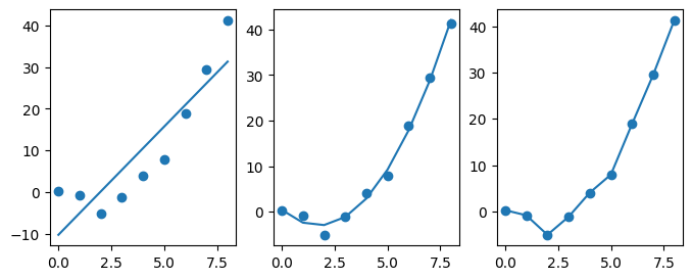

欠拟合是指模型在训练数据上的表现不佳，无法充分拟合训练数据，导致在新的数据集上表现也不佳，就像第一张图。这通常是因为模型过于简单，无法捕捉到数据的复杂模式和规律。过拟合是指模型在训练数据上的表现非常好，但在新的数据集上表现不佳，就像第三张图。这是因为模型过于复杂，对训练数据进行了过度的拟合，导致模型泛化能力下降。比如，用一条非常复杂的曲线去拟合一组简单的直线，可能会出现过拟合的情况。在机器学习中，我们通常希望找到一个平衡点，使模型既能充分拟合训练数据，又能具有良好的泛化能力。这需要我们不断调整模型复杂度、添加正则化项、使用更复杂的模型等措施，以减小偏差和方差之间的矛盾。

偏差和方差是有冲突的。偏差反映了学习算法的拟合能力，而方差则反映了同样大小的训练集的变动所导致的学习性能的变化。在训练不足的情况下，学习器的拟合能力不够强，训练数据的扰动不足以使学习器产生显著变化，此时偏差占主导。随着训练程度的加深，学习器的拟合能力逐渐增强，训练数据发生的扰动被学习器学到，方差逐渐占主导。在训练程度充足后，学习器拟合能力已非常强，训练数据的轻微扰动都会导致学习器发生显著变化，若继续学习，则将发生过拟合。如下图所示：


在评估机器学习算法的有效性时，我们通常会采用以下几种方法来确保模型的性能达到预期：

1、数据集划分：为了测试模型在未知数据上的表现，我们可以将数据集分为两部分。通常情况下，我们会将较大的一部分（如70%）用于训练模型，而另一部分（如30%）用于测试模型。这种方法有助于我们了解模型在处理新数据时的准确性和泛化能力。

2、交叉验证：想象你有一批水果，你想知道每种水果的味道。你可以先尝一颗苹果，再尝一颗香蕉，然后一颗橙子，这样交替尝每种水果。交叉验证就像这样，是一种更全面评估模型性能的方法，你不是一次尝完所有水果，而是每次只尝一种，每次仅使用其中一部分作为训练数据，其他部分作为测试数据，这样你就能更全面地了解每种水果的味道，以确保我们对模型的性能有更全面的了解。

选择和使用评估指标是机器学习项目中的关键步骤，因为它们可以帮助你了解模型的性能并指导模型的选择和调整。上面我们已经对确保模型的性能达到预期的两种方法，有了一定的了解，以下是一些建议，教你如何选择和使用这些评估指标：

首先，你需要了解问题类型，确定你的机器学习问题是分类问题还是回归问题。分类问题涉及到将数据分为多个类别，而回归问题则涉及到预测连续值。不同类型的问题需要使用不同的评估指标。

对于分类问题，可以选择准确率、精确率、召回率和F1得分等指标。根据问题的具体需求，你可能需要关注某个指标更多。例如，如果问题对漏检非常敏感，那么召回率和F1得分可能比准确率更重要：

1、准确率：准确率是正确分类的样本数占总样本数的比例。例如，如果你有100个水果，你正确判断了90个，那么你的准确率是90%。

2、精确率：精确率是正确分类的正类样本数占所有被判定为正类的样本数的比例。例如，如果你有10个香蕉，你正确判断了8个，那么你的精确率是80%。

3、召回率：召回率是正确分类的正类样本数占所有实际正类样本数的比例。例如，如果你有10个香蕉，其中有3个是坏的，你正确判断了2个，那么你的召回率是66.6%。

4、F1得分：F1得分是精确率和召回率的调和平均值，它综合反映了模型在精确率和召回率方面的表现。F1得分越高，模型的性能越好。

对于二分类问题，ROC曲线和AUC值是常用的评估工具，它们可以帮助你了解模型在不同阈值下的性能表现：

1、ROC曲线：ROC曲线是一张反映模型在不同阈值下的性能的图。横轴表示假阳性率（即误判为正类的负类样本比例），纵轴表示真阳性率（即正确判为正类的正类样本比例）。ROC曲线越靠近左上角，表示模型的性能越好。

2、AUC****值：AUC****值是ROC****曲线下的面积，它反映了模型在整个阈值范围内的平均性能。AUC****值越高，表示模型的效果越好。**

**对于回归问题，我们可以使用均方误差（MSE****）、平均绝对误差（MAE****）和R****方值等指标来衡量模型的性能。MSE****和MAE****衡量预测值与真实值之间的差异，而R****方值衡量模型解释的变异与总变异的比例：**

**1****、均方误差（MSE****）：MSE****是预测值与真实值之差的平方的平均值。MSE****越低，表示模型的预测误差越小。**

**2****、平均绝对误差（MAE****）：MAE****是预测值与真实值之差的绝对值的平均值。MAE****越低，表示模型的预测误差越小。**

**3****、R****方值：R****方值是模型解释的变异与总变异的比率。R****方值越高，表示模型的解释能力越强。**

**4****、偏差-****方差分析：我们还可以通过偏差-****方差分析来评估模型的准确性和泛化能力。这就像你在画一幅画，你画得越像真的，这幅画就越准确，但如果你画得太像，就可能失去了原本画的感觉。模型也是这样，如果模型过于强调某个特定数据点，可能会导致对其他数据点的理解不足。因此，我们需要在偏差和方差之间找到一个平衡点，以确保模型既能准确反映数据特征，又具有良好的泛化能力。**

**5****、学习曲线：学习曲线是另一种评估模型性能的方法。通过观察随着训练数据量的增加，模型表现的变化，我们可以判断模型是否具有良好的泛化能力。如果模型性能随着样本数量的增加而提高，说明模型具有良好的泛化能力；如果性能没有提升甚至下降，则可能存在过拟合或欠拟合问题。在这种情况下，我们需要调整模型的复杂度，以达到更好的性能。**

### 9.4.3  机器学习算法的区分
机器学习算法可以分为如图所示的几个类别：

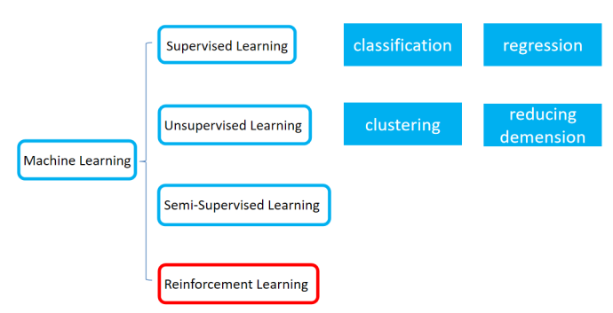

机器学习的任务大体上按照有无标签区分。有标签指导训练过程的任务被称作有监督学习，包含目标为离散标签的分类问题和目标为连续标签的回归问题。无标签指导的任务被称作无监督学习，主要包括聚类问题和降维问题等。此外，还有半监督和强化学习等问题，这些问题我们不作过多讨论。

- 分类问题：比如机器学习中著名的鸢尾花数据集（鸢尾花也就是水仙花），数据集收集了150朵花的萼片长度、萼片宽度、花瓣长度和花瓣宽度等四个形状指标，最后有一列标注数据表明每一条数据数据是哪种鸢尾花（数据集的最后一列是字符串，有setosa，versicolor和virginica三种类型）。数据的最后一列显然是离散变量，而前面四列自变量都是连续变量。这种数据可以用来预测一朵新的鸢尾花是三种鸢尾花中的哪一种，但是分类模型需要基于后续的标签来指导，这叫分类问题。也可以把它抽象成：已知自变量的数值，求因变量数据属于ABC三类中哪一类的选择题。分类问题本身就像做选择题一样，有标准答案。
- 回归问题：也就是在已知自变量的情况下若因变量是连续数据如何去进行建模与预测。例如，著名的波士顿房价数据集，在这个数据集中存在不同的自变量，但因变量房价却是连续的数值。对房价做预测本质上也是一种回归。也可以把它抽象成：已知自变量的数值，求因变量的计算结果，使其与实际结果偏差不大。回归问题本身就像做计算题一样，也有标准答案。
- 聚类问题：另一类比较有意思的就是聚类问题，比如在一家服装专卖店内老板会收集每个VIP用户的信息，例如年龄、性别、消费次数、卡内充值、消费偏好等，但这些都是自变量没有因变量。现在老板需要根据这一系列自变量对用户进行画像，将其分为若干个群，至于分多少群、每个群体有什么样的特征是由数据自变量所决定的。只有自变量没有因变量将数据分群的过程就是聚类，它也可以被抽象为根据自变量的数值做一个论述题，是没有标准答案的。
- 降维问题：主要探究如何用更少的变量表示原始数据，并且尽可能保留更多的信息。常见的降维方法包括主成分分析、因子分析、独立成分分析、t-SNE等，在第7章中我们已经介绍了两种最常用的降维方法，这一章就不单独讨论了。
## 9.5  使用scikit-learn完成机器学习任务
本节在介绍具体的机器学习算法之前就先告诉大家如何去进行实践。因为机器学习算法是比较复杂的，把焦点聚焦于具体的算法原理未必对我们解决实际问题有利，完全可以把机器学习算法视作工具去使用。这也是我们想告诉大家的一点——培养工具思维。使用枪支的人未必会组装枪械，使用手机的人未必进过电子厂，同样的，使用机器学习库scikit-learn的同学也未必对机器学习的底层逻辑理解透彻。但是没关系，只要能够对实际问题做出解答，一切困难都是纸老虎。
### 9.5.1  scikit-learn对数据集的处理
Scikit-learn处理数据集包括对特征的编码、数据集的切分与打乱等操作，并且自带了一部分数据集。对特征的编码与处理是做好后续操作的关键。

首先是特征编码的部分。机器学习算法无法直接处理字符串数据，所以，需要给离散属性进行特征编码保证它们是独立的。常用函数如下

- OneHotEncoder: 输入参数包括data（数据），categories（指定哪些是有效类别）。输出独热编码后的数据，返回值类型取决于输入数据和参数的设置。如果sparse为True，则返回稀疏矩阵；如果为False或未设置，则返回密集矩阵。它的作用是对目标变量进行独热编码，将每个类别转换为一个二进制列向量。
- LabelEncoder: 输入参数包括data（标签数组或列表）。输出参数为转换后的整数标签数组。它的作用是将标签转换为整数，标签会按照出现顺序进行排序并分配整数。未出现的标签将被编码为-1。
- LabelBinarizer: 输入参数包括data（标签数组或列表）。输出参数为二进制形式的标签矩阵，每一行代表一个样本，每一列代表一个标签。如果标签出现在样本中，则对应位置为1；否则为0。它的作用是将标签转换为二进制形式，适合于多标签分类问题。
- MinMaxScaler: 输入参数包括data（特征数组或列表）和可选参数feature_range（一个元组，指定缩放后的范围，例如(0, 1)）。输出参数为缩放后的特征数组，每个特征的值都将在指定的范围内。它的作用是对特征进行min-max规约化，将每个特征的值缩放到指定的范围。
- StandardScaler: 输入参数包括data（特征数组或列表），以及可选参数with_mean（布尔值，默认为True）和with_std（布尔值，默认为True）。输出参数为标准化后的特征数组，每个特征都减去其均值并除以其标准差。它的作用是对特征进行Z-score规约化。
- CountVectorizer: 输入参数包括data（文本数据）和可选参数参数如stop_words（停用词列表），max_df（最大文档频率），min_df（最小文档频率）等。输出参数为词频矩阵，其中每一行代表一个样本，每一列代表一个词，矩阵中的元素表示该词在对应样本中出现的次数。它的作用是将文本数据转换为词频矩阵，方便后续的机器学习算法使用。
- TfidfVectorizer: 输入参数包括data（文本数据）和可选参数参数如stop_words（停用词列表），max_df（最大文档频率），min_df（最小文档频率）等。输出参数为TF-IDF矩阵，其中每一行代表一个样本，每一列代表一个词，矩阵中的元素表示该词在对应样本中的TF-IDF值。它的作用是将文本数据转换为TF-IDF矩阵，方便后续的机器学习算法使用。与CountVectorizer不同的是，它同时考虑了词频和逆文档频率，能够更好地反映词语在文本中的重要性。

特征工程是指通过一系列算法和技巧，将原始数据转换为能够被机器学习模型理解和使用的特征的过程。特征工程是机器学习中至关重要的步骤，因为机器学习模型的效果在很大程度上取决于输入特征的质量和数量。通过特征工程，可以提取出更具有代表性和区分度的特征，从而提高模型的准确率和泛化能力。特征工程可以帮助解决数据维度过高、特征相关性、缺失值等问题，同时也可以根据业务背景和经验知识，加入一些手工特征或特征组合，以提升模型效果。对于特征的构造，需要利用一些背景知识和数学方法。但对于特征的选择，则有一些统计方法可以参考。

- 基于特征自身的方差。我们知道，在构建回归方程的时候如果有一列数据都是同一个值，它并不会对结果造成什么太大的影响，而是充当方程的常数项。这是一个特征的极限情况。事实上，如果一个特征的波动情况不大，方差过小的情况下它的影响是非常小的。
- 基于特征与标签的统计结果。通过T检验、卡方检验、方差检验和相关系数等统计量可以分析某个特征的取值不同是否会造成标签出现明显差异，或者说，标签不同的多组样本它们在某个属性上是否呈现出显著的水平差异。
- 基于机器学习模型的分析。一些树模型例如决策树、随机森林、XGBoost等方法可以给不同的特征以权重分数，按照权重分数从高到低排序即可得到特征的重要性顺序。这样就可以选出最重要的特征。

Scikit-learn中提供了一些特征选择与交叉验证的函数：

- RFECV: 输入参数包括estimator（估计器对象，已经训练的模型），data（数据集），param_grid（参数网格），cv（交叉验证的折数）。输出参数为最佳特征子集。它的作用是通过递归特征消除来选择最佳的特征子集，通过在交叉验证过程中逐步删除最不重要的特征来找到最优特征集。
- SelectKBest: 输入参数包括data（数据集），key（特征选择方法，如卡方检验或互信息法），k（要选择的特征数量）。输出参数为选择后的特征矩阵。它的作用是使用卡方检验或互信息法来选择最佳特征，通过计算特征与目标变量之间的相关性来选择最有用的特征。
- SelectPercentile: 输入参数包括data（数据集），percentile（要选择的特征的百分比）。输出参数为选择后的特征矩阵。它的作用是选择一定百分比的预测值最高的特征，通过保留最相关的特征来减少噪声和冗余特征。
- VarianceThreshold: 输入参数包括data（数据集），threshold（阈值，特征的方差低于该值将被视为冗余）。输出参数为选择后的特征矩阵。它的作用是选择高于给定阈值的特征，以减少噪声和冗余特征。通过只保留那些方差较大的特征，可以去除不相关或重复的特征。
- SelectFromModel: 输入参数包括estimator（估计器对象，已经训练的模型），threshold（阈值，低于该值的特征将被视为不重要）。输出参数为选择后的特征矩阵。它的作用是从已训练的模型中选择特征，基于模型的重要性分数或系数来决定哪些特征应该保留。
- KFold: 输入参数包括data（数据集），k（交叉验证的折数）。输出参数为训练和验证的迭代器，每次迭代返回一个训练集和一个验证集。它的作用是将数据集分成k个折，用于k折交叉验证。通过将数据分成k个部分，并在每次迭代中使用k-1个部分进行训练，剩下的一个部分进行验证，可以评估模型的泛化能力。
- LeaveOneOut: 输入参数包括data（数据集）。输出参数为训练和验证的迭代器，每次迭代返回一个训练集和一个验证集。它的作用是将数据集分成n个折，其中n是样本数量，用于留一交叉验证。通过每次迭代中使用n-1个样本进行训练，剩下的一个样本进行验证，可以评估模型的泛化能力。这种方法能够提供较为精确的模型评估结果，但计算成本较高。
- StratifiedKFold: 输入参数包括data（数据集），k（交叉验证的折数），random_state（随机种子）。输出参数为训练和验证的迭代器，每次迭代返回一个训练集和一个验证集。它的作用是将数据集分成k个折，并保持每个折中类别的比例与原始数据集中一致，用于分层交叉验证。通过分层抽样，可以确保每个折中各类别的样本比例与原始数据集一致，以评估模型在各个类别上的性能表现。

`   `Scikit-learn将数据集切分为训练集和数据集的过程是通过model_selection.train_test_split函数实现的。它的使用规则如下：

Xtrain, Xtest, Ytrain,Ytest = train_test_split(X,y,test_size=0.3)

`    `输入参数为自变量数据X和因变量数据y，通过指定test_size确定测试集的比例。返回训练集自变量、测试集自变量、训练集标签和测试集标签。另外，还可以通过random_state指定是否需要对数据集进行打乱处理，这对提升模型泛化性非常重要。
### 9.5.2  scikit-learn中的模型训练
这一节我就会把scikit-learn里面常用模型的接口全部调出来，如果只是学习如何使用想要快速跳过的话，可以跳过9.6-9.12节。这些接口的使用都非常简单，使用方法也都是一致的。大家可以通过下面的案例快速上手。

鸢尾花数据集是机器学习中非常常用的一个数据集，在sklearn.dataset中自带，通过load_iris()函数导入。鸢尾花数据集是一个用于分类问题的经典数据集，包含三种不同种类的鸢尾花：山鸢尾、变色鸢尾和维吉尼亚鸢尾。数据集中的每个样本都有四个特征：花萼长度、花萼宽度、花瓣长度和花瓣宽度。这四个特征是用来预测鸢尾花卉属于哪一品种的重要依据。每一类各50条样本。我们可以看到它的统计分布图：

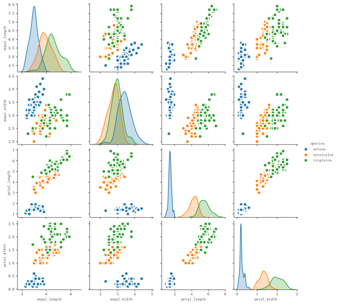

**我们可以从上图得出：**

**Setosa:萼片长度>萼片宽度>花瓣长度>花瓣宽度**

**Versicolour:萼片长度>花瓣长度>萼片宽度>花瓣宽度**

**Virginica:萼片长度>花瓣长度>萼片宽度>花瓣宽度**

**当我们在对数据集进行统计描述时，我们通常会关注数据的中心趋势、分散程度、分布形状和相关性等特征。我们可以对Iris数据集进行如下统计描述**

**中心趋势：**

**中心趋势描述了数据集中的观测值倾向于聚集的数值。对于Iris数据集中的量化特征（如萼片长度、萼片宽度、花瓣长度和花瓣宽度）都有一定的中心趋势，我们可以通过计算平均值来了解每个特征的中心位置。而对于分类特征（如花种），我们可以通过统计每个类别的出现频率来描述其中心趋势。在Iris数据集中，Setosa、Versicolour和Virginica三种花种各有50个样本，各占总样本数的1/3。**

**分散程度：**

**Iris数据集中的每个特征都有一定的分散程度，可以通过计算其标准差来描述。分散程度反映了数据点之间的差异程度，标准差越大，数据点之间的差异就越大。**

**例如，Setosa花种的花瓣长度的标准差为0.82厘米，Versicolour花种的花瓣长度的标准差为1.76厘米，Virginica花种的花瓣长度的标准差为2.06厘米。Setosa花种的花瓣长度标准差较小，表明大多数样本的花瓣长度接近平均值。相反，如果一个特征的标准差较大，如Virginica花种的花瓣长度，这可能表明样本之间存在较大的变异。**

**分布形状：**

**分布形状描述了数据的分布模式，是对称、偏斜还是具有峰度。Iris数据集中的每个特征都有一定的分布形状，我们可以通过绘制直方图或密度图来观察数据的分布形状。分布形状反映了数据点的分布特征，对称的分布形状（如正态分布）通常表示数据的中心趋势与分散程度相符，非对称的分布形状则可能表示数据集中于某一范围或两侧。例如，如果Setosa花种的花瓣长度呈现右偏态分布，这可能意味着大多数样本的花瓣长度较短，只有少数样本的花瓣长度较长。这种分布形状可以帮助我们了解数据的集中趋势和异常值的可能性。**

**相关性：**

**相关性描述了数据集中不同特征之间的关系，反映了特征之间的相关程度，相关性越高，特征之间的变化趋势越相似。通过计算相关系数，我们可以量化两个特征之间的线性关系强度。例如，如果花瓣长度和花瓣宽度之间的相关系数接近1，这表明这两个特征之间存在强烈的正相关关系，即花瓣长度较长的花往往花瓣宽度也较大。**

数据集包括4个属性，分别为花萼的长、花萼的宽、花瓣的长和花瓣的宽。对花瓣我们可能比较熟悉，花萼是什么呢？花萼是花冠外面的绿色被叶，在花尚未开放时，保护着花蕾。四个属性的单位都是cm，属于数值变量，四个属性均不存在缺失值的情况，字段如下：

sepal length（萼片长度）

sepal width（萼片宽度）

petal length（花瓣长度）

petal width （花瓣宽度）

Species（品种类别）：分别是：Setosa、Versicolour、Virginica

单位都是厘米。

进行机器学习第一步是导入数据并处理数据。通过下面的代码导入数据：
```python
import numpy as np

import pandas as pd

# 鸢尾花数据集，红酒数据集，乳腺癌数据集，糖尿病数据集

from sklearn.datasets import load_iris,load_wine,load_breast_cancer,load_diabetes

# 回归重要指标

from sklearn.metrics import r2_score, mean_absolute_error, mean_squared_error

# 分类重要指标

from sklearn.metrics import accuracy_score, confusion_matrix, f1_score, precision_recall_curve, roc_auc_score

from sklearn.model_selection import train_test_split #训练集训练集分类器

import graphviz #画文字版决策树的模块

import pydotplus #画图片版决策树的模块

from IPython.display import ./src/image #画图片版决策树的模块

iris = load_iris()

print(iris.data)  # 数据

print(iris.target_names)  # 标签名

print(iris.target)  # 标签值

print(iris.feature_names)  # 特证名(列名)

iris_dataframe = pd.concat([pd.DataFrame(iris.data),pd.DataFrame(iris.target)],axis=1)

print(iris_dataframe)

Xtrain, Xtest, Ytrain,Ytest = train_test_split(iris.data,iris.target,test_size=0.3)
```
随后选择对应接口创建模型，输入数据通过fit方法进行训练，然后进行predict并评估指标即可。代码如下：
```python
from sklearn.linear_model import LogisticRegression,LinearRegression

from sklearn.neighbors import KNeighborsRegressor,KNeighborsClassifier

from sklearn.naive_bayes import GaussianNB

from sklearn.tree import DecisionTreeRegressor,DecisionTreeClassifier

from sklearn.ensemble import RandomForestRegressor,RandomForestClassifier

from sklearn.ensemble import ExtraTreesRegressor,ExtraTreesClassifier

from sklearn.ensemble import AdaBoostRegressor,AdaBoostClassifier

from sklearn.ensemble import GradientBoostingRegressor,GradientBoostingClassifier

clf = RandomForestClassifier()

clf.fit(Xtrain, Ytrain)

Ypredict=clf.predict(Xtest)

print(r2_score(Ypredict,Ytest))
```
其中，决策树、随机森林等具有树形结构的基学习器可以把树形结构打印出来并保存为PDF或png文件，代码如下：
```python
from sklearn import tree

tree_data = tree.export_graphviz(

    clf

    ,feature_names =iris.feature_names

    ,class_names = iris.feature_names#也可以自己起名

    ,filled = True #填充颜色

    ,rounded = True #决策树边框圆形/方形

)

graph1 = graphviz.Source(tree_data.replace('helvetica','Microsoft YaHei UI'), encoding='utf-8')

graph1.render('./iris_tree')
```
Python中想要评估模型效果的话scikit-learn也提供了不同问题的评估指标接口。

Scikit-learn（简称sklearn）是一个非常强大的机器学习库，提供了很多用于分类、回归和聚类的评估指标函数。以下是常用的一些函数：

分类问题常用函数：

- accuracy_score: 输入参数包括y_true（真实标签）和y_pred（预测标签）。输出参数为准确率，即预测正确的样本数占总样本数的比例。它的作用是评估分类器的准确率，通过比较真实标签和预测标签的一致性来计算准确率。
- confusion_matrix: 输入参数包括y_true（真实标签）和y_pred（预测标签）。输出参数为混淆矩阵，展示各类别之间的预测和实际分类情况。它的作用是评估分类器的性能，通过比较真实标签和预测标签的分类情况来生成混淆矩阵，以量化分类器的正确率、精度、召回率和F1分数等指标。
- classification_report: 输入参数包括y_true（真实标签）和y_pred（预测标签）。输出参数为分类报告，包括精确度、召回率和F1分数等分类性能指标。它的作用是提供详细的分类性能评估报告，通过比较真实标签和预测标签的分类情况来计算各类别的精确度、召回率和F1分数，以全面评估分类器的性能。
- roc_auc_score: 输入参数包括y_true（真实标签）和y_pred（预测概率）。输出参数为ROC曲线下的面积，用于评估二元分类器的性能。它的作用是通过计算ROC曲线下的面积来评估分类器的性能，ROC曲线展示了不同分类阈值下真正例率（TPR）和假正例率（FPR）的变化情况，AUC值越大表示分类器性能越好。
- average_precision_score: 输入参数包括y_true（真实标签）和y_score（预测分数）。输出参数为平均精度，用于评估二元分类器的性能。它的作用是计算在不同分类阈值下的平均精度，综合考虑了真正例率（TPR）和假正例率（FPR），以更全面地评估分类器的性能。
- brier_score_loss: 输入参数包括y_true（真实标签）和y_prob（预测概率）。输出参数为Brier分数，用于评估二元或多元分类器的性能。它的作用是计算Brier分数，通过比较真实标签和预测概率的差异来评估分类器的性能。Brier分数越小表示预测概率与真实标签越接近，分类器性能越好。
- f1_score: 输入参数包括y_true（真实标签）和y_pred（预测标签）。输出参数为F1分数，用于评估分类器的性能。它的作用是计算F1分数，综合考虑了精确度和召回率，以更全面地评估分类器的性能。F1分数越高表示分类器性能越好。

回归问题常用函数：

mean_squared_error: 输入参数包括y_true（真实值）和y_pred（预测值）。输出参数为均方误差，即预测值与真实值差的平方的平均值。它的作用是衡量回归模型的预测误差，通过比较预测值和真实值之间的差异来评估模型的性能。

- mean_absolute_error: 输入参数包括y_true（真实值）和y_pred（预测值）。输出参数为平均绝对误差，即预测值与真实值差的绝对值的平均值。它的作用是衡量回归模型的预测误差，通过比较预测值和真实值之间的差异来评估模型的性能。
- median_absolute_error: 输入参数包括y_true（真实值）和y_pred（预测值）。输出参数为中位数绝对误差，即预测值与真实值差的中位数绝对值。它的作用是衡量回归模型的预测误差，通过比较预测值和真实值之间的差异来评估模型的性能。
- r2_score: 输入参数包括y_true（真实值）和y_pred（预测值）。输出参数为R平方值，衡量回归模型的拟合优度。它的作用是通过计算R平方值来评估模型对数据的拟合程度，R平方值越接近于1表示模型拟合越好。
- explained_variance_score: 输入参数包括y_true（真实值）和y_pred（预测值）。输出参数为解释方差，衡量模型对数据的解释程度。它的作用是通过计算解释方差来评估模型对数据的解释能力，解释方差越接近于1表示模型对数据的解释程度越高。

聚类问题常用函数：

- adjusted_mutual_info_score: 输入参数包括y_true（真实标签）和y_pred（预测标签）。输出参数为调整后的互信息分数，用于评估聚类结果的纯度。它的作用是通过计算调整后的互信息分数来评估聚类结果的纯度，该分数综合考虑了真实标签和预测标签的相似性和不相似性，以更准确地评估聚类效果。
- adjusted_rand_score: 输入参数包括y_true（真实标签）和y_pred（预测标签）。输出参数为调整后的Rand指数，衡量聚类结果的相似度。它的作用是通过计算调整后的Rand指数来评估聚类结果的相似度，该指数考虑了聚类结果的排序和类别分配情况，以更准确地评估聚类效果。
- homogeneity_score: 输入参数包括y_true（真实标签）和y_pred（预测标签）。输出参数为同质性分数，衡量聚类结果中每个簇的纯度。它的作用是通过计算同质性分数来评估聚类结果中每个簇的纯度，该分数越高表示每个簇的样本越集中于某个类别，聚类效果越好。
- completeness_score: 输入参数包括y_true（真实标签）和y_pred（预测标签）。输出参数为完整性分数，衡量聚类结果中每个样本被正确分配到其真实类别的情况。它的作用是通过计算完整性分数来评估聚类结果中每个样本被正确分配到其真实类别的情况，该分数越高表示聚类效果越好。
- v-measure: 输入参数包括y_true（真实标签）和y_pred（预测标签）。输出参数为V-measure分数，是调和平均数，结合了同质性和完整性两个方面。它的作用是通过计算V-measure分数来综合评估聚类结果的同质性和完整性，该分数越高表示聚类效果越好。
- silhouette_score: 输入参数包括y_true（真实标签）和y_pred（预测标签），samplewise（是否按样本计算）。输出参数为轮廓系数，衡量聚类效果的指标，值越接近1表示聚类效果越好。它的作用是通过计算轮廓系数来评估聚类效果的指标，该系数越高表示聚类效果越好。
- calinski-harabasz: 输入参数包括data（数据集），labels（标签）。输出参数为卡林斯基-哈拉巴兹指数，衡量聚类效果的一个指标，值越大表示聚类效果越好。它的作用是通过计算卡林斯基-哈拉巴兹指数来评估聚类效果，该指数越高表示聚类效果越好。
- davies-bouldin: 输入参数包括data（数据集），labels（标签）。输出参数为Davies-Bouldin指数，衡量聚类效果的一个指标，值越小表示聚类效果越好。它的作用是通过计算Davies-Bouldin指数来评估聚类效果，该指数越小表示聚类效果越好。
- contingency_matrix: 输入参数包括data1（第一个数据集），data2（第二个数据集），。输出参数为一个稀疏矩阵，表示每个样本的标签在真实标签和预测标签中的分布情况。它的作用是计算条件矩阽矩阵，以展示两个数据集之间的标签分布情况。

以上这些函数都是sklearn库中常用的评估指标函数，可以用来评估分类、回归和聚类等机器学习任务的性能。在使用这些函数时，需要提供真实标签和预测标签作为输入参数，并返回相应的评估结果。需要注意的是，不同的任务和数据集可能需要使用不同的评估指标来衡量模型的性能，因此在使用时需要根据具体情况选择合适的评估指标。
## 9.6  基于距离的KNN模型
KNN又被称为近邻判别算法，这个算法应该是最简单的机器学习算法之一。这一节我们不仅会带领大家看到KNN的基本原理，也会带大家上手实现自己的KNN模型。
### 9.6.1  KNN模型的基本原理
KNN是最基本的监督学习算法之一，你只要找出你的“邻居”是什么标签，然后看哪个标签的“邻居”最多，就给这个样本贴上哪个标签。它和“懒惰学习”有点像，因为它在学习的时候并不会做很多工作，只是把数据存起来，等到要分类的时候才来用。它主要是看样本和谁最像，就像人一样，总爱找和自己像的人玩。怎么才算最像呢？就是看各个样本之间的距离，距离越近越像。就像我们平时说的“物以类聚，人以群分”，这个分类方法也是这样，它通过距离来判断样本的相似度。所以，只要找到与测试样本最近的k个训练样本，看这k个样本里哪个类别最多，就认为这个类别是测试样本的类别。

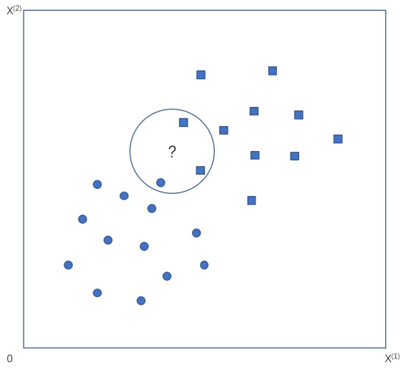

> 注意：还有一个聚类算法就是KMeans也是用的距离，它们形式上很类似，但本质上是两个完全不同的算法！

KNN算法的执行流程可以概括为以下步骤：

- 计算距离：对于测试样本，计算其与训练集中每个样本的距离，距离的度量方式可以是欧式距离、曼哈顿距离等。
- 选择k个最近样本：选择与测试样本距离最近的k个样本。
- 投票并返回结果：根据k个最近样本的类别标签进行投票，多数决定原则，即哪个类别标签的多数就选择哪个标签作为测试样本的分类结果。

从上面的过程可以看出，KNN算法的好坏决定性因素有三个：距离的计算方式，K值的选取和数据集。在计算距离时可以采用多种不同的距离衡量方式，例如欧几里得距离、曼哈顿距离、车比雪夫距离等或者其他，用的最多的计算方法是欧几里得距离。既然数据集我们没有办法影响，那k值如何选择好呢？

如果K值太小，那测试样本就只会听“隔壁邻居”的意见，要是这个邻居是个“噪音制造者”，那测试样本的分类就会出错。相反，如果K值太大，那远处的邻居也会插嘴，虽然这样可以让分类更“稳重”，但也可能分得不准确，也就是“没分清楚”。所以，K值得试了才知道，不是我们一开始就能决定的。通常，我们会选一个5-15之间的奇数。但具体选哪个，除了实验和交叉验证，还得看看你的数据量有多大，以及训练集的标签有什么特点。为了加快最近邻居的搜索可以利用KD树进行数据结构的优化。KD树是对数据点在k维空间中划分的一种数据结构。在KD 的构造中，每个节点都是k维数值点的二叉树。既然是二叉树，就可以采用二叉树的增删改查操作，这样就大大提升了搜索效率。
### 9.6.2  KNN的代码实现
KNN的代码实现其实相对来说比较简单。使用sklearn的方法已经在前面看过了，这里我们从底层开始动手实现一个KNN。这里仍然选用最基础的鸢尾花数据集，首先仍然是导入数据：
```python
from sklearn.datasets import load_iris

from sklearn.metrics import accuracy_score

from sklearn.model_selection import train_test_split

x,y=load_iris(return_X_y=True)

x_train,x_test,y_train,y_test=train_test_split(x,y,train_size=0.7,random_state=42)
```
我们很容易得到距离的计算方法：
```python
def distance(a,b):

    return np.sqrt(np.sum(np.square(a-b)))
```
针对单一样本，如何得到它最近的K个节点并投票呢？我们说，首先要计算它到其他点的距离，然后找最近的K个抽出来，计数。因此，如果训练数据集已知，可以写函数：
```python
def get_label(x):

    dist=list(map(lambda a:distance(a,x),x_train))

    ind=np.argsort(dist)

    ind=ind[:k]

    labels=np.zeros(3)

    for i in ind:

        label=y_train[ind].astype(int)

            labels[label]+=1

    return np.argmax(labels)
```
因此，对这个函数进行封装就可以包装为：
```python
def KNN(x_train,y_train,x_test,k):

    def get_label(x):

        dist=list(map(lambda a:distance(a,x),x_train))

        ind=np.argsort(dist)

        ind=ind[:k]

        labels=np.zeros(3)

        for i in ind:

            label=y_train[ind].astype(int)

            labels[label]+=1

        return np.argmax(labels)

    y_predict=np.zeros(len(x_test))

    for i in range(len(x_test)):

        y_predict[i]=get_label(x_test[i])

    return y_predict
```
最后，使用不同的K值进行测试：
```python
for k in range(1,10):

    y_predict=KNN(x_train,y_train,x_test,k)

    print(accuracy_score(y_test,y_predict))
```
所得到的结果都是比较高的，正确率都在0.9以上。
## 9.7  基于优化的LDA与SVM模型
费舍尔判别和支持向量机两种模型都是基于优化推导的，因此可以借助这两个模型体会优化在机器学习中的应用。
### 9.7.1  线性判别分析（摘抄自我的MATLAB建模教材，要改）
线性判别分析（LDA），由于是费舍尔所发明，故又名费舍尔判别。LDA在模式识别领域（比如人脸识别，舰艇识别等图形图像识别领域）中有非常广泛的应用。LDA是一种监督学习的降维技术，也就是说它可以同时实现降维和分类两个操作。LDA的思想可以用一句话概括，就是“投影后类内方差最小，类间方差最大”，如图所示。 我们要将数据在低维度上进行投影，投影后希望每一种类别数据的投影点尽可能的接近，而不同类别的数据的类别中心之间的距离尽可能的大。图8.11是一个LDA的投影效果：

**线性判别分析（LDA）是一种在模式识别领域广泛应用的技术，如在人脸识别、舰艇识别等图像识别任务中。LDA由著名统计学家费舍尔提出，因此也被称为费舍尔判别分析。这种技术不仅能够降低数据的维度，还能在此过程中进行分类，使其成为监督学习中的一种重要降维技术。**

**LDA的核心思想可以用一句话概括，就是“投影后类内方差最小，类间方差最大”即寻找一个投影方向，使得在这个方向上，不同类别的数据点尽可能地分离，即类间方差最大化，而同一类别的数据点尽可能地靠近，即类内方差最小。这种投影可以有效地提取出对于分类任务最重要的特征，同时去除那些对于区分不同类别帮助不大的冗余信息。**

**LDA的优点在于它不仅能够降低数据的复杂性，提高计算效率，还能够提高分类的准确性。通过减少特征的数量，LDA有助于减少过拟合的风险，使得模型更加简洁且易于解释。然而，LDA也有一些局限性，当它假设数据在每个类别中都是高斯分布的，且不同类别的协方差矩阵相同，这在实际应用中不一定都能成立。**

**在实际应用中，LDA通过计算类内散度矩阵和类间散度矩阵来实现这一目标。类内散度矩阵反映了同一类别内数据点的分散程度，而类间散度矩阵则反映了不同类别间数据点的分离程度。LDA的目标是找到一个投影方向，使得在这个方向上，类内散度最小化，类间散度最大化。**

**想象一下，我们有一个由红蓝两种颜色的数据点组成的二维平面图，每个数据点代表一个观测样本，颜色表示它的类别标签。我们的任务是找到一个方法，将这些二维数据点简化表示，同时保持类别的区分度。这就是线性判别分析（LDA）的用武之地。**

**LDA是一种旨在降维和分类的技术。它通过找到一个新的投影方向，将数据点映射到一条直线上（在二维数据的情况下）。这个新的投影不仅减少了数据的复杂性，而且还尽可能保持了原始数据中类别的区分度。在投影后，我们希望看到红色数据点聚集在一起，蓝色数据点也聚集在一起，而两个集群之间有明显的分离。**

**为了实现这一目标，LDA首先计算类内散度矩阵和类间散度矩阵。类内散度矩阵衡量同类别的数据点之间的差异，而类间散度矩阵则衡量不同类别数据点的差异。LDA通过优化这两个矩阵的比值来找到最佳的投影方向，这个比值越大，说明投影后的数据点分类效果越好。**

**图8.11展示了LDA的投影效果：**

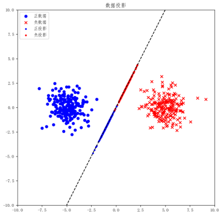

图8.11 LDA的投影效果

**假设我们已经找到了最佳的投影方向。当我们将数据点投影到这条直线上时，我们会发现，原本在二维空间中可能混杂在一起的红蓝数据点，现在在一维直线上清晰地分开了。红色数据点形成了一个集群，蓝色数据点形成了另一个集群，两个集群之间有较大的距离，这使得分类变得更加容易。**

**通过这种方式，LDA不仅帮助我们简化了数据表示，还提高了分类的准确性。这种方法特别适合于那些特征维度较高、数据复杂度较大的情况。**

**在实际操作中，我们首先计算类内散度矩阵和类间散度矩阵。类内散度矩阵衡量了同一类别内数据点的分布情况，而类间散度矩阵则反映了不同类别数据点的中心点之间的距离。接下来，我们要找到一个投影方向，使得在这个方向上，类间散度最大而类内散度最小。这个优化问题可以通过计算费舍尔判别系数来解决。**

**值得注意的是，（1）虽然费舍尔判别分析和线性判别分析在早期有所区别，但现在这两个术语通常被交替使用，尤其是在描述LDA时。（2）尽管我们在这里讨论的是二维数据集的投影问题，但在现实世界的机器学习任务中，数据集往往包含多个类别，且特征维度远超过二维。在这些情况下，LDA同样适用，不过我们不是将数据投影到直线上，而是投影到一个低维的超平面上。这样，我们可以通过较少的维度来捕捉数据的主要特征，同时减少计算复杂度和避免过拟合。**

假设有两类数据，分别为红色和蓝色，如图8.11所示，这些数据特征是二维的，希望将这些数据投影到一维的一条直线，让每一种类别数据的投影点尽可能的接近，而红色和蓝色数据中心之间的距离尽可能的大。图的红色数据和蓝色数据各个较为集中，且类别之间的距离明显。以上就是LDA的主要思想了，当然在实际应用中，数据是多个类别的，我们的原始数据一般也是超过二维的，投影后的也一般不是直线，而是一个低维的超平面。

注意：其实在早期费舍尔判别和线性判别还是有一点区别的，但现在可能就没有那么多讲究了。

怎样使得红蓝两个颜色的数据投影后有最大的区分度呢？这个区分度又该怎么定义呢？这也就是线性判别分析的流程：

- 对于给定有标签数据集(x<sub>i</sub>,y<sub>i</sub>)，计算出均值和协方差和。
- 投影到直线y=w<sup>T</sup>X以后均值和协方差变成了${w^T}{\mu _i}$和${w^T}{\Sigma _i}w$。
- 类内差别尽量小，类间差别尽可能大，列出目标函数： 

$$
J = \frac{{{w^T}({\mu _0} - {\mu _1}){{({\mu _0} - {\mu _1})}^T}w}}{{{w^T}({\Sigma _0} + {\Sigma _1})w}}
$$

- 记${S_w} = {\Sigma _0} + {\Sigma _1}$，${S_b} = {({\mu _0} - {\mu _1})^T}({\mu _0} - {\mu _1})$，那目标函数就变成了一个广义瑞利商$J = \frac{{{w^T}{S_b}w}}{{{w^T}{S_w}w}}$，于是问题等价成一个凸优化问题，再将分母规约得到：

$$
\begin{array}{c}
\min  - {w^T}{S_b}w\\
s.t.{w^T}{S_w}w = 1
\end{array}
$$

利用拉格朗日法求解可以得到。实际中我们会对S<sub>w</sub>进行SVD分解。

据此，可以编写LDA的Python代码：
```python
def LDA(x, y):      # x: all the input vector   y: labels

    x_1 = np.array([x[i] for i in range(len(x)) if y[i] == 1])

    x_2 = np.array([x[i] for i in range(len(x)) if y[i] == -1])

    mju1 = np.mean(x_1, axis=0)     # mean vector

    mju2 = np.mean(x_2, axis=0)

    sw1 = np.dot((x_1 - mju1).T, (x_1 - mju1))    # Within-class scatter matrix

    sw2 = np.dot((x_2 - mju2).T, (x_2 - mju2))

    sw = sw1 + sw2

    return np.dot(np.linalg.inv(sw), (mju1 - mju2))
```
对于上例，可以用如下代码找到最优分割超平面：
```python
w = LDA(x, y)

x1 = 1

y1 = -1 / w[1] * (w[0] * x1)

x2 = -1

y2 = -1 / w[1] * (w[0] * x2)

plt.plot([x1, x2], [y1, y2], 'k--')

plt.show()
```

### 9.7.2  支持向量机
支持向量机SVM是从线性可分情况下的最优分类面提出的。所谓最优分类，就是要求分类线不但能够将两类无错误的分开，而且两类之间的分类间隔最大。推广到高维空间，最优分类线就成为最优分类面。


考虑这样一个问题：在一个n维欧式空间内有红蓝两组点，怎么找到一个超平面将它们分隔开？为了方便大家理解，考虑最简单的情况，平面直角坐标系内有红蓝两组点，用一条直线将它们分隔开，如图所示：

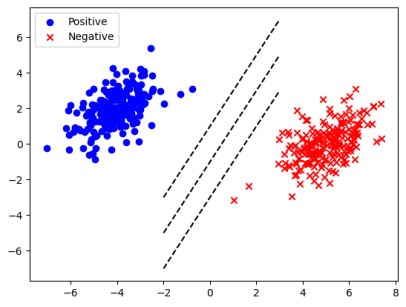

这似乎是很容易的一件事，直线的斜率可以不同，斜率相同的情况下截距也可以不同，有很多种分法都可以把两组样本点分割开来。但是，哪一种分法是最好的呢？这里首先就需要定义怎样才能算最好。不妨称：正样本到直线的距离与负样本到直线距离之和最大就是最好。样本到直线的距离定义为样本中所有点到直线距离的最小值。事实上，如果同学们还记得高中解析几何的知识，就知道点到直线的距离等于过这一点作直线平行线进而求解两平行线之间的距离。

所以，目标函数也就是求这样一条直线：过正样本和负样本中各自离直线最近的两点作平行线，使两平行线之间距离最大。为了表示样本的正负性，不妨记正样本标签为+1，负样本标签为-1，可以得到直线的数学表达形式：

$$
\begin{array}{l}
{H_1}:{w^T}x + b =  + 1\\
{H_2}:{w^T}x + b =  - 1
\end{array}
$$

如果同学们熟悉解析几何当中的内容，就会知道两平行线之间的距离实际上等于$\gamma  = \frac{2}{{||w||}}$。但这个函数非凸，为了转化为凸优化，对其进行一些小变换。进而，有了支持向量机的数学表达形式：

$$
\[\begin{array}{c}
{\min _w}\frac{{||w|{|^2}}}{2}\\
{\rm{s}}.t.{y_i}({w^T}{x_i} + b) \ge 1
\end{array}\]
$$

通过这样的一个凸优化问题求解就可以把支持向量机解出来了。真的是这样吗？来看下面一个例子你能不能通过一条直线把它分割出来：

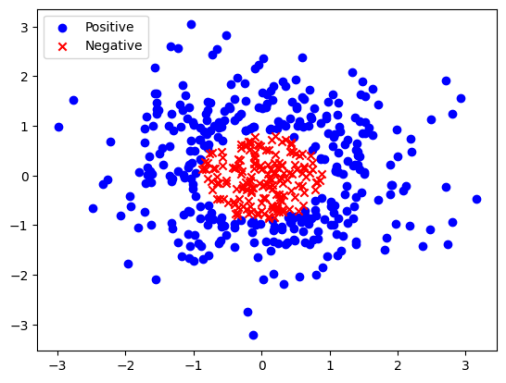

这个时候我们就发现了问题：不是所有的样本都可以用一条直线粗暴地分割开的。即使用直线去分割，一定会有一些样本点会被分错。如何让支持向量机具备容错性呢？这时，就需要借助软间隔的概念。你可以理解为，软间隔是一种正则化手段，它允许支持向量机有一个较小的误差率。加入一些松弛变量模型就变成了：

$$
\begin{array}{c}
\mathop {\min }\limits_w \frac{{||w|{|^2}}}{2} + C\sum\limits_{i = 1}^n {{\xi _i}} \\
s.t.{y_i}({w^T}{x_i} + b) \ge 1 - {\xi _i},
\end{array}
$$

但是，即使允许有一定的分类误差率，用直线分割图中的样本还是太困难了，错误率会非常高。这个时候就有了支持向量机的第二个技巧：核方法。我们这样想，如果能够通过一个多元函数，把二维样本点映射到三维空间当中去，再用一个平面分割它，问题是不是就可以解决了呢？例如，如果使用函数z=x2+y2，图像可以变成：

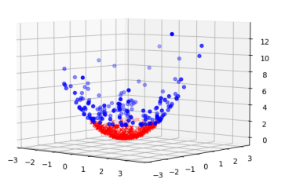

很显然，经过映射以后，样本点用一个平面就可以完全把它们分开。那么这样的一个映射函数本质上是一个升维操作，这个函数也叫核函数。核方法使得数据能够由低维映射向高维，让形如异或问题这样的线性不可分问题得到解决。常用的核函数包括表8.2中列出的几种。

**表8.2 常见核函数及其形式**

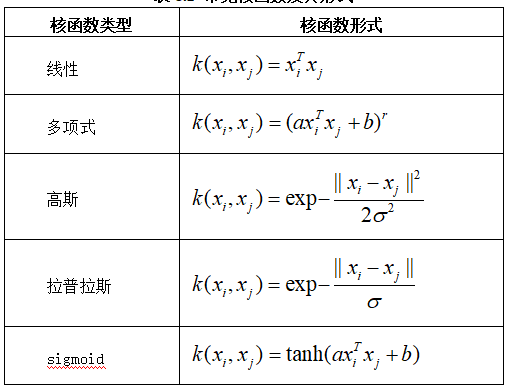

非线性问题往往不好求解，所以希望能用解线性分类问题的方法求解，因此可以采用非线性变换，将非线性问题变换成线性问题。对于这样的问题，可以将训练样本从原始空间映射到一个更高维的空间，使得样本在这个空间中线性可分，如果原始空间维数是有限的，即属性是有限的，那么一定存在一个高维特征空间是样本可分。用核方法映射过后的数值代替X，就可以得到新的超平面形式为$y = {w^T}K(X) + b$。

对于支持向量机的求解，可以使用拉格朗日乘子法。先不考虑核化，引入一系列拉格朗日乘子以后问题可以变形成：

$$
L(w,b,\alpha ) = \frac{1}{2}||w|{|^2} + \sum\limits_{i = 1}^2 {{\alpha _i}} (1 - {y_i}({w^T}{x_i} + b))
$$

对目标函数求偏导就等于：

$$
\left\{ {\begin{array}{*{20}{l}}
{\frac{{\partial L}}{{\partial b}} = \sum\limits_{i = 1}^n {{\alpha _i}} {y_i}}\\
{\frac{{\partial L}}{{\partial w}} = w - \sum\limits_{i = 1}^n {{\alpha _i}} {y_i}{x_i}}
\end{array}} \right.
$$

解方程然后代入，将w和b消掉就只剩下了拉格朗日乘子：

$$
\begin{array}{l}
{\max _\alpha }\sum\limits_{i = 1}^n {{a_i}}  - \frac{1}{2}\sum\limits_{i = 1}^n {\sum\limits_{j = 1}^n {{\alpha _i}} } {\alpha _j}{y_i}{y_j}{x_i}{x_j}\\
s.t.\sum\limits_{i = 1}^n {{\alpha _i}} {y_i} = 0,{\alpha _i} \ge 0,i = 1,2,...,n
\end{array}
$$

那么如果引入核函数，这个问题的KKT条件也就可以写作：

$$
\left\{ {\begin{array}{*{20}{l}}
{{\alpha _i} \ge 0}\\
{{y_i}f({x_i}) - 1 \ge 0}\\
{{\alpha _i}({y_i}f({x_i}) - 1) = 0}
\end{array}} \right.
$$

当训练完成后，大部分样本都不需要保留，最终模型只与支持向量有关。如果是经过核化的，就把目标函数变成：

$$
{\max _\alpha }\sum\limits_{i = 1}^n {{a_i}}  - \frac{1}{2}\sum\limits_{i = 1}^n {\sum\limits_{j = 1}^n {{\alpha _i}} } {\alpha _j}{y_i}{y_j}k({x_i},{x_j})
$$

这个问题变量太多，传统的优化算法很难求解。在运筹学中有一种方法叫序贯优化算法（SMO）。SMO是用来求解拉格朗日乘子的，它的思想概括为不断地变换主元，只留下两个主元给我自由活动的最小空间（因为只留一个的话那一个可以通过代换的方式定下来所以要确定主元就至少要选两个可变其他的为常量）可以简记为${\alpha _i}{y_1} + {\alpha _2}{y_2} = \delta $，反代入：

$$
\[W = {a_1} + {a_2} - \frac{1}{2}{K_{11}}{a_1}^2 - \frac{1}{2}{K_{22}}{a_2}^2 - {y_1}{y_2}{a_1}{a_2}{K_{12}} - {y_1}{a_1}{v_1} - {y_2}{a_2}{v_2} + {C_0}\]
$$

然后这一凸优化问题可以转化求导就可以解出来了。求出来两个以后再换组合，将这些乘子逐一击破。

对于一般的回归问题，给定训练样本，希望学习到一个f(x)使得其与y尽可能的接近，w，b是待确定的参数。在这个模型中，只有当f(x)与y完全相同时，损失才为零，而支持向量回归假设能容忍的f(x)与y之间最多有ε的偏差，当且仅当f(x)与y的差别绝对值大于ε时，才计算损失，此时相当于以f(x)为中心，构建一个宽度为2ε的间隔带，若训练样本落入此间隔带，则认为是被预测正确的。

支持向量回归的模型形式为

$$
\frac{{||w|{|^2}}}{2} + C\sum\limits_{i = 1}^n {{l_}} (f({x_i}) - {y_i})
$$

其中${l_}(x) = \left\{ {\begin{array}{*{20}{l}}
{0(x \le )}\\
{(|x| - )(x > )}
\end{array}} \right.$，具体的求解过程得先引入松弛变量然后再来引入拉格朗日乘子再对偶。具体这里不展开了，直接给出最后的模型形式：

$$
\begin{array}{l}
f(x) = \sum\limits_{i = 1}^n {(\widehat {{\alpha _i}} - {\alpha _i})} x_i^Tx + b\\
b = {y_i} +  - \sum\limits_{i = 1}^n {(\widehat {{\alpha _i}} - {\alpha _i})} x_i^Tx
\end{array}
$$

支持向量机的理论是很复杂的一套优化理论，近年来还有对半监督的SVM、few-shot与SVM结合的研究等，有兴趣的话是可以深入了解的。（这里标蓝的段落摘抄自我的MATLAB版教材，需要改文字表述，另外我感觉讲的有点烂，你们如果也这么觉得可以干脆重写）

> 这里的代码参考了《动手学机器学习》

**在解决支持向量机问题时，拉格朗日乘子法是一种有效的策略。通过引入一系列的拉格朗日乘子，我们可以将原始问题转换为一个对偶问题，其目标函数形式如公式（8.31）所示。对目标函数求偏导的结果，如公式（8.32）所示，可以帮助我们找到最优的解。通过解这些偏导数等于零的方程，我们最终可以消去w和b，只剩下拉格朗日乘子的值，如公式（8.33）所示。**

**当引入核函数后，KKT条件会发生变化，如公式（8.34）所示。训练完成后，只有支持向量对模型的预测有影响，其他样本可以忽略。对于核化的SVM，目标函数的形式变为公式（8.35）。**

**对于回归问题，我们的目标是最小化预测值f(x)和真实值y之间的差异。在支持向量回归中，我们允许最大偏差为ε，构建一个宽度为2ε的间隔带，只有当训练样本的预测值与真实值之差的绝对值超过ε时，我们才计算损失。支持向量回归的模型形式如公式（8.37）所示。求解这个模型需要引入松弛变量和拉格朗日乘子，最终的对偶形式如公式（8.38）所示。**

**支持向量机的理论是一个复杂的优化理论领域，近年来还扩展到了半监督学习、few-shot学习等多个研究方向。如果您对此感兴趣，可以进一步深入了解。**

> 代码：《动手学机器学习》是一本以实践为导向的教材，它不仅提供了丰富的理论知识，还包含了许多可以直接运行的代码示例。本书通过直观的编程练习，帮助读者深入理解和支持向量机等机器学习算法的工作原理。例如，书中对SVM的实现包括了如何选择合适的核函数，以及如何利用序贯最小优化（SMO）算法来解决优化问题。如果您想要亲手尝试这些代码，可以参考《动手学机器学习》中的相关章节，书中详细的步骤和注释将引导您逐步完成每个练习。

```python
import numpy as np

import matplotlib.pyplot as plt

from matplotlib.colors import ListedColormap

from tqdm import tqdm, trange

data = np.loadtxt('linear.csv', delimiter=',')

print('数据集大小：', len(data))

x = data[:, :2]

y = data[:, 2]

# 数据集可视化

plt.figure()

plt.scatter(x[y == -1, 0], x[y == -1, 1], color='red', label='y=-1')

plt.scatter(x[y == 1, 0], x[y == 1, 1], color='blue', marker='x', label='y=1')

plt.xlabel(r'$x_1$')

plt.ylabel(r'$x_2$')

plt.legend()

plt.show()
```
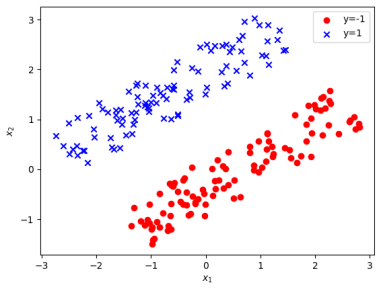
```python
def SMO(x, y, ker, C, max_iter):

    '''

    SMO算法

    x，y：样本的值和类别

    ker：核函数，与线性回归中核函数的含义相同

    C：惩罚系数

    max_iter：最大迭代次数

    '''

    # 初始化参数

    m = x.shape[0]

    alpha = np.zeros(m)


    # 预先计算所有向量的两两内积，减少重复计算

    K = np.zeros((m, m))

    for i in range(m):

        for j in range(m):

            K[i, j] = ker(x[i], x[j])


    for l in trange(max_iter):

        # 开始迭代

        for i in range(m):

            # 有m个参数，每一轮迭代中依次更新

            # 固定参数alpha_i与另一个随机参数alpha_j，并且保证i与j不相等

            j = np.random.choice([l for l in range(m) if l != i])


            # 用-b/2a更新alpha_i的值

            eta = K[j, j] + K[i, i] - 2 * K[i, j] # 分母

            e_i = np.sum(y * alpha * K[:, i]) - y[i] # 分子

            e_j = np.sum(y * alpha * K[:, j]) - y[j]

            alpha_i = alpha[i] + y[i] * (e_j - e_i) / (eta + 1e-5) # 防止除以0

            zeta = alpha[i] * y[i] + alpha[j] * y[j]

            # 将alpha_i和对应的alpha_j保持在[0,C]区间

            # 0 <= (zeta - y_j * alpha_j) / y_i <= C

            if y[i] == y[j]:

`                `lower = max(0, zeta / y[i] - C)

`                `upper = min(C, zeta / y[i])

            else:

`                `lower = max(0, zeta / y[i])

`                `upper = min(C, zeta / y[i] + C)

            alpha_i = np.clip(alpha_i, lower, upper)

            alpha_j = (zeta - y[i] * alpha_i) / y[j]


            # 更新参数

            alpha[i], alpha[j] = alpha_i, alpha_j

    return alpha

# 设置超参数

C = 1e8 # 由于数据集完全线性可分，我们不引入松弛变量

max_iter = 1000

np.random.seed(0)

alpha = SMO(x, y, ker=np.inner, C=C, max_iter=max_iter)

# 用alpha计算w，b和支持向量

sup_idx = alpha > 1e-5 # 支持向量的系数不为零

print('支持向量个数：', np.sum(sup_idx))

w = np.sum((alpha[sup_idx] * y[sup_idx]).reshape(-1, 1) * x[sup_idx], axis=0)

wx = x @ w.reshape(-1, 1)

b = -0.5 * (np.max(wx[y == -1]) + np.min(wx[y == 1]))

print('参数：', w, b)

# 绘图

X = np.linspace(np.min(x[:, 0]), np.max(x[:, 0]), 100)

Y = -(w[0] * X + b) / (w[1] + 1e-5)

plt.figure()

plt.scatter(x[y == -1, 0], x[y == -1, 1], color='red', label='y=-1')

plt.scatter(x[y == 1, 0], x[y == 1, 1], marker='x', color='blue', label='y=1')

plt.plot(X, Y, color='black')

# 用圆圈标记出支持向量

plt.scatter(x[sup_idx, 0], x[sup_idx, 1], marker='o', color='none', 

    edgecolor='purple', s=150, label='support vectors')

plt.xlabel(r'$x_1$')

plt.ylabel(r'$x_2$')

plt.legend()

plt.show()
```
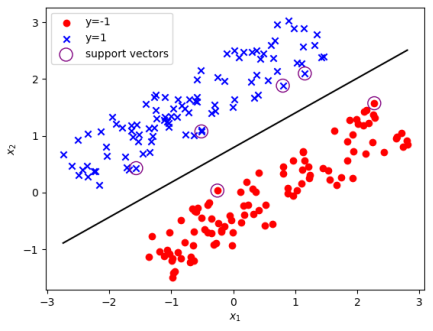

我们再来看一个线性不可分的例子。
```python
data = np.loadtxt('spiral.csv', delimiter=',')

print('数据集大小：', len(data))

x = data[:, :2]

y = data[:, 2]

# 数据集可视化

plt.figure()

plt.scatter(x[y == -1, 0], x[y == -1, 1], color='red', label='y=-1')

plt.scatter(x[y == 1, 0], x[y == 1, 1], marker='x', color='blue', label='y=1')

plt.xlabel(r'$x_1$')

plt.ylabel(r'$x_2$')

plt.legend()

plt.axis('square')

plt.show()
```
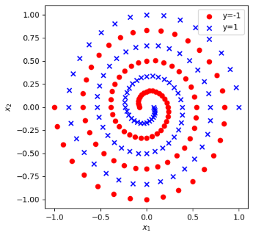

定义不同的核函数：
```python
# 简单多项式核

def simple_poly_kernel(d):

    def k(x, y): 

        return np.inner(x, y) ** d

    return k

# RBF核

def rbf_kernel(sigma):

    def k(x, y):

        return np.exp(-np.inner(x - y, x - y) / (2.0 * sigma ** 2))

    return k

# 余弦相似度核

def cos_kernel(x, y):

    return np.inner(x, y) / np.linalg.norm(x, 2) / np.linalg.norm(y, 2)

# sigmoid核

def sigmoid_kernel(beta, c):

    def k(x, y):

        return np.tanh(beta * np.inner(x, y) + c)

    return k

测试不同核函数下样本会被如何核化：

kernels = [

    simple_poly_kernel(3), 

    rbf_kernel(0.1), 

    cos_kernel, 

    sigmoid_kernel(1, -1)

]

ker_names = ['Poly(3)', 'RBF(0.1)', 'Cos', 'Sigmoid(1,-1)']

C = 1e8

max_iter = 500

# 绘图准备，构造网格

plt.figure()

fig, axs = plt.subplots(2, 2, figsize=(10, 10))

axs = axs.flatten()

cmap = ListedColormap(['coral', 'royalblue'])

# 开始求解 SVM

for i in range(len(kernels)):

    print('核函数：', ker_names[i])

    alpha = SMO(x, y, kernels[i], C=C, max_iter=max_iter)

    sup_idx = alpha > 1e-5 # 支持向量的系数不为零

    sup_x = x[sup_idx] # 支持向量

    sup_y = y[sup_idx]

    sup_alpha = alpha[sup_idx]

    # 用支持向量计算 w^T*x

    def wx(x_new):

        s = 0

        for xi, yi, ai in zip(sup_x, sup_y, sup_alpha):

            s += yi * ai * kernels[i](xi, x_new)

        return s

    # 计算b*

    neg = [wx(xi) for xi in sup_x[sup_y == -1]]

    pos = [wx(xi) for xi in sup_x[sup_y == 1]]

    b = -0.5 * (np.max(neg) + np.min(pos))

    # 构造网格并用 SVM 预测分类

    G = np.linspace(-1.5, 1.5, 100)

    G = np.meshgrid(G, G)

    X = np.array([G[0].flatten(), G[1].flatten()]).T # 转换为每行一个向量的形式

    Y = np.array([wx(xi) + b for xi in X])

    Y[Y < 0] = -1

    Y[Y >= 0] = 1

    Y = Y.reshape(G[0].shape)

    axs[i].contourf(G[0], G[1], Y, cmap=cmap, alpha=0.5)

    # 绘制原数据集的点

    axs[i].scatter(x[y == -1, 0], x[y == -1, 1], color='red', label='y=-1')

    axs[i].scatter(x[y == 1, 0], x[y == 1, 1], marker='x', color='blue', label='y=1')

    axs[i].set_title(ker_names[i])

    axs[i].set_xlabel(r'$x_1$')

    axs[i].set_ylabel(r'$x_2$')

    axs[i].legend()

plt.show()
```
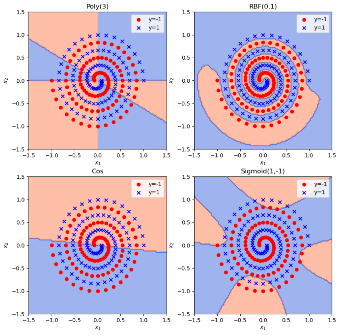


## 9.8  基于树形结构的模型
什么是决策树？决策树是一种利用树状数据结构来进行分类或者回归的算法。在决策树的生成中，我们通过信息论里面几个数值的计算判断分类例如熵，信息增益，增益率，基尼指数等，然后通过这些指标去生成一整个决策的树形图。
### 9.8.1  信息论中的基本概念
在决策树的生成中，我们通过信息论里面几个数值的计算判断分类：熵，信息增益，增益率，基尼指数。

- 信息熵：熵是衡量数据集中类别混乱程度的一个指标。在决策树中，我们使用熵来评估一个节点中的数据分布情况。如果一个节点中的数据大部分都属于同一个类别，那么这个节点的熵值就比较低，意味着这个节点的分类比较明确；反之，如果数据分布比较均匀，则熵值较高，表示这个节点的分类比较模糊。通过计算熵，我们可以确定在哪个节点进行分裂，以最大化分类的准确性。如果对于样本集合S，一共可以划分为k个类，每个类概率是p<sub>k</sub>，那么信息熵定义为：

$$
E(S) =  - \sum\limits_{i = 1}^k {{p_k}} \log {p_k}
$$

如果对数据集S按照某一个属性A对S进行划分，将它划分成v个子集，定义属性A的信息熵为：

$$
E(S,A) = \sum\limits_{i = 1}^v {\frac{{|{A_i}|}}{{|S|}}} E({A_i})
$$

- 信息增益：数据集本身的k个类是按照最后的返回标签排的，所以数据集本身的信息熵与属性的信息熵并不是一个东西。信息增益就是这个差值，看看按照这个属性划分我的信息到底增长了多少。信息增益用于衡量某个属性对于分类的贡献程度。在决策树中，我们选择信息增益最大的属性作为当前节点的分裂属性，这样可以使得子节点的数据更加集中，从而提高分类的准确性。

$$
Gain(A) = E(S) - E(S,A)
$$

- 增益率：增益与信息熵的比值，它解决了信息增益偏向于选择具有多个值的属性问题。增益率结合了信息增益和属性熵，使得决策树在选择分裂属性时既考虑了分类的纯度，又考虑了属性的分散程度。

$$
GainRatio(A) = \frac{{Gain(A)}}{{E(S,A)}}
$$

- 基尼指数：基尼指数另一种衡量数据纯度的方式。它基于一个假设，即如果一个样本被错误分类，则该样本的基尼指数增加。因此，通过计算基尼指数，我们可以确定数据集的纯度，并选择能够最小化基尼指数的属性进行分裂。假设数据集有n个类，第k类的概率是p<sub>k</sub>，定义基尼指数：

$$
GINI(S) = 1 - \sum\limits_{i = 1}^n {p_k^2} 
$$

通过引入这些信息论中的统计量，我们可以更好地构建决策树。它们帮助我们评估数据集的纯度，确定最佳的分裂属性，从而构建一棵结构简单、分类准确度高的决策树。这不仅提高了决策树的性能，也使得决策树在处理实际问题时更加可靠和有效。

9.8.2  ID3决策树

ID3决策树能够处理自变量和标签都是离散型的分类问题。它是以信息熵和信息增益度为衡量标准，从而实现对数据的归纳分类。它是在已知各种情况发生概率的基础上，通过构成决策树来求取净现值的期望值大于等于零的概率，评价项目风险，判断其可行性的决策分析方法。

ID3决策树的训练步骤分四步：

（1）创建根节点，确定属性是什么。

（2）若全部样本都是一类，那就全部落在叶子结点上。否则，根据每个属性计算信息增益，根据最大的信息增益确定划分属性与划分原则。

（3）根据划分属性把属性值不同的样本划到对应边上。

（4）根据不同属性的分类准则递归生成决策树。

> 代码参考了<https://blog.csdn.net/asialee_bird/article/details/81118245>，特别鸣谢！

例如，用一个非常简单的案例实现ID3决策树。由于它只能处理离散自变量与离散标签的问题，这里选用的案例也比较简单，是一份贷款申请成功表，包含四个自变量：年龄段（青年、中年、老年），有工作（是、否），有自己的房子（是、否）和信贷情况（一般、好、非常好），最终标签是是否贷款成功。可以导入数据：
```python
import numpy as np

dataSet = [[0, 0, 0, 0, 'no'],         #数据集

                      [0, 0, 0, 1, 'no'],

                      [0, 1, 0, 1, 'yes'],

                      [0, 1, 1, 0, 'yes'],

                      [0, 0, 0, 0, 'no'],

                      [1, 0, 0, 0, 'no'],

                      [1, 0, 0, 1, 'no'],

                      [1, 1, 1, 1, 'yes'],               

                      [1, 0, 1, 2, 'yes'],

                      [1, 0, 1, 2, 'yes'],

                      [2, 0, 1, 2, 'yes'],

                      [2, 0, 1, 1, 'yes'],

                      [2, 1, 0, 1, 'yes'],

                      [2, 1, 0, 2, 'yes'],

                      [2, 0, 0, 0, 'no']]

dataSet=np.array(dataSet)

labels = ['年龄', '有工作', '有自己的房子', '信贷情况']        #分类属性
```
首先，编写函数计算数据集的信息熵。这里需要对标签出现的次数进行计数，通过numpy.unique函数实现计数功能。这里我们使用了一个技巧，为了防止计算熵时出现log0，在原有基础上增加0.00001一个很小的数。
```python
def EntropyData(dataset):

    n = len(dataset)                        #返回数据集的行数

    dataset=dataset[:,-1]

    count = np.unique(dataset, return_counts=True)[1]

    ent = -np.sum([c/n * np.log2(c/n + 0.00001) for c in count]) # 防止出现log0

    return ent
```
随后，如果选中了某个特征需要进行分类，则对其进行筛选和剔除操作。这个特征也被选中成为决策树的节点。
```python
def maxcount(y):

    y,c = np.unique(y,return_counts=True)

    return y[c==max(c)]

def splitdata(dataset, f, value):

    dataset = dataset[dataset[:, f] == value, :]       

    retDataSet=np.delete(dataset,f,1)

    return retDataSet                                   #返回划分后的数据集
```
有了这些前期工作，就可以计算信息增益：
```python
def infoGain(fList, i,dataset):

    baseEntropy = EntropyData(dataset)                 #计算数据集的香农熵

    newEntropy = 0.0                                   #经验条件熵

    for value in fList:                           #计算信息增益

        subDataSet = splitdata(dataset, i, value)           #subDataSet划分后的子集

        prob = len(subDataSet) / float(len(dataset))           #计算子集的概率

        newEntropy += prob * EntropyData(subDataSet)        #根据公式计算经验条件熵

    infoGain = baseEntropy - newEntropy                        #信息增益

    return infoGain
```
这里i是特征编号，传递进来用以计算针对特定特征的信息增益。通过对每个特征的增益计算，找到划分后增益最大的特征，于是开始选择节点并构建决策树：
```python
def choose(dataset):

    numFeatures = len(dataset[0]) - 1                     #特征数量  

    bestInfoGain = 0.0                                    #信息增益

    bestFeature = -1                                      #最优特征的索引值

    for i in range(numFeatures):                          #遍历所有特征

        #获取dataSet的第i个所有特征

        featList = [example[i] for example in dataset]

        uniqueVals = set(featList)                         #创建set集合{},元素不可重复

        iGain = infoGain(uniqueVals,i,dataset)                        #信息增益

        print("第%d个特征的增益为%.3f" % (i, iGain))             #打印每个特征的信息增益

        if (iGain > bestInfoGain):                              #计算信息增益

            bestInfoGain = iGain                               #更新信息增益，找到最大的信息增益

            bestFeature = i                                      #记录信息增益最大的特征的索引值

    return bestFeature                                           #返回信息增益最大的特征的索引值

def createID3(dataSet, labels, featLabels):

    classList = [example[-1] for example in dataSet]              #取分类标签(是否放贷:yes or no)

    if classList.count(classList[0]) == len(classList):        #如果类别完全相同则停止继续划分

        return classList[0]

    if len(dataSet[0]) == 1:                           #遍历完所有特征时返回出现次数最多的类标签

        return maxcount(classList)

    bestFeat = choose(dataSet)                   #选择最优特征

    bestFeatLabel = labels[bestFeat]                               #最优特征的标签

    featLabels.append(bestFeatLabel)

    myTree = {bestFeatLabel:{}}                                    #根据最优特征的标签生成树

    del(labels[bestFeat])                                          #删除已经使用特征标签

    featValues = [example[bestFeat] for example in dataSet]  #得到训练集中所有最优特征的属性值

    uniqueVals = set(featValues)                                   #去掉重复的属性值

    for value in uniqueVals:

        subLabels=labels[:]

        #递归调用函数createTree(),遍历特征，创建决策树。

        myTree[bestFeatLabel][value] = createTree(splitdata(dataSet, bestFeat, value), subLabels, featLabels)

    return myTree
```
无论是决策树还是写力扣中与二叉树有关的题目，最基本的想法就是递归。这里我们就是递归生成了决策树，用字典分支。运行这一系列函数：
```python
featLabels = []

myTree = createID3(dataSet, labels, featLabels)

print(myTree)
```
首先计算得到第0个特征的增益为0.083，第1个特征的增益为0.324，第2个特征的增益为0.420，第3个特征的增益为0.363。选择第2个特征分裂，删除它，还剩下三个特征。重新计算：第0个特征的增益为0.252，第1个特征的增益为0.918，第2个特征的增益为0.474。此时已经可以满足分类需求，递归停止。得到树的结构为：

{'有自己的房子': {'1': 'yes', '0': {'有工作': {'1': 'yes', '0': 'no'}}}}


### 9.8.3  C4.5决策树

为了处理连续属性的自变量和缺失值问题，对ID3决策树进行改进就得到了C4.5决策树，后来又诞生了C5.0决策树。C4.5决策树在每个节点处都会选择一个最佳的属性进行分支，选择的标准通常是信息增益或增益率。信息增益代表信息不确定性较少的程度，信息增益越大，说明不确定性降低的越多，因此该特征对分类来说越重要。C4.5通过阈值自动把连续变量分成两部分来处理，在数据特性和基本结构上具有很强的灵活性和泛化能力，能够处理各种类型的数据，并构建出准确度高的分类模型。

C4.5决策树的本质是一种分治策略，基本步骤包括：

（1）将连续数值离散化，创建树。

（2）确定连续属性的阈值，计算信息增益率，确定划分属性。

（3）根据划分属性把属性值不同的样本划到对应边上。

（4）根据不同属性的分类准则递归生成树。

有了前面ID3的基础，实现C4.5其实非常简单。首先需要定义信息增益率的写法：
```python
def splitdata_C4_5(dataset, f, value):

    dataset = dataset[dataset[:, f] <= value, :]       

    retDataSet=np.delete(dataset,f,1)

    return retDataSet                                   #返回划分后的数据集

def infoGain_rate(fList,i,dataset):

    H = EntropyData(dataset)

    IG = infoGain(fList,i,dataset)

    return IG/H
```
然后使用这两处替换ID3代码的对应主体部分即可。得到的生成树结构为：

{'信贷情况': {'no': {'有自己的房子': {'1': '0', '0': '0'}}, 'yes': {'有自己的房子': {'1': {'有工作': {'1': {'年龄': {'1': array(['0'], dtype='<U1'), '0': array(['0'], dtype='<U1')}}, '0': {'年龄': {'1': array(['0'], dtype='<U1'), '0': array(['0'], dtype='<U1')}}}}, '2': {'有工作': {'1': {'年龄': {'1': array(['0', '1', '2'], dtype='<U1'), '0': array(['1'], dtype='<U1')}}, '0': {'年龄': {'1': array(['0'], dtype='<U1'), '0': array(['0'], dtype='<U1')}}}}, '0': {'有工作': {'1': {'年龄': {'1': array(['0'], dtype='<U1'), '0': array(['0'], dtype='<U1')}}, '0': '0'}}}}}}


### 9.8.4  CART决策树

CART（Classification and Regression Trees）决策树算法在先前的工作基础上进行了一些重要的改进，使其在处理各种数据和问题时更加有效。顾名思义，CART决策树算法是能够处理回归问题的一种树算法。它适用于各种类型的数据和问题，尤其是处理大规模数据集和多变量输入的情况。CART算法适用于各种类型的数据和问题，包括分类和回归问题，以及连续属性和缺失值的处理，并且有很好的可解释性。Python的sklearn中集成的默认树模型是基于CART结构的。

CART决策树处理分类问题的步骤包括：

（1）将连续数值离散化，创建树。

（2）确定连续属性的阈值，计算基尼指数增长，确定划分属性，按最小者开始划分，注意要二分。

（3）根据划分属性把属性值不同的样本划到对应边上。

（4）根据不同属性递归计算基尼指数增长并划分。

如果CART决策树处理的的是一个回归问题，则回归中的基尼指数为

$$
GainGINI = \sqrt {{y_{k1}} - {\mu _1}}  + \sqrt {{y_{k2}} - {\mu _2}} 
$$

CART使用基尼指数替换即可，这里不多对上述代码进行改写。这里注意在决策树训练过程中有一个重要的技巧：剪枝。决策树生成中需要剪枝的原因主要是为了防止过拟合。通过剪枝，可以去除决策树中过于复杂的部分，使其在测试数据或实际应用中表现更好。剪枝包括预剪枝和后剪枝两种方法。预剪枝是指在决策树生成过程中提前停止树的生长，以防止过拟合，可以及早停止树的生长，从而减少过拟合的风险。然而，预剪枝可能会过早地停止树的生长，导致丢失一些重要的特征和样本。后剪枝则是在决策树生成完成后对其进行简化，以去除不必要或冗余的节点，可以保留更多的特征和样本，但可能会导致过拟合。如果数据集较小，可以采用预剪枝方法，以减少过拟合的风险。如果数据集较大，特征不重要或者存在很多噪声，可以采用后剪枝方法，以保留更多的特征和样本。另外，也可以结合使用预剪枝和后剪枝，先进行预剪枝再进行后剪枝，以获得更好的剪枝效果。

**在使用CART（分类与回归树）算法构建决策树时，我们通常会依赖于基尼指数来选择最佳的分裂点。基尼指数是一个衡量数据不纯度的指标，分裂点的选择目标是最大化基尼指数的降低，从而得到更纯净的子节点。尽管基尼指数是一个有效的分裂准则，但在决策树的训练过程中，还需要考虑另一个重要的技术——剪枝。**

**剪枝的目的是为了防止决策树过拟合。过拟合是指模型在训练数据上表现很好，但在新的、未见过的数据上表现不佳的现象。过拟合的决策树通常具有过多的节点，这些节点可能会捕捉到数据中的噪声和偶然规律，而不是真实的、普遍存在的模式。**

**剪枝有两种主要策略：预剪枝和后剪枝。**

**1. 预剪枝：**

**预剪枝是在决策树生长的过程中进行的。它通过设置一些停止条件（例如，树的最大深度、节点的最小样本数、节点的最小信息增益等）来限制树的生长。这种方法的优点是可以减少过拟合的风险，因为它避免了树变得过于复杂。然而，预剪枝也有可能过早地停止树的生长，这可能导致模型未能充分捕捉数据中的所有重要信息，从而影响模型的准确性。**

**2. 后剪枝：**

**后剪枝则是在决策树完全生长后进行的。它从树的底部开始，检查每个非叶子节点，如果移除该节点并用其子节点替换可以减少模型的复杂度，同时保持或提高预测性能，那么就进行剪枝。后剪枝的优点是它允许树在生成过程中充分生长，从而保留更多的特征和样本信息。但缺点是如果剪枝不当，仍有可能导致过拟合。**

**在实际应用中，可以根据数据集的特点和需求来选择剪枝策略。例如，如果数据集较小，或者特征较为重要，可以采用预剪枝来减少过拟合的风险。如果数据集较大，或者特征中包含较多的噪声，可以采用后剪枝来保留更多的信息。此外，还可以结合预剪枝和后剪枝的优点，先进行预剪枝以控制树的生长，再进行后剪枝以进一步优化模型。**

**通过适当的剪枝，我们可以创建出既能捕捉数据中的关键信息，又具有良好的泛化能力的决策树模型。在实践中，剪枝是一个需要细致调整的过程，可能需要多次尝试和评估，才能找到最佳的剪枝策略。**

**在剪枝后评估剪枝后决策树模型的性能是一个关键的过程，它帮助我们理解模型在处理未知数据时的有效性。以下是详细的评估步骤：**

**1. 交叉验证：**

` `**交叉验证通过将数据集分割成多个子集，并在这些子集上重复训练和测试模型，来评估模型的稳定性和可靠性。在k折交叉验证中，每个子集轮流作为测试集，其余的作为训练集。这样可以确保模型在不同数据子集上的表现都得到评估，从而提高模型选择的信心。**

**2.性能指标：**

**根据问题的性质选择合适的性能指标。例如，在分类问题中，除了准确率，我们还关注精确率和召回率，它们分别衡量了模型正确识别正例的能力。在回归问题中，我们更关注预测值与实际值之间的差异，因此会使用MSE、RMSE或MAE等指标。**

**3. 模型比较：**

**如果有多个剪枝策略生成的决策树模型，我们需要比较它们的性能指标，以选择最佳的模型。这通常涉及到在模型的复杂度和预测性能之间找到平衡点。一个简单但过于复杂的模型可能会过拟合，而一个复杂度适中的模型可能更具有泛化能力。**

**4. 学习曲线：**

**学习曲线显示了模型性能随数据量或训练时间的增加而变化的趋势。通过分析学习曲线，我们可以识别出模型是否开始过拟合。如果模型在训练集上的性能持续提高，而在验证集上的性能开始下降，这通常表明模型开始捕捉到训练数据中的噪声。**

**5. 外部验证：**

**在完成所有模型调整和训练后，使用一个从未参与过训练的独立测试集来评估模型的最终性能。这个步骤是至关重要的，因为它提供了模型在实际应用中可能表现的真实估计。通过外部验证，我们可以确信模型的泛化能力，以及它对新数据的适应性。**

**掌握这些评估技术对于构建和选择适当的决策树模型至关重要。它们不仅帮助我们避免过拟合或欠拟合的问题，还能确保我们的模型在现实世界中的表现与在训练集上的表现一样好。通过综合运用这些方法，我们可以提高模型的可靠性和实用性。**
## 9.9  集成学习模型与GBDT
集成学习(Ensemble learning)通过构建并结合多个学习器来完成学习任务，有时也被称为多分类器系统。集成学习的一般结构为：先产生一组“个体学习器”，再用某种策略将它们结合起来。集成中只包含同种类型的个体学习器，称为同质，当中的个体学习器亦称为“基学习器”，相应的算法称为“基学习算法”。集成中包含不同类型的个体学习器，称为“异质”，当中的个体学习器称为“组建学习器”。

### 9.9.1  Boosting方法与AdaBoost

集成学习是一种机器学习方法，通过结合多个学习器的预测结果来提高整体的预测精度。它通常包含三个步骤：训练多个基学习器，组合这些学习器的预测结果，以及评估整个集成系统的性能。基学习器是构成集成学习的“基础个体”。比如，你有一组数据，你想用这组数据预测一个结果。基学习器就是那些你用来做预测的“个体”模型，比如决策树等。集成就是将多个基学习器的预测结果结合起来，形成一个更强大的“集体”。这个“集体”的预测结果往往比任何一个基学习器都要好。通过集成这些基学习器，集成学习方法可以在一定程度上降低模型过拟合的风险，提高模型的泛化能力。

在集成学习中，常见的算法包括bagging、boosting和stacking等。Bagging是一种基于自助采样法的集成学习技术，通过从原始数据集中有放回地随机抽取样本构建多个子数据集，并分别训练基模型。Boosting是一种基于加权平均思想的集成方法，通过为不同的基学习器分配不同的权重来组合它们的预测结果。Stacking是一种分层集成方法，通过将多个基学习器的预测结果作为新的特征输入到另一层模型中进行训练。

Boosting是一种特殊的集成方法。它首先训练一个基学习器，然后用这个学习器的错误来调整数据，再训练下一个学习器。这样，每个后续的基学习器都会特别关注那些第一个学习器搞错的地方。Boosting就像一个老师，它不断给学生们出更难的题目，直到学生们都掌握知识为止。

Boosting方法的特征包括如下几点：

- 关注错误：当我们有一个分类问题，Boosting方法并不会忽略那些被第一个分类器错误分类的样本。相反，它会特别关注这些“困难”的样本，并给予它们更大的权重。这样，在下一次迭代中，这些样本会被给予更多的关注，增加了被正确分类的机会。
- 迭代训练：Boosting方法不是一个单一的学习器，而是一系列学习器的集合。每个学习器在训练时都考虑到了前一个学习器的错误。这意味着，每个学习器都是在上一个学习器的基础上进行的训练。
- 加权投票：不同于普通的投票系统，Boosting中的每个分类器都有不同的权重。这个权重是基于它在前一轮的表现来决定的。表现得越好，权重越大；反之，则权重越小。最后的预测结果是所有分类器的加权平均，而不是简单的多数投票。

AdaBoost算法是Boosting方法中的一种经典算法，主要用于解决二分类问题。该算法通过调整样本权重来实现对样本分布的调整，即提高前一轮个体学习器错误分类的样本权重，降低正确分类的样本权重。这样可以使错误分类的样本在下一轮中受到更多关注，从而在下一轮中被正确分类，增加分类的准确性。对于组合方式，AdaBoost采用加权多数表决的方法，具体地，加大分类误差率小的弱分类器的权值，减小分类误差率大的弱分类器的权值，从而调整它们在表决中的作用。

boosting方法的基学习器必须得是一个一个生成，后一个在前一个的基础上生成，故又名串行生成。它的工作机制是初始给每个样本赋予一个均衡的权重值1/m，然后训练第一个弱学习器，根据该弱学习器的学习误差率来更新权重值，使得该学习器中的误差率高的训练样本的权重值变高。这就好像一场考试后学霸再进行学习，即使他是绩点满分的神仙它也不会在意做对了哪些，只会盯着自己究竟还有哪些错误并不断改进。以此方法来依次学习各个弱学习器，直到弱学习器的数量达到预先指定的值为止，最后通过某种策略将这些弱学习器进行整合，得到最终的强学习器。

Adaboost算法基本原理就是将多个弱分类器（决策树桩或逻辑回归等）进行合理的结合，使其成为一个强分类器。它每次迭代只训练一个弱分类器，训练好的弱分类器将参与下一次迭代的使用。第N个弱分类器更可能分对前N-1个弱分类器没分对的数据，最终分类输出要看这N个分类器的综合效果。

Adaboost算法输入数据集以后就会开始它的训练。训练过程如下：

- 初始化数据权重，使各个权重相等。

**开始训练前的数据准备：**

**我们需要一个数据集，这个数据集包含了我们想要识别或分类的样本。在Adaboost算法开始之前，我们会给予每个样本相同的权重，这意味着我们假设每个样本都同等重要。**

- 对每一个训练轮次<i>t</i>，如果训练轮次还没有达到训练次数上限<i>T</i>，则训练出在<i>D<sub>t</sub></i>统计分布下采样数据集生成的学习器。
- **评估调整权重**
- **每训练出一个弱学习器，我们就会用它来对样本进行预测，并计算出预测的准确性。如果某个样本被错误分类，我们会提高这个样本的权重，这样在下一轮训练中，模型就会更加关注这些难以分类的样本。同时，我们会根据每个学习器的表现来调整其在最终模型中的权重。**

- 计算误差率，然后计算出权重：

$$
{\alpha _t} = \frac{1}{2}\ln \frac{{1 - {_t}}}{{{_t}}}
$$

- **更新样本分布：**
- **在每次迭代后，我们会根据样本的新权重来更新样本分布。这样做是为了确保在接下来的训练轮次中，模型能够集中注意力在那些之前被错误分类的样本上。**
- 更新分布：

$$
{D_{t + 1}}(i) = \frac{{{D_t}(i)}}{{{Z_t}}}\exp ( - {\alpha _t}{y_i}{h_t}({x_i}))
$$

`	`其中，<i>Z<sub>t</sub></i>为正则化因子，<b>Zt正则化因子在Adaboost算法中起到了平衡样本权重、防止过拟合和提高泛化能力的作用。</b>它的目的是使得<i>D<sub>t+1</sub></i>服从正态分布。

- 当次数未达到上限或精度不达标时，返回步骤（2）继续执行。
- **循环并及时更新：**
- **这个过程会一直重复，直到我们达到了预先设定的训练次数上限，或者模型的预测性能已经足够好。每次循环，我们都会得到一个新的弱学习器，并根据其表现更新样本权重和分布。**
- **构建最终模型：**
- **当所有训练轮次完成后，我们会将所有弱学习器组合起来形成一个强学习器。这个强学习器会综合所有弱学习器的预测结果，通过加权等方式来进行最终的分类或预测。**


> 代码参考了博客<https://zhuanlan.zhihu.com/p/343196025>与<https://zhuanlan.zhihu.com/p/59121403>，特别鸣谢！

现在，我们可以自己动手实现一个AdaBoost算法。首先，我们需要定义一个简单的基学习器，这里使用简单的决策树桩实现。为了扩展方便，我们将决策树封装为类，但是不需要像上一节里面说的那么复杂，可以简单一点：
```python
class DecisionTreeClassifierWithWeight:

    def __init__(self):

`         `self.best_err = 1  # 最小的加权错误率 

`         `self.best_fea_id = 0  # 最优特征id

`         `self.best_thres = 0  # 选定特征的最优阈值

`         `self.best_op = 1  # 阈值符号，其中 1: >, 0: < 

    def fit(self, X, y, sample_weight=None):

`         `if sample_weight is None:

`             `sample_weight = np.ones(len(X)) / len(X)

`         `n = X.shape[1]

`         `for i in range(n):

`             `feature = X[:, i]  # 选定特征列

`             `fea_unique = np.sort(np.unique(feature))  # 将所有特征值从小到大排序

`             `for j in range(len(fea_unique)-1):

`                 `thres = (fea_unique[j] + fea_unique[j+1]) / 2  # 逐一设定可能阈值

`                 `for op in (0, 1):

`                     `y_ = 2*(feature >= thres)-1 if op==1 else 2*(feature < thres)-1  # 判断何种符号为最优

`                     `err = np.sum((y_ != y)*sample_weight)

`                     `if err < self.best_err:  # 当前参数组合可以获得更低错误率，更新最优参数

`                         `self.best_err = err

`                         `self.best_op = op

`                         `self.best_fea_id = i

`                         `self.best_thres = thres

`         `return self

    def predict(self, X):

        feature = X[:, self.best_fea_id]

        return 2*(feature >= self.best_thres)-1 if self.best_op==1 else 2*(feature < self.best_thres)-1

    def score(self, X, y, sample_weight=None):

        y_pre = self.predict(X)

        if sample_weight is not None:

            return np.sum((y_pre == y)*sample_weight) 

        return np.mean(y_pre == y)
```
那么接下来的操作就是在一定轮次中不断训练基学习器，并计算归一化权重将基学习器集成起来。形如：
```python
class AdaBoostClassifier:

    def __init__(self, n_estimators=50):

`         `self.n_estimators = n_estimators 

`         `self.estimators = []

`         `self.alphas = []

    def fit(self, X, y):

`         `sample_weight = np.ones(len(X)) / len(X)  # 初始化样本权重为 1/N

`         `for _ in range(self.n_estimators):

`             `dtc = DecisionTreeClassifierWithWeight().fit(X, y, sample_weight)  # 训练弱学习器

`             `alpha = 1/2 * np.log((1-dtc.best_err)/dtc.best_err)  # 权重系数

`             `y_pred = dtc.predict(X)

`             `sample_weight *= np.exp(-alpha*y_pred*y)  # 更新迭代样本权重

`             `sample_weight /= np.sum(sample_weight)  # 样本权重归一化

`             `self.estimators.append(dtc)

`             `self.alphas.append(alpha)

`         `return self   


    def predict(self, X):

`         `y_pred = np.empty((len(X), self.n_estimators))  # 预测结果二维数组，其中每一列代表一个弱学习器的预测结果

`         `for i in range(self.n_estimators):

`             `y_pred[:, i] = self.estimators[i].predict(X)

`         `y_pred = y_pred * np.array(self.alphas)  # 将预测结果与训练权重乘积作为集成预测结果

`         `return 2*(np.sum(y_pred, axis=1)>0)-1  # 以0为阈值，判断并映射为-1和1

    def score(self, X, y):

`         `y_pred = self.predict(X)

`         `return np.mean(y_pred==y)

使用sklearn自带的乳腺癌数据集测试：

from sklearn.datasets import load_breast_cancer

from sklearn.model_selection import train_test_split

X, y = load_breast_cancer(return_X_y=True)

y = 2*y-1  # 将0/1取值映射为-1/1取值 

x_train, x_test, y_train, y_test = train_test_split(X, y,random_state=42)

print(AdaBoostClassifier_().fit(x_train, y_train).score(x_test, y_test)) 
```
最终的准确率达到了0.97，是比较不错的水平。

### 9.9.2  Bagging方法与随机森林

Bagging是另一种集成学习技术，与Boosting不同，它通过从原始数据集中随机抽取样本（有放回地）来训练基学习器。这种方式能够降低模型对数据集的过度拟合，提高模型的泛化能力。Bagging通过引入随机性来降低各个基学习器之间的相关性，从而获得更好的集成效果。

Bagging方法的特点有以下几点：

- 自助采样：Bagging采用有放回的自助采样方法从原始数据集中随机抽取样本，每个样本被选中的概率相等。这样每个基学习器都从不同的数据子集中进行训练，降低了它们之间的相关性。
- 简单平均：Bagging通过简单平均的方式将多个基学习器的预测结果结合起来，形成一个更稳定的预测结果。与Boosting不同，Bagging不会对每个基学习器的预测结果赋予不同的权重，而是平等对待它们。
- 降低方差：Bagging通过降低基学习器之间的相关性来降低集成学习模型的方差，从而提高泛化性能。这使得Bagging对于噪声数据和异常值具有一定的鲁棒性。

随机森林是Bagging最有代表性的算法。随机森林的名称中有两个关键词，一个是“随机”，一个就是“森林”。“森林”我们很好理解，一棵叫做树，那么成百上千棵就可以叫做森林了，这样的比喻还是很贴切的，其实这也是随机森林的主要思想——集成思想的体现。那随机是什么？就是在生成决策树的时候会随机选择一些属性。一般的决策树在选择划分属性时是在当前结点的所有d属性中选择一个最优属性，而在随机森林的基学习器上不一定用完全部的属性而是抽样抽出一部分k，然后从该属性集中选择最优的划分属性。

随机森林的优势包括以下几点：

- 能够处理很高维度的数据。
- 在训练完成后，可以给出哪些属性比较重要，这一方法也被用于自动化特征工程。
- Bagging是一种并行化方法，训练速度快。
- 方便进行可视化展示，便于后续分析。

随机森林是Bagging系列的典型代表。而Bagging又是并行式集成学习方法的著名代表，它是基于自助采样法(有放回的取样)来提高学习器泛化能力的一种很高效的集成学习方法。它的策略如下：

- 从样本集里面Bootstrap采集n个样本。
- 在树的每个节点上，从所有属性中随机选择k个属性，选择出一个最佳分割属性作为节点,建立决策树，一般,d表示属性的总个数。
- 重复以上两步m次，建立m棵决策树。重复的过程可以并行化。
- 通过简单平均或加权平均形成随机森林。

### 9.9.3  GBDT框架

GBDT 是一种基于梯度提升（Gradient Boosting）的集成学习算法。它通过不断学习一系列的决策树模型，并将这些模型组合起来，形成一个强大的集成模型。在每一次迭代中，GBDT 会对上一次迭代的残差进行建模，也就是预测值与实际值之间的差。这样，GBDT 能够逐步地提高模型的预测精度。

在传统集成学习中，Boosting系列算法的基学习器往往是串行生成，Bagging系列算法（例如随机森林）往往是并行生成。能不能提出一种可以并行或部分并行的Boosting方法呢？传统的集成学习算法（如bagging和随机森林）是对原始数据进行重采样和特征重选择来构建多个基模型。而GBDT是直接对原始的损失函数进行优化，学习的是残差函数，这使得GBDT能更好地逼近真实函数。在每一步，GBDT 都会根据上一轮的误差来更新样本权重，这样在下一轮迭代中，模型会对之前难以预测的样本给予更大的关注。这种动态调整样本权重的策略使得 GBDT 在处理非平衡数据、噪声数据和连续特征等方面有更好的鲁棒性。并且GBDT是可以并行化训练的。

GBDT有三个典型的实现：XGBoost是2017年的一种相当强力的机器学习方法，梯度提升树框架的第一个里程碑；CatBoost针对类别型数据进行了改进，对离散特征数据进行了优化；LightGBM针对XGB的效率进行改进，通过梯度采样和直方图算法支持并行化。

我们想一想，传统使用树结构去进行集成学习分类或回归任务是不是这样的：

$$
{\hat y_i} = \sum\limits_{i = 1}^K {{f_k}({x_i})} ,f(x) = {w_{q(x)}}
$$

在这个式子中，f 表示回归树基学习器(CART)，函数f根据规则q，在给定数据也就是自变量x 的条件下给出一个评分函数w。w 是树f 上不同节点的权重分数。那么，如果想提升它的性能可以从哪些地方入手呢？主要就是两个想法：从基学习器本身入手和从误差优化入手。这里我们考虑误差优化。 我们说，模型的误差=“距离定义”+正则化因子，所谓的距离其实也就是交叉熵损失或者均方误差等。这里我们可以列出它的公式：

$$
\begin{array}{l}
\arg \min L = \sum\limits_{i = 1}^n {l({{\hat y}_i},{y_i})}  + \sum\limits_{k = 1}^K {\Omega ({f_k})} \\
s.t.\Omega (f) = \gamma T + \frac{1}{2}\lambda {\left\| w \right\|^2}
\end{array}
$$

Boosting系列集成器为串行生成，所以第i轮的预测结果也就是在第i-1轮的基础上加上 fi(x)：

$$
{L^{(t)}} = \sum\limits_{i = 1}^n {l({y_i},\hat y_i^{(t - 1)} + {f_t}({x_i}))}  + \Omega ({f_t})
$$

L的本质是针对y的二元函数，现在欲求解y在 ft(x) 这个增量变化后函数值的大小，可以使对y的预测值进行二阶泰勒展开近似

$$
{L^{(t)}} = \sum\limits_{i = 1}^n {[l({y_i},\hat y_i^{(t - 1)}) + \frac{{\partial l({y_i},\hat y_i^{(t - 1)})}}{{\partial \hat y_i^{(t - 1)}}}{f_t}({x_i}) + \frac{1}{2}\frac{{{\partial ^2}l({y_i},\hat y_i^{(t - 1)})}}{{\partial {{(\hat y_i^{(t - 1)})}^2}}}f_t^2({x_i})]}  + \Omega ({f_t})
$$

既然第一项是不太能动的部分，那可优化的部分就很明确了，就是从第二项以后都可以优化。这也就是为什么叫梯度提升树的原因。对第t 轮损失函数中标蓝部分进一步化简，Ij 为决策方案构成的空间：

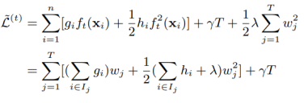

可以解得函数的最优解为：

$$
\begin{array}{c}
w_j^* =  - \frac{{\sum\limits_{i \in {I_j}} {{g_i}} }}{{\sum\limits_{i \in {I_j}} {{h_i}}  + \lambda }}\\
{{\tilde L}^{(t)}}(q) =  - \frac{1}{2}\sum\limits_{j = 1}^T {\frac{{{{\left( {\sum\limits_{i \in {I_j}} {{g_i}} } \right)}^2}}}{{\sum\limits_{i \in {I_j}} {{h_i}}  + \lambda }}}  + \gamma T
\end{array}
$$

那么问题来了，怎么去搜索这个函数的最优解呢？大体上搜索策略会有三种想法：暴力搜索、启发式搜索和贪心搜索。暴力搜素那必然不可取，启发式搜索可以成为一个优化方向但目前做的不多，我们采用贪心的想法解。搜索分支点的策略如下：

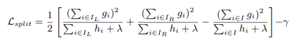

它的基本想法很纯粹，对左子树梯度优化与右子树梯度优化减去不分支的整体梯度优化 就可以得到对某个节点分枝后的增益。分支的算法有精确搜索和粗略搜索两个版本，这里放上精确搜索的版本：

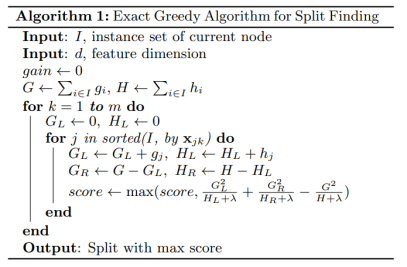

计算每个特征的分数后会根据这个分数排序，选择信息增益最大的特征进行梯度提升树的生长。不断迭代学习器并集成就得到了XGBoost。

XGBoost作为机器学习领域的一个里程碑，其独特的优势和特点使其在众多算法中脱颖而出。首先，XGBoost对梯度进行了优化，提高了预测的准确度。与传统的机器学习算法相比，XGBoost通过优化梯度下降的方式，更加精确地逼近真实函数，从而在许多数据集上取得了更高的预测精度。其次，XGBoost能够自主处理数据缺失的问题，这极大地削弱了我们预处理的困难。在数据预处理阶段，如何处理缺失值一直是一个令人头疼的问题。而XGBoost通过一种创新的策略，能够自动处理缺失值，无需我们手动填充或删除数据，大大简化了数据预处理的流程。此外，XGBoost还能自主感知数据的稀疏性，从而减少了人工降维的工作量。在许多实际问题中，数据往往是高度稀疏的，即大多数特征的值都是0或缺失的。XGBoost通过特殊的处理方式，能够有效地利用这些稀疏特征，避免了人工降维的需要，同时也提高了模型的预测性能。从计算理论的角度讲，打破了传统Boosting串行化的传统，打响了并行化Boost的第一枪。从系统结构的角度来看，XGBoost的另一个重要特点是其Cache感知能力。通过这一特性，XGBoost能够在搜索过程中进行内存优化，提高了搜索效率。传统的搜索算法往往只关注数据的连续读写，而忽视了非连续读写的可能性。XGBoost则不同，它能够充分利用非连续读写的特性，给予更多的缓冲机会，使得数据读写更加高效。

```python
# 用XGBoost做尝试

import xgboost as xgb

from sklearn.model_selection import train_test_split

from sklearn.metrics import f1_score

from matplotlib import pyplot as plt

from sklearn.metrics import classification_report

from sklearn import preprocessing

X=data[['X%d'%i for i in range(1,65)]]

Y=data['class']

xgb_n_clf = xgb.XGBClassifier(

        max_depth=12

        ,learning_rate=0.1

        ,reg_lambda=1

        ,n_estimators=150

        ,subsample = 0.9

        ,colsample_bytree = 0.9

        ,random_state=0

        ,eval_metric='logloss')

xgb_n_clf.fit(X,Y)

Y_test=xgb_n_clf.predict(X)

print(classification_report(Y,Y_test))

pd.DataFrame(xgb_n_clf.predict_proba(X)).to_csv("2021-predict.csv")
```
XGBoost作为机器学习领域的一个强大工具，尽管具有许多优势，但仍存在一些问题需要关注。首先，精确贪心算法在XGBoost中的实现需要反复迭代和遍历，这导致了较大的计算量和内存消耗。在处理大规模数据集时，这种算法复杂度可能会成为性能瓶颈。其次，XGBoost采用的level-wise策略在构建树的过程中可能会产生许多不必要的叶子节点。这不仅增加了模型的复杂度，还可能导致过拟合问题。过多的叶子节点可能捕捉到训练数据中的噪声，降低模型的泛化能力。此外，尽管XGBoost具有Cache感知的特性，但在实际应用中仍存在大量Cache Missing的情况。这导致了频繁的页面调度，增加了I/O操作的开销。对于大规模数据处理任务，频繁的页面调度可能导致显著的性能下降。在实际应用中，针对这些问题进行优化和改进将有助于进一步提高XGBoost的性能和泛化能力。

**XGBoost是机器学习领域的一种强大算法，但它也有一些局限性需要注意。**

1. **精确贪心算法需要大量的迭代和遍历来构建决策树。这会导致计算量和内存消耗增大，特别是处理大规模数据集时，可能会成为性能的瓶颈。**
1. **XGBoost在构建树时采用了一种level-wise策略，这种策略可能会导致生成过多不必要的叶子节点。这不仅增加了模型的复杂度，还可能导致过拟合，即模型在训练数据上表现很好，但在未见过的数据上表现不佳。**
1. **尽管XGBoost具有减少缓存丢失的特性，但在实际应用中仍然可能遇到大量缓存丢失，导致频繁的磁盘I/O操作，这对于大规模数据处理任务来说，可能会显著影响性能。**

   **为了提高XGBoost的性能和泛化能力，需要针对这些问题进行优化和改进。例如，可以通过调整参数来减少不必要的计算，采用更高效的树构建策略来控制模型复杂度，或者优化缓存策略来减少缓存丢失。这样，XGBoost就能在保持强大性能的同时，更好地适应实际应用的需求。**

   LightGBM在XGBoost的基础上做了不少优化的工作，包括提出直方图算法、数据并行与特征并行、GOSS梯度采样、EFB方法等。

   直方图算法先对特征值进行装箱处理（对每个特征的取值做个分段函数，将所有样本在该特征上的取值划分到某一段bin中）。最终把特征取值从连续值转化成了离散值。遍历数据时，根据离散化后的值作为索引在直方图中累积统计量，当遍历一次数据后，直方图累积了需要的统计量，然后根据直方图的离散值，遍历寻找最优的分割点。直方图算法是牺牲了一定的准确性而换取训练速度和节省内存空间消耗的算法。每次分裂只需计算分裂后样本数较少的子节点的直方图然后通过做差的方式获得另一个子节点的直方图，进一步提高效率。将连续数据离散化为直方图的形式，对于数据量较小的情形可以使用小型的数据类型来保存训练数据，不需要额外的较大的内存。降低了并行通信的代价。

   建立直方图的复杂度为O(feature×data)，如果降低特征数或者降低样本数，训练的时间会大大减少。以往的降低样本数的方法中，要么不能直接用在GBDT上，要么会损失精度。而降低特征数的直接想法是去除弱的特征（通常用PCA完成），然而，这些方法往往都假设特征是有冗余的，然而通常特征是精心设计的，去除它们中的任何一个可能会影响训练精度。因此LightGBM提出了GOSS算法和EFB算法。

   一个有高维特征空间的数据往往是稀疏的，而稀疏的特征空间中，许多特征是互斥的。所谓互斥就是他们从来不会同时具有非0值（比如one-hot编码后的类别特征）。LightGBM利用这一点提出Exclusive Feature Bundling（EFB，互斥特征捆绑）算法来进行互斥特征的合并，从而减少特征的数目。做法是先确定哪些互斥的特征可以合并（可以合并的特征放在一起，称为bundle），然后将各个bundle合并为一个特征。当bundle远小于feature时，直方图构建的复杂度从O(data×feature)变为O(data×bundle)。这样GBDT能在精度不损失的情况下进一步提高训练速度。

   内存优化的策略方面，使用bin来表示特征，一般bin的个数都是控制在比较小的范围内，这样可以使用更少的Byte来存储，降低为XGB的1/8。对梯度的访问，因为不需要对特征进行排序，同时，所有的特征都采用同样的方式进行访问，所以只需要对梯度访问的顺序进行一个重新的排序，所有的特征都能连续地访问梯度。

   直方图算法不需要数据到模型的一个索引表，没有cache-miss的问题。把速度提升了四倍以上。LightGBM通过更改决策树算法的决策规则，直接原生支持类别特征，不需要额外的离散化。并且通过一些实验，MRSA研究人员验证了直接使用离散特征可以比使用0-1离散化后的特征，速度快到8倍以上 。并且支持的并行方式更多，包括特征并行、数据并行、集成并行等多种方式。

   Python可以安装lightgbm库实现相关算法。上面使用XGBoost实现的代码如果改写为LightGBM实现可以改写为：
   ```python
   import lightgbm as lgb

   from sklearn.model_selection import train_test_split

   from sklearn.metrics import f1_score

   from matplotlib import pyplot as plt

   from sklearn.metrics import classification_report

   from sklearn import preprocessing

   X=data[['X%d'%i for i in range(1,65)]]

   Y=data['class']

   lgb_n_clf = lgb.LGBMClassifier(

           max_depth=12

           ,learning_rate=0.1

           ,reg_lambda=1

           ,n_estimators=150

           ,subsample = 0.9

           ,colsample_bytree = 0.9

           ,random_state=0

           ,eval_metric='logloss')

   lgb_n_clf.fit(X,Y)

   Y_test=lgb_n_clf.predict(X)

   print(classification_report(Y,Y_test))

   pd.DataFrame(lgb_n_clf.predict_proba(X)).to_csv("2021-predict.csv")
   ```

## 9.10  从神经网络模型到深度学习
神经网络是一种具有非常强大能力的模型，不仅能够做常规的分类、回归等任务，还可以处理非结构化数据。但神经网络需要在大量数据下使用才有其意义，需要注意使用条件。从神经网络的诞生开始，一直到现在的ChatGPT，都是神经网络的应用。为此，它开辟了机器学习的一个新的分支：深度学习。

   ### 9.10.1  多层感知机（这一节抄自我的MATLAB版教材，要改）

   多层感知机（MLP，Multilayer Perceptron）也叫人工神经网络（ANN，Artificial Neural Network），除了输入输出层，它中间可以有多个隐层。这东西是个非常厉害的模型，有神经网络，才有了今天的深度学习，后面我们会了解到。

   **多层感知机（MLP）是一种神经网络，它由三种类型的层组成：输入层、一个或多个隐藏层（中间层），以及输出层。在这些层之间，数据会经过线性映射和激活函数处理，然后传递到下一层。**

   **为了更好地理解这个过程，我们可以将其分解为以下步骤：**

   **1. 输入层接收输入数据，并将其传递到第一个隐藏层。**

   **2. 在每一层，数据会经过线性映射（即，每个神经元的输入是上一层输出的加权和），然后通过激活函数进行非线性转换。**

   **3. 经过所有隐藏层的处理后，数据最终到达输出层，得到预测结果。**

   **在建立了基本的神经网络模型之后，接下来的任务是训练模型，即学习模型的参数。由于神经网络包含多层结构，计算梯度变得非常复杂。为了解决这个问题，我们采用误差反向传播算法（Backpropagation）来更新网络参数。**

   **误差反向传播算法是一种高效的梯度计算方法，它基于以下步骤：**

   **1. 从输入层开始，数据逐层传递到输出层，计算预测结果与实际数据之间的误差。**

   **2. 对于每一层，我们计算误差与上一层输出的关系。这需要对每一层的激活函数求导，以找到误差对权重的影响。**

   **3. 通过这种链式求导过程，我们可以计算出每一层权重对损失函数的梯度，从而更新权重以最小化误差。**

   **这种方法类似于线性回归中的梯度下降法，但在神经网络中，我们需要对多层结构进行求导。通过这种方式，我们可以有效地训练神经网络，使其在各种任务中表现出色。**

   图8.15所示是一个多层感知机的结构图：

   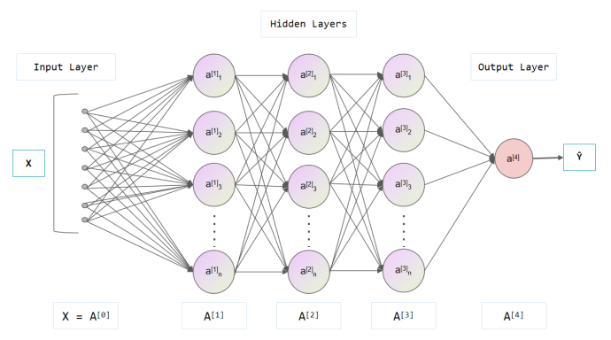

   如图8.15所示，对于每两层之间神经元与神经元之间都有连接，这个连接用一个权重表示。那么，如果上一层有m个神经元，下一层n个神经元，那么权值就有mn个，可以排成一个矩阵。加上自己的偏置项，一个数据信息在这两层之间的传播实际上就是一个线性方程y<sub>n</sub>(X)=W<sub>n</sub>X+b。没完，在神经网络中，还有个很重要的成分叫做激活函数。激活函数再将通过线性变换的数据映射成一个新的变量才能作为响应，再来反馈给下一层。常用的激活函数有sigmoid，tanh，softmax，还有。

   **在神经网络的构建过程中，我们通常会遇到两个主要的概念：线性方程和激活函数。这两个组成部分共同决定了数据在网络中的传播和变化方式。**

   **1. 线性方程（Linear Equation）**

   **线性方程是神经网络中最基本的数学模型，用于描述数据如何在各层之间传播。一个简单的线性方程可以表示为 y(X) = W * X + b，其中 X 是输入数据，W 是权重矩阵，* 表示矩阵乘法，b 是偏置项。这个方程的输出 y(X) 是输入数据经过线性变换的结果。**

   **2. 激活函数（Activation Function）**

   **在神经网络中，激活函数的作用是引入非线性，使得网络能够学习和近似复杂的函数。如果没有激活函数，无论神经网络有多少层，最终都只能表示线性映射，这限制了网络的表达能力。常见的激活函数包括 Sigmoid、tanh 和 softmax。**

   **Sigmoid 函数：将实数映射到 (0,1) 区间，其公式为 f(x) = 1 / (1 + e^(-x))。Sigmoid 函数的输出范围在 0 到 1 之间，这使得它可以被用于二分类问题的输出层。**

   ` `**tanh 函数：将实数映射到 (-1,1) 区间，其公式为 f(x) = (e^(x) - e^(-x)) / (e^(x) + e^(-x))。与 Sigmoid 函数类似，但输出范围是 -1 到 1，它在某些情况下可以提供更好的数值稳定性。**

   **-Softmax 函数：将实数映射为一组表示概率分布的值，其公式为 f(x_i) = e^(x_i) / Σ(e^(x_j))，其中 i 和 j 是输入向量的元素索引。Softmax 函数常用于多分类问题的输出层，因为它的输出可以解释为属于各个类别的概率。**

   **在神经网络中，线性方程和激活函数交替使用，构建出多层的网络结构。每一层的输出都会作为下一层的输入，经过一次次的线性变换和非线性激活，最终得到网络的输出。通过调整网络中的权重和偏置项，神经网络可以学习到从输入数据到期望输出的映射规律。这种学习过程通常通过一种叫做反向传播（Backpropagation）的算法来实现，配合梯度下降（Gradient Descent）等优化方法，以达到最小化预测误差的目的。**

   现在咱们知道了，多层感知机实际上是有三种层，输入层，中间层和输出层。两层之间的过程是线性映射，再激活函数，然后输出去。

   每两层前后的输入输出递推形式如下，本质上就是一个复合函数：

$$
\[{X_n} = {f_n}({W_n}{X_{n - 1}} + {b_n})\]
$$

   基本的模型搭建完成后，训练的时候所做的就是完成模型参数的学习。由于存在多层的网络结构，因此即使是数值解梯度下降都非常困难，一个方法就是用误差反向传播算法。误差反向传播是一种非常行之有效的更新算法。每次我们的数据从输入层逐层传入到输出层，发现和实际数据有偏差。但是具体的偏差是多少呢？我们对每一层逐层求导，每一层的误差都与上一层的输出有关。这样就建立了复合函数偏导数的关系，形成一种链式反应。

   后向传播算法是基于梯度下降的一种改进。还记得我们在线性回归里面说到的凸优化方法，对损失函数求导。这里也是一样，思想还是打算对权值求导。但是神经网络相比于线性回归和逻辑回归模型复杂了不少，再想像那样直接求导就很难了。但是从作用原理出发，对于某一层而言，权值w<sub>ij</sub>先影响了对应的输入值，再影响输出值，从而影响损失函数E。那么，我们可以进行一个链式求导的过程：

$$
\frac{{\partial E}}{{\partial {w_{ij}}}} = \frac{{\partial E}}{{\partial \widehat {{y_j}}}}\frac{{\partial \widehat {{y_j}}}}{{\partial {\beta _j}}}\frac{{\partial {\beta _j}}}{{\partial {w_{ij}}}}
$$

   值得注意的是最后一项，这最后一项本质上就是上一层网络的输出啊孩子们，这样本层损失与上层输出就建立关系了。另外我们将损失函数对输入层求微分：

$$
\frac{{\partial E}}{{\partial x}} = \frac{{\partial E}}{{\partial {y_n}}}\frac{{\partial {y_n}}}{{\partial {y_{n - 1}}}}...\frac{{\partial {y_1}}}{{\partial x}}
$$

   可以看到嗷，这个东西本质上就还是会和上一层的输出扯上关系。误差项就通过这样一个方程，实现了后向传播。通过不断地迭代和训练，最终权重系数等参数都会稳定下来，达到逼近的目的。

   注意：训练过程是一个迭代的过程，不断迭代不断更新权重。所以它是吃时间吃算力的。如果真的做深度学习研究那得配置比较好的显卡。

   在神经网络的训练过程中，调节参数是一个至关重要的步骤。这些参数决定了网络的结构和行为，进而影响模型的预测性能。一般来说，我们需要通过反复试验和比较来找到最优的参数组合。在调节参数时，通常会考虑以下几个方面：

- 学习率（Learning Rate）：学习率决定了模型在每次迭代中更新权重的幅度。如果学习率过大，可能导致模型震荡而无法收敛；如果学习率过小，则可能导致训练速度缓慢。因此，需要根据实际情况选择一个合适的学习率。
- 批处理大小（Batch Size）：批处理大小决定了每次迭代中使用多少样本进行权重更新。较大的批处理大小可能会加快训练速度，但也可能导致内存不足；较小的批处理大小则可以减少内存使用，但训练速度可能会变慢。
- 迭代次数（Epochs）：迭代次数决定了整个数据集被遍历的次数。过多的迭代可能会导致过拟合，而太少的迭代则可能无法充分训练模型。
- 正则化参数（Regularization Parameters）：正则化用于防止模型过拟合。常见的正则化参数包括L1和L2正则化系数、dropout概率等。这些参数可以帮助控制模型的复杂度，避免过度拟合训练数据。
- 优化器（Optimizer）：优化器决定了如何更新模型的权重。常见的优化器有SGD（随机梯度下降）、Adam、RMSprop等。不同的优化器适用于不同的问题和数据集，选择合适的优化器也是调节参数的一个重要方面。

通过调整这些参数，我们可以找到一个最优的平衡点，使模型在训练集和测试集上都能取得较好的性能。这个过程可能需要多次尝试和调整，因此耐心和经验积累是非常重要的。

**为了优化误差反向传播算法的训练过程，我们可以采取多种策略来提升神经网络的性能和训练效率。：**

**1. 学习率调整：选择合适的学习率对训练过程至关重要。如果学习率太高，可能会导致模型在最优解附近震荡；如果学习率太低，训练过程可能会非常缓慢。使用自适应学习率算法，如Adam，可以帮助我们在训练过程中自动调整学习率，使模型更快收敛。**

**2. 批量大小的选择：批量大小决定了每次参数更新前要处理的数据量。较大的批量可以提供更稳定的梯度估计，但计算成本更高；较小的批量可以更快地适应参数更新，但可能导致梯度估计不稳定。实践中，可以尝试不同的批量大小，找到适合当前任务的最佳值。**

**3. 权重初始化：在训练开始时，如何初始化权重对模型的收敛速度和最终性能有显著影响。使用如He初始化或Xavier初始化等策略，可以减少训练初期的梯度消失或爆炸问题，从而加速收敛。**

**4. 正则化技术：为了防止模型过拟合，我们可以在训练过程中加入正则化项，如L1或L2正则化。此外，Dropout是一种简单而有效的正则化方法，它通过在训练过程中随机“丢弃”一部分神经元，减少了模型对特定参数的依赖，增强了泛化能力。**

**5. 早停策略：当我们在训练集上不断改进模型，但在验证集上的性能停止提升时，可能是过拟合的信号。此时，采用早停策略，即停止进一步训练，可以避免过拟合，保持模型的泛化性能。**

**6. 激活函数的选择：激活函数为神经网络引入非线性，选择合适的激活函数可以影响模型的学习能力。ReLU（Rectified Linear Unit）是目前常用的激活函数之一，因为它在正区间内保持梯度不衰减，有助于加速训练。**

**7. 优化器的选用：除了传统的梯度下降，还有许多改进的优化器可供选择，如带动量的梯度下降和Nesterov加速梯度（NAG）。这些优化器通过考虑之前梯度的动量，帮助模型更有效地逃离局部最小值和鞍点。**

**8. 网络结构的调整：根据具体任务的需求，可以尝试调整网络结构，比如增加或减少隐藏层的数量，或者改变层间的连接方式。这些调整可以帮助模型更好地捕捉数据的特征，提高性能。**

**9. 数据增强：在训练数据中引入变化，如旋转、缩放、裁剪等，可以增加数据的多样性，使模型对输入的微小变化，减少过拟合的风险。**

**10. 梯度裁剪：在训练过程中，有时梯度的值会变得非常大，导致参数更新不稳定。通过梯度裁剪，我们可以限制梯度的最大值，防止梯度爆炸问题。**

**通过这些策略的综合应用，我们可以有效地提升神经网络的训练效果，使其在各种任务中都能表现出色。对于新手来说，理解和实践这些优化技巧，将有助于构建更加强大和可靠的神经网络模型。**

### 9.10.2  循环神经网络

循环神经网络是对传统神经网络结构的一次重要革新。让我们回顾在时间序列中学到的东西，时间序列预测的基本想法就是用历史预测未来。那么神经网络能不能用在时间序列里面呢？当然是可以的，神经网络若将上一步获得的输出作为下一步的输入，这就构成了一个循环神经网络。循环神经网络可以表示为：

$$
{y_t} = f(W{X_t} + H{y_{t - 1}} + b)
$$

最简单的循环神经网络通常使用双曲正切函数作为激活函数。这样就会带来一系列问题：对于一层RNN而言，梯度应该怎么传播？双曲正切函数在这种传播机制下会出现什么问题？对于RNN而言，梯度是随着时间而反向传播的（Backward Propagation Through Time），而在梯度反向传播的过程中梯度是随时间来求导的，这就导致小的梯度值会越来越小直到变成0，大的梯度值会越来越大直到变成无穷大，这两种现象就是RNN训练中容易出现的梯度逸散和梯度爆炸。为了克服这两个问题，需要开发新的循环神经网络结构。

LSTM神经网络是由Sepp Hochreiter等人提出的神经网络模型，在RNN的基础上引入了遗忘门。传统的RNN可以看作是同一结构的反复迭代，每次迭代的结果都会被传到下一个值进行再处理。RNNs一旦展开，可以将之视为一个所有层共享同样权值的深度前馈神经网络。虽然它们的目的是学习长期的依赖性，但理论的和经验的证据表明很难学习并长期保存信息。而LSTM则是对RNN的改进，是一种特殊的RNN模型，被更广泛地应用于文本预测、时间序列预测等领域。

注意：RNN本质上就是拿历史前一项或前几项作为自变量，线性方程后用tanh激活做输出。所以本质上还是上一章讲到的“历史预测未来”的思想。

LSTM网络与普通RNN一样，都有重复的单元结构。但不同的是，传统的普通RNN单元只有比较简单的网络结构，而LSTM的单元由三个不同的门组成：输入门，输出门和遗忘门。基本架构如图8.16所示。

循环神经网络（RNN）是一种用于处理序列数据的神经网络结构。在最简单的RNN中，通常使用双曲正切函数（tanh）作为激活函数。然而，这种设计在训练过程中会引发一些问题。

**让我们先来探讨一下RNN中的梯度传播。在RNN中，梯度是通过时间反向传播的（Backpropagation Through Time, BPTT）。这意味着，当我们计算梯度时，需要沿着时间轴反向进行。在这个过程中，我们会发现一个关键问题：梯度的值会随着时间的传递而发生变化。如果梯度值很小，它们会逐渐减小，最终消失；如果梯度值很大，它们会逐渐增大，最终可能导致无穷大。这种现象分别被称为梯度消失和梯度爆炸，它们都会对RNN的训练造成严重影响。**

**为了解决这些问题，研究人员开发了新的RNN结构，其中最知名的是长短期记忆网络（LSTM）。LSTM是由Sepp Hochreiter等人提出的，它在传统RNN的基础上增加了一种特殊的机制——遗忘门。这个遗忘门允许网络决定哪些信息应该被保留，哪些应该被遗忘。这样，LSTM能够更好地处理长期依赖关系，避免了传统RNN在长序列处理中的困难。**

**LSTM网络的结构与传统RNN有所不同。虽然RNN可以看作是重复相同结构的单元，每次迭代的结果都会传递到下一个时间步进行处理，但LSTM通过引入遗忘门、输入门和输出门，形成了一个更为复杂的网络结构。这种结构使得LSTM在处理文本预测、时间序列预测等领域的任务时，表现得更为出色。**

**值得注意的是，尽管RNN和LSTM都是处理序列数据的强大工具，但它们的核心思想是相似的：利用历史信息来预测未来。在RNN中，这通常是通过将前一时间步的输出作为当前时间步的输入来实现的。通过这种方式，网络能够捕捉到序列中的时间动态，并据此做出预测。**

**LSTM通过引入遗忘门和其他机制，有效地解决了RNN在处理长序列时遇到的梯度消失和梯度爆炸问题。这使得LSTM在需要捕捉长期依赖关系的序列预测任务中，成为了一个非常受欢迎的选择,理解这些概念和方法是构建有效序列处理模型的基础。**

**我们来解释下LSTM是如何解决梯度消失问题**

**长短期记忆网络（LSTM）通过引入特殊的结构单元——称为“记忆单元”（memory cell）——来解决梯度消失问题。这些记忆单元能够学习在长序列中保持重要的信息，同时遗忘不相关的信息。LSTM的核心在于其内部的门控机制，这些门控制着信息的流动，包括遗忘门（forget gate）、输入门（input gate）和输出门（output gate）。**

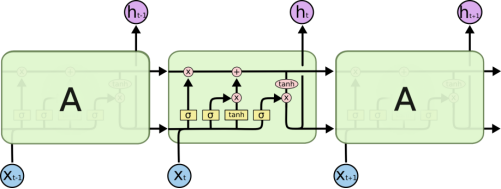

图8.16  LSTM单元的基本架构

图8.16最上方的c<sub>t-1</sub>到c<sub>t</sub>的总线贯穿始终，是整个LSTM网络的核心。在总线的下方是三个门。从左到右的三个门分别为遗忘门，输入门和输出门。

**LSTM首先决定哪些信息需要从记忆单元中被遗忘。遗忘门通过一个sigmoid激活函数来实现这一点。给定当前输入和上一个隐藏状态，遗忘门会为记忆单元中的每个元素生成一个介于0到1之间的值。值为0表示该元素应该被遗忘（即，梯度为0），而值为1表示该元素应该被保留。然后，这个值会与记忆单元中的旧内容相乘，从而实现遗忘操作。**

对于遗忘门，它的作用是将接收过的信息进行选择性地遗忘，可以主动调节不同位置信息的作用大小。对此，有：

$$
{f_t} = \sigma ({W_f}({h_{t - 1}},{x_t}) + {b_f})
$$

**接下来，LSTM决定哪些新信息将被存储在记忆单元中。输入门由两部分组成：一个sigmoid层和一个tanh层。Sigmoid层决定哪些值我们将要更新，而tanh层则创建一个新的候选值向量，这些值可以被加入到记忆单元中。**

而输入门的作用是更新单元的状态。将新的信息有选择性地输入来代替被遗忘的信息，并生成候选向量C。下面的方程解释了输入门生成的候选向量：

$$
\begin{array}{c}
{i_t} = \sigma ({W_i}({h_{t - 1}},{x_t}) + {b_i})\\
C = \tanh ({W_C}({h_{t - 1}},{x_t}) + {b_C})
\end{array}
$$

**输出门决定了记忆单元中的哪些信息将被用于当前的输出。首先，一个sigmoid层决定记忆单元中哪些信息是重要的。然后，这些信息会通过一个tanh激活函数，将它们转换为-1到1之间的值。最后，这些值与sigmoid门的输出相乘，以决定最终的输出。**

输出门可以给出结果，同时将先前的信息保存到隐层中去。同样的，有：

$$
\begin{array}{l}
{o_t} = \sigma ({W_o}({h_{t - 1}},{x_t}) + {b_o})\\
{c_t} = {f_t} \cdot {c_{t - 1}} + {i_t} \cdot C\\
{h_t} = {o_t} \cdot \tanh ({c_t})
\end{array}
$$

可以看到，LSTM宏观上也是关于x<sub>t-1</sub>和x<sub>t</sub>的函数，但是由于多了门控单元对长期信息和短期信息的不同处理模式，网络能够对先前的长期信息保持一定记忆，这克服了传统RNN只能针对先前的短期数据进行计算的缺点。


### 9.10.3  深度学习的发展

深度学习的概念源于人工神经网络的研究。在20世纪80年代，神经网络的研究已经取得了初步的成果。然而，由于计算能力的限制和训练方法的不足，神经网络的性能并未得到充分发挥。直到2006年，深度学习的概念被提出，才真正开启了神经网络的新篇章。深度学习通过构建多层次的神经网络结构，使得机器能够从原始数据中提取出更高级的特征，从而提高了分类和识别的准确率。

随着计算能力的提升和大数据的出现，深度学习在近年来得到了飞速的发展。2012年，AlexNet在./src/imageNet挑战赛中取得了优异的成绩，标志着深度学习在计算机视觉领域的突破。随后，卷积神经网络（CNN）在语音识别、自然语言处理等领域也取得了显著的进展。此外，循环神经网络（RNN）和长短期记忆网络（LSTM）等深度学习模型在处理序列数据方面也表现出了强大的能力。

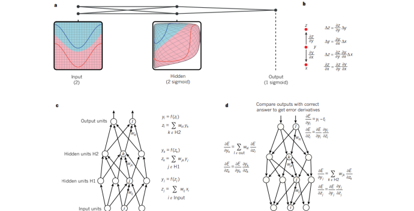

深度学习已经在许多领域得到了广泛应用。在图像识别方面，深度学习可以用于人脸识别、物体检测等任务。在自然语言处理领域，深度学习可以实现机器翻译、情感分析、问答系统等应用。在医疗领域，深度学习可以帮助医生进行疾病诊断和治疗方案的制定。此外，深度学习还在金融、自动驾驶、语音助手等领域得到了广泛应用。

随着技术的不断发展，深度学习的未来发展前景广阔。一方面，随着计算能力的不断提升，深度学习的模型规模和训练数据量将进一步扩大，从而提高模型的性能和泛化能力。另一方面，随着深度学习算法的不断优化和创新，将会有更多的问题得到解决。例如，目前深度学习在处理自然语言理解、语音识别等方面的性能已经达到了较高的水平，但在处理语义理解、常识推理等方面仍存在挑战。未来，深度学习有望在这些领域取得更大的突破。

此外，深度学习与强化学习的结合也是未来的一个重要趋势。目前，深度学习已经在监督学习和无监督学习方面取得了很大的进展，但强化学习仍然是一个具有挑战性的领域。未来，通过将深度学习与强化学习相结合，有望实现更加智能化的决策和行为。


## 9.11  使用PyTorch实现神经网络
目前Python实现深度学习的最佳框架就是PyTorch。本讲以PyTorch为基础，介绍神经网络的搭建与训练。

### 9.11.1  Torch基本语法

Torch的运算基于张量进行。张量本质上是向量与矩阵的扩展。在torch中，我们有几种常见的张量创建方法：
1. 随机初始化矩阵
我们可以通过`torch.rand()`的方法，构造一个随机初始化的矩阵：

```python

import torch
x = torch.rand(4, 3) 
print(x)
```
```python
tensor([[0.7569, 0.4281, 0.4722],
        [0.9513, 0.5168, 0.1659],
        [0.4493, 0.2846, 0.4363],
        [0.5043, 0.9637, 0.1469]])
```
2. 全0矩阵的构建
我们可以通过`torch.zeros()`构造一个矩阵全为 0，并且通过`dtype`设置数据类型为 long。除此以外，我们还可以通过torch.zero_()和torch.zeros_like()将现有矩阵转换为全0矩阵.

```python
import torch
x = torch.zeros(4, 3, dtype=torch.long)
print(x)
```
```python
tensor([[0, 0, 0],
        [0, 0, 0],
        [0, 0, 0],
        [0, 0, 0]])
```
3. 张量的构建
 我们可以通过`torch.tensor()`直接使用数据，构造一个张量：
```python
import torch
x = torch.tensor([5.5, 3]) 
print(x)
```
```python
tensor([5.5000, 3.0000])
```
在接下来的内容中，我们将介绍几种常见的张量的操作方法：
1. 加法操作：
```python
import torch
# 方式1
y = torch.rand(4, 3) 
print(x + y)

# 方式2
print(torch.add(x, y))

# 方式3 in-place，原值修改
y.add_(x) 
print(y)
```
```python
tensor([[ 2.8977,  0.6581,  0.5856],
        [-1.3604,  0.1656, -0.0823],
        [ 2.1387,  1.7959,  1.5275],
        [ 2.2427, -0.3100, -0.4826]])
tensor([[ 2.8977,  0.6581,  0.5856],
        [-1.3604,  0.1656, -0.0823],
        [ 2.1387,  1.7959,  1.5275],
        [ 2.2427, -0.3100, -0.4826]])
tensor([[ 2.8977,  0.6581,  0.5856],
        [-1.3604,  0.1656, -0.0823],
        [ 2.1387,  1.7959,  1.5275],
        [ 2.2427, -0.3100, -0.4826]])

```
2. 索引操作：(类似于numpy)

**需要注意的是：索引出来的结果与原数据共享内存，修改一个，另一个会跟着修改。如果不想修改，可以考虑使用copy()等方法**

```python
import torch
x = torch.rand(4,3)
# 取第二列
print(x[:, 1]) 
```
```python
tensor([-0.0720,  0.0666,  1.0336, -0.6965])
```

```python
y = x[0,:]
y += 1
print(y)
print(x[0, :]) # 源tensor也被改了了
```
```python
tensor([3.7311, 0.9280, 1.2497])
tensor([3.7311, 0.9280, 1.2497])
```
3. 维度变换
张量的维度变换常见的方法有`torch.view()`和`torch.reshape()`，下面我们将介绍第一中方法`torch.view()`：

```python
x = torch.randn(4, 4)
y = x.view(16)
z = x.view(-1, 8) # -1是指这一维的维数由其他维度决定
print(x.size(), y.size(), z.size())
```
```python
torch.Size([4, 4]) torch.Size([16]) torch.Size([2, 8])
```
注: `torch.view()` 返回的新`tensor`与源`tensor`共享内存(其实是同一个`tensor`)，更改其中的一个，另外一个也会跟着改变。(顾名思义，view()仅仅是改变了对这个张量的观察角度)

```python
x += 1
print(x)
print(y) # 也加了了1
```
```python
tensor([[ 1.3019,  0.3762,  1.2397,  1.3998],
        [ 0.6891,  1.3651,  1.1891, -0.6744],
        [ 0.3490,  1.8377,  1.6456,  0.8403],
        [-0.8259,  2.5454,  1.2474,  0.7884]])
tensor([ 1.3019,  0.3762,  1.2397,  1.3998,  0.6891,  1.3651,  1.1891, -0.6744,
         0.3490,  1.8377,  1.6456,  0.8403, -0.8259,  2.5454,  1.2474,  0.7884])
```
上面我们说过torch.view()会改变原始张量，但是很多情况下，我们希望原始张量和变换后的张量互相不影响。为为了使创建的张量和原始张量不共享内存，我们需要使用第二种方法`torch.reshape()`， 同样可以改变张量的形状，但是此函数并不能保证返回的是其拷贝值，所以官方不推荐使用。推荐的方法是我们先用 `clone()` 创造一个张量副本然后再使用 `torch.view()`进行函数维度变换 。

注：使用 `clone()` 还有一个好处是会被记录在计算图中，即梯度回传到副本时也会传到源 Tensor 。
3. 取值操作
如果我们有一个元素 `tensor` ，我们可以使用 `.item()` 来获得这个 `value`，而不获得其他性质：

```python
import torch
x = torch.randn(1) 
print(type(x)) 
print(type(x.item()))
```
```python
<class 'torch.Tensor'>
<class 'float'>
```
PyTorch中的 Tensor 支持超过一百种操作，包括转置、索引、切片、数学运算、线性代数、随机数等等，具体使用方法可参考[官方文档](https://pytorch.org/docs/stable/tensors.html)。

## 2.1.4 广播机制

当对两个形状不同的 Tensor 按元素运算时，可能会触发广播(broadcasting)机制：先适当复制元素使这两个 Tensor 形状相同后再按元素运算。

```python
x = torch.arange(1, 3).view(1, 2)
print(x)
y = torch.arange(1, 4).view(3, 1)
print(y)
print(x + y)
```
```python
tensor([[1, 2]])
tensor([[1],
        [2],
        [3]])
tensor([[2, 3],
        [3, 4],
        [4, 5]])
```

由于x和y分别是1行2列和3行1列的矩阵，如果要计算x+y，那么x中第一行的2个元素被广播 (复制)到了第二行和第三行，⽽y中第⼀列的3个元素被广播(复制)到了第二列。如此，就可以对2个3行2列的矩阵按元素相加。

### 9.11.2  全连接神经网络搭建

```python
import numpy as np
import torch
from collections import Counter
from sklearn import datasets
import torch.nn.functional as Fun

# 1. 数据准备
dataset = datasets.load_iris()
dataut=dataset['data']
priciple=dataset['target']
input=torch.FloatTensor(dataset['data'])
label=torch.LongTensor(dataset['target'])

# 2. 定义BP神经网络
class Net(torch.nn.Module):
    def __init__(self, n_feature, n_hidden, n_output):
        super(Net, self).__init__()
        self.hidden = torch.nn.Linear(n_feature, n_hidden)   # 定义隐藏层网络
        self.out = torch.nn.Linear(n_hidden, n_output)   # 定义输出层网络

    def forward(self, x):
        x = Fun.relu(self.hidden(x))      # 隐藏层的激活函数,采用relu,也可以采用sigmod,tanh
        x = self.out(x)                   # 输出层不用激活函数
        return x

# 3. 定义优化器损失函数
net = Net(n_feature=4, n_hidden=20, n_output=3)    #n_feature:输入的特征维度,n_hiddenb:神经元个数,n_output:输出的类别个数
optimizer = torch.optim.SGD(net.parameters(), lr=0.02) # 优化器选用随机梯度下降方式
loss_func = torch.nn.CrossEntropyLoss() # 对于多分类一般采用的交叉熵损失函数,

# 4. 训练数据
for t in range(500):
    out = net(input)                 # 输入input,输出out
    loss = loss_func(out, label)     # 输出与label对比
    optimizer.zero_grad()   # 梯度清零
    loss.backward()         # 前馈操作
    optimizer.step()        # 使用梯度优化器

# 5. 得出结果
out = net(input) #out是一个计算矩阵，可以用Fun.softmax(out)转化为概率矩阵
prediction = torch.max(out, 1)[1] # 返回index  0返回原值
pred_y = prediction.data.numpy()
target_y = label.data.numpy()

# 6.衡量准确率
accuracy = float((pred_y == target_y).astype(int).sum()) / float(target_y.size)
print("莺尾花预测准确率",accuracy)
```

### 9.11.3  循环神经网络搭建

```python
# 配置环境
import matplotlib.pyplot as plt
import pandas as pd
import torch.nn as nn
import numpy as np
import torch.optim


# ---------------- 准备数据 -------------------
data = pd.read_csv('Hospital1.csv')  # 读取csv文件
data = np.array(data['RATE'])  # 提取占有率
seq_l = 6  # 回溯及预测步长，其间隔为 5min


# 构造 rnn 模型数据结构
def rnn_data(sequence, length):
    output_sequence = np.zeros([sequence.shape[0]-length, length, 1])  # [batch, seq, feature]
    output_y = np.zeros([sequence.shape[0]-length, 1])
    for i in range(sequence.shape[0] - length):
        output_sequence[i, :, 0] = sequence[i:(i+length)]
        output_y[i, 0] = sequence[i+length]
    return output_sequence, output_y


x, y = rnn_data(data, seq_l)
x_tensor = torch.tensor(x, dtype=torch.float)  # 转化为 torch.tensor 格式
y_tensor = torch.tensor(y, dtype=torch.float)


# ---------------- 搭建模型 -------------------
class LSTM(nn.Module):
    def __init__(self, input_size, hidden_size, output_size, seq_l):
        super().__init__()
        self.lstm = nn.LSTM(input_size, hidden_size, batch_first=True)  # lstm layer
        self.linear = nn.Linear(hidden_size * seq_l, output_size)  # linear layer

    def forward(self, x_in):
        x_in, _ = self.lstm(x_in)
        b, s, f = x_in.shape  # batch_size, sequence_length, feature_number
        x_in = x_in.reshape(b, s * f)
        x_in = self.linear(x_in)
        return x_in


# ---------------- 初始化、实例化 -------------------
net = LSTM(1, 12, 1, seq_l)  # 网络
loss_function = nn.MSELoss()  # 损失函数
optimizer = torch.optim.Adam(net.parameters())  # 优化器
epoch = 1000  # 最大迭代次数


# ---------------- 训练 -------------------
for i in range(epoch):
    optimizer.zero_grad()  # 梯度清零
    y_predict = net(x_tensor)  # 预测
    loss = loss_function(y_predict, y_tensor)  # 计算损失
    loss.backward()  # 损失回传，计算梯度
    optimizer.step()  # 根据梯度更新模型

 # 拟合曲线图
    if (i+1) % 10 == 0:
        print('loss =', loss.item())
        x_plot = x_tensor.detach().numpy()
        y_predict_plot = y_predict.detach().numpy()
        y_plot = y_tensor.detach().numpy()
        plt.clf()
        plt.plot(y_plot, label='original')
        plt.plot(y_predict_plot, label='predicted')
        plt.legend()
        plt.tight_layout()
        plt.pause(0.5)
        plt.ioff()
```

## 9.12  聚类算法
这一节不讲分类讲聚类。聚类理论上是一种无监督学习问题，样本是没有标记的，也就算不出来准确率。这一节的算法虽然形式上和KNN、决策树这些内容有一定的相似和互通之处，但核心上这是两类完全不同的问题！

### 9.12.1  基于原型的聚类算法：KMeans算法

假设你有一组客户数据，每个客户都有一些特征，比如年龄、收入和购买历史。现在，你想将这些客户分成两组。对于分类问题，你可以设定一个规则，比如将年龄小于30岁的客户归为一组，年龄大于30岁的客户归为另一组。这样，你的目标就是判断每个客户属于哪个年龄段。对于聚类问题，你可以不设定任何规则，而是让算法根据客户之间的相似性自动将他们分成两组。比如，算法可能会发现有一组客户年龄较轻且收入较高，另一组客户年龄较老且收入较低。这样，你的目标就是找到数据中的自然分组或集群。分类问题通常基于明确规则或阈值进行分类，而聚类问题则基于数据之间的相似性进行分组，以发现数据中的自然集群。

k-means 算法是根据给定的 n 个数据对象的数据集，构建 k 个划分聚类的方法，每个划分聚类即为一个簇。该方法将数据划分为 n 个簇，每个簇至少有一个数据对象，每个数据对象必须属于而且只能属于一个簇。同时要满足同一簇中的数据对象相似度高，不同簇中的数据对象相似度较小。聚类相似度是利用各簇中对象的均值来进行计算的。

K-Means算法的基本流程如下：

- 选择K值：需要确定要将数据集分成多少个类别，即簇的数量K。这一参数往往在最开始就需要设定好。
- 初始化质心：随机从数据集中选择K个点作为初始的簇中心。这些点通常是数据集中的任意点，但最常见的是选择K个数据点的均值作为初始质心。
- 分配数据点：接下来，算法会遍历数据集中的每个点，并根据这些点与簇中心的距离，将其分配给最近的簇中心。这个过程叫做“分配”。计算每个数据点到每个质心的距离时，通常使用欧几里得距离或余弦相似度等度量方法。
- 重新计算质心：一旦数据点被分配给了各自的簇，算法会重新计算每个簇的质心。这是通过取每个簇中所有点的坐标的平均值来完成的。新的质心将被设置为每个簇所有点的平均位置。
- 迭代优化：然后，算法回到步骤3，再次分配数据点，并重新计算质心。这个过程会重复进行多次，直到达到预设的迭代次数或质心位置的变化小于某个预设的阈值。这个阈值用于判断质心是否已经稳定，即是否已经收敛。
- 输出结果：最后，算法会输出K个簇和每个数据点的归属。每个数据点将属于与其最近的质心所在的簇。同时，还会输出每个簇的质心位置，这些质心表示了每个簇的中心点或平均形态。

KMeans算法对初始质心的选择和K值的确定非常敏感。不同的初始质心可能会导致完全不同的聚类结果，而K值的选取也会影响聚类的质量和效果。通过迭代并尝试不同的K值和初始质心，以找到最佳的聚类结果。最佳K值往往通过肘部图法获得，也就是绘制silhoutte稀疏随k的变化曲线找到曲线拐点即可。

衡量聚类好坏的标准可以用轮廓系数来描述。轮廓系数的定义为

$$
s(i) = \frac{{b(i) - a(i)}}{{\max \{ a(i),b(i)\} }}
$$

其中，*a*(***i***)是***i***向量到同一簇内其他点不相似程度的平均值，*b*(***i***)是***i***向量到其他簇的平均不相似程度的最小值。轮廓系数在[-1,1]之间，越大越合理。

判断最优的*K*值会采取肘部图策略。肘部法则的计算原理是分析损失函数随着聚类簇数量的变化曲线找到其拐点。聚类中的损失函数是每个变量点到其类别中心的位置距离平方和。在选择类别数量上，肘部法则会把不同值的成本函数值画出来。肘部就是指这个图的拐点，下降从快到慢的点。

对上述代码进行Python实现如下：
```python
def init_cent(dataset,K):

    idx=np.random.choice(np.arange(len(dataset)),size=K,replace=False)

    return dataset[idx]

def Kmeans(dataset,K,init_cent):

    centroids=init_cent(dataset,K)

    cluster=np.zeros(len(dataset))

    changed=True

    while changed:

        changed=False

        loss=0

        for i,data in enumerate(dataset):

            dis=np.sum((centroids-data)**2,axis=-1)

            k=np.argmin(dis)

            if cluster[i]!=k:

`                `cluster[i]=k

`                `changed=True

            loss+=np.sum((data-centroids[k])**2)

        for i in range(K):

            centroids[i]=np.mean(dataset[cluster==i],axis=0)

    return centroids,cluster
```
在sklearn.cluster中也提供了KMeans算法的接口。例如，可以看到下面的案例。
```python
from sklearn.cluster import KMeans  

import numpy as np  

# 创建一个随机数据集  

X = np.random.rand(100, 2)   

# 创建KMeans聚类模型，设置簇的数量为3  

kmeans = KMeans(n_clusters=3)  

# 使用数据集拟合模型  

kmeans.fit(X)  

# 输出聚类中心点  

print("Cluster centers:")  

print(kmeans.cluster_centers_)  

# 对数据集进行预测，得到每个数据点的聚类标签  

labels = kmeans.predict(X)  

print("Labels of data points:")  

print(labels)
```
这段代码首先导入所需的库和模块，然后创建一个随机数据集。接下来，创建一个KMeans聚类模型，并设置簇的数量为3。然后，使用数据集拟合模型，并输出聚类中心点。最后，对数据集进行预测，得到每个数据点的聚类标签。

### 9.12.2  基于层次的聚类算法：层次聚类法

层次聚类法是一种基于距离的聚类算法，它将数据点按照距离的远近进行层次式的分组，使得同一组内的数据点尽可能相似或接近，不同组之间的数据点尽可能不同或远离。为什么需要引入层次聚类法：在许多实际应用中，我们可能需要对数据进行更细致的分类或者处理具有层次结构的数据。例如，在市场细分中，我们可能希望将消费者按照购买行为、偏好和特征进行更精细的分类；在社交网络分析中，我们可能希望找到具有相似兴趣或行为的用户群体。层次聚类法可以帮助我们实现这些目标，因为它能够揭示数据的层次结构和细微差别，并提供更为精确和细致的聚类结果。

层次聚类法按照聚类的顺序可以分为自底向上和自顶向下两种类型。

- 自底向上的层次聚类（凝聚层次聚类）：先单独考虑每个对象，然后逐渐合并这些原子簇，直到所有对象都在一个簇中或满足终止条件。这种方法的优点是不需要预先设定簇的数量，适合发现任意形状的簇，并且对异常值不敏感。缺点是计算量大，容易受到初始值的影响，可能陷入局部最优解。
- 自顶向下的层次聚类（分裂层次聚类）：开始时将所有对象视作一个簇，然后逐渐分裂这个簇，直到每个对象都是一个簇或满足终止条件。优点是可以发现任意形状的簇，能够处理大规模数据集。缺点是需要预先设定簇的数量，容易受到初始值的影响，可能陷入局部最优解。

这两种方法没有孰优孰劣之分，只是在实际应用的时候要根据数据特点以及你想要的“类”的个数，来考虑是自上而下更快还是自下而上更快。判断”类”的方法就是：最短距离法、最长距离法、中间距离法、类平均法等，其中类平均法往往被认为是最常用也最好用的方法，一方面因为其良好的单调性，另一方面因为其空间扩张/浓缩的程度适中。

自顶而下的层次聚类输入样本数据和聚类数量后进行以下操作。

（1）将样本归为一类。

（2）在一个类中计算样本的距离，找到距离最远的a和b。

（3）将a和b分到两个不同的簇中。

（4）剩下样本到a和到b哪个距离更小就去哪个簇。

（5）递归生成聚类树。

自底而上的层次聚类则按照以下顺序进行。

（1）一个样本作为一个类。

（2）计算两两之间的距离，最小的两个点合并为一个类别。

（3）重复上一个操作，直到所有数据被归为一类。

基于scipy可以实现层次聚类法。例如，参考下面的代码：
```python
import numpy as np  

import matplotlib.pyplot as plt  

from scipy.cluster.hierarchy import dendrogram, linkage  

# 生成随机数据  

np.random.seed(0)  

X = np.random.multivariate_normal([0, 0], [[1, 0.5], [0.5, 1]], size=500)  

# 执行层次聚类  

linked = linkage(X, 'ward')  

# 绘制层次聚类模型图  

fig = plt.figure(figsize=(10, 7))  

dendrogram(linked,  

                      orientation='top',  

                      distance_sort='descending',  

                      show_leaf_counts=True)  

plt.show()
```
首先，我们使用numpy库生成一个500个样本的随机数据集。然后，我们使用scipy.cluster.hierarchy模块中的linkage函数执行层次聚类。最后，我们使用matplotlib库中的dendrogram函数绘制层次聚类模型图如图所示。

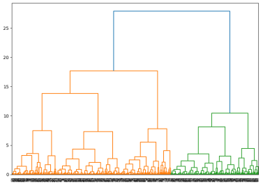

在图中，每个节点表示一个数据点，节点之间的连线表示聚类关系。上面的代码在sklearn中也有对应的接口，我们使用sklearn库中的AgglomerativeClustering类执行层次聚类。该类提供了许多参数来控制聚类的过程，其中n_clusters指定了最终要形成的簇的数量，affinity指定了相似度的度量方式（这里使用欧几里得距离），memory参数用于指定用于存储中间结果的内存大小。我们用sklearn来改写上面的代码：
```python
from sklearn.cluster import AgglomerativeClustering  

import matplotlib.pyplot as plt  

# 生成随机数据  

X = np.random.multivariate_normal([0, 0], [[1, 0.5], [0.5, 1]], size=500)   

# 执行层次聚类  

cluster = AgglomerativeClustering(n_clusters=2, affinity='euclidean', memory='auto')  

cluster.fit(X)  

labels = cluster.labels_

# 绘制层次聚类模型图  

fig = plt.figure(figsize=(10, 7))  

plt.scatter(X[:, 0], X[:, 1], c=labels)  

plt.show()
```
### 9.12.3  基于密度的聚类算法：DBSCAN算法

DBSCAN算法是密度聚类算法，所谓密度聚类算法，就是说这个算法是根据样本的密集程度来进行聚类。但在介绍具体的算法之前，先来介绍一些基本的定义和概念。要根据样本中的数据密度进行聚类，首先定义样本中数据密度大的地方应该怎样表示，于是引出了两个概念：

（1）<i>ε</i>-邻域：若<i>X<sub>i</sub></i>是一个样本点，邻域就是指距离<i>X<sub>i</sub></i>不超过<i>ε</i>的范围。本质上，就是衡量离<i>A</i>样本有多远。

（2）核心对象：如果<i>X<sub>i</sub></i>的<i>ε</i>-邻域内至少含有<i>M</i>个样本，则<i>X<sub>i</sub></i>是一个核心对象。这个<i>M</i>也被定义为密集的阈值。

有了这两个定义以后，下面定义核心对象之间的几何关系。

（1）密度直达：如果*B*样本位于*A*样本的*ε*-邻域内，则称*A*样本和*B*样本密度直达。

（2）若*A*样本和*B*样本密度直达，*B*样本和*C*样本密度直达，*A*样本和*C*样本之间不是密度直达，则称*A*样本和*C*样本密度可达。

（3）若*B*样本和*A*、*C*样本均密度可达，则称*A*样本和*C*样本密度相连。

本质上，这个算法就是统计数据中的核心对象并将其归类，但这个算法有一个特点就是非核心对象会被判定为离群点，所以安排一个特殊的离群类并记为-1。具体的代码操作如下。

**DBSCAN是一种基于密度的聚类算法，它通过样本点的密集程度来进行聚类。在深入探讨DBSCAN算法之前，让我们先了解一下与密度聚类相关的一些基本概念。**

**我们定义一个样本点Xi的ε-邻域，这指的是与Xi的距离不超过ε的所有样本点构成的区域。这个ε值帮助我们衡量样本之间的接近程度。**

**我们引入核心对象的概念。如果一个样本点Xi的ε-邻域内包含至少M个样本，那么Xi被称为核心对象。这里的M被称为密度阈值，它决定了什么樣的样本点被视为密集区域的一部分。**

**了解核心对象后，我们可以定义它们之间的几种特殊几何关系：**

**1. 密度直达：如果样本点B位于样本点A的ε-邻域内，那么我们说A和B是密度直达的。**

**2. 密度可达：如果样本点B是样本点A的密度直达点，且B也是样本点C的密度直达点，但A和C之间不是密度直达，那么我们说A和C是密度可达的。**

**3. 密度相连：如果样本点B同时与样本点A和C密度可达，那么我们说A和C是密度相连的。**

**DBSCAN算法的基本原理就是识别这些核心对象和它们之间的密度连接，并将它们聚类。算法还会将非核心对象（即那些ε-邻域内少于M个样本的点）视为离群点，并将它们归为特殊的离群类，通常标记为-1。**

**在实际应用中，DBSCAN算法的代码实现涉及以下几个步骤：**

**1. 选择合适的ε值和M值。**

**2. 计算每个样本点的ε-邻域。**

**3. 确定核心对象。**

**4. 建立密度连接关系。**

**5. 合并密度相连的核心对象为同一聚类。**

**6. 将离群点分类。**

通过上述步骤，DBSCAN能够有效地对数据集进行聚类，识别出数据中的模式和结构。

我们可以使用sklearn.cluster模块中的DBSCAN类执行DBSCAN聚类。在创建DBSCAN对象时，我们指定两个参数：eps和min_samples。eps参数指定了两个样本被认为是邻居的最大距离，而min_samples参数指定了一个样本点被视为核心点所需的最小邻居数。通过调整这些参数，我们可以控制聚类的结果。例如，参考下面的代码：
```python
from sklearn.cluster import DBSCAN  

from sklearn.datasets import make_moons  

import matplotlib.pyplot as plt  

# 生成半月形数据集  

X, y = make_moons(n_samples=200, noise=0.05, random_state=0)  

# 执行DBSCAN聚类  

dbscan = DBSCAN(eps=0.3, min_samples=5)  

dbscan.fit(X)  

labels = dbscan.labels_  

# 绘制聚类结果  

unique_labels = set(labels)  

colors = [plt.cm.Spectral(each)  

`          `for each in np.linspace(0, 1, len(unique_labels))]  

for k, col in zip(unique_labels, colors):  

    if k == -1:  

        # Black used for noise.  

        col = [0, 0, 0, 1]  

    class_member_mask = (labels == k)  

    xy = X[class_member_mask & (labels != -1)]  

    plt.plot(xy[:, 0], xy[:, 1], 'o', markerfacecolor=tuple(col),  

`             `markeredgecolor='k', markersize=14)  

plt.title('DBSCAN')  

plt.show()
```
效果如图所示：

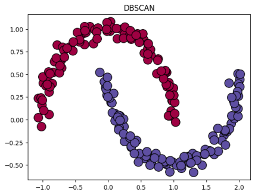
### 9.12.4  基于模型的聚类算法：高斯混合聚类法

大家还记得正态分布吗？正态分布不仅有一元正态分布，还有多元正态分布。实际上，任何一组样本其实都可以看做是若干个正态分布的叠加。高斯混合聚类就是基于这种思想，GMM也可以看作是K-means的推广，因为GMM不仅是考虑到了数据分布的均值，也考虑到了协方差。和K-means一样，我们需要提前确定簇的个数。GMM的基本假设为数据是由几个不同的高斯分布的随机变量组合而成，而聚类的任务就是确定数据的叠加方法。

假设要将样本分为K个簇，每个簇有对应的均值与协方差矩阵，为了确定样本属于每个簇的概率大小，将这个概率写作矩阵W并构造最大似然函数：

$$
L(W) = \prod\limits_{i = 1}^n {\left( {\sum\limits_{j = 1}^k {{W_{i,j}}P({X_i}|{\mu _j},{\Sigma _j})} } \right)} 
$$

接下来的操作就是要通过优化W找到最佳的似然函数极小值了。这里选择使用EM算法。EM（Expectation-Maximization）算法是一种迭代优化算法，主要用于寻找参数的最大似然估计。它的基本思想是：在每一步迭代中，先对参数进行估计，然后根据这些估计值来更新模型，接着再用新的模型来估计参数，如此反复迭代，直到参数收敛或达到预设的迭代次数。

在进行优化过程时，需要轮换执行E操作和M操作。对于E操作，主要目的是更新W。第i个变量属于第m簇的概率为：
$$
{W_{i,m}} = \frac{{{\pi _m}P({X_i}|{\mu _j},{\Sigma _j})}}{{\sum\limits_{j = 1}^n {{\pi _j}P({X_i}|{\mu _j},{\Sigma _j})} }}
$$

根据W，我们就可以更新每一簇的占比。而在M步骤中，我们需要根据上面一步得到的W来更新均值和方差。 因为这里的数据是二维的，第m簇的第k个分量的均值与方差：

$$
\begin{array}{l}
{\mu _{m,k}} = \frac{{\sum\limits_{i = 1}^n {{W_{i,m}}{X_{i,k}}} }}{{\sum\limits_{i = 1}^n {{W_{i,m}}} }}\\
{\Sigma _{m,k}} = \frac{{\sum\limits_{i = 1}^n {{W_{i,m}}{{({X_{i,k}} - {\mu _{m,k}})}^2}} }}{{\sum\limits_{i = 1}^n {{W_{i,m}}} }}
\end{array}
$$

Python使用mixture中的GaussianMixture实现高斯混合聚类。例如，我们看到下面的简单案例：
```python
from sklearn.mixture import GaussianMixture  

import numpy as np  

import matplotlib.pyplot as plt  


# 生成随机样本数据  

np.random.seed(0)  

X = np.concatenate([  

    np.random.multivariate_normal([0, 0], [[1, 0.5], [0.5, 1]], 50),  

    np.random.multivariate_normal([0, 5], [[1, 0.5], [0.5, 1]], 50),  

    np.random.multivariate_normal([5, 0], [[1, 0.5], [0.5, 1]], 50),  

    np.random.multivariate_normal([5, 5], [[1, 0.5], [0.5, 1]], 50)  

])  


# 使用GaussianMixture进行聚类  

gmm = GaussianMixture(n_components=4)  

gmm.fit(X)  

labels = gmm.predict(X)  


# 可视化聚类结果  

plt.scatter(X[:, 0], X[:, 1], c=labels)  

plt.show()
```
这段代码会生成四个基于正态分布的样本混合，将其聚类成四类。聚类效果如图所示：

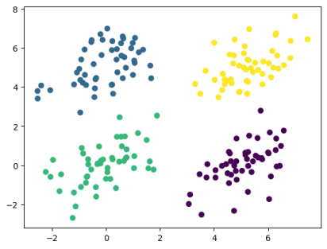

可以看到，算法能够较为准确地分析出样本的分布规律。
## 9.13  关联关系挖掘模型
关联规则挖掘发现大量数据中项集之间有趣的关联或者相互联系。关联规则挖掘的一个典型例子就是购物篮分析，该过程通过发现顾客放入其购物篮中不同商品之间的联系，分析出顾客的购买习惯，通过了解哪些商品频繁地被顾客同时买入，能够帮助零售商制定合理的营销策略。

注意：关联关系和相关关系是两码事！

### 9.13.1  关联关系的定义

在几十年前的美国有一个怪现象，一个超市的员工发现，超市里面啤酒和尿布在同一个购物篮里面的频率特别高。这个现象引起了统计学家的注意，他们开始思考：是否还具有这类我们没想到的关联物品？由此引发了关联关系挖掘的研究。其实，想要解释这件事并不难，因为在几十年前的美国，家里面打酱油啊买尿布啊这些事都是爸爸在做。爸爸在出门给孩子买尿布的时候捎几瓶啤酒晚上回去宵夜，很合理吧？

但是挖掘关联关系只能靠统计一起出现的商品频率吗？这个频率应该多少次算高呢？这个量化够吗？

关联关系挖掘是一种数据挖掘技术，用于发现数据集中的关联规则和模式。它通过分析数据集中的项之间的关系，揭示它们之间的潜在关联性。关联关系挖掘的目标是找到频繁项集和强关联规则。频繁项集指的是在数据集中经常同时出现的项集，而强关联规则指的是具有一定置信度和支持度的关联规则。通过计算支持度和置信度，可以筛选出频繁项集和强关联规则。为了量化关联规则，我们先引入一些概念：

- 项和项集。在关联规则挖掘中，“项”可以看作是单个的商品或产品，而“项集”则是由多个项组成的集合，例如“牛奶”和“面包”都可以看作是项，而“牛奶、面包”的组合则是一个项集。如果一个项集包含*k*个项，则称它为*k*-项集。空集是指不包含任何项的项集。例如，｛啤酒,尿布,牛奶｝是一个3-项集。
- 支持度。支持度描述的是一个项集在数据集中出现的频率，简单来说就是有多少人同时购买了这些商品。例如，如果100个人中有50个人同时购买了牛奶和面包，那么“牛奶、面包”这个项集的支持度就是50%。项集的一个重要性质是它的支持度计数，即包含特定项集的事务个数。说白了就是这些订单里面包含想研究的关联商品的单数。支持度被定义为：

$$
S\left( {X \to Y} \right) = \frac{{\sigma \left( {X \cup Y} \right)}}{N}
$$

- 置信度。置信度则是指当某个项集中的商品出现时，另一个商品出现的概率有多大。例如，如果购买牛奶的人中有70%的人也会购买面包，那么“如果牛奶，那么面包”这个关联规则的置信度就是70%。置信度为：

$$
C\left( {X \to Y} \right) = \frac{{\sigma \left( {X \cup Y} \right)}}{{\sigma (X)}}
$$

- 关联规则。关联规则是通过支持度和置信度的计算得出的，它表示了商品之间的关联关系。例如，“如果牛奶，那么面包”就是一个关联规则，表示购买牛奶的人很可能会购买面包。关联规则有很多种形式，如“如果A，那么B”、“A和B”、“A->B”等。关联规则是形如*X*→*Y*的蕴含表达式，其中*X*和*Y*是不相交的项集。关联规则的强度可以用它的支持度和置信度来度量。支持度确定规则可以用于给定数据集的频繁程度，而置信度确定*Y*在包含*X*的事务中出现的频繁程度。

### 9.13.2  Apriori算法

Apriori算法是一种用于关联关系挖掘的经典算法。它的基本思想是利用项集的支持度来生成频繁项集，再利用频繁项集生成关联规则。Apriori算法通过不断剪枝和迭代，找出数据集中频繁出现的项集，并利用这些频繁项集来挖掘强关联规则。它的核心思想是利用已知的频繁项集来推导出更大规模的频繁项集，从而减少了计算量和时间复杂度。简单来说，Apriori算法就是通过不断寻找更大规模的频繁项集来发现数据集中的关联规则。

Apriori算法的基本流程如下：

- 初始化：设置参数，包括最小支持度阈值和最小置信度阈值。初始化L1，即频繁1项集的集合。扫描整个数据集，计算每个项集的支持度，将支持度大于或等于最小支持度阈值的项集加入L1。
- 迭代：从L1出发，生成候选的k项集（k大于1），记为Ck。扫描整个数据集，对Ck中的每个候选进行计数，并计算每个候选的支持度。将支持度大于或等于最小支持度阈值的候选加入Lk。
- 剪枝：在生成Ck的过程中，如果存在某个候选的子集的支持度大于该候选本身，那么该候选可以被剪掉，因为它的非空子集的支持度更高。
- 终止：当无法找到更多的Lk时，算法结束。
- 生成关联规则：对于每个频繁项集Lk，如果存在一个子集A和一个超集B，使得A和B都是频繁的，且A和B的交集非空，那么存在一个关联规则“A->B”。计算该规则的置信度，如果置信度大于或等于最小置信度阈值，则输出该规则。


实现一个apriori算法并不困难。在Python中，可以使用apyori包实现该算法。
```python
import pandas as pd  

from apyori import apriori  

# 读取数据集  

data = pd.read_csv('dataset.csv', header=None)  

# 将数据集转换为Apriori算法所需的格式  

data = data.iloc[:, 1:].values  

transactions = list(data)  

# 执行Apriori算法  

min_support = 0.3  

min_confidence = 0.7  

results = apriori(transactions, min_support=min_support, min_confidence=min_confidence)  

# 输出关联规则  

for result in results:  

    print(result)
```
### 9.13.3  FP-Growth算法


Apriori通过不断的构造候选集、筛选候选集挖掘出频繁项集，需要多次扫描原始数据，当原始数据较大时，磁盘I/O次数太多，效率比较低下。这毫无疑问会成为Apriori算法最大的缺点一频繁项集发现的速度太慢。 FP-growth算法其实是在Apriori算法基础上进行了优化得到的算法，FPGrowth算法则只需扫描原始数据两遍，通过FP-tree数据结构对原始数据进行压缩，效率较高。

FP-growth算法只需要对数据库进行了两次扫描，而Apriori算法对于每个潜在的频繁项集都会扫描数据集判定给定模式是否频繁，因此FP-growth算法的速度要比Apriori算法快。在小规模数据集上,这不是什么问题，但是当处理大规模数据集时，就会产生很大的区别。

FP-growth算法主要分为两个步骤：基于数据集构建FP树和从FP树递归挖掘频繁项集。FP-tree构建通过两次数据扫描，将原始数据中的事务压缩到一个FP-tree树，该FP-tree类似于前缀树，相同前缀的路径可以共用，从而达到压缩数据的目的。

在Python中，使用pyfpgrowth库可以实现该算法。可以看到下面的简单demo：
```python
import pyfpgrowth

transactions = [[1, 2, 3],

`                `[2, 4, 5],

`                `[1, 2, 4],

`                `[1, 3, 5],

`                `[2, 3],

`                `[1, 3, 5],

`                `[1, 2, 3, 5],

`                `[1, 2, 3]]


patterns = pyfpgrowth.find_frequent_patterns(transactions, 3)  

rules = pyfpgrowth.generate_association_rules(patterns, 0.5)

print(patterns)

print('===============')

print(rules)
```
代码会找到超过3次的频繁项集并保存在patterns中，并以字典的形式在rule中返回每个规则以及对应的置信度（实际上也可以看做是条件概率）。
## 9.14  图数据与PageRank算法
PageRank是一种由搜索引擎利用网页间超链接计算网页重要度的算法，常被称为网页排名、谷歌左侧排名。该算法是以Google公司创始人拉里·佩奇（Larry Page）的姓氏命名的，作为网页排名的重要要素之一。事实上，PageRank 可以定义在任意有向图上，后来被应用到社会影响力分析、文本摘要等多个问题。

PageRank算法的基本思想是通过对网页之间的链接关系进行分析，计算每个网页的重要程度，从而实现对网页的排序。PageRank算法认为，一个网页的重要性取决于它被其他网页引用的次数以及这些引用的网页的重要性。因此，算法通过分析网页之间的链接关系，构建出一个链接矩阵，然后对这个矩阵进行迭代运算，最终得到每个网页的PageRank值，从而实现对网页的排序。PageRank算法能够有效地解决信息过载问题，帮助用户快速找到高质量的网页，提高搜索结果的准确性和相关性。

PageRank算法的基本概念是在有向图中构建一个随机游走模型，即马尔可夫链的一阶形式。这个模型描述了随机游走者在有向图中如何随机访问各个节点。PageRank表示该马尔可夫链的平稳分布，每个节点的平稳概率值就是其PageRank值。这个值赋予每个网页一个正实数，代表其重要性。所有网页的PageRank值共同构成一个向量，其中PageRank值越高的网页越重要，因此在互联网搜索结果中可能被排在前面。PageRank是递归定义的，可以通过迭代算法进行计算。

如果一个网页的PageRank值越高，那么随机跳转到该网页的概率也就越大，从而该网页的PageRank值会进一步提高，使其变得更为重要。PageRank值依赖于网络的拓扑结构，一旦网络的连接关系确定，PageRank值也就随之确定。

在互联网的有向图上，可以运用PageRank算法进行计算，通常采用迭代过程。先假设一个初始分布，然后通过迭代不断计算所有网页的PageRank值，直到达到收敛状态为止。

PageRank的迭代过程如下面的式子所示：

$$
P(X) = \frac{{1 - d}}{N} + d\sum\limits_{i \to X}^N {\frac{{P({T_i})}}{{C({T_i})}}} 
$$

P表示游走到该节点的概率，T是指向X的所有节点，而C（T）表示节点T的出度。通过阻尼系数d调节使其迭代更加稳定。在最开始，所有节点访问的概率是均等的，随着迭代次数进行不同节点出现了不同的概率，也就反映了不同节点的重要程度。
```python
import numpy as np

# PageRank算法

def pagerank_algorithm(adjacency_matrix, damping_factor=0.85, max_iterations=100, convergence_threshold=0.0001):

    n = len(adjacency_matrix)

    # 构建转移矩阵

    transition_matrix = adjacency_matrix / np.sum(adjacency_matrix, axis=0, keepdims=True)

    # 初始化PageRank向量

    pagerank = np.ones(n) / n

    # 开始迭代

    for i in range(max_iterations):

        old_pagerank = np.copy(pagerank)

        # 计算新的PageRank向量

        pagerank = damping_factor * np.dot(transition_matrix, old_pagerank) + (1 - damping_factor) / n

        # 判断是否收敛

        if np.sum(np.abs(pagerank - old_pagerank)) < convergence_threshold:

            break

    return pagerank

# 测试代码

if __name__ == '__main__':

    links = [(0, 1), (0, 2), (1, 3), (2, 3), (3, 0)]

    n = 4

    adjacency_matrix = np.zeros((n, n))

    for link in links:

        adjacency_matrix[link[1]][link[0]] = 1

    pagerank = pagerank_algorithm(adjacency_matrix)

    print('PageRank:', pagerank)
```


## 9.15  朴素贝叶斯与贝叶斯网络
我想各位在中学阶段其实已经是对线性规划有所了解了，不过如果有些学校没学的话也没关系。在这一节当中我们会回顾以前中学接触到的线性规划，补充一些线性代数的知识和matlab解线性代数问题的指令，最后引出线性规划的基本形式。数学建模是一门应用数学课程，与基础数学不同，我这里不打算抢读者线性代数老师的饭碗太严重，但我们会尽可能多补充一些基础的常用的有关理论。

### 9.15.1  朴素贝叶斯算法

讲朴素贝叶斯算法就不得不提到贝叶斯公式。贝叶斯公式是用来描述两个条件概率之间的关系，比如P(A|B)和P(B|A)。它基于贝叶斯定理，该定理指出在已知先验概率的情况下，可以通过新的证据来更新事件的概率。它的数学表达为：

$$
P(B|A) = \frac{{P(A|B)P(B)}}{{P(A)}}
$$

不知道大家有没有收到过垃圾邮件的经历。现在的邮箱软件是可以自动区分谁是垃圾邮件谁是正常邮件的，怎么做到的呢？首先，有些发信者会在同一时间发送好多封信，这种人多半就是打小广告的。这种就叫做基于行为的垃圾邮件识别。还有一种呢就是因为被太多人举报于是把发信者拉进了黑名单，这种就是基于白名单的垃圾邮件识别。而基于内容的垃圾邮件识别就要用到贝叶斯公式了。具体来说，垃圾邮件分类的任务是根据邮件的特征（如关键词、发件人、主题等）判断该邮件是否为垃圾邮件。首先，我们需要统计训练集中各类别（垃圾邮件、正常邮件）以及各个特征的出现概率。然后，对于待分类的邮件，我们根据其特征计算该邮件属于各个类别的概率。最后，将该邮件归为概率最大的类别。

贝叶斯公式在垃圾邮件分类中的作用原理在于利用条件概率来表示给定特征下各个类别的概率。具体来说，我们使用贝叶斯公式计算给定特征下各个类别的概率，即P(C|X)，其中C表示类别（垃圾邮件或正常邮件），X表示特征（如关键词、发件人、主题等）。在垃圾邮件分类中，贝叶斯公式通常用于实现朴素贝叶斯分类器。该分类器基于贝叶斯定理，通过计算给定特征下各个类别的概率，将待分类的邮件归为概率最大的类别。

朴素贝叶斯算法是一种基于贝叶斯定理的分类方法。它假设各个特征之间相互独立，通过计算每个类别在给定特征下的概率，将待分类的样本归为概率最大的类别。朴素贝叶斯算法在处理文本分类、垃圾邮件过滤等任务中表现出色，并且具有简单、高效的特点。它的核心思想是根据已知的训练数据集，为每个类别计算出特征条件独立的概率，然后利用这些概率来预测新样本的类别。

朴素贝叶斯算法处理垃圾邮件的基本流程可以分为以下几个步骤：

- 特征提取：从邮件数据集中提取出有意义的特征，通常采用TF-IDF（词频-逆文档频率）方法进行特征提取。
- 训练模型：将提取出的特征和对应的类别进行训练，计算出每个特征在不同类别下的条件概率。
- 分类：对未知样本进行分类，根据已知的特征和对应的条件概率计算出每个类别的概率，将样本归为概率最大的类别。

假设我们正在使用朴素贝叶斯分类器对一组文本进行分类，其中一个类别是“正面情感”。我们的训练数据集中包含了一些正面的文本和负面的文本，但是正面的文本数量较少。在训练过程中，我们发现一个常见的词语“好”在正面的文本中出现了很多次，但在负面的文本中只出现了一次。根据朴素贝叶斯分类器的原理，每个词语的出现概率是独立的，因此在计算正面情感类别的条件概率时，我们不能简单地认为“好”这个词语的出现概率是1（在正面的文本中）和0（在负面的文本中）。这是因为负面的文本中“好”这个词出现的概率虽然很小，但并不为0。为了解决这个问题，我们可以使用拉普拉斯平滑方法。拉普拉斯平滑的核心思想是在计算概率时，给每个事件添加一个小的常数，以避免出现零概率的情况。具体来说，我们可以给“好”这个词的出现概率增加一个小的常数（例如0.01），这样在计算正面情感类别的条件概率时，就不会出现分母为0的情况。通过引入拉普拉斯平滑，我们可以更准确地计算每个词语的出现概率，从而使得朴素贝叶斯分类器的分类效果更好。这是因为拉普拉斯平滑方法能够处理训练数据中未出现的事件，避免将它们的概率估计为0。

朴素贝叶斯算法的朴素就在于它的思想其实很简单。实现自己的朴素贝叶斯模型也并不是很困难的事情。下面我们自己实现一个朴素贝叶斯分类器。首先，我们创建一个比较小的分类样本数据：

> 代码参考了<https://blog.csdn.net/phdsky/article/details/95762993>，特别鸣谢！
```python
import numpy as np

import pandas as pd

from sklearn.model_selection import train_test_split

from sklearn.preprocessing import Binarizer

X_train = np.array([[0, 0], [0, 1], [0, 1], [0, 0], [0, 0],

`                          `[1, 0], [1, 1], [1, 1], [1, 2], [1, 2],

`                          `[2, 2], [2, 1], [2, 1], [2, 2], [2, 2]])

y_train = np.array([0, 0, 1, 1, 0, 0, 0, 1, 1, 1, 1, 1, 1, 1, 0])

X_test = np.array([[1, 0]])
```
样本非常小，只有十几个。我们统计一下特征的取值与标签的取值，创建矩阵用于存储先验分布与条件概率。
```python
N = len(y_train)

K = len(np.unique(y_train))

S = len(np.unique(X_train[:,0])) # 特征取值

D = X_train.shape[1]  # 维度

n = len(X_test)

d = X_test.shape[1]

prior = np.zeros(K)

condition = np.zeros((K, D, S)) #条件概率

lambda_=3
```
接下来是实现朴素贝叶斯的主体部分，包括概率计算与预测。
```python
# 朴素贝叶斯训练

def trainNB(X_train, y_train):

    for i in range(0, N):

        prior[y_train[i]] += 1

        for j in range(0, D):

            condition[y_train[i]][j][X_train[i][j]] += 1

    prior_probability = (prior + lambda_) / (N + K*lambda_) # 拉普拉斯平滑

    return prior_probability, condition  

def predictNB(prior_probability, condition, X_test):

    predict_label = -1 * np.ones(n)

    for i in range(0, n):

        predict_probability = np.ones(K)

        to_predict = X_test[i]

        for j in range(0, K):

            prior_prob = prior_probability[j]

            for k in range(0, d):

`                `conditional_probability = (condition[j][k][to_predict[k]] + lambda_) / (sum(condition[j][k]) + S*lambda_)

`                `predict_probability[j] *= conditional_probability

            predict_probability[j] *= prior_prob

        predict_label[i] = np.argmax(predict_probability)

        print("Sample %d predicted as %d" % (i, predict_label[i]))

    return predict_label
```
测试代码如下：
```python
print("Start naive bayes training...")   

prior, conditional = trainNB(X_train=X_train, y_train=y_train)

print("Testing on %d samples..." % len(X_test))

predictNB(prior_probability=prior,condition=conditional,X_test=X_test)
```
经过测试，样本被分类为0，测试结束。这是一个比较简单的实现，有兴趣的同学可以把它扩充为面向对象版本。

### 9.15.2  贝叶斯网络与概率图模型


贝叶斯网络，又称为信念网络或有向无环图模型，是一种强大的概率图形模型。它通过有向无环图来表示变量之间的概率依赖关系，这种图由代表变量的节点和连接这些节点的有向边组成。每个节点代表一个随机变量，而节点之间的有向边则表达了变量间的因果关系，即从父节点指向子节点。这些关系通过条件概率来量化，而对于没有父节点的节点，我们则使用先验概率来描述其信息。

**贝叶斯网络的应用非常广泛，它能够帮助我们理解和分析那些涉及不确定性和概率性的事件。在实际应用中，这种模型特别适合于需要根据多个条件因素进行决策的场景。比如，在医疗诊断中，医生可能会使用贝叶斯网络来分析各种症状与疾病之间的关系，从而得出最有可能的诊断结果。在其他领域，如产品推荐、天气预报和网络安全等，贝叶斯网络也发挥着重要的作用。**

**在处理数据时，贝叶斯网络可以从不完全、不精确或不确定的信息中进行推理，这使得它在面对现实世界中的复杂问题时尤为有用。通过学习数据中的模式和关系，贝叶斯网络能够预测新的数据点，并给出相应的概率分布。**

**总的来说，贝叶斯网络是一种非常有用的工具，它能够帮助我们理解和处理现实世界中的不确定性，并做出更加可靠的决策。无论是新手还是有经验的分析师，掌握贝叶斯网络的基本原理和方法，都将极大地提升他们在面对复杂问题时进行有效分析和决策的能力。**
